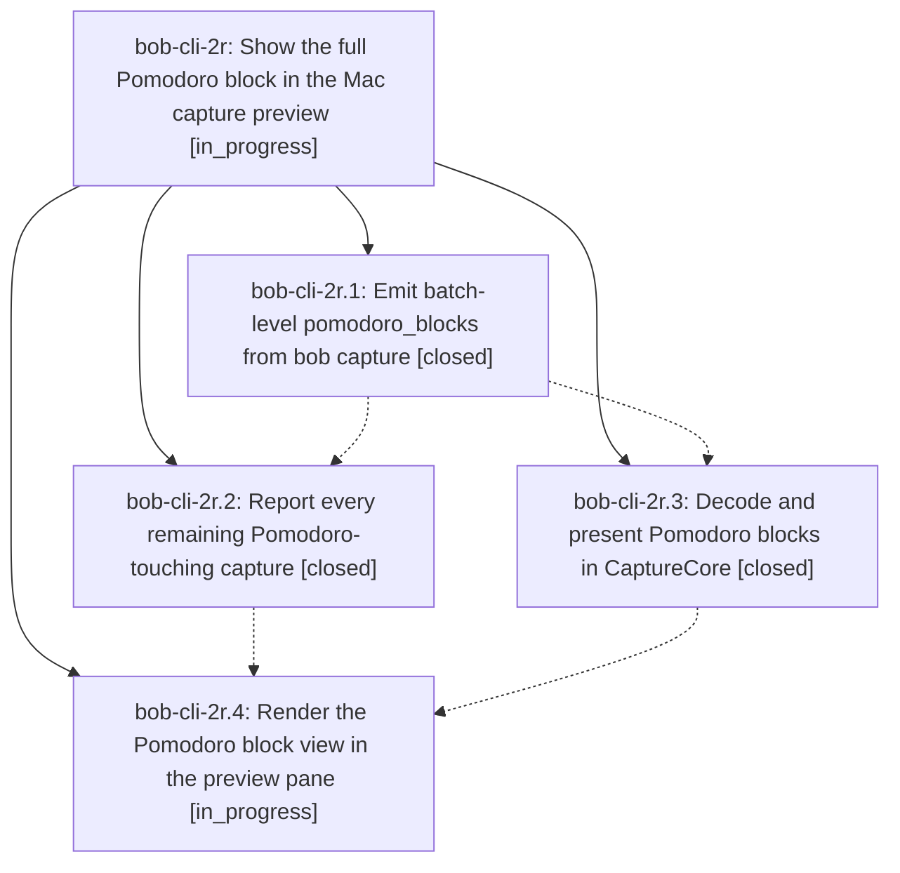

# Bead: bob-cli-2r — Show the full Pomodoro block in the Mac capture preview

[Bead Pages](../README.md) / bob-cli-2r

**Status:** ◐ in_progress · **Type:** ▸ plan · **Tier:** epic
**Owner:** `bryanbugyi34@gmail.com` · **Created by:** [bbugyi200.apollo.3c](https://github.com/bobs-org/bob-cli--agents/blob/main/sessions/bbugyi200.apollo.3c.md) · **Assignee:** `bob-cli-2r.land`
**Created:** 2026-09-30 07:52:28 EDT
**Plan:** [202609/pomodoro\_full\_block\_preview.md](https://github.com/bobs-org/bob-cli--plans/blob/main/202609/pomodoro_full_block_preview.md)

## Description

Whenever a capture touches, creates, or reports a Pomodoro, the Bob Mac Capture live preview shows that Pomodoro in full: its headline and every nested child line, exactly as Bob will write it, with the lines the capture changes clearly marked. Bob computes the blocks and the diff. The app only decodes and renders them in one consistent, polished block view.

## Phases

| Bead | Title | Status | Size | Created | Agents | Commits |
|---|---|---|---|---|---:|---:|
| [bob-cli-2r.1](bob-cli-2r.1.md) | Emit batch-level pomodoro\_blocks from bob capture | ✓ closed | medium | 2026-09-30 | 1 | 1 |
| [bob-cli-2r.2](bob-cli-2r.2.md) | Report every remaining Pomodoro-touching capture | ✓ closed | medium | 2026-09-30 | 1 | 1 |
| [bob-cli-2r.3](bob-cli-2r.3.md) | Decode and present Pomodoro blocks in CaptureCore | ✓ closed | medium | 2026-09-30 | 1 | 0 |
| [bob-cli-2r.4](bob-cli-2r.4.md) | Render the Pomodoro block view in the preview pane | ◐ in_progress | medium | 2026-09-30 | 1 | 0 |

## Lineage

## Agents

| Agent | Bead | Commits |
|---|---|---:|
| [bbugyi200.apollo.bob-cli-2r.1](https://github.com/bobs-org/bob-cli--agents/blob/main/agents/bbugyi200.apollo.bob-cli-2r.1/README.md) | [bob-cli-2r.1](bob-cli-2r.1.md) | 1 |
| [bbugyi200.apollo.bob-cli-2r.2](https://github.com/bobs-org/bob-cli--agents/blob/main/agents/bbugyi200.apollo.bob-cli-2r.2/README.md) | [bob-cli-2r.2](bob-cli-2r.2.md) | 1 |
| [bbugyi200.apollo.bob-cli-2r.3](https://github.com/bobs-org/bob-cli--agents/blob/main/sessions/bbugyi200.apollo.bob-cli-2r.3.md) | [bob-cli-2r.3](bob-cli-2r.3.md) | 0 |
| [bbugyi200.apollo.bob-cli-2r.4](https://github.com/bobs-org/bob-cli--agents/blob/main/agents/bbugyi200.apollo.bob-cli-2r.4/README.md) | [bob-cli-2r.4](bob-cli-2r.4.md) | 0 |
| [bbugyi200.apollo.bob-cli-2r.land](https://github.com/bobs-org/bob-cli--agents/blob/main/agents/bbugyi200.apollo.bob-cli-2r.land/README.md) | [bob-cli-2r](README.md) | 0 |

## Commits

| Repo | Commit | Subject | Bead | Committed |
|---|---|---|---|---|
| bob-cli | [`f32359f`](https://github.com/bobs-org/bob-cli/commit/f32359ff6a2cd7798a4fcf197240ef9781ad9e76) | feat(capture): add pomodoro blocks tracker with batch-level JSON | [bob-cli-2r.1](bob-cli-2r.1.md) | 2026-09-30 08:46:17 EDT |
| bob-cli | [`a297a48`](https://github.com/bobs-org/bob-cli/commit/a297a48c4646f07a9f519bfcaad77d22045938a1) | feat(capture): report every remaining Pomodoro-touching capture in pomodoro\_blocks | [bob-cli-2r.2](bob-cli-2r.2.md) | 2026-09-30 09:39:18 EDT |
