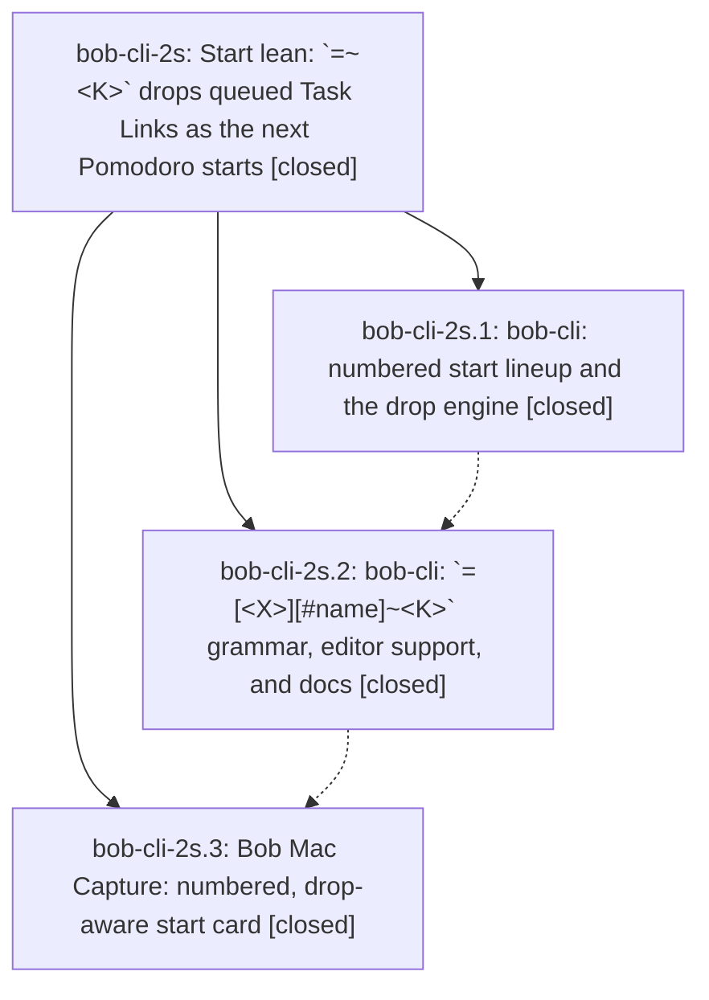

# Bead: bob-cli-2s — Start lean: \`=~\<K\>\` drops queued Task Links as the next Pomodoro starts

[Bead Pages](../README.md) / bob-cli-2s

**Status:** ✓ closed · **Resolution:** done · **Type:** ▸ plan · **Tier:** epic
**Owner:** `bryanbugyi34@gmail.com` · **Created by:** [bbugyi200.apollo.3f](https://github.com/bobs-org/bob-cli--agents/blob/main/sessions/bbugyi200.apollo.3f.md) · **Assignee:** `bob-cli-2s.land`
**Created:** 2026-09-30 08:28:31 EDT · **Closed:** 2026-09-30 10:49:04 EDT
**Plan:** [202609/start\_drop\_queued\_links.md](https://github.com/bobs-org/bob-cli--plans/blob/main/202609/start_drop_queued_links.md)

## Description

`bob capture '=~2'` starts today's next Pomodoro without queued Task Link 2. It also works as `=<X>~<K>` and `=<X>#name~<K>`, in blank-line batches, and in same-line chains such as `=x =~2`. It is atomic and dry-runnable. Every start shows its numbered lineup, so you can see which number to drop. `capture-parse` and `capture-complete` support the new token, and Bob Mac Capture shows a numbered, drop-aware start card.

## Notes

[2026-09-30T14:49:04Z · bob-cli-2s.land] Verified all three closed phases and notes against plan and code: 0b50af3 numbers start lineups and drops queued subtrees; 1121e06 shares start-drop grammar across capture, parse, completion, batches/chains with docs/tests; Mac commits d46667b/e22365c/8a2047e render the numbered, drop-aware card, pending state, fixtures, and docs, with phase-reported green macOS CI. Reviewed post-start CLI commits f32359f/a297a48 and Mac block-preview commits 642313f/ecd428a/5497775: started refs remain wired, and real-Bob fixture records dropped lines as removed; bob-cli-2r owns its additional coverage test. No integration edit needed. Full cargo test and cargo fmt --check pass; 15 focused start-drop tests pass. just check is unavailable (no recipe). Phase .1 and .2 proposed one identical pre-existing Clippy deny at pomodoro_name.rs:808-811; cargo clippy confirms it, and active epic bob-cli-28 already owns the fix. Corroborated on bob-cli-28, so declined a duplicate task. Phase .3 had no proposed follow-up. No epic-symbol entries and no parent bead.

## Phases

| Bead | Title | Status | Size | Created | Agents | Commits |
|---|---|---|---|---|---:|---:|
| [bob-cli-2s.1](bob-cli-2s.1.md) | bob-cli: numbered start lineup and the drop engine | ✓ closed | medium | 2026-09-30 | 1 | 1 |
| [bob-cli-2s.2](bob-cli-2s.2.md) | bob-cli: \`=\[\<X\>\]\[#name\]~\<K\>\` grammar, editor support, and docs | ✓ closed | medium | 2026-09-30 | 1 | 1 |
| [bob-cli-2s.3](bob-cli-2s.3.md) | Bob Mac Capture: numbered, drop-aware start card | ✓ closed | medium | 2026-09-30 | 1 | 0 |

## Lineage

## Agents

| Agent | Bead | Commits |
|---|---|---:|
| [bbugyi200.apollo.bob-cli-2s.1](https://github.com/bobs-org/bob-cli--agents/blob/main/agents/bbugyi200.apollo.bob-cli-2s.1/README.md) | [bob-cli-2s.1](bob-cli-2s.1.md) | 1 |
| [bbugyi200.apollo.bob-cli-2s.2](https://github.com/bobs-org/bob-cli--agents/blob/main/agents/bbugyi200.apollo.bob-cli-2s.2/README.md) | [bob-cli-2s.2](bob-cli-2s.2.md) | 1 |
| [bbugyi200.apollo.bob-cli-2s.3](https://github.com/bobs-org/bob-cli--agents/blob/main/agents/bbugyi200.apollo.bob-cli-2s.3/README.md) | [bob-cli-2s.3](bob-cli-2s.3.md) | 0 |
| [bbugyi200.apollo.bob-cli-2s.land](https://github.com/bobs-org/bob-cli--agents/blob/main/agents/bbugyi200.apollo.bob-cli-2s.land/README.md) | [bob-cli-2s](README.md) | 1 |

## Commits

| Repo | Commit | Subject | Bead | Committed |
|---|---|---|---|---|
| bob-cli | [`0b50af3`](https://github.com/bobs-org/bob-cli/commit/0b50af3cff1c86fc3bc995585b5896ae27a6edf6) | feat(capture): number whole-item start lineup and add plan\_start\_drop engine | [bob-cli-2s.1](bob-cli-2s.1.md) | 2026-09-30 09:06:14 EDT |
| bob-cli | [`1121e06`](https://github.com/bobs-org/bob-cli/commit/1121e06d77f6e8a18a771b4a1b172e36ff7bed83) | feat(capture): start-drop grammar for whole-item starts | [bob-cli-2s.2](bob-cli-2s.2.md) | 2026-09-30 09:44:41 EDT |
| bob-cli--plans | [`bob-cli--plans@735792d`](https://github.com/bobs-org/bob-cli--plans/commit/735792d002462b6bd69248f3d6feddfb19f22ad0) | docs(plan): mark start-drop epic complete | [bob-cli-2s](README.md) | 2026-09-30 10:51:00 EDT |
