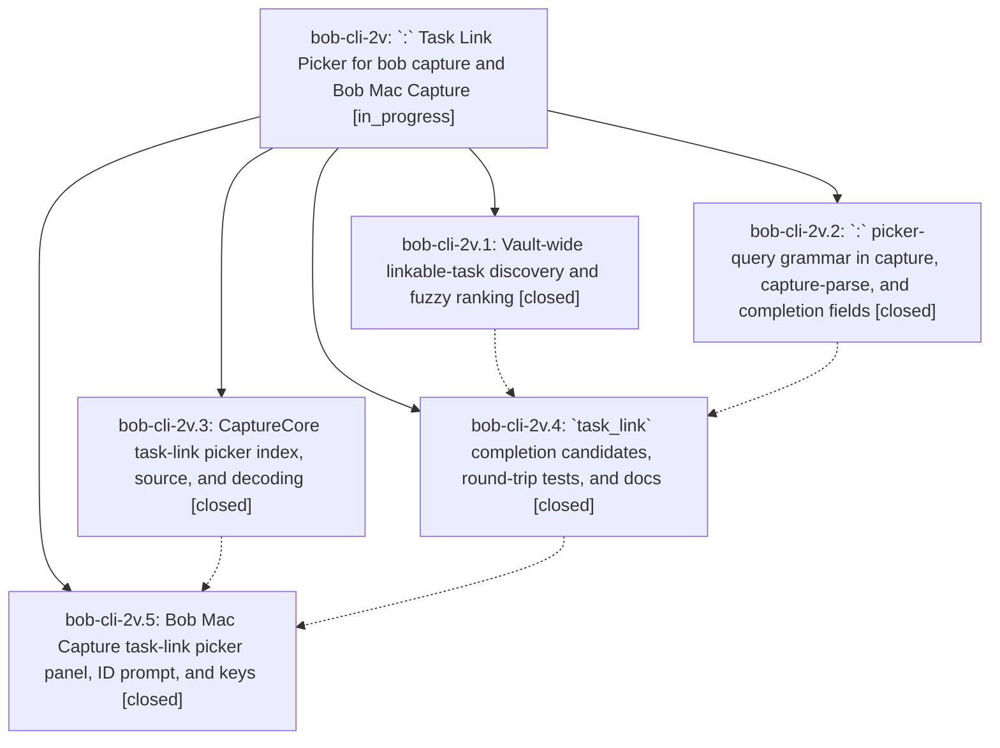

# Bead: bob-cli-2v — \`:\` Task Link Picker for bob capture and Bob Mac Capture

[Bead Pages](../README.md) / bob-cli-2v

**Status:** ◐ in_progress · **Type:** ▸ plan · **Tier:** epic
**Owner:** `bryanbugyi34@gmail.com` · **Created by:** [bbugyi200.apollo.3j](https://github.com/bobs-org/bob-cli--agents/blob/main/sessions/bbugyi200.apollo.3j.md) · **Assignee:** `bob-cli-2v.land`
**Created:** 2026-09-30 13:00:14 EDT
**Plan:** [202609/task\_link\_picker.md](https://github.com/bobs-org/bob-cli--plans/blob/main/202609/task_link_picker.md)

## Description

Typing `:` at the start of any capture item, including any item of a blank-line-separated batch draft, opens a fast, beautiful fuzzy picker over every open (not done or canceled) task in the vault's area and project notes. Accepting a task replaces the `:` query with the canonical `@route:block-id` link. Tasks without a block ID get one first, from a prefilled suggestion. The link can then be captured as-is or started with `=`, so any task can be linked into today's Pomodoros in a few keystrokes.

## Notes

[2026-09-30T18:33:59Z · bryanbugyi34@gmail.com] This doesn't seem to work. See 🔒 20260930\_143313.png for context. The epic lander agent should try to fix this.

[2026-09-30T18:44:39Z · bob-cli-2v.land] LAND TRIAGE (bob-cli-2v.land): PROPOSED FOLLOW-UP outcomes. (1) pomodoro_name.rs:808 '|| true' clippy deny (bob-cli-2v.1 #1, .2 #1, .4 #1): not caused by this epic (from bob-cli-28.1, commit 22abed4); reproduced on master f7d9c58 and corroborated as a DISCOVERED ISSUE note on active epic bob-cli-28, whose closeout owns it; bob-cli-v tracks warnings only. No new task. (2) CLT-only mac host lacks XCTest so 'just test' cannot run (bob-cli-2v.3 #2, .5 #1): the environmental root cause (no local Swift test gate; agents must watch bob-mac-capture Actions to green) duplicates bob-cli-1x, so a +1 with bob-cli-2v evidence was recorded there. The part asking to run TaskLinkPickerPresentationTests / CaptureTaskLinkPanelTests on CI is epic work, not a follow-up. (3) 'needs one green macOS 26 SwiftPM CI run' (bob-cli-2v.5 #2): declined as a task because the epic caused it. It is remaining epic work: CI run 36758703183 on e9865e6 is RED at Test with a test-target compile error (TaskLinkPickerPresentationTests.swift:488/494 call pullForwardLine on CapturePickerPresentation; it lives on TaskLinkPickerIndex), so no new Swift test has ever run. The landing tale plans that fix.

[2026-09-30T18:46:49Z · bob-cli-2v.land] LAND AUDIT (bob-cli-2v.land, before landing tale): read all five closed phase beads and their notes, the plan, bob-cli commits 5ef8eb7/d67bbb0/b672114, and bob-mac-capture e9865e6 (it carries both mac_core and mac_panel). bob-cli is complete: the claim predicate is shared by execution, editor, and completion; T1/T2, discovery, groups, order, ranker, and the task_link candidate contract match the plan. On master f7d9c58: cargo fmt clean, cargo test green (1334 lib + 650 cli), and clippy's only error is the pre-existing pomodoro_name.rs:808. Remaining epic work: (a) bob-mac-capture CI run 36758703183 is RED (TaskLinkPickerPresentationTests.swift:488/494 compile error), so no new Swift test has run; (b) mac_panel gaps: removePickerTrigger's fallback deletes the range without a ':' check; the link-mode cancelTaskIDPrompt ignores clearCompletion and restores a stale picker; the ID-less splice uses the request route instead of success.route; acceptPickerRowAndStart returns silently on a stale draft; an extra capture-complete runs on every open; 'No active tasks match' wording; missing locator/prompt colors; README keyboard tables not updated and no Task Link Picker subsection; most plan step-9 panel tests and fake-bob cases missing; three fixtures unreferenced; (c) bob-cli leftovers: the completion_field_at doc comment is misplaced above task_link_completion_field_at, and find_single_future_scheduled_field is needlessly pub(crate). Integration: f7d9c58 (bob-cli-2w.4 cancel docs) needs no change; no other bob-mac-capture commit landed after the epic started. No --epic-symbol entries; no parent bead. Proposing landing tale sase_plan_task_link_picker_landing.md, which ends with the epic closeout.

## Attachments

- 🔒 20260930\_143313.png · image/png · 2872×1656 · 732.331 KiB (private attachment)

## Phases

| Bead | Title | Status | Size | Created | Agents | Commits |
|---|---|---|---|---|---:|---:|
| [bob-cli-2v.1](bob-cli-2v.1.md) | Vault-wide linkable-task discovery and fuzzy ranking | ✓ closed | medium | 2026-09-30 | 1 | 1 |
| [bob-cli-2v.2](bob-cli-2v.2.md) | \`:\` picker-query grammar in capture, capture-parse, and completion fields | ✓ closed | medium | 2026-09-30 | 1 | 1 |
| [bob-cli-2v.3](bob-cli-2v.3.md) | CaptureCore task-link picker index, source, and decoding | ✓ closed | medium | 2026-09-30 | 1 | 0 |
| [bob-cli-2v.4](bob-cli-2v.4.md) | \`task\_link\` completion candidates, round-trip tests, and docs | ✓ closed | medium | 2026-09-30 | 1 | 1 |
| [bob-cli-2v.5](bob-cli-2v.5.md) | Bob Mac Capture task-link picker panel, ID prompt, and keys | ✓ closed | medium | 2026-09-30 | 1 | 0 |

## Lineage

## Agents

| Agent | Bead | Commits |
|---|---|---:|
| [bbugyi200.apollo.bob-cli-2v.1](https://github.com/bobs-org/bob-cli--agents/blob/main/agents/bbugyi200.apollo.bob-cli-2v.1/README.md) | [bob-cli-2v.1](bob-cli-2v.1.md) | 1 |
| [bbugyi200.apollo.bob-cli-2v.2](https://github.com/bobs-org/bob-cli--agents/blob/main/agents/bbugyi200.apollo.bob-cli-2v.2/README.md) | [bob-cli-2v.2](bob-cli-2v.2.md) | 1 |
| [bbugyi200.apollo.bob-cli-2v.3](https://github.com/bobs-org/bob-cli--agents/blob/main/sessions/bbugyi200.apollo.bob-cli-2v.3.md) | [bob-cli-2v.3](bob-cli-2v.3.md) | 0 |
| [bbugyi200.apollo.bob-cli-2v.4](https://github.com/bobs-org/bob-cli--agents/blob/main/agents/bbugyi200.apollo.bob-cli-2v.4/README.md) | [bob-cli-2v.4](bob-cli-2v.4.md) | 1 |
| [bbugyi200.apollo.bob-cli-2v.5](https://github.com/bobs-org/bob-cli--agents/blob/main/agents/bbugyi200.apollo.bob-cli-2v.5/README.md) | [bob-cli-2v.5](bob-cli-2v.5.md) | 0 |
| [bbugyi200.apollo.bob-cli-2v.land](https://github.com/bobs-org/bob-cli--agents/blob/main/sessions/bbugyi200.apollo.bob-cli-2v.land.md) | [bob-cli-2v](README.md) | 1 |

## Commits

| Repo | Commit | Subject | Bead | Committed |
|---|---|---|---|---|
| bob-cli | [`5ef8eb7`](https://github.com/bobs-org/bob-cli/commit/5ef8eb724c44a1964c2d0a0c473587bea540fe41) | feat(capture): add task-link picker query grammar for colon items | [bob-cli-2v.2](bob-cli-2v.2.md) | 2026-09-30 13:18:07 EDT |
| bob-cli | [`d67bbb0`](https://github.com/bobs-org/bob-cli/commit/d67bbb0e174f128225424f5ab9a92c2fc09fa612) | feat(capture): add read-only linkable-task discover scanner with tiered ranker | [bob-cli-2v.1](bob-cli-2v.1.md) | 2026-09-30 13:27:40 EDT |
| bob-cli | [`b672114`](https://github.com/bobs-org/bob-cli/commit/b672114fa48247484ff4c0da0788f7a27f609d39) | feat(capture): complete task\_link picker candidates, round trips, and docs | [bob-cli-2v.4](bob-cli-2v.4.md) | 2026-09-30 14:02:04 EDT |
| bob-cli | [`8f2a02e`](https://github.com/bobs-org/bob-cli/commit/8f2a02ec31d23d3b70bde8a4dcd7fc751dcc0461) | refactor(capture): move completion doc comment and privatize schedule helper | [bob-cli-2v](README.md) | 2026-09-30 15:14:00 EDT |
