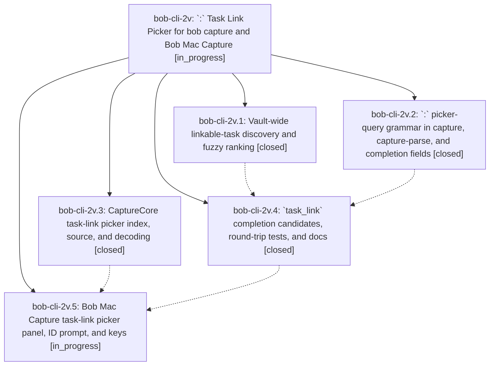

# Bead: bob-cli-2v — \`:\` Task Link Picker for bob capture and Bob Mac Capture

[Bead Pages](../README.md) / bob-cli-2v

**Status:** ◐ in_progress · **Type:** ▸ plan · **Tier:** epic
**Owner:** `bryanbugyi34@gmail.com` · **Created by:** [bbugyi200.apollo.3j](https://github.com/bobs-org/bob-cli--agents/blob/main/sessions/bbugyi200.apollo.3j.md) · **Assignee:** `bob-cli-2v.land`
**Created:** 2026-09-30 13:00:14 EDT
**Plan:** [202609/task\_link\_picker.md](https://github.com/bobs-org/bob-cli--plans/blob/main/202609/task_link_picker.md)

## Description

Typing `:` at the start of any capture item, including any item of a blank-line-separated batch draft, opens a fast, beautiful fuzzy picker over every open (not done or canceled) task in the vault's area and project notes. Accepting a task replaces the `:` query with the canonical `@route:block-id` link. Tasks without a block ID get one first, from a prefilled suggestion. The link can then be captured as-is or started with `=`, so any task can be linked into today's Pomodoros in a few keystrokes.

## Phases

| Bead | Title | Status | Size | Created | Agents | Commits |
|---|---|---|---|---|---:|---:|
| [bob-cli-2v.1](bob-cli-2v.1.md) | Vault-wide linkable-task discovery and fuzzy ranking | ✓ closed | medium | 2026-09-30 | 1 | 1 |
| [bob-cli-2v.2](bob-cli-2v.2.md) | \`:\` picker-query grammar in capture, capture-parse, and completion fields | ✓ closed | medium | 2026-09-30 | 1 | 1 |
| [bob-cli-2v.3](bob-cli-2v.3.md) | CaptureCore task-link picker index, source, and decoding | ✓ closed | medium | 2026-09-30 | 1 | 0 |
| [bob-cli-2v.4](bob-cli-2v.4.md) | \`task\_link\` completion candidates, round-trip tests, and docs | ✓ closed | medium | 2026-09-30 | 1 | 1 |
| [bob-cli-2v.5](bob-cli-2v.5.md) | Bob Mac Capture task-link picker panel, ID prompt, and keys | ◐ in_progress | medium | 2026-09-30 | 1 | 0 |

## Lineage

## Agents

| Agent | Bead | Commits |
|---|---|---:|
| [bbugyi200.apollo.bob-cli-2v.1](https://github.com/bobs-org/bob-cli--agents/blob/main/agents/bbugyi200.apollo.bob-cli-2v.1/README.md) | [bob-cli-2v.1](bob-cli-2v.1.md) | 1 |
| [bbugyi200.apollo.bob-cli-2v.2](https://github.com/bobs-org/bob-cli--agents/blob/main/agents/bbugyi200.apollo.bob-cli-2v.2/README.md) | [bob-cli-2v.2](bob-cli-2v.2.md) | 1 |
| [bbugyi200.apollo.bob-cli-2v.3](https://github.com/bobs-org/bob-cli--agents/blob/main/sessions/bbugyi200.apollo.bob-cli-2v.3.md) | [bob-cli-2v.3](bob-cli-2v.3.md) | 0 |
| [bbugyi200.apollo.bob-cli-2v.4](https://github.com/bobs-org/bob-cli--agents/blob/main/agents/bbugyi200.apollo.bob-cli-2v.4/README.md) | [bob-cli-2v.4](bob-cli-2v.4.md) | 1 |
| [bbugyi200.apollo.bob-cli-2v.5](https://github.com/bobs-org/bob-cli--agents/blob/main/agents/bbugyi200.apollo.bob-cli-2v.5/README.md) | [bob-cli-2v.5](bob-cli-2v.5.md) | 0 |
| [bbugyi200.apollo.bob-cli-2v.land](https://github.com/bobs-org/bob-cli--agents/blob/main/agents/bbugyi200.apollo.bob-cli-2v.land/README.md) | [bob-cli-2v](README.md) | 0 |

## Commits

| Repo | Commit | Subject | Bead | Committed |
|---|---|---|---|---|
| bob-cli | [`5ef8eb7`](https://github.com/bobs-org/bob-cli/commit/5ef8eb724c44a1964c2d0a0c473587bea540fe41) | feat(capture): add task-link picker query grammar for colon items | [bob-cli-2v.2](bob-cli-2v.2.md) | 2026-09-30 13:18:07 EDT |
| bob-cli | [`d67bbb0`](https://github.com/bobs-org/bob-cli/commit/d67bbb0e174f128225424f5ab9a92c2fc09fa612) | feat(capture): add read-only linkable-task discover scanner with tiered ranker | [bob-cli-2v.1](bob-cli-2v.1.md) | 2026-09-30 13:27:40 EDT |
| bob-cli | [`b672114`](https://github.com/bobs-org/bob-cli/commit/b672114fa48247484ff4c0da0788f7a27f609d39) | feat(capture): complete task\_link picker candidates, round trips, and docs | [bob-cli-2v.4](bob-cli-2v.4.md) | 2026-09-30 14:02:04 EDT |
