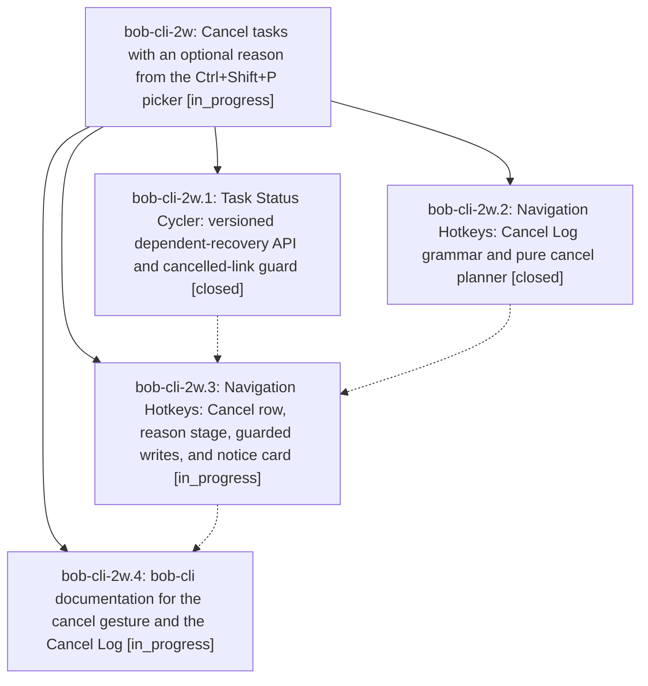

# Bead: bob-cli-2w — Cancel tasks with an optional reason from the Ctrl+Shift+P picker

[Bead Pages](../README.md) / bob-cli-2w

**Status:** ◐ in_progress · **Type:** ▸ plan · **Tier:** epic
**Owner:** `bryanbugyi34@gmail.com` · **Created by:** [bbugyi200.athena.0ug](https://github.com/bobs-org/bob-cli--agents/blob/main/sessions/bbugyi200.athena.0ug.md) · **Assignee:** `bob-cli-2w.land`
**Created:** 2026-09-30 13:42:47 EDT
**Plan:** [202609/cancel\_task\_picker.md](https://github.com/bobs-org/bob-cli--plans/blob/main/202609/cancel_task_picker.md)

## Description

In Obsidian, Ctrl+Shift+P on a #task line (bare or counted) or on a dedicated Task Link offers a pinned Cancel row. It asks for an optional reason, then closes the task(s) as Cancelled `[-]` with a `[cancelled:: YYYY-MM-DD]` stamp and records the reason under a managed `❌ **CANCEL LOG**` child. It also removes the tasks' links from today's open Pomodoros, unblocks their dependents right away, and confirms with a rich notice card.

## Phases

| Bead | Title | Status | Size | Created | Agents | Commits |
|---|---|---|---|---|---:|---:|
| [bob-cli-2w.1](bob-cli-2w.1.md) | Task Status Cycler: versioned dependent-recovery API and cancelled-link guard | ✓ closed | small | 2026-09-30 | 1 | 1 |
| [bob-cli-2w.2](bob-cli-2w.2.md) | Navigation Hotkeys: Cancel Log grammar and pure cancel planner | ✓ closed | medium | 2026-09-30 | 1 | 1 |
| [bob-cli-2w.3](bob-cli-2w.3.md) | Navigation Hotkeys: Cancel row, reason stage, guarded writes, and notice card | ◐ in_progress | medium | 2026-09-30 | 1 | 0 |
| [bob-cli-2w.4](bob-cli-2w.4.md) | bob-cli documentation for the cancel gesture and the Cancel Log | ◐ in_progress | small | 2026-09-30 | 1 | 0 |

## Lineage

## Agents

| Agent | Bead | Commits |
|---|---|---:|
| [bbugyi200.athena.bob-cli-2w.1](https://github.com/bobs-org/bob-cli--agents/blob/main/agents/bbugyi200.athena.bob-cli-2w.1/README.md) | [bob-cli-2w.1](bob-cli-2w.1.md) | 1 |
| [bbugyi200.athena.bob-cli-2w.2](https://github.com/bobs-org/bob-cli--agents/blob/main/agents/bbugyi200.athena.bob-cli-2w.2/README.md) | [bob-cli-2w.2](bob-cli-2w.2.md) | 1 |
| [bbugyi200.athena.bob-cli-2w.3](https://github.com/bobs-org/bob-cli--agents/blob/main/agents/bbugyi200.athena.bob-cli-2w.3/README.md) | [bob-cli-2w.3](bob-cli-2w.3.md) | 0 |
| [bbugyi200.athena.bob-cli-2w.4](https://github.com/bobs-org/bob-cli--agents/blob/main/agents/bbugyi200.athena.bob-cli-2w.4/README.md) | [bob-cli-2w.4](bob-cli-2w.4.md) | 0 |
| [bbugyi200.athena.bob-cli-2w.land](https://github.com/bobs-org/bob-cli--agents/blob/main/agents/bbugyi200.athena.bob-cli-2w.land/README.md) | [bob-cli-2w](README.md) | 0 |

## Commits

| Repo | Commit | Subject | Bead | Committed |
|---|---|---|---|---|
| bob-plugins | [`bob-plugins@80d6647`](https://github.com/bobs-org/bob-plugins/commit/80d66477782fd3d7711c3b967f0620721b991c39) | feat(task-status-cycler): add frozen recovery api with future-schedule and cancelled-link guards | [bob-cli-2w.1](bob-cli-2w.1.md) | 2026-09-30 13:51:55 EDT |
| bob-plugins | [`bob-plugins@de10a6f`](https://github.com/bobs-org/bob-plugins/commit/de10a6f7a5b2ce90d642500c1acfdbaca70bfef1) | feat(nav-hotkeys): add Cancel Log grammar and pure cancel planner | [bob-cli-2w.2](bob-cli-2w.2.md) | 2026-09-30 13:55:05 EDT |
