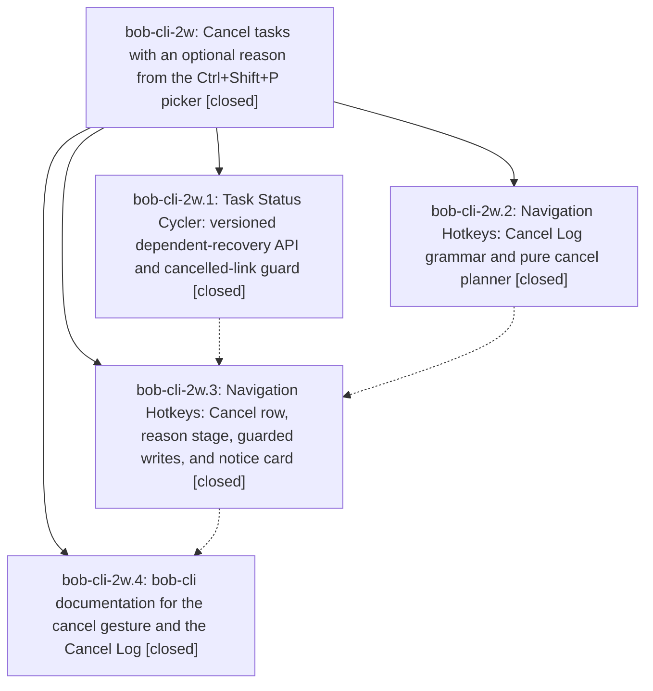

# Bead: bob-cli-2w — Cancel tasks with an optional reason from the Ctrl+Shift+P picker

[Bead Pages](../README.md) / bob-cli-2w

**Status:** ✓ closed · **Resolution:** done · **Type:** ▸ plan · **Tier:** epic
**Owner:** `bryanbugyi34@gmail.com` · **Created by:** [bbugyi200.athena.0ug](https://github.com/bobs-org/bob-cli--agents/blob/main/sessions/bbugyi200.athena.0ug.md) · **Assignee:** `bob-cli-2w.land`
**Created:** 2026-09-30 13:42:47 EDT · **Closed:** 2026-09-30 14:45:02 EDT
**Plan:** [202609/cancel\_task\_picker.md](https://github.com/bobs-org/bob-cli--plans/blob/main/202609/cancel_task_picker.md)

## Description

In Obsidian, Ctrl+Shift+P on a #task line (bare or counted) or on a dedicated Task Link offers a pinned Cancel row. It asks for an optional reason, then closes the task(s) as Cancelled `[-]` with a `[cancelled:: YYYY-MM-DD]` stamp and records the reason under a managed `❌ **CANCEL LOG**` child. It also removes the tasks' links from today's open Pomodoros, unblocks their dependents right away, and confirms with a rich notice card.

## Notes

[2026-09-30T18:45:02Z · bob-cli-2w.land] Verified all four phases against their notes, the plan contract, and the landed source.

bob-cli-2w.1 (80d6647): task-status-cycler api is frozen at version 1 with recoverBlockedDependents queued and non-throwing, no reference retirement. buildBlockedDependentRecoveryPlan keeps a strictly future scheduled dependent Blocked. Ctrl+Enter on a Task Link to a Cancelled task notices "reopen it with ⌥] first" and does not complete the Pomodoro. Manifest and vault copy are 1.17.0.

bob-cli-2w.2 (de10a6f): Cancel Log grammar, parse kind cancel, planCancelLogEntry (first child, prepend, fallback, grandchild ignored), and planTaskCancelBatch ([-], cancelled upsert, recurring refusal, bottom-up, CRLF) are in bob-navigation-hotkeys. Project conversion reports "cancel log moved".

bob-cli-2w.3 (2faa272): pinned last Cancel row, reason stage, one-undo editor writes, same-file and cross-note Pomodoro prune, shared commitLinkPickerNoteWrites, TSC recovery call with silent skip, and the Cancelled notice card plus CSS. Manifest and vault copy are 1.41.0. #now is not rewritten.

bob-cli-2w.4 (f7d9c58): docs/projects.md "Cancelling a task", README Cancel Log glossary row, task-status-hooks recovery/guards paragraph, and the sub_bullet.rs plugin-only parity comment. Capture still inserts new notes at the first Schedule/Work Log, so a first-child Cancel Log stays above them.

Integration: the only non-epic bob-cli commit after the epic started is b672114 (bob-cli-2v.4, task-link picker). It already excludes canceled tasks, and f7d9c58 is based on it, so the README rows compose. bob-plugins has no commits after the three epic stitches. No code change was required.

Follow-up: bob-cli-2w.4 note 1 asked for glossary:cancel-log. The strand is absent (Schedule Log and Work Log exist). Filed ready memory task bob-cli-2x (small) naming that phase. sase artifact link add failed because the artifact-link event store is invalid (operation_id de29d2e25c1cfb4381f223c44d576f8c reused); the proposing bead is named in the task description. No other PROPOSED FOLLOW-UP notes. None declined.

sase bead epic-symbols bob-cli-2w listed no entries. No parent bead.

## Phases

| Bead | Title | Status | Size | Created | Agents | Commits |
|---|---|---|---|---|---:|---:|
| [bob-cli-2w.1](bob-cli-2w.1.md) | Task Status Cycler: versioned dependent-recovery API and cancelled-link guard | ✓ closed | small | 2026-09-30 | 1 | 1 |
| [bob-cli-2w.2](bob-cli-2w.2.md) | Navigation Hotkeys: Cancel Log grammar and pure cancel planner | ✓ closed | medium | 2026-09-30 | 1 | 1 |
| [bob-cli-2w.3](bob-cli-2w.3.md) | Navigation Hotkeys: Cancel row, reason stage, guarded writes, and notice card | ✓ closed | medium | 2026-09-30 | 1 | 1 |
| [bob-cli-2w.4](bob-cli-2w.4.md) | bob-cli documentation for the cancel gesture and the Cancel Log | ✓ closed | small | 2026-09-30 | 1 | 1 |

## Lineage

## Agents

| Agent | Bead | Commits |
|---|---|---:|
| [bbugyi200.athena.bob-cli-2w.1](https://github.com/bobs-org/bob-cli--agents/blob/main/agents/bbugyi200.athena.bob-cli-2w.1/README.md) | [bob-cli-2w.1](bob-cli-2w.1.md) | 1 |
| [bbugyi200.athena.bob-cli-2w.2](https://github.com/bobs-org/bob-cli--agents/blob/main/agents/bbugyi200.athena.bob-cli-2w.2/README.md) | [bob-cli-2w.2](bob-cli-2w.2.md) | 1 |
| [bbugyi200.athena.bob-cli-2w.3](https://github.com/bobs-org/bob-cli--agents/blob/main/agents/bbugyi200.athena.bob-cli-2w.3/README.md) | [bob-cli-2w.3](bob-cli-2w.3.md) | 1 |
| [bbugyi200.athena.bob-cli-2w.4](https://github.com/bobs-org/bob-cli--agents/blob/main/agents/bbugyi200.athena.bob-cli-2w.4/README.md) | [bob-cli-2w.4](bob-cli-2w.4.md) | 1 |
| [bbugyi200.athena.bob-cli-2w.land](https://github.com/bobs-org/bob-cli--agents/blob/main/agents/bbugyi200.athena.bob-cli-2w.land/README.md) | [bob-cli-2w](README.md) | 1 |

## Commits

| Repo | Commit | Subject | Bead | Committed |
|---|---|---|---|---|
| bob-plugins | [`bob-plugins@80d6647`](https://github.com/bobs-org/bob-plugins/commit/80d66477782fd3d7711c3b967f0620721b991c39) | feat(task-status-cycler): add frozen recovery api with future-schedule and cancelled-link guards | [bob-cli-2w.1](bob-cli-2w.1.md) | 2026-09-30 13:51:55 EDT |
| bob-plugins | [`bob-plugins@de10a6f`](https://github.com/bobs-org/bob-plugins/commit/de10a6f7a5b2ce90d642500c1acfdbaca70bfef1) | feat(nav-hotkeys): add Cancel Log grammar and pure cancel planner | [bob-cli-2w.2](bob-cli-2w.2.md) | 2026-09-30 13:55:05 EDT |
| bob-plugins | [`bob-plugins@2faa272`](https://github.com/bobs-org/bob-plugins/commit/2faa2726f047291f6bf7402cefbbf0da5af2ba5b) | feat(nav-hotkeys): cancel tasks with optional reason from Ctrl+Shift+P picker | [bob-cli-2w.3](bob-cli-2w.3.md) | 2026-09-30 14:15:33 EDT |
| bob-cli | [`f7d9c58`](https://github.com/bobs-org/bob-cli/commit/f7d9c58dff9bc16c8510e74f557d100ef09285e1) | docs(cancel): document the cancel gesture and Cancel Log (bob-cli-2w.4) | [bob-cli-2w.4](bob-cli-2w.4.md) | 2026-09-30 14:27:35 EDT |
| bob-cli--plans | [`bob-cli--plans@fc4bc89`](https://github.com/bobs-org/bob-cli--plans/commit/fc4bc89743ae439b16d0ca2845f6061045a1c65c) | docs(plan): mark cancel task picker epic done | [bob-cli-2w](README.md) | 2026-09-30 14:47:08 EDT |
