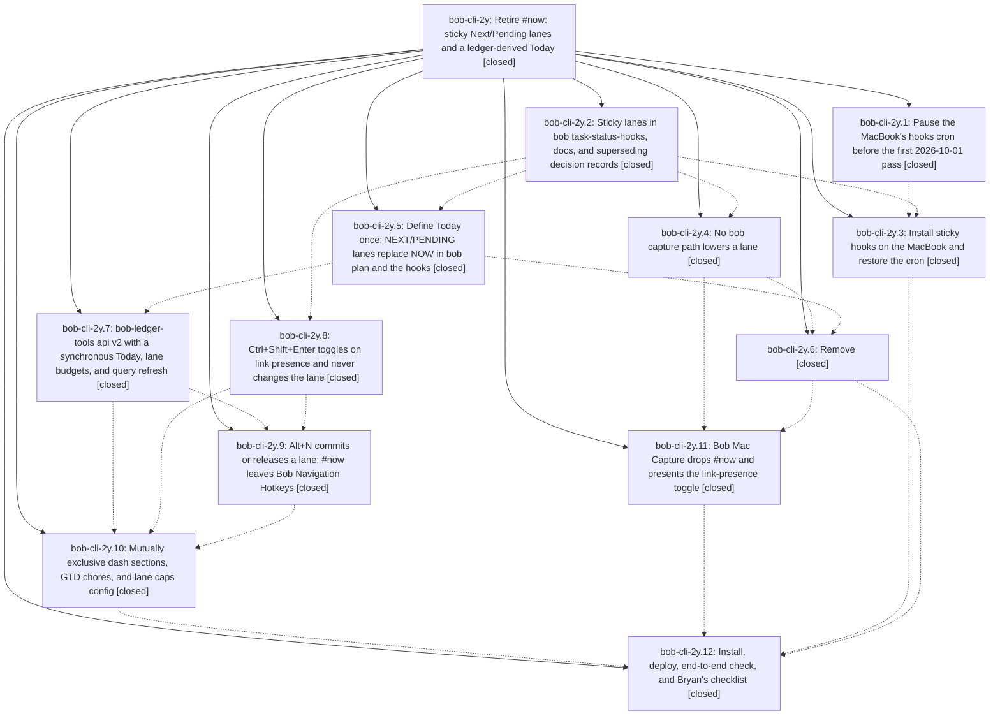

# Bead: bob-cli-2y — Retire #now: sticky Next/Pending lanes and a ledger-derived Today

[Bead Pages](../README.md) / bob-cli-2y

**Status:** ✓ closed · **Resolution:** done · **Type:** ▸ plan · **Tier:** epic
**Owner:** `bryanbugyi34@gmail.com` · **Created by:** [bbugyi200.apollo.3n](https://github.com/bobs-org/bob-cli--agents/blob/main/sessions/bbugyi200.apollo.3n.md) · **Assignee:** `bob-cli-2y.land`
**Created:** 2026-09-30 16:41:59 EDT · **Closed:** 2026-09-30 19:19:54 EDT
**Plan:** [202609/retire\_now\_sticky\_lanes.md](https://github.com/bobs-org/bob-cli--plans/blob/main/202609/retire_now_sticky_lanes.md)

## Description

Linking a task makes it Next, working it makes it Pending, and no unlink path (hooks, keymap, capture drop, hand deletion) ever lowers it; only an explicit one-key release returns it to Ready. Today is read from the ledger when the dash renders, the dash shows mutually exclusive TODAY / PENDING / NEXT / READY sections with soft caps, and #now is gone from bob-cli, bob-plugins, Bob Mac Capture, the vault, and memory.

## Notes

[2026-09-30T23:12:00Z · bob-cli-2y.land] LAND TRIAGE (bob-cli-2y.land) of every PROPOSED FOLLOW-UP: (1) clippy deny '|| true' at tests/cli/capture/pomodoro_name.rs:808 (proposed by 2y.2, 2y.4, 2y.5, 2y.6): not caused by this epic (blame 7d1c8dd, owned by active epic bob-cli-28) -> corroborating DISCOVERED ISSUE note added on bob-cli-28, no new task. (2) clippy unnecessary_to_owned at tests/cli/capture/pomodoro_shift.rs:581 (proposed by 2y.12, which misread it as the lint failure; it is a warning): duplicate of bob-cli-v -> +1 recorded there. (3) crontab not writable over ssh + hand-install the paused tab (2y.1 #2): the pause itself is declined as superseded, because rollout installed the sticky build on the Mac at 18:50 EDT before any 2026-10-01 pass (land re-verified: Mac dry run cleared 0 / cleared_in_progress 0), so no pause is needed; the underlying doc drift (live tab */15 without --retry-timeout vs docs/vault-git-sync.md, and ssh crontab EPERM) is genuinely distinct and not epic-caused -> new task bob-cli-30 (bug, small, ready). (4) Mac install/dry-run/cron verify pending (2y.3 #1): declined, done by 2y.12; land re-verified ~/.cargo/bin/bob built 18:50 and dry run keeps lanes. (5) cron restore is a no-op (2y.3 #2): declined, the cron was never paused and land re-verified the hooks line is byte-identical to the original '*/15 * * * * ~/.cargo/bin/bob task-status-hooks >> /var/tmp/bob_task_status_hooks.log'.

[2026-09-30T23:19:54Z · bob-cli-2y.land] Land verification: read the epic and all 12 phase beads and notes, the epic plan, and every epic commit (bob-cli 33d5622 63305f0 85f7901 d06102c e57d33d 473cca3 297ecb4; bob-plugins b9d9828 3297b25 053a076; bob-mac-capture fe5d1d5 ec4ad58). Hooks keep Next/In Progress outside daily notes (cleared_in_progress always []); @route+id! is a link-presence toggle that never lowers a lane; the Today engine, NEXT/PENDING lanes and bob plan schema 2 ship with T1-T9 vectors; #now is gone from the capture grammar, pickers and rows (rg leaves only intentional retired-tag tests and compat notes in bob-cli, bob-plugins and the Mac app). bob-plugins npm test 873/873 and validate 6/6; deployed ledger-tools 1.7.0, block-id-prompt 1.15.0 and nav-hotkeys 1.42.0 match the repo byte-for-byte. Mac Capture CI green on ec4ad58. Vault dash.md has TODAY/PENDING/NEXT/READY sections and chips, gtd_daily NOW chores are cancelled and the morning-review/weekly-prune chores added, hotkeys.json has no toggle-now-tag. chezmoi config has max_next 15 / max_pending 10; installed bob plan -f json is schema 2. The Mac runs the sticky build (dry run clears 0 / cleared_in_progress 0) with its original hooks cron line. No unrelated commits landed on bob-cli, bob-plugins or bob-mac-capture after the epic started, so no integration was needed. Follow-ups triaged in the LAND TRIAGE note (bob-cli-28 note, bob-cli-v +1, new bob-cli-30; the rest resolved by rollout). Closeout: removed reachable_identities and its cycle test, removed the write-only FileScan.note_kind field with its writes and initializers (no behavior change), and fixed the stale tasks[].now numbering in docs/capture.md plus the Obsidian Notices lane row in docs/plan.md. Verification: just fmt passed; cargo test 1340 lib + 655 CLI green with all integration suites green; lib/bins clippy shows no reachable_identities; all-targets clippy fails only on the pre-existing pomodoro_name.rs:808 deny owned by bob-cli-28; rg sweep for tasks[].now and NEXT 13/15 shows no new hits.

## Phases

| Bead | Title | Status | Size | Created | Agents | Commits |
|---|---|---|---|---|---:|---:|
| [bob-cli-2y.1](bob-cli-2y.1.md) | Pause the MacBook's hooks cron before the first 2026-10-01 pass | ✓ closed | small | 2026-09-30 | 1 | 0 |
| [bob-cli-2y.10](bob-cli-2y.10.md) | Mutually exclusive dash sections, GTD chores, and lane caps config | ✓ closed | small | 2026-09-30 | 1 | 0 |
| [bob-cli-2y.11](bob-cli-2y.11.md) | Bob Mac Capture drops #now and presents the link-presence toggle | ✓ closed | medium | 2026-09-30 | 1 | 0 |
| [bob-cli-2y.12](bob-cli-2y.12.md) | Install, deploy, end-to-end check, and Bryan's checklist | ✓ closed | small | 2026-09-30 | 1 | 1 |
| [bob-cli-2y.2](bob-cli-2y.2.md) | Sticky lanes in bob task-status-hooks, docs, and superseding decision records | ✓ closed | medium | 2026-09-30 | 1 | 1 |
| [bob-cli-2y.3](bob-cli-2y.3.md) | Install sticky hooks on the MacBook and restore the cron | ✓ closed | small | 2026-09-30 | 1 | 0 |
| [bob-cli-2y.4](bob-cli-2y.4.md) | No bob capture path lowers a lane | ✓ closed | medium | 2026-09-30 | 1 | 1 |
| [bob-cli-2y.5](bob-cli-2y.5.md) | Define Today once; NEXT/PENDING lanes replace NOW in bob plan and the hooks | ✓ closed | medium | 2026-09-30 | 1 | 1 |
| [bob-cli-2y.6](bob-cli-2y.6.md) | Remove | ✓ closed | medium | 2026-09-30 | 1 | 1 |
| [bob-cli-2y.7](bob-cli-2y.7.md) | bob-ledger-tools api v2 with a synchronous Today, lane budgets, and query refresh | ✓ closed | medium | 2026-09-30 | 1 | 1 |
| [bob-cli-2y.8](bob-cli-2y.8.md) | Ctrl+Shift+Enter toggles on link presence and never changes the lane | ✓ closed | medium | 2026-09-30 | 1 | 2 |
| [bob-cli-2y.9](bob-cli-2y.9.md) | Alt+N commits or releases a lane; #now leaves Bob Navigation Hotkeys | ✓ closed | medium | 2026-09-30 | 1 | 2 |

## Lineage

## Agents

| Agent | Bead | Commits |
|---|---|---:|
| [bbugyi200.apollo.bob-cli-2y.1](https://github.com/bobs-org/bob-cli--agents/blob/main/agents/bbugyi200.apollo.bob-cli-2y.1/README.md) | [bob-cli-2y.1](bob-cli-2y.1.md) | 0 |
| [bbugyi200.apollo.bob-cli-2y.10](https://github.com/bobs-org/bob-cli--agents/blob/main/agents/bbugyi200.apollo.bob-cli-2y.10/README.md) | [bob-cli-2y.10](bob-cli-2y.10.md) | 0 |
| [bbugyi200.apollo.bob-cli-2y.11](https://github.com/bobs-org/bob-cli--agents/blob/main/sessions/bbugyi200.apollo.bob-cli-2y.11.md) | [bob-cli-2y.11](bob-cli-2y.11.md) | 0 |
| [bbugyi200.apollo.bob-cli-2y.12](https://github.com/bobs-org/bob-cli--agents/blob/main/agents/bbugyi200.apollo.bob-cli-2y.12/README.md) | [bob-cli-2y.12](bob-cli-2y.12.md) | 1 |
| [bbugyi200.apollo.bob-cli-2y.2](https://github.com/bobs-org/bob-cli--agents/blob/main/agents/bbugyi200.apollo.bob-cli-2y.2/README.md) | [bob-cli-2y.2](bob-cli-2y.2.md) | 1 |
| [bbugyi200.apollo.bob-cli-2y.3](https://github.com/bobs-org/bob-cli--agents/blob/main/agents/bbugyi200.apollo.bob-cli-2y.3/README.md) | [bob-cli-2y.3](bob-cli-2y.3.md) | 0 |
| [bbugyi200.apollo.bob-cli-2y.4](https://github.com/bobs-org/bob-cli--agents/blob/main/agents/bbugyi200.apollo.bob-cli-2y.4/README.md) | [bob-cli-2y.4](bob-cli-2y.4.md) | 1 |
| [bbugyi200.apollo.bob-cli-2y.5](https://github.com/bobs-org/bob-cli--agents/blob/main/agents/bbugyi200.apollo.bob-cli-2y.5/README.md) | [bob-cli-2y.5](bob-cli-2y.5.md) | 1 |
| [bbugyi200.apollo.bob-cli-2y.6](https://github.com/bobs-org/bob-cli--agents/blob/main/agents/bbugyi200.apollo.bob-cli-2y.6/README.md) | [bob-cli-2y.6](bob-cli-2y.6.md) | 1 |
| [bbugyi200.apollo.bob-cli-2y.7](https://github.com/bobs-org/bob-cli--agents/blob/main/agents/bbugyi200.apollo.bob-cli-2y.7/README.md) | [bob-cli-2y.7](bob-cli-2y.7.md) | 1 |
| [bbugyi200.apollo.bob-cli-2y.8](https://github.com/bobs-org/bob-cli--agents/blob/main/agents/bbugyi200.apollo.bob-cli-2y.8/README.md) | [bob-cli-2y.8](bob-cli-2y.8.md) | 2 |
| [bbugyi200.apollo.bob-cli-2y.9](https://github.com/bobs-org/bob-cli--agents/blob/main/agents/bbugyi200.apollo.bob-cli-2y.9/README.md) | [bob-cli-2y.9](bob-cli-2y.9.md) | 2 |
| [bbugyi200.apollo.bob-cli-2y.land](https://github.com/bobs-org/bob-cli--agents/blob/main/sessions/bbugyi200.apollo.bob-cli-2y.land.md) | [bob-cli-2y](README.md) | 1 |

## Commits

| Repo | Commit | Subject | Bead | Committed |
|---|---|---|---|---|
| bob-cli | [`33d5622`](https://github.com/bobs-org/bob-cli/commit/33d5622a466b72a0254f7b7866b3ebd6243fa11a) | feat(hooks): make Next/In-Progress lanes sticky outside daily notes | [bob-cli-2y.2](bob-cli-2y.2.md) | 2026-09-30 17:11:06 EDT |
| bob-cli | [`63305f0`](https://github.com/bobs-org/bob-cli/commit/63305f02b7d437e7830f89d6ba919a43a9a15a6e) | feat(capture): make @route+id! a link-presence toggle that never lowers a lane | [bob-cli-2y.4](bob-cli-2y.4.md) | 2026-09-30 17:31:39 EDT |
| bob-cli | [`85f7901`](https://github.com/bobs-org/bob-cli/commit/85f79018ab2e47075c9123c3a03c8ef2f9805f85) | docs(memory): unlinking an In Progress task keeps its lane in the Work Log strand | [bob-cli-2y.8](bob-cli-2y.8.md) | 2026-09-30 17:32:20 EDT |
| bob-plugins | [`bob-plugins@b9d9828`](https://github.com/bobs-org/bob-plugins/commit/b9d98284f658666a0e11d82d42de612666b6ef72) | feat(block-id-prompt): lane-preserving Ctrl+Shift+Enter link toggle | [bob-cli-2y.8](bob-cli-2y.8.md) | 2026-09-30 17:32:54 EDT |
| bob-cli | [`d06102c`](https://github.com/bobs-org/bob-cli/commit/d06102c7429f55712516911c8a2d5004f038485c) | feat(plan): ledger-derived Today engine with NEXT/PENDING lanes (bob-cli-2y.5) | [bob-cli-2y.5](bob-cli-2y.5.md) | 2026-09-30 17:35:26 EDT |
| bob-plugins | [`bob-plugins@3297b25`](https://github.com/bobs-org/bob-plugins/commit/3297b2559f81402931abf7896d8978f3efd3b4ce) | feat(ledger): bob-ledger-tools api v2 with synchronous Today, lane budgets, and query refresh | [bob-cli-2y.7](bob-cli-2y.7.md) | 2026-09-30 17:48:37 EDT |
| bob-cli | [`e57d33d`](https://github.com/bobs-org/bob-cli/commit/e57d33d6ef57da690aa1abf7d66506c16f63b0b7) | feat(capture): remove the #now grammar, pickers, rows, and docs (bob-cli-2y.6) | [bob-cli-2y.6](bob-cli-2y.6.md) | 2026-09-30 18:03:54 EDT |
| bob-cli | [`473cca3`](https://github.com/bobs-org/bob-cli/commit/473cca3e0882e0fd73156a45cfbd235f97b682d4) | docs(memory): Alt+N release prompts for the Work Log summary | [bob-cli-2y.9](bob-cli-2y.9.md) | 2026-09-30 18:07:05 EDT |
| bob-plugins | [`bob-plugins@053a076`](https://github.com/bobs-org/bob-plugins/commit/053a07640a26d2f44c71c0e0774efa8af25eacf5) | feat(nav-hotkeys): Alt+N commits or releases the lane; #now removed | [bob-cli-2y.9](bob-cli-2y.9.md) | 2026-09-30 18:07:37 EDT |
| bob-cli | [`297ecb4`](https://github.com/bobs-org/bob-cli/commit/297ecb474445479390dba26e75eb7c52164d9441) | docs(plan): finalize Surfaces table for retired-#now rollout (bob-cli-2y.12) | [bob-cli-2y.12](bob-cli-2y.12.md) | 2026-09-30 18:59:06 EDT |
| bob-cli | [`af0d17f`](https://github.com/bobs-org/bob-cli/commit/af0d17f211bd7980671a21d2415dc305c9b8e2ed) | chore(hooks): remove In Progress rollback leftovers, fix two stale doc lines (bob-cli-2y) | [bob-cli-2y](README.md) | 2026-09-30 19:23:36 EDT |
