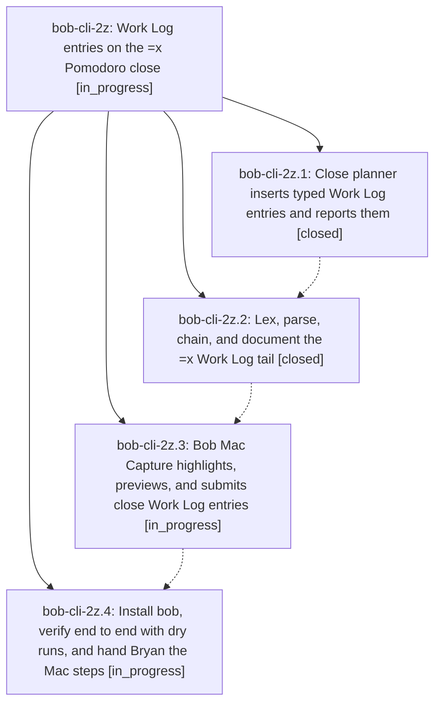

# Bead: bob-cli-2z — Work Log entries on the =x Pomodoro close

[Bead Pages](../README.md) / bob-cli-2z

**Status:** ◐ in_progress · **Type:** ▸ plan · **Tier:** epic
**Owner:** `bryanbugyi34@gmail.com` · **Created by:** [bbugyi200.athena.0ui](https://github.com/bobs-org/bob-cli--agents/blob/main/sessions/bbugyi200.athena.0ui.md) · **Assignee:** `bob-cli-2z.land`
**Created:** 2026-09-30 18:46:56 EDT
**Plan:** [202609/close\_work\_log\_entries.md](https://github.com/bobs-org/bob-cli--plans/blob/main/202609/close_work_log_entries.md)

## Description

`bob capture '=x2,3 2 wired the lexer'` closes the running Pomodoro with tasks 2 and 3 in progress and first adds `wired the lexer` as a sub-bullet under Task Link 2, so the unchanged close writes it to that task's Work Log. Bob Mac Capture highlights, previews, and submits the same drafts, and every mistake is caught loudly before anything is written.

## Phases

| Bead | Title | Status | Size | Created | Agents | Commits |
|---|---|---|---|---|---:|---:|
| [bob-cli-2z.1](bob-cli-2z.1.md) | Close planner inserts typed Work Log entries and reports them | ✓ closed | medium | 2026-09-30 | 1 | 1 |
| [bob-cli-2z.2](bob-cli-2z.2.md) | Lex, parse, chain, and document the =x Work Log tail | ✓ closed | medium | 2026-09-30 | 1 | 1 |
| [bob-cli-2z.3](bob-cli-2z.3.md) | Bob Mac Capture highlights, previews, and submits close Work Log entries | ◐ in_progress | medium | 2026-09-30 | 1 | 0 |
| [bob-cli-2z.4](bob-cli-2z.4.md) | Install bob, verify end to end with dry runs, and hand Bryan the Mac steps | ◐ in_progress | small | 2026-09-30 | 1 | 0 |

## Lineage

## Agents

| Agent | Bead | Commits |
|---|---|---:|
| [bbugyi200.athena.bob-cli-2z.1](https://github.com/bobs-org/bob-cli--agents/blob/main/agents/bbugyi200.athena.bob-cli-2z.1/README.md) | [bob-cli-2z.1](bob-cli-2z.1.md) | 1 |
| [bbugyi200.athena.bob-cli-2z.2](https://github.com/bobs-org/bob-cli--agents/blob/main/agents/bbugyi200.athena.bob-cli-2z.2/README.md) | [bob-cli-2z.2](bob-cli-2z.2.md) | 1 |
| [bbugyi200.athena.bob-cli-2z.3](https://github.com/bobs-org/bob-cli--agents/blob/main/agents/bbugyi200.athena.bob-cli-2z.3/README.md) | [bob-cli-2z.3](bob-cli-2z.3.md) | 0 |
| [bbugyi200.athena.bob-cli-2z.4](https://github.com/bobs-org/bob-cli--agents/blob/main/agents/bbugyi200.athena.bob-cli-2z.4/README.md) | [bob-cli-2z.4](bob-cli-2z.4.md) | 0 |
| [bbugyi200.athena.bob-cli-2z.land](https://github.com/bobs-org/bob-cli--agents/blob/main/agents/bbugyi200.athena.bob-cli-2z.land/README.md) | [bob-cli-2z](README.md) | 0 |

## Commits

| Repo | Commit | Subject | Bead | Committed |
|---|---|---|---|---|
| bob-cli | [`8653c67`](https://github.com/bobs-org/bob-cli/commit/8653c676c6b3f9caa71bee206433b6c8dc61648f) | feat(capture): insert typed Work Log entries on the =x close and report them | [bob-cli-2z.1](bob-cli-2z.1.md) | 2026-09-30 19:17:47 EDT |
| bob-cli | [`c7ce096`](https://github.com/bobs-org/bob-cli/commit/c7ce0964fadfd6a06b27d1d8210f58ee1f010f32) | feat(capture): implement =x Work Log tail grammar | [bob-cli-2z.2](bob-cli-2z.2.md) | 2026-09-30 19:52:44 EDT |
