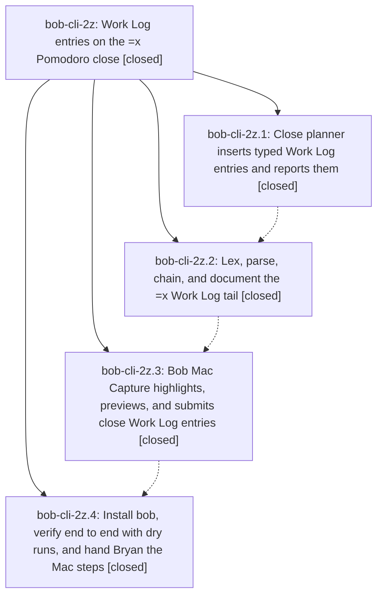

# Bead: bob-cli-2z — Work Log entries on the =x Pomodoro close

[Bead Pages](../README.md) / bob-cli-2z

**Status:** ✓ closed · **Resolution:** done · **Type:** ▸ plan · **Tier:** epic
**Owner:** `bryanbugyi34@gmail.com` · **Created by:** [bbugyi200.athena.0ui](https://github.com/bobs-org/bob-cli--agents/blob/main/sessions/bbugyi200.athena.0ui.md) · **Assignee:** `bob-cli-2z.land`
**Created:** 2026-09-30 18:46:56 EDT · **Closed:** 2026-09-30 20:43:37 EDT
**Plan:** [202609/close\_work\_log\_entries.md](https://github.com/bobs-org/bob-cli--plans/blob/main/202609/close_work_log_entries.md)

## Description

`bob capture '=x2,3 2 wired the lexer'` closes the running Pomodoro with tasks 2 and 3 in progress and first adds `wired the lexer` as a sub-bullet under Task Link 2, so the unchanged close writes it to that task's Work Log. Bob Mac Capture highlights, previews, and submits the same drafts, and every mistake is caught loudly before anything is written.

## Notes

[2026-10-01T00:36:30Z · bob-cli-2z.land] FOLLOW-UP TRIAGE: bob-cli-2z.1 #1 and bob-cli-2z.2 #1 propose the same pre-existing parallel BOB_DAY_FILE test race. It is already task bob-cli-2e; source audit confirms the unlocked capture_pomodoros with_env versus module-private capture_complete DAY_FILE_LOCK, and I recorded one +1 with both proposing phases. No new task. bob-cli-2z.4 MacBook install remains the approved best-effort rollout exception; its checklist is in phase note #1. LAND AUDIT: verified engine 8653c67 and grammar c7ce096 in source and CLI tests, Mac 6a0263d in models/presentation/fixtures/tests, and rollout phase notes. Post-start af0d17f docs/hooks and freshness 32d7007/3cd4d44 were reviewed; 3cd4d44 already stamps the same close planner path, with coverage. Remaining epic-caused gap: Mac close card subtracts typed entries from work_log using a Set, losing a hand-written entry with identical dated text. A small tale will fix and land this epic.

[2026-10-01T00:37:34Z · bob-cli-2z.land] Remaining-work tale validated: sase_plan_close_work_log_mac_duplicates.md (small). It covers the Mac duplicate Work Log presentation fix, regression test, just check, and this epic closeout; no new task bead was created for the already-tracked BOB_DAY_FILE race.

[2026-10-01T00:43:37Z · bob-cli-2z.land] Verified the engine, grammar, Mac presentation including duplicate Work Log rows, rollout notes, and post-start freshness integration; triaged both BOB_DAY_FILE proposals to bob-cli-2e.

## Phases

| Bead | Title | Status | Size | Created | Agents | Commits |
|---|---|---|---|---|---:|---:|
| [bob-cli-2z.1](bob-cli-2z.1.md) | Close planner inserts typed Work Log entries and reports them | ✓ closed | medium | 2026-09-30 | 1 | 1 |
| [bob-cli-2z.2](bob-cli-2z.2.md) | Lex, parse, chain, and document the =x Work Log tail | ✓ closed | medium | 2026-09-30 | 1 | 1 |
| [bob-cli-2z.3](bob-cli-2z.3.md) | Bob Mac Capture highlights, previews, and submits close Work Log entries | ✓ closed | medium | 2026-09-30 | 1 | 1 |
| [bob-cli-2z.4](bob-cli-2z.4.md) | Install bob, verify end to end with dry runs, and hand Bryan the Mac steps | ✓ closed | small | 2026-09-30 | 1 | 0 |

## Lineage

## Agents

| Agent | Bead | Commits |
|---|---|---:|
| [bbugyi200.athena.bob-cli-2z.1](https://github.com/bobs-org/bob-cli--agents/blob/main/agents/bbugyi200.athena.bob-cli-2z.1/README.md) | [bob-cli-2z.1](bob-cli-2z.1.md) | 1 |
| [bbugyi200.athena.bob-cli-2z.2](https://github.com/bobs-org/bob-cli--agents/blob/main/agents/bbugyi200.athena.bob-cli-2z.2/README.md) | [bob-cli-2z.2](bob-cli-2z.2.md) | 1 |
| [bbugyi200.athena.bob-cli-2z.3](https://github.com/bobs-org/bob-cli--agents/blob/main/agents/bbugyi200.athena.bob-cli-2z.3/README.md) | [bob-cli-2z.3](bob-cli-2z.3.md) | 1 |
| [bbugyi200.athena.bob-cli-2z.4](https://github.com/bobs-org/bob-cli--agents/blob/main/agents/bbugyi200.athena.bob-cli-2z.4/README.md) | [bob-cli-2z.4](bob-cli-2z.4.md) | 0 |
| [bbugyi200.athena.bob-cli-2z.land](https://github.com/bobs-org/bob-cli--agents/blob/main/sessions/bbugyi200.athena.bob-cli-2z.land.md) | [bob-cli-2z](README.md) | 1 |

## Commits

| Repo | Commit | Subject | Bead | Committed |
|---|---|---|---|---|
| bob-cli | [`8653c67`](https://github.com/bobs-org/bob-cli/commit/8653c676c6b3f9caa71bee206433b6c8dc61648f) | feat(capture): insert typed Work Log entries on the =x close and report them | [bob-cli-2z.1](bob-cli-2z.1.md) | 2026-09-30 19:17:47 EDT |
| bob-cli | [`c7ce096`](https://github.com/bobs-org/bob-cli/commit/c7ce0964fadfd6a06b27d1d8210f58ee1f010f32) | feat(capture): implement =x Work Log tail grammar | [bob-cli-2z.2](bob-cli-2z.2.md) | 2026-09-30 19:52:44 EDT |
| bob-mac-capture | [`bob-mac-capture@6a0263d`](https://github.com/bobs-org/bob-mac-capture/commit/6a0263d33e302408f6d4f4a0c874e560b01cb78c) | feat(capture): highlight, preview, and submit close Work Log entries | [bob-cli-2z.3](bob-cli-2z.3.md) | 2026-09-30 20:13:32 EDT |
| bob-mac-capture | [`bob-mac-capture@0f5def1`](https://github.com/bobs-org/bob-mac-capture/commit/0f5def1ab90e9279dd7075294c55c3569a28ef7a) | fix(mac-capture): preserve duplicate Work Log rows in close card by occurrence count | [bob-cli-2z](README.md) | 2026-09-30 20:45:51 EDT |
