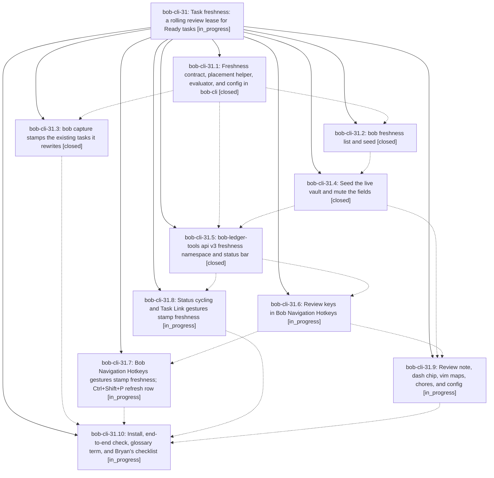

# Bead: bob-cli-31 — Task freshness: a rolling review lease for Ready tasks

[Bead Pages](../README.md) / bob-cli-31

**Status:** ◐ in_progress · **Type:** ▸ plan · **Tier:** epic
**Owner:** `bryanbugyi34@gmail.com` · **Created by:** [bbugyi200.apollo.research.v.linker.w0](https://github.com/bobs-org/bob-cli--agents/blob/main/sessions/bbugyi200.apollo.research.v.linker.w0.md) · **Assignee:** `bob-cli-31.land`
**Created:** 2026-09-30 19:32:05 EDT
**Plan:** [202609/task\_freshness\_review.md](https://github.com/bobs-org/bob-cli--plans/blob/main/202609/task_freshness_review.md)

## Description

Every visible, non-recurring Ready task can carry a human-confirmed [fresh:: YYYY-MM-DD]. A task that was never confirmed (every new capture) or was confirmed longer ago than its refresh interval is due for review. The interval is 7 days by default and can be overridden per task, per note, and in config. Bryan works through the due tasks each morning in their source notes with ]s / [s and Alt+F / Alt+Shift+F, and the status bar always shows how many tasks are due and how many he refreshed today. Every supported keymap and bob capture edit stamps the tasks it rewrites; task creation and automation never do.

## Phases

| Bead | Title | Status | Size | Created | Agents | Commits |
|---|---|---|---|---|---:|---:|
| [bob-cli-31.1](bob-cli-31.1.md) | Freshness contract, placement helper, evaluator, and config in bob-cli | ✓ closed | medium | 2026-09-30 | 1 | 1 |
| [bob-cli-31.10](bob-cli-31.10.md) | Install, end-to-end check, glossary term, and Bryan's checklist | ◐ in_progress | small | 2026-09-30 | 1 | 0 |
| [bob-cli-31.2](bob-cli-31.2.md) | bob freshness list and seed | ✓ closed | medium | 2026-09-30 | 1 | 1 |
| [bob-cli-31.3](bob-cli-31.3.md) | bob capture stamps the existing tasks it rewrites | ✓ closed | medium | 2026-09-30 | 1 | 1 |
| [bob-cli-31.4](bob-cli-31.4.md) | Seed the live vault and mute the fields | ✓ closed | small | 2026-09-30 | 1 | 1 |
| [bob-cli-31.5](bob-cli-31.5.md) | bob-ledger-tools api v3 freshness namespace and status bar | ✓ closed | medium | 2026-09-30 | 1 | 2 |
| [bob-cli-31.6](bob-cli-31.6.md) | Review keys in Bob Navigation Hotkeys | ◐ in_progress | medium | 2026-09-30 | 1 | 0 |
| [bob-cli-31.7](bob-cli-31.7.md) | Bob Navigation Hotkeys gestures stamp freshness; Ctrl+Shift+P refresh row | ◐ in_progress | medium | 2026-09-30 | 1 | 0 |
| [bob-cli-31.8](bob-cli-31.8.md) | Status cycling and Task Link gestures stamp freshness | ◐ in_progress | medium | 2026-09-30 | 1 | 0 |
| [bob-cli-31.9](bob-cli-31.9.md) | Review note, dash chip, vim maps, chores, and config | ◐ in_progress | small | 2026-09-30 | 1 | 0 |

## Lineage

## Agents

| Agent | Bead | Commits |
|---|---|---:|
| [bbugyi200.apollo.bob-cli-31.1](https://github.com/bobs-org/bob-cli--agents/blob/main/agents/bbugyi200.apollo.bob-cli-31.1/README.md) | [bob-cli-31.1](bob-cli-31.1.md) | 1 |
| [bbugyi200.apollo.bob-cli-31.10](https://github.com/bobs-org/bob-cli--agents/blob/main/agents/bbugyi200.apollo.bob-cli-31.10/README.md) | [bob-cli-31.10](bob-cli-31.10.md) | 0 |
| [bbugyi200.apollo.bob-cli-31.2](https://github.com/bobs-org/bob-cli--agents/blob/main/agents/bbugyi200.apollo.bob-cli-31.2/README.md) | [bob-cli-31.2](bob-cli-31.2.md) | 1 |
| [bbugyi200.apollo.bob-cli-31.3](https://github.com/bobs-org/bob-cli--agents/blob/main/agents/bbugyi200.apollo.bob-cli-31.3/README.md) | [bob-cli-31.3](bob-cli-31.3.md) | 1 |
| [bbugyi200.apollo.bob-cli-31.4](https://github.com/bobs-org/bob-cli--agents/blob/main/agents/bbugyi200.apollo.bob-cli-31.4/README.md) | [bob-cli-31.4](bob-cli-31.4.md) | 1 |
| [bbugyi200.apollo.bob-cli-31.5](https://github.com/bobs-org/bob-cli--agents/blob/main/agents/bbugyi200.apollo.bob-cli-31.5/README.md) | [bob-cli-31.5](bob-cli-31.5.md) | 2 |
| [bbugyi200.apollo.bob-cli-31.6](https://github.com/bobs-org/bob-cli--agents/blob/main/agents/bbugyi200.apollo.bob-cli-31.6/README.md) | [bob-cli-31.6](bob-cli-31.6.md) | 0 |
| [bbugyi200.apollo.bob-cli-31.7](https://github.com/bobs-org/bob-cli--agents/blob/main/agents/bbugyi200.apollo.bob-cli-31.7/README.md) | [bob-cli-31.7](bob-cli-31.7.md) | 0 |
| [bbugyi200.apollo.bob-cli-31.8](https://github.com/bobs-org/bob-cli--agents/blob/main/agents/bbugyi200.apollo.bob-cli-31.8/README.md) | [bob-cli-31.8](bob-cli-31.8.md) | 0 |
| [bbugyi200.apollo.bob-cli-31.9](https://github.com/bobs-org/bob-cli--agents/blob/main/agents/bbugyi200.apollo.bob-cli-31.9/README.md) | [bob-cli-31.9](bob-cli-31.9.md) | 0 |
| [bbugyi200.apollo.bob-cli-31.land](https://github.com/bobs-org/bob-cli--agents/blob/main/agents/bbugyi200.apollo.bob-cli-31.land/README.md) | [bob-cli-31](README.md) | 0 |

## Commits

| Repo | Commit | Subject | Bead | Committed |
|---|---|---|---|---|
| bob-cli | [`32d7007`](https://github.com/bobs-org/bob-cli/commit/32d700717c65ef691d6cb8cb457f948d56445686) | feat(freshness): implement fresh-core contract, placement, evaluator and config | [bob-cli-31.1](bob-cli-31.1.md) | 2026-09-30 19:56:49 EDT |
| bob-cli | [`3cd4d44`](https://github.com/bobs-org/bob-cli/commit/3cd4d44290857815d6d6596ed307a54eca2456e7) | feat(capture): stamp freshness on rewritten tasks | [bob-cli-31.3](bob-cli-31.3.md) | 2026-09-30 20:23:52 EDT |
| bob-cli | [`f103979`](https://github.com/bobs-org/bob-cli/commit/f103979594c7a1b471ddb6a9f291befce6c3db2a) | feat(freshness): add bob freshness list and seed review queue | [bob-cli-31.2](bob-cli-31.2.md) | 2026-09-30 20:41:17 EDT |
| bob-cli | [`66c4e4c`](https://github.com/bobs-org/bob-cli/commit/66c4e4cb827abf096543e22b060d025b6f2cdc69) | feat(freshness): stamp blockquoted tasks, seed live vault cutover (bob-cli-31.4) | [bob-cli-31.4](bob-cli-31.4.md) | 2026-09-30 21:59:55 EDT |
| bob-cli | [`fcf1f6a`](https://github.com/bobs-org/bob-cli/commit/fcf1f6ab679869befac977f07ad13f0b6c2601ea) | docs(freshness): add ledger-freshness spec and phase Surfaces row | [bob-cli-31.5](bob-cli-31.5.md) | 2026-09-30 22:20:27 EDT |
| bob-plugins | [`bob-plugins@8fd0f90`](https://github.com/bobs-org/bob-plugins/commit/8fd0f906fd7f881be8814ab377a20ff4fbe85f97) | feat(ledger-tools): add ledger-freshness evaluator, api v3, and status bar | [bob-cli-31.5](bob-cli-31.5.md) | 2026-09-30 22:21:13 EDT |
