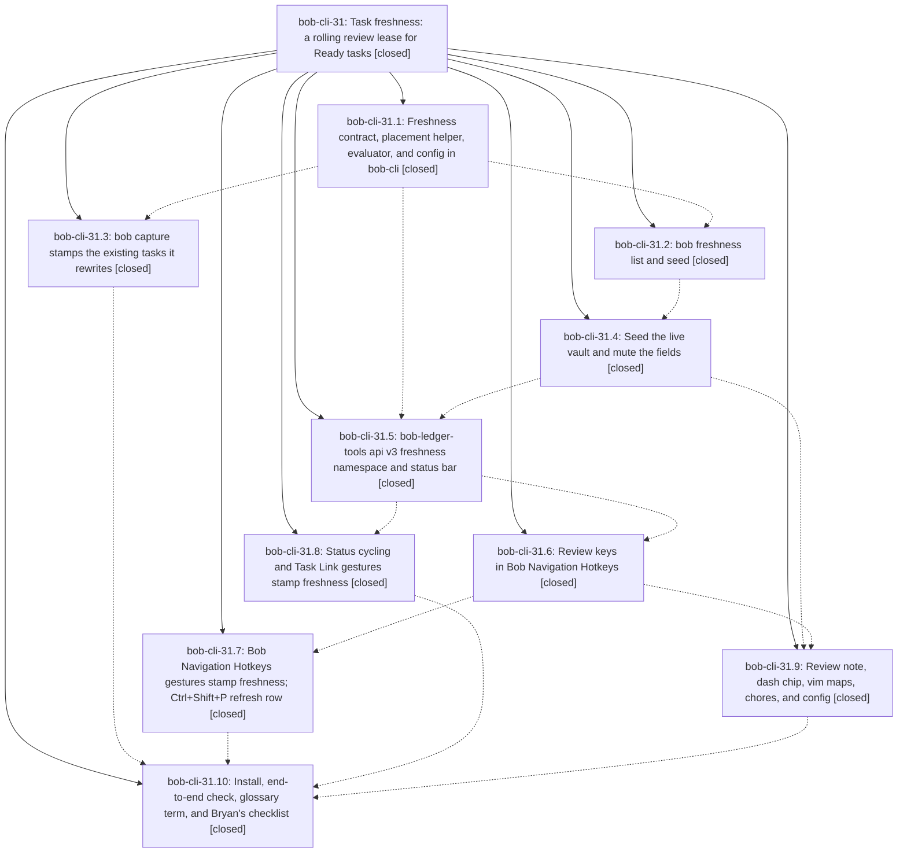

# Bead: bob-cli-31 — Task freshness: a rolling review lease for Ready tasks

[Bead Pages](../README.md) / bob-cli-31

**Status:** ✓ closed · **Resolution:** done · **Type:** ▸ plan · **Tier:** epic
**Owner:** `bryanbugyi34@gmail.com` · **Created by:** [bbugyi200.apollo.research.v.linker.w0](https://github.com/bobs-org/bob-cli--agents/blob/main/sessions/bbugyi200.apollo.research.v.linker.w0.md) · **Assignee:** `bob-cli-31.land`
**Created:** 2026-09-30 19:32:05 EDT · **Closed:** 2026-10-01 00:08:07 EDT
**Plan:** [202609/task\_freshness\_review.md](https://github.com/bobs-org/bob-cli--plans/blob/main/202609/task_freshness_review.md)

## Description

Every visible, non-recurring Ready task can carry a human-confirmed [fresh:: YYYY-MM-DD]. A task that was never confirmed (every new capture) or was confirmed longer ago than its refresh interval is due for review. The interval is 7 days by default and can be overridden per task, per note, and in config. Bryan works through the due tasks each morning in their source notes with ]s / [s and Alt+F / Alt+Shift+F, and the status bar always shows how many tasks are due and how many he refreshed today. Every supported keymap and bob capture edit stamps the tasks it rewrites; task creation and automation never do.

## Notes

[2026-10-01T03:40:51Z · bob-cli-32.land] DISCOVERED ISSUE: five capture_pomodoro_close linked_task_tests fail on current master because ClosePlanner::apply_startable stamps [fresh:: 2026-09-28] and the expectations still describe the pre-stamp line. Tests: close_plan_preserves_crlf_in_changed_task_notes (left "- [/] #task Ready [fresh:: 2026-09-28] ^ready\r\n", right without the stamp), day_file_can_also_be_a_task_note_and_receives_its_work_log (the [/] line no longer contains "[created:: 2026-09-20] ^self" with nothing between), selection_in_progress_and_complete_updates_both_tasks, typed_entry_lands_in_task_work_log_as_typed_subset, and worked_example_updates_tasks_and_writes_dated_work_logs. Work Log bytes match; only the stamp differs. Reproduced with cargo test --lib capture_pomodoro_close:: (61 passed, these 5 failed). Introduced by 3cd4d44, bob-cli-31.3's stamp_fresh on [/] closes. Already proposed on bob-cli-31.4. Also proposed by bob-cli-32.1, bob-cli-32.2, and bob-cli-32.4; that lander declined a new task because this epic owns the stamp. The bullet and detail tests from bob-cli-32 pass.

[2026-10-01T03:48:55Z · bob-cli-31.land] LAND TRIAGE of PROPOSED FOLLOW-UPs (bob-cli-31.land): (1) clippy deny overly_complex_bool_expr at tests/cli/capture/pomodoro_name.rs:808 (proposed by .1, .3 #1, .4 #1, .10 #2): pre-existing (blame 7d1c8dd3, 2026-09-28), owned by active epic bob-cli-28, so I added a DISCOVERED ISSUE corroboration note there instead of creating a task. (2) the 5 capture_pomodoro_close::linked_task_tests failures (.4 #1): NOT pre-existing. Caused by this epic's 3cd4d44 (.3): apply_startable now stamps [fresh::] on [/] lines and the unit expectations (blame f8b03c2) were never updated, because .3 ran only the CLI tests. This is remaining epic work for the landing tale. (3) mirror P18 blockquote stripping in ledger-tools (.4 #2): already done by .5; test-ledger-tools-freshness covers 'P1-P11, P14-P16, P18'. (4) Bob Mac Capture rendering of stamped task_line (.3 #2): verified in bob-mac-capture 0ff0de9 and declined. CaptureTogglePresentation/CapturePomodoroLinkPresentation.taskPreviewText strip every inline field, so [fresh::] never shows in toggle/link cards or notification batch lines. The only raw use, CapturePanelModel.captureSummary, already showed [created::] and ^id raw by design, so this adds no new defect. (5) Ctrl+Alt+J/K Vim fallback (.6 #1): declined. The plan's Vim path is the ]s / [s vimrc maps that .9 installed, so the chords need no Vim capture listener. (6) cycler undo granularity (.8 #1): declined as a task. Plan option (b), a follow-up edit, was explicitly allowed. The landing tale adds the same-task/expected-status guard the plan required for (b), and an Alt+] then Ctrl+Z check goes on Bryan's checklist. (7) Land-agent discovery: bob freshness list failed once with 'interrupted' under load ~22. Cause: the pre-existing eager Tasks JS sandbox and its 2s deadline in js.rs, which also affects bob plan and bob query. Filed bob-cli-33 (bug, medium). Not caused by this epic.

[2026-10-01T04:08:07Z · bob-cli-31.land] Land bob-cli-31 (task freshness). All ten phases (.1-.10) verified against notes, source, and commits (bob-cli 32d7007, 3cd4d44, f103979, 66c4e4c, fcf1f6a, 779cc0c, 663a0bc, 52969e5; bob-plugins 8fd0f90, 3fc6a5f, 7e13c02, 566a3ef). bob-cli-2z =x Work Log integration checked (c7ce096, 15c6341, 0ce41b9 keep apply_startable stamp intact, no new rewrite path). Fixed five linked_task_tests expectations to carry [fresh:: 2026-09-28] (worked_example, day_file self-note, crlf, selection_in_progress, typed_entry). Cleared epic clippy warnings: lib 38->22, zero diagnostics in src/native/freshness/**, src/native/config/freshness.rs, and the three re-export lines; only error left is pre-existing deny at tests/cli/capture/pomodoro_name.rs:808 (bob-cli-28). block-id-prompt 1.17.0 stamps only rewritten lines (lineRewritten guard); task-status-cycler 1.19.0 follow-up stamp guarded by line-count + same-task/expected-status check. Tests: cargo test all green (lib+CLI+parity), cargo fmt --check clean; bob-plugins npm test 950/950, npm run validate 6/6; deployed both via bob plugins sync with cmp OK. Follow-up triage already on epic: bob-cli-28 corroboration for pomodoro_name:808 deny, new bug bob-cli-33 (freshness list interrupted under load), declined P18 mirror (done in .5), Mac Capture rendering (no defect), Vim fallback, and cycler undo granularity.

## Phases

| Bead | Title | Status | Size | Created | Agents | Commits |
|---|---|---|---|---|---:|---:|
| [bob-cli-31.1](bob-cli-31.1.md) | Freshness contract, placement helper, evaluator, and config in bob-cli | ✓ closed | medium | 2026-09-30 | 1 | 1 |
| [bob-cli-31.10](bob-cli-31.10.md) | Install, end-to-end check, glossary term, and Bryan's checklist | ✓ closed | small | 2026-09-30 | 1 | 1 |
| [bob-cli-31.2](bob-cli-31.2.md) | bob freshness list and seed | ✓ closed | medium | 2026-09-30 | 1 | 1 |
| [bob-cli-31.3](bob-cli-31.3.md) | bob capture stamps the existing tasks it rewrites | ✓ closed | medium | 2026-09-30 | 1 | 1 |
| [bob-cli-31.4](bob-cli-31.4.md) | Seed the live vault and mute the fields | ✓ closed | small | 2026-09-30 | 1 | 1 |
| [bob-cli-31.5](bob-cli-31.5.md) | bob-ledger-tools api v3 freshness namespace and status bar | ✓ closed | medium | 2026-09-30 | 1 | 2 |
| [bob-cli-31.6](bob-cli-31.6.md) | Review keys in Bob Navigation Hotkeys | ✓ closed | medium | 2026-09-30 | 1 | 1 |
| [bob-cli-31.7](bob-cli-31.7.md) | Bob Navigation Hotkeys gestures stamp freshness; Ctrl+Shift+P refresh row | ✓ closed | medium | 2026-09-30 | 1 | 2 |
| [bob-cli-31.8](bob-cli-31.8.md) | Status cycling and Task Link gestures stamp freshness | ✓ closed | medium | 2026-09-30 | 1 | 2 |
| [bob-cli-31.9](bob-cli-31.9.md) | Review note, dash chip, vim maps, chores, and config | ✓ closed | small | 2026-09-30 | 1 | 0 |

## Lineage

## Agents

| Agent | Bead | Commits |
|---|---|---:|
| [bbugyi200.apollo.bob-cli-31.1](https://github.com/bobs-org/bob-cli--agents/blob/main/agents/bbugyi200.apollo.bob-cli-31.1/README.md) | [bob-cli-31.1](bob-cli-31.1.md) | 1 |
| [bbugyi200.apollo.bob-cli-31.10](https://github.com/bobs-org/bob-cli--agents/blob/main/agents/bbugyi200.apollo.bob-cli-31.10/README.md) | [bob-cli-31.10](bob-cli-31.10.md) | 1 |
| [bbugyi200.apollo.bob-cli-31.2](https://github.com/bobs-org/bob-cli--agents/blob/main/agents/bbugyi200.apollo.bob-cli-31.2/README.md) | [bob-cli-31.2](bob-cli-31.2.md) | 1 |
| [bbugyi200.apollo.bob-cli-31.3](https://github.com/bobs-org/bob-cli--agents/blob/main/agents/bbugyi200.apollo.bob-cli-31.3/README.md) | [bob-cli-31.3](bob-cli-31.3.md) | 1 |
| [bbugyi200.apollo.bob-cli-31.4](https://github.com/bobs-org/bob-cli--agents/blob/main/agents/bbugyi200.apollo.bob-cli-31.4/README.md) | [bob-cli-31.4](bob-cli-31.4.md) | 1 |
| [bbugyi200.apollo.bob-cli-31.5](https://github.com/bobs-org/bob-cli--agents/blob/main/agents/bbugyi200.apollo.bob-cli-31.5/README.md) | [bob-cli-31.5](bob-cli-31.5.md) | 2 |
| [bbugyi200.apollo.bob-cli-31.6](https://github.com/bobs-org/bob-cli--agents/blob/main/agents/bbugyi200.apollo.bob-cli-31.6/README.md) | [bob-cli-31.6](bob-cli-31.6.md) | 1 |
| [bbugyi200.apollo.bob-cli-31.7](https://github.com/bobs-org/bob-cli--agents/blob/main/agents/bbugyi200.apollo.bob-cli-31.7/README.md) | [bob-cli-31.7](bob-cli-31.7.md) | 2 |
| [bbugyi200.apollo.bob-cli-31.8](https://github.com/bobs-org/bob-cli--agents/blob/main/agents/bbugyi200.apollo.bob-cli-31.8/README.md) | [bob-cli-31.8](bob-cli-31.8.md) | 2 |
| [bbugyi200.apollo.bob-cli-31.9](https://github.com/bobs-org/bob-cli--agents/blob/main/agents/bbugyi200.apollo.bob-cli-31.9/README.md) | [bob-cli-31.9](bob-cli-31.9.md) | 0 |
| [bbugyi200.apollo.bob-cli-31.land](https://github.com/bobs-org/bob-cli--agents/blob/main/sessions/bbugyi200.apollo.bob-cli-31.land.md) | [bob-cli-31](README.md) | 3 |

## Commits

| Repo | Commit | Subject | Bead | Committed |
|---|---|---|---|---|
| bob-cli | [`32d7007`](https://github.com/bobs-org/bob-cli/commit/32d700717c65ef691d6cb8cb457f948d56445686) | feat(freshness): implement fresh-core contract, placement, evaluator and config | [bob-cli-31.1](bob-cli-31.1.md) | 2026-09-30 19:56:49 EDT |
| bob-cli | [`3cd4d44`](https://github.com/bobs-org/bob-cli/commit/3cd4d44290857815d6d6596ed307a54eca2456e7) | feat(capture): stamp freshness on rewritten tasks | [bob-cli-31.3](bob-cli-31.3.md) | 2026-09-30 20:23:52 EDT |
| bob-cli | [`f103979`](https://github.com/bobs-org/bob-cli/commit/f103979594c7a1b471ddb6a9f291befce6c3db2a) | feat(freshness): add bob freshness list and seed review queue | [bob-cli-31.2](bob-cli-31.2.md) | 2026-09-30 20:41:17 EDT |
| bob-cli | [`66c4e4c`](https://github.com/bobs-org/bob-cli/commit/66c4e4cb827abf096543e22b060d025b6f2cdc69) | feat(freshness): stamp blockquoted tasks, seed live vault cutover (bob-cli-31.4) | [bob-cli-31.4](bob-cli-31.4.md) | 2026-09-30 21:59:55 EDT |
| bob-cli | [`fcf1f6a`](https://github.com/bobs-org/bob-cli/commit/fcf1f6ab679869befac977f07ad13f0b6c2601ea) | docs(freshness): add ledger-freshness spec and phase Surfaces row | [bob-cli-31.5](bob-cli-31.5.md) | 2026-09-30 22:20:27 EDT |
| bob-plugins | [`bob-plugins@8fd0f90`](https://github.com/bobs-org/bob-plugins/commit/8fd0f906fd7f881be8814ab377a20ff4fbe85f97) | feat(ledger-tools): add ledger-freshness evaluator, api v3, and status bar | [bob-cli-31.5](bob-cli-31.5.md) | 2026-09-30 22:21:13 EDT |
| bob-plugins | [`bob-plugins@3fc6a5f`](https://github.com/bobs-org/bob-plugins/commit/3fc6a5f85a837904de2a02d23bb01557fffa0121) | feat(nav): review keys for task freshness (bob-cli-31.6) | [bob-cli-31.6](bob-cli-31.6.md) | 2026-09-30 22:37:00 EDT |
| bob-cli | [`779cc0c`](https://github.com/bobs-org/bob-cli/commit/779cc0caa8169f3d2799d5d6cb30f2e475d50c85) | docs(freshness): mark cycler-link-stamps surfaces landed | [bob-cli-31.8](bob-cli-31.8.md) | 2026-09-30 22:40:31 EDT |
| bob-plugins | [`bob-plugins@7e13c02`](https://github.com/bobs-org/bob-plugins/commit/7e13c02285a4d4c5dc6e8b47f8cce6177ac89d3a) | feat(plugins): stamp freshness on cycler-link status transitions | [bob-cli-31.8](bob-cli-31.8.md) | 2026-09-30 22:41:08 EDT |
| bob-cli | [`663a0bc`](https://github.com/bobs-org/bob-cli/commit/663a0bc1846d2e75a3d7854b83d9607246076357) | docs(freshness): mark nav-stamps surfaces landed | [bob-cli-31.7](bob-cli-31.7.md) | 2026-09-30 23:18:34 EDT |
| bob-plugins | [`bob-plugins@566a3ef`](https://github.com/bobs-org/bob-plugins/commit/566a3ef8725ff1ec6396288566575f36b9c2849f) | feat(nav): stamp freshness on lane/property/move/dependency gestures and add refresh row (bob-cli-31.7) | [bob-cli-31.7](bob-cli-31.7.md) | 2026-09-30 23:19:11 EDT |
| bob-cli | [`52969e5`](https://github.com/bobs-org/bob-cli/commit/52969e50fa95a107aaaca16532717f81987b5957) | docs(freshness): rollout — glossary strand and finalized Surfaces table (bob-cli-31.10) | [bob-cli-31.10](bob-cli-31.10.md) | 2026-09-30 23:32:32 EDT |
| bob-cli | [`6710c74`](https://github.com/bobs-org/bob-cli/commit/6710c748752969e82504bedbdfcb1956704bc317) | test(freshness): land epic bob-cli-31 — fix linked\_task\_tests stamps, clear epic clippy warnings | [bob-cli-31](README.md) | 2026-10-01 00:18:31 EDT |
| bob-plugins | [`bob-plugins@eff561e`](https://github.com/bobs-org/bob-plugins/commit/eff561ecca07b5a8d30d2502f92b41b388a8505e) | feat(freshness): stamp only rewritten lines in block-id-prompt 1.17.0, guard cycler follow-up stamp 1.19.0 | [bob-cli-31](README.md) | 2026-10-01 00:19:08 EDT |
| bob-cli--plans | [`bob-cli--plans@bb4b7a6`](https://github.com/bobs-org/bob-cli--plans/commit/bb4b7a68576eb59057daf3ed0383767217c7dc22) | docs(freshness): mark task\_freshness\_review plan done | [bob-cli-31](README.md) | 2026-10-01 00:19:34 EDT |
