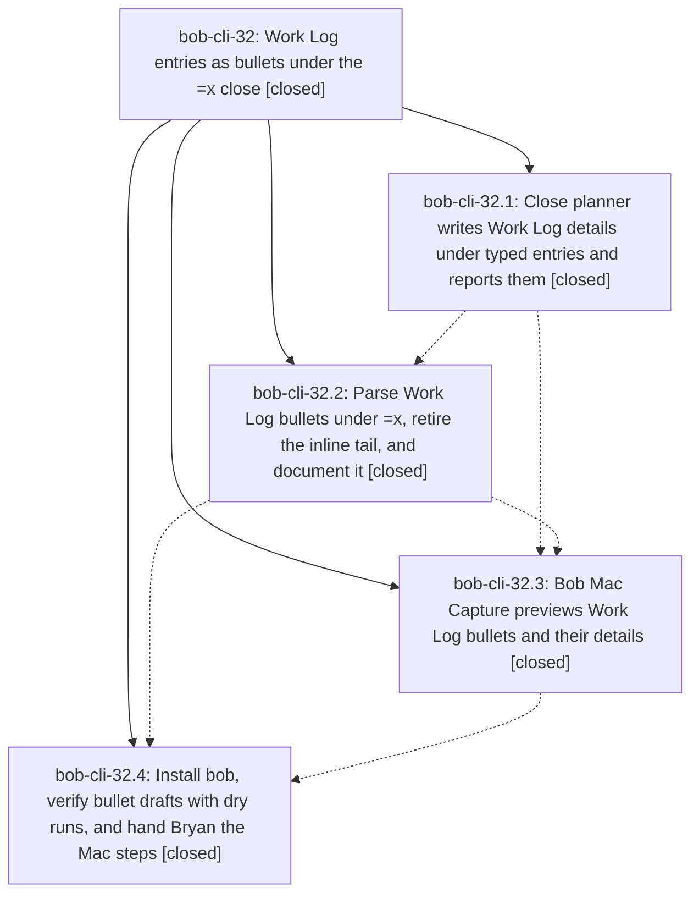

# Bead: bob-cli-32 — Work Log entries as bullets under the =x close

[Bead Pages](../README.md) / bob-cli-32

**Status:** ✓ closed · **Resolution:** done · **Type:** ▸ plan · **Tier:** epic
**Owner:** `bryanbugyi34@gmail.com` · **Created by:** [bbugyi200.athena.0uj](https://github.com/bobs-org/bob-cli--agents/blob/main/sessions/bbugyi200.athena.0uj.md) · **Assignee:** `bob-cli-32.land`
**Created:** 2026-09-30 21:31:27 EDT · **Closed:** 2026-09-30 23:40:59 EDT
**Plan:** [202609/close\_work\_log\_bullets.md](https://github.com/bobs-org/bob-cli--plans/blob/main/202609/close_work_log_bullets.md)

## Description

Work Log entries become child bullets of the `=x` close instead of an inline tail:
`=x2,3` followed by `- 2 foo bar baz` on the next line closes the running Pomodoro
with tasks 2 and 3 in progress and logs `foo bar baz` to task 2. A two-space
`  - …` bullet under an entry is a detail that nests under that entry in the task's
Work Log. The inline tail (`=x2,3 2 foo bar baz`) is retired; it now fails with a
message that shows the bullet to write. Bob Mac Capture highlights, previews, and
submits the new drafts, and the close card shows each entry with its details.

## Notes

[2026-10-01T03:40:59Z · bob-cli-32.land] Verified all four phases against the plan, the source, and the commits. Engine 15c6341 (bob-cli-32.1) adds CloseLogEntry.details, LineTag::InsertedDetail, aligned typed_work_log_details, and human/JSON detail output. Grammar 0ce41b9 (bob-cli-32.2) replaces the inline tail with the shared bullet lexer, retires the tail with the bullet hint, attaches chain children to the line's =x, and suppresses marker and block completion on bullet lines. Mac 1c85058 and 0ff0de9 (bob-cli-32.3) decode details and typed_work_log_details, render them on the close card, and teach =x Ctrl-J 1. Rollout bob-cli-32.4 reinstalled bob and recorded the Mac checklist; the MacBook did not resolve. CLI tests in pomodoro_close_log passed 8/8 (worked table, retired tail, chains, dry-run, parse protocol). Detail nesting and bullet-line completion tests passed.

Integrated commits after 15c6341 that are not this epic: 66c4e4c teaches stamp_fresh to see blockquoted tasks, and fcf1f6a, 779cc0c, and 663a0bc are freshness docs. apply_startable already calls stamp_fresh, so blockquoted [/] closes pick up that strip with no planner change. Freshness docs already say =x rows that set [/] stamp and sub-bullets never stamp, which is the bullet contract. No bob-mac-capture commit landed after 0ff0de9.

Landed two leftovers of this epic: docs/capture.md still called the completion exception a Work Log tail, and POMODORO_CLOSE_INTERNAL_BULLETS_ERROR was unused while reject_pomodoro_close_conflicts inlined the same sentence. The docs now say bullet lines, and the reject uses the markers constant.

Follow-ups: bob-cli-32.1, bob-cli-32.2, and bob-cli-32.4 each proposed the same five linked_task_tests failures. They are not caused by this epic. The assertions lack [fresh:: 2026-09-28], which apply_startable writes via stamp_fresh from 3cd4d44 (bob-cli-31.3). No task bead matched. In-progress bob-cli-28 does not own the stamp. Recorded a DISCOVERED ISSUE on in-progress bob-cli-31, which already has the same proposal on bob-cli-31.4. Declined a new task. The Mac checklist on bob-cli-32.4 is the rollout handoff, not a new task. No --epic-symbol entries. No parent bead.

## Phases

| Bead | Title | Status | Size | Created | Agents | Commits |
|---|---|---|---|---|---:|---:|
| [bob-cli-32.1](bob-cli-32.1.md) | Close planner writes Work Log details under typed entries and reports them | ✓ closed | small | 2026-09-30 | 1 | 1 |
| [bob-cli-32.2](bob-cli-32.2.md) | Parse Work Log bullets under =x, retire the inline tail, and document it | ✓ closed | medium | 2026-09-30 | 1 | 1 |
| [bob-cli-32.3](bob-cli-32.3.md) | Bob Mac Capture previews Work Log bullets and their details | ✓ closed | medium | 2026-09-30 | 1 | 2 |
| [bob-cli-32.4](bob-cli-32.4.md) | Install bob, verify bullet drafts with dry runs, and hand Bryan the Mac steps | ✓ closed | small | 2026-09-30 | 1 | 0 |

## Lineage

## Agents

| Agent | Bead | Commits |
|---|---|---:|
| [bbugyi200.athena.bob-cli-32.1](https://github.com/bobs-org/bob-cli--agents/blob/main/agents/bbugyi200.athena.bob-cli-32.1/README.md) | [bob-cli-32.1](bob-cli-32.1.md) | 1 |
| [bbugyi200.athena.bob-cli-32.2](https://github.com/bobs-org/bob-cli--agents/blob/main/agents/bbugyi200.athena.bob-cli-32.2/README.md) | [bob-cli-32.2](bob-cli-32.2.md) | 1 |
| [bbugyi200.athena.bob-cli-32.3](https://github.com/bobs-org/bob-cli--agents/blob/main/agents/bbugyi200.athena.bob-cli-32.3/README.md) | [bob-cli-32.3](bob-cli-32.3.md) | 0 |
| [bbugyi200.athena.bob-cli-32.4](https://github.com/bobs-org/bob-cli--agents/blob/main/agents/bbugyi200.athena.bob-cli-32.4/README.md) | [bob-cli-32.4](bob-cli-32.4.md) | 0 |
| [bbugyi200.athena.bob-cli-32.land](https://github.com/bobs-org/bob-cli--agents/blob/main/agents/bbugyi200.athena.bob-cli-32.land/README.md) | [bob-cli-32](README.md) | 1 |

## Commits

| Repo | Commit | Subject | Bead | Committed |
|---|---|---|---|---|
| bob-cli | [`15c6341`](https://github.com/bobs-org/bob-cli/commit/15c63418ddc0558b968694cc53f88f083190db7a) | feat(capture): close planner writes Work Log details under typed entries and reports them | [bob-cli-32.1](bob-cli-32.1.md) | 2026-09-30 21:51:25 EDT |
| bob-cli | [`0ce41b9`](https://github.com/bobs-org/bob-cli/commit/0ce41b9df8470a93f6001fe4776b7b31d46e07c3) | feat(capture): use child bullets for =x Work Log entries | [bob-cli-32.2](bob-cli-32.2.md) | 2026-09-30 22:36:06 EDT |
| bob-mac-capture | [`bob-mac-capture@1c85058`](https://github.com/bobs-org/bob-mac-capture/commit/1c85058c4f9d2bc7c562d0a5a7e6d111d39e5bf5) | feat(capture): preview Work Log bullets and their details on the close card | [bob-cli-32.3](bob-cli-32.3.md) | 2026-09-30 22:59:05 EDT |
| bob-mac-capture | [`bob-mac-capture@0ff0de9`](https://github.com/bobs-org/bob-mac-capture/commit/0ff0de999056040ab09297445b92a1faad25335b) | fix(capture): serve the trimmed bullet placeholder as a plain close in fake-bob | [bob-cli-32.3](bob-cli-32.3.md) | 2026-09-30 23:05:27 EDT |
| bob-cli | [`f9eef4c`](https://github.com/bobs-org/bob-cli/commit/f9eef4c98d6f777b836b2389cbd95c426927dde9) | docs(capture): name bullet-line completion and use the close error | [bob-cli-32](README.md) | 2026-09-30 23:47:59 EDT |
