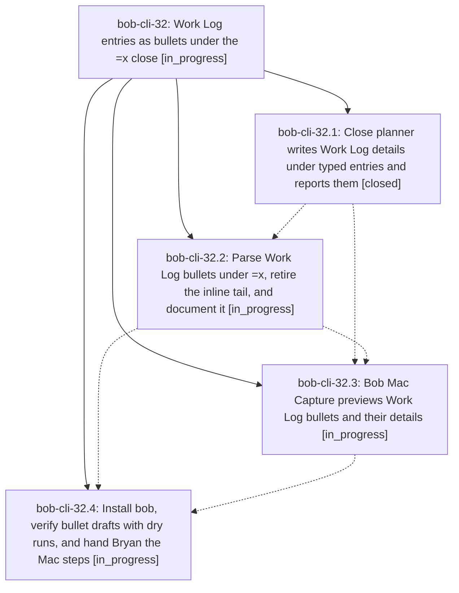

# Bead: bob-cli-32 — Work Log entries as bullets under the =x close

[Bead Pages](../README.md) / bob-cli-32

**Status:** ◐ in_progress · **Type:** ▸ plan · **Tier:** epic
**Owner:** `bryanbugyi34@gmail.com` · **Created by:** [bbugyi200.athena.0uj](https://github.com/bobs-org/bob-cli--agents/blob/main/sessions/bbugyi200.athena.0uj.md) · **Assignee:** `bob-cli-32.land`
**Created:** 2026-09-30 21:31:27 EDT
**Plan:** [202609/close\_work\_log\_bullets.md](https://github.com/bobs-org/bob-cli--plans/blob/main/202609/close_work_log_bullets.md)

## Description

Work Log entries become child bullets of the `=x` close instead of an inline tail:
`=x2,3` followed by `- 2 foo bar baz` on the next line closes the running Pomodoro
with tasks 2 and 3 in progress and logs `foo bar baz` to task 2. A two-space
`  - …` bullet under an entry is a detail that nests under that entry in the task's
Work Log. The inline tail (`=x2,3 2 foo bar baz`) is retired; it now fails with a
message that shows the bullet to write. Bob Mac Capture highlights, previews, and
submits the new drafts, and the close card shows each entry with its details.

## Phases

| Bead | Title | Status | Size | Created | Agents | Commits |
|---|---|---|---|---|---:|---:|
| [bob-cli-32.1](bob-cli-32.1.md) | Close planner writes Work Log details under typed entries and reports them | ✓ closed | small | 2026-09-30 | 1 | 1 |
| [bob-cli-32.2](bob-cli-32.2.md) | Parse Work Log bullets under =x, retire the inline tail, and document it | ◐ in_progress | medium | 2026-09-30 | 1 | 0 |
| [bob-cli-32.3](bob-cli-32.3.md) | Bob Mac Capture previews Work Log bullets and their details | ◐ in_progress | medium | 2026-09-30 | 1 | 0 |
| [bob-cli-32.4](bob-cli-32.4.md) | Install bob, verify bullet drafts with dry runs, and hand Bryan the Mac steps | ◐ in_progress | small | 2026-09-30 | 1 | 0 |

## Lineage

## Agents

| Agent | Bead | Commits |
|---|---|---:|
| [bbugyi200.athena.bob-cli-32.1](https://github.com/bobs-org/bob-cli--agents/blob/main/agents/bbugyi200.athena.bob-cli-32.1/README.md) | [bob-cli-32.1](bob-cli-32.1.md) | 1 |
| [bbugyi200.athena.bob-cli-32.2](https://github.com/bobs-org/bob-cli--agents/blob/main/agents/bbugyi200.athena.bob-cli-32.2/README.md) | [bob-cli-32.2](bob-cli-32.2.md) | 0 |
| [bbugyi200.athena.bob-cli-32.3](https://github.com/bobs-org/bob-cli--agents/blob/main/agents/bbugyi200.athena.bob-cli-32.3/README.md) | [bob-cli-32.3](bob-cli-32.3.md) | 0 |
| [bbugyi200.athena.bob-cli-32.4](https://github.com/bobs-org/bob-cli--agents/blob/main/agents/bbugyi200.athena.bob-cli-32.4/README.md) | [bob-cli-32.4](bob-cli-32.4.md) | 0 |
| [bbugyi200.athena.bob-cli-32.land](https://github.com/bobs-org/bob-cli--agents/blob/main/agents/bbugyi200.athena.bob-cli-32.land/README.md) | [bob-cli-32](README.md) | 0 |

## Commits

| Repo | Commit | Subject | Bead | Committed |
|---|---|---|---|---|
| bob-cli | [`15c6341`](https://github.com/bobs-org/bob-cli/commit/15c63418ddc0558b968694cc53f88f083190db7a) | feat(capture): close planner writes Work Log details under typed entries and reports them | [bob-cli-32.1](bob-cli-32.1.md) | 2026-09-30 21:51:25 EDT |
