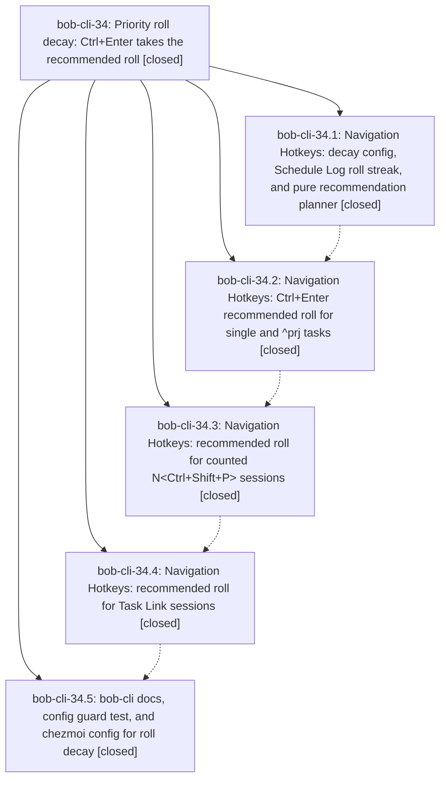

# Bead: bob-cli-34 — Priority roll decay: Ctrl+Enter takes the recommended roll

[Bead Pages](../README.md) / bob-cli-34

**Status:** ✓ closed · **Resolution:** done · **Type:** ▸ plan · **Tier:** epic
**Owner:** `bryanbugyi34@gmail.com` · **Created by:** [bbugyi200.athena.0um](https://github.com/bobs-org/bob-cli--agents/blob/main/sessions/bbugyi200.athena.0um.md) · **Assignee:** `bob-cli-34.land`
**Created:** 2026-09-30 23:56:47 EDT · **Closed:** 2026-10-01 02:07:54 EDT
**Plan:** [202609/priority\_roll\_decay.md](https://github.com/bobs-org/bob-cli--plans/blob/main/202609/priority_roll_decay.md)

## Description

In the Ctrl+Shift+P picker, Ctrl+Enter on `scheduled` takes the recommended roll in one keypress, and the date it will write is shown on the `scheduled` row. The roll follows a configurable decay ladder read from the task's Schedule Log. A level is re-rolled `rolls` times (default 1), the next recommended roll moves the task one level down (P2 → P3), and past the last level it cancels the task. This works for single tasks, `^prj` tasks, counted sessions and Task Link sessions, and every write is a guarded, logged, one-undo edit.

## Notes

[2026-10-01T05:52:24Z · bob-cli-34.land] LAND TRIAGE (bob-cli-34.land): PROPOSED FOLLOW-UP from bob-cli-34.5 (flaky capture_pomodoros missing_note_and_missing_section_are_warning_successes) is a semantic duplicate of bug bob-cli-2e (unlocked BOB_DAY_FILE mutation in capture_pomodoros tests::with_env, predates this epic) -> corroborated with sase bead +1, no new task. No other PROPOSED FOLLOW-UP notes on bob-cli-34.1-.5. Declined as a separate task: the bob-cli ignores_decay_and_rolls_keys test does not assert its replacen() calls changed the fixture; the DEPLOYED_CONFIG fixture contains both anchors today, so it is not vacuous, and it is not worth a bead. Remaining epic work found in verification (planned as a tale, not follow-ups): decay notice text header copy, one-undo for inline single-task roll/decay writes (goal promises it; shared setInlineBulletPropertyValues inserts the Schedule Log entry as a second editor edit), and the plan-required modal-driven end-to-end tests for single and counted Ctrl+Enter.

[2026-10-01T06:07:54Z · bob-cli-34.land] LAND (bob-cli-34.land): phases .1-.5 verified against code, tests and docs per the landing plan's prior verification (bob-plugins npm test 990/990 + validate 6/6, vault in sync, docs/ignores test/chezmoi block in place, no --epic-symbol entries, smoke run of real picker writes matched the plan). Integration review found no conflicts with the concurrent commits (bob-plugins 0b6c847 project promotion and eff561e bob-cli-31 freshness landing; bob-cli 3dd833f park-links and 6710c74 bob-cli-31 test fixes), and no other plugin or bob-cli code classifies Schedule Log reasons. Follow-up triage: flaky capture_pomodoros corroborated on bug bob-cli-2e (+1); nothing else filed. This tale's three fixes: (1) setInlineBulletPropertyValues now plans the Schedule Log entry against the postimage and lands task-line edit + log insert in one cm.transaction (new applyInlinePropertyAndScheduleLogTransaction helper; folded same-file prune spliced in-memory; replaceRange fallback kept for editors without transaction), so inline single-task Ctrl+Enter roll/decay is one undo step; (2) decay notice text header now reads priority -> P3 (low) · decayed from P2 per the epic plan (pill unchanged); (3) 15 new modal-driven end-to-end tests in test-navigation-roll-decay.cjs driving BulletPropertyPickerModal through handleKeydown (single roll/decay/cancel exact lines + undoGroups==1, stage-two roll, Enter/priority-row/P0/closed behavior, recurring refusal, stale refusal with decay re-render, Ctrl+R stage-one/two, ^prj roll/decay frontmatter, counted mixed batch exact lines + notice copy, counted stale + recurring refusals). bob-plugins npm test 1005/1005, validate 6/6. Plugin shipped at 1.48.0 and synced to the vault (dry-run clean).

## Phases

| Bead | Title | Status | Size | Created | Agents | Commits |
|---|---|---|---|---|---:|---:|
| [bob-cli-34.1](bob-cli-34.1.md) | Navigation Hotkeys: decay config, Schedule Log roll streak, and pure recommendation planner | ✓ closed | medium | 2026-09-30 | 1 | 1 |
| [bob-cli-34.2](bob-cli-34.2.md) | Navigation Hotkeys: Ctrl+Enter recommended roll for single and ^prj tasks | ✓ closed | medium | 2026-09-30 | 1 | 1 |
| [bob-cli-34.3](bob-cli-34.3.md) | Navigation Hotkeys: recommended roll for counted N\<Ctrl+Shift+P\> sessions | ✓ closed | medium | 2026-09-30 | 1 | 1 |
| [bob-cli-34.4](bob-cli-34.4.md) | Navigation Hotkeys: recommended roll for Task Link sessions | ✓ closed | medium | 2026-09-30 | 1 | 1 |
| [bob-cli-34.5](bob-cli-34.5.md) | bob-cli docs, config guard test, and chezmoi config for roll decay | ✓ closed | small | 2026-09-30 | 1 | 2 |

## Lineage

## Agents

| Agent | Bead | Commits |
|---|---|---:|
| [bbugyi200.athena.bob-cli-34.1](https://github.com/bobs-org/bob-cli--agents/blob/main/agents/bbugyi200.athena.bob-cli-34.1/README.md) | [bob-cli-34.1](bob-cli-34.1.md) | 1 |
| [bbugyi200.athena.bob-cli-34.2](https://github.com/bobs-org/bob-cli--agents/blob/main/agents/bbugyi200.athena.bob-cli-34.2/README.md) | [bob-cli-34.2](bob-cli-34.2.md) | 1 |
| [bbugyi200.athena.bob-cli-34.3](https://github.com/bobs-org/bob-cli--agents/blob/main/agents/bbugyi200.athena.bob-cli-34.3/README.md) | [bob-cli-34.3](bob-cli-34.3.md) | 1 |
| [bbugyi200.athena.bob-cli-34.4](https://github.com/bobs-org/bob-cli--agents/blob/main/agents/bbugyi200.athena.bob-cli-34.4/README.md) | [bob-cli-34.4](bob-cli-34.4.md) | 1 |
| [bbugyi200.athena.bob-cli-34.5](https://github.com/bobs-org/bob-cli--agents/blob/main/agents/bbugyi200.athena.bob-cli-34.5/README.md) | [bob-cli-34.5](bob-cli-34.5.md) | 2 |
| [bbugyi200.athena.bob-cli-34.land](https://github.com/bobs-org/bob-cli--agents/blob/main/sessions/bbugyi200.athena.bob-cli-34.land.md) | [bob-cli-34](README.md) | 1 |

## Commits

| Repo | Commit | Subject | Bead | Committed |
|---|---|---|---|---|
| bob-plugins | [`bob-plugins@09d9578`](https://github.com/bobs-org/bob-plugins/commit/09d9578916419c73165e0ac9471fc0b83398ab67) | feat(nav): add priority decay core with roll streak and preview model | [bob-cli-34.1](bob-cli-34.1.md) | 2026-10-01 00:07:57 EDT |
| bob-plugins | [`bob-plugins@b56bb9d`](https://github.com/bobs-org/bob-plugins/commit/b56bb9d00088557f5f30c76160457e69331bf772) | feat(nav): Ctrl+Enter recommended roll for single and ^prj tasks | [bob-cli-34.2](bob-cli-34.2.md) | 2026-10-01 00:35:30 EDT |
| bob-plugins | [`bob-plugins@d97f005`](https://github.com/bobs-org/bob-plugins/commit/d97f005f8c1aeaeec68bbce8dc9cbb1ba803b44c) | feat(nav): recommended roll for counted N\<Ctrl+Shift+P\> sessions | [bob-cli-34.3](bob-cli-34.3.md) | 2026-10-01 00:57:32 EDT |
| bob-plugins | [`bob-plugins@427f79c`](https://github.com/bobs-org/bob-plugins/commit/427f79c2566ccea68c6a9e0feda4c8e7cbd6c1bb) | feat(picker-links): add recommended roll for task-link picker sessions | [bob-cli-34.4](bob-cli-34.4.md) | 2026-10-01 01:25:11 EDT |
| chezmoi | [`chezmoi@0f31093`](https://github.com/bbugyi200/dotfiles/commit/0f31093073d6fb98e1164fa6d2cdeec365f831b4) | docs: document priority roll decay defaults in bob config | [bob-cli-34.5](bob-cli-34.5.md) | 2026-10-01 01:32:22 EDT |
| bob-cli | [`849e9fe`](https://github.com/bobs-org/bob-cli/commit/849e9fee9dc44d16483e988919dc69ab87bf2ddc) | docs: recommended roll and priority decay docs with config guard test | [bob-cli-34.5](bob-cli-34.5.md) | 2026-10-01 01:39:45 EDT |
| bob-plugins | [`bob-plugins@9da50dd`](https://github.com/bobs-org/bob-plugins/commit/9da50dd5ea9959823c9a7c288383f8992fbf6b2b) | feat(nav-hotkeys): land priority roll decay epic bob-cli-34 | [bob-cli-34](README.md) | 2026-10-01 02:09:43 EDT |
