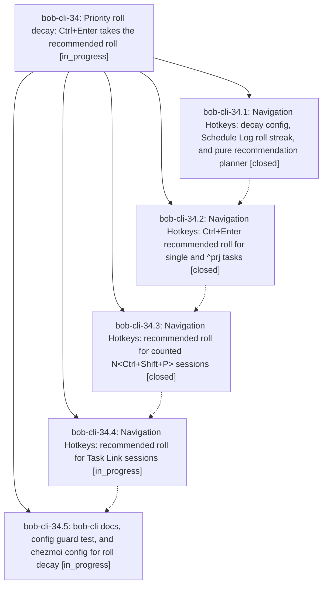

# Bead: bob-cli-34 — Priority roll decay: Ctrl+Enter takes the recommended roll

[Bead Pages](../README.md) / bob-cli-34

**Status:** ◐ in_progress · **Type:** ▸ plan · **Tier:** epic
**Owner:** `bryanbugyi34@gmail.com` · **Created by:** [bbugyi200.athena.0um](https://github.com/bobs-org/bob-cli--agents/blob/main/sessions/bbugyi200.athena.0um.md) · **Assignee:** `bob-cli-34.land`
**Created:** 2026-09-30 23:56:47 EDT
**Plan:** [202609/priority\_roll\_decay.md](https://github.com/bobs-org/bob-cli--plans/blob/main/202609/priority_roll_decay.md)

## Description

In the Ctrl+Shift+P picker, Ctrl+Enter on `scheduled` takes the recommended roll in one keypress, and the date it will write is shown on the `scheduled` row. The roll follows a configurable decay ladder read from the task's Schedule Log. A level is re-rolled `rolls` times (default 1), the next recommended roll moves the task one level down (P2 → P3), and past the last level it cancels the task. This works for single tasks, `^prj` tasks, counted sessions and Task Link sessions, and every write is a guarded, logged, one-undo edit.

## Phases

| Bead | Title | Status | Size | Created | Agents | Commits |
|---|---|---|---|---|---:|---:|
| [bob-cli-34.1](bob-cli-34.1.md) | Navigation Hotkeys: decay config, Schedule Log roll streak, and pure recommendation planner | ✓ closed | medium | 2026-09-30 | 1 | 1 |
| [bob-cli-34.2](bob-cli-34.2.md) | Navigation Hotkeys: Ctrl+Enter recommended roll for single and ^prj tasks | ✓ closed | medium | 2026-09-30 | 1 | 1 |
| [bob-cli-34.3](bob-cli-34.3.md) | Navigation Hotkeys: recommended roll for counted N\<Ctrl+Shift+P\> sessions | ✓ closed | medium | 2026-09-30 | 1 | 1 |
| [bob-cli-34.4](bob-cli-34.4.md) | Navigation Hotkeys: recommended roll for Task Link sessions | ◐ in_progress | medium | 2026-09-30 | 1 | 0 |
| [bob-cli-34.5](bob-cli-34.5.md) | bob-cli docs, config guard test, and chezmoi config for roll decay | ◐ in_progress | small | 2026-09-30 | 1 | 0 |

## Lineage

## Agents

| Agent | Bead | Commits |
|---|---|---:|
| [bbugyi200.athena.bob-cli-34.1](https://github.com/bobs-org/bob-cli--agents/blob/main/agents/bbugyi200.athena.bob-cli-34.1/README.md) | [bob-cli-34.1](bob-cli-34.1.md) | 1 |
| [bbugyi200.athena.bob-cli-34.2](https://github.com/bobs-org/bob-cli--agents/blob/main/agents/bbugyi200.athena.bob-cli-34.2/README.md) | [bob-cli-34.2](bob-cli-34.2.md) | 1 |
| [bbugyi200.athena.bob-cli-34.3](https://github.com/bobs-org/bob-cli--agents/blob/main/agents/bbugyi200.athena.bob-cli-34.3/README.md) | [bob-cli-34.3](bob-cli-34.3.md) | 1 |
| [bbugyi200.athena.bob-cli-34.4](https://github.com/bobs-org/bob-cli--agents/blob/main/agents/bbugyi200.athena.bob-cli-34.4/README.md) | [bob-cli-34.4](bob-cli-34.4.md) | 0 |
| [bbugyi200.athena.bob-cli-34.5](https://github.com/bobs-org/bob-cli--agents/blob/main/agents/bbugyi200.athena.bob-cli-34.5/README.md) | [bob-cli-34.5](bob-cli-34.5.md) | 0 |
| [bbugyi200.athena.bob-cli-34.land](https://github.com/bobs-org/bob-cli--agents/blob/main/agents/bbugyi200.athena.bob-cli-34.land/README.md) | [bob-cli-34](README.md) | 0 |

## Commits

| Repo | Commit | Subject | Bead | Committed |
|---|---|---|---|---|
| bob-plugins | [`bob-plugins@09d9578`](https://github.com/bobs-org/bob-plugins/commit/09d9578916419c73165e0ac9471fc0b83398ab67) | feat(nav): add priority decay core with roll streak and preview model | [bob-cli-34.1](bob-cli-34.1.md) | 2026-10-01 00:07:57 EDT |
| bob-plugins | [`bob-plugins@b56bb9d`](https://github.com/bobs-org/bob-plugins/commit/b56bb9d00088557f5f30c76160457e69331bf772) | feat(nav): Ctrl+Enter recommended roll for single and ^prj tasks | [bob-cli-34.2](bob-cli-34.2.md) | 2026-10-01 00:35:30 EDT |
| bob-plugins | [`bob-plugins@d97f005`](https://github.com/bobs-org/bob-plugins/commit/d97f005f8c1aeaeec68bbce8dc9cbb1ba803b44c) | feat(nav): recommended roll for counted N\<Ctrl+Shift+P\> sessions | [bob-cli-34.3](bob-cli-34.3.md) | 2026-10-01 00:57:32 EDT |
