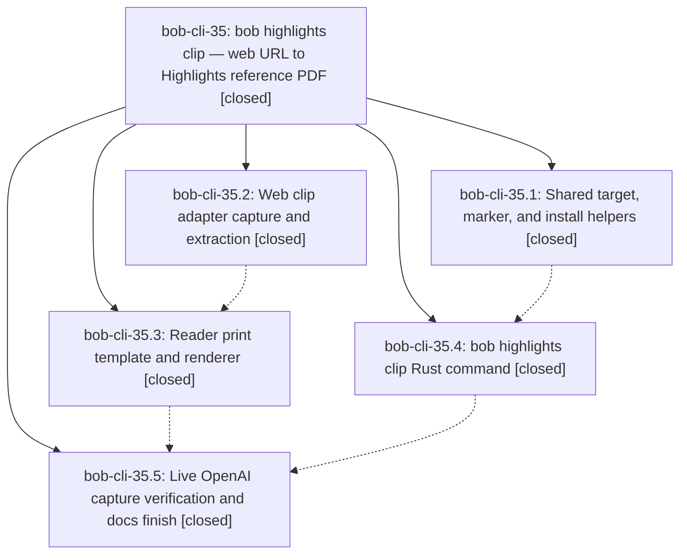

# Bead: bob-cli-35 — bob highlights clip — web URL to Highlights reference PDF

[Bead Pages](../README.md) / bob-cli-35

**Status:** ✓ closed · **Resolution:** done · **Type:** ▸ plan · **Tier:** epic
**Owner:** `bryanbugyi34@gmail.com` · **Created by:** [bbugyi200.apollo.3s](https://github.com/bobs-org/bob-cli--agents/blob/main/sessions/bbugyi200.apollo.3s.md) · **Assignee:** `bob-cli-35.land`
**Created:** 2026-10-01 02:07:05 EDT · **Closed:** 2026-10-01 04:21:04 EDT
**Plan:** [202610/web\_url\_highlights\_clip.md](https://github.com/bobs-org/bob-cli--plans/blob/main/202610/web_url_highlights_clip.md)

## Description

`bob highlights clip <URL>` turns a web article into a beautiful, readable, provenance-stamped PDF in the Highlights intake (`~/bob/xlib/blogs/` by default), which the existing `bob highlights scan` turns into a `~/bob/ref/` note. The Cloudflare-protected OpenAI Symphony post is captured on a host that can run headed Chrome (athena), and every unsupported case fails loudly with a next step, never with a silently wrong PDF.

## Notes

[2026-10-01T08:21:04Z · bob-cli-35.land] LAND VERIFIED (bob-cli-35.land, master a35b255 + landing fixes). Step 1: read all 5 closed phases and every note, the plan, and epic commits fd12809 (stamp-core), e355016 (adapter-capture), 44bfe58 (clip-command), 5c6e2ad (reader-template), a35b255 (live-verify). Source matches the plan: stamp.rs shared planner/compose_marker extras/stamp_and_install with create unchanged; captured in COMMON_USER_FIELDS and docs; clip/clip_url/clip_adapter with dedupe, fail-fast planning, workdir, dry-run/success reports, doctor rows; scripts/web_clip adapter, snapshot.js, vendored defuddle 0.19.4, reader renderer, template, and OFL fonts, all 18 runtime files in SUPPORT_ASSETS and cargo package --list; install-smoke and help tests; README, highlights-ref-sync, and highlights-clip docs with a Verified section. Checks: cargo fmt --check passes; cargo test passes (2272 passed, 0 failed: 1431 lib + 701 cli + rest); just check-web-clip-adapter passes on apollo (browser fixtures ran; headed check skipped, no Xvfb); clippy reports no diagnostic in any epic file. just lint / just all stay red only from the pre-existing bob-cli-28 '|| true' deny at tests/cli/capture/pomodoro_name.rs:808. (This repo has no just check or just symvision recipe.) Live: ~/bob/ref/blogs/open_source_codex_orchestration_symphony.md exists on apollo with every provenance field. It carries highlights_marker_fields: [captured] because the Mac scanned it with a pre-epic bob. A scratch copy scanned with this build drops that line once, then a second scan is a no-op, so the upgrade is clean. Step 2: the only non-epic commit since fd12809 is 8957f4a (plan max_ready soft cap), which does not touch highlights; origin/master == HEAD. Landing fixes: (a) replaced the stale clip_adapter.rs user hint that cited 'the adapter-capture phase'; (b) tests/cli/support.rs bob_command() now points BOB_WEB_CLIP_ADAPTER at a missing path, so highlights doctor tests no longer spawn the real uv adapter ping (possible network / 120 s timeout); clip tests still override it with their fake; (c) doc integration: added highlights-clip.md to docs/README.md and to the README contracts table; added BOB_CHROME and BOB_WEB_CLIP_ADAPTER/KEEP_WORKDIR/TIMEOUT_SECS to the README Environment section; added clip deps to Dependencies; updated the xlib/ layout row and the Highlights summary. Follow-ups: (1) pomodoro_name.rs:808 clippy deny (all 5 phases): no new task; corroborated as a DISCOVERED ISSUE note on active epic bob-cli-28, whose closeout owns it (bob-cli-v tracks warnings only). (2) Manual Mac Highlights quote acceptance (35.5): declined as a bead. It is Bryan's hands-on check in the Highlights app, and the conditional pandoc render swap is only actionable if it fails; surfaced to Bryan. (3) Install updated bob on athena/apollo/Mac (35.5): declined as a bead. It is a host rollout outside the task-type catalog and needs Bryan's go-ahead and Mac access; surfaced to Bryan. (4) --from-chrome + Bob Mac Capture/Shortcuts entry point: created bob-cli-37 (feature, large). (5) --mode page, image rescue, --keep-source: created bob-cli-38 (feature, large). (6) Recapture/versioning design: created bob-cli-39 (feature, large). Related artifact links for 37-39 failed with a pre-existing artifact-link store validation error (operation_id reuse); each bead description cites bob-cli-35 and the plan. No --epic-symbol entries.

## Phases

| Bead | Title | Status | Size | Created | Agents | Commits |
|---|---|---|---|---|---:|---:|
| [bob-cli-35.1](bob-cli-35.1.md) | Shared target, marker, and install helpers | ✓ closed | small | 2026-10-01 | 1 | 1 |
| [bob-cli-35.2](bob-cli-35.2.md) | Web clip adapter capture and extraction | ✓ closed | medium | 2026-10-01 | 1 | 1 |
| [bob-cli-35.3](bob-cli-35.3.md) | Reader print template and renderer | ✓ closed | medium | 2026-10-01 | 1 | 1 |
| [bob-cli-35.4](bob-cli-35.4.md) | bob highlights clip Rust command | ✓ closed | medium | 2026-10-01 | 1 | 1 |
| [bob-cli-35.5](bob-cli-35.5.md) | Live OpenAI capture verification and docs finish | ✓ closed | medium | 2026-10-01 | 1 | 1 |

## Lineage

## Agents

| Agent | Bead | Commits |
|---|---|---:|
| [bbugyi200.apollo.bob-cli-35.1](https://github.com/bobs-org/bob-cli--agents/blob/main/agents/bbugyi200.apollo.bob-cli-35.1/README.md) | [bob-cli-35.1](bob-cli-35.1.md) | 1 |
| [bbugyi200.apollo.bob-cli-35.2](https://github.com/bobs-org/bob-cli--agents/blob/main/agents/bbugyi200.apollo.bob-cli-35.2/README.md) | [bob-cli-35.2](bob-cli-35.2.md) | 1 |
| [bbugyi200.apollo.bob-cli-35.3](https://github.com/bobs-org/bob-cli--agents/blob/main/agents/bbugyi200.apollo.bob-cli-35.3/README.md) | [bob-cli-35.3](bob-cli-35.3.md) | 1 |
| [bbugyi200.apollo.bob-cli-35.4](https://github.com/bobs-org/bob-cli--agents/blob/main/agents/bbugyi200.apollo.bob-cli-35.4/README.md) | [bob-cli-35.4](bob-cli-35.4.md) | 1 |
| [bbugyi200.apollo.bob-cli-35.5](https://github.com/bobs-org/bob-cli--agents/blob/main/agents/bbugyi200.apollo.bob-cli-35.5/README.md) | [bob-cli-35.5](bob-cli-35.5.md) | 1 |
| [bbugyi200.apollo.bob-cli-35.land](https://github.com/bobs-org/bob-cli--agents/blob/main/agents/bbugyi200.apollo.bob-cli-35.land/README.md) | [bob-cli-35](README.md) | 1 |

## Commits

| Repo | Commit | Subject | Bead | Committed |
|---|---|---|---|---|
| bob-cli | [`fd12809`](https://github.com/bobs-org/bob-cli/commit/fd128098dc311aeb02b03f0911829157e384459a) | feat(highlights-ref): add shared stamp-core module with marker extras and atomic install | [bob-cli-35.1](bob-cli-35.1.md) | 2026-10-01 02:23:38 EDT |
| bob-cli | [`e355016`](https://github.com/bobs-org/bob-cli/commit/e355016e67882ea464ef10b30275f98517d81cee) | feat(web-clip): implement adapter-capture phase (bob-cli-35.2) | [bob-cli-35.2](bob-cli-35.2.md) | 2026-10-01 02:49:03 EDT |
| bob-cli | [`44bfe58`](https://github.com/bobs-org/bob-cli/commit/44bfe5898fa399eb2669b15d2525db69a0236b23) | feat(highlights): add bob highlights clip subcommand | [bob-cli-35.4](bob-cli-35.4.md) | 2026-10-01 02:55:23 EDT |
| bob-cli | [`5c6e2ad`](https://github.com/bobs-org/bob-cli/commit/5c6e2ad64a8c6535eb67930adbad9b3bf378d1c5) | feat(web-clip): add Bob-owned reader print template and renderer | [bob-cli-35.3](bob-cli-35.3.md) | 2026-10-01 03:21:17 EDT |
| bob-cli | [`a35b255`](https://github.com/bobs-org/bob-cli/commit/a35b255e872f4fa2cbe8d831644a7a64f68d0611) | docs(web-clip): record live-verify gate for bob highlights clip | [bob-cli-35.5](bob-cli-35.5.md) | 2026-10-01 04:05:33 EDT |
| bob-cli | [`6b37d39`](https://github.com/bobs-org/bob-cli/commit/6b37d3977b18a77990e9ea5f44a7b32cde74c9e9) | chore(web-clip): land epic bob-cli-35 — doc integration, hermetic doctor tests, stale hint | [bob-cli-35](README.md) | 2026-10-01 04:22:19 EDT |
