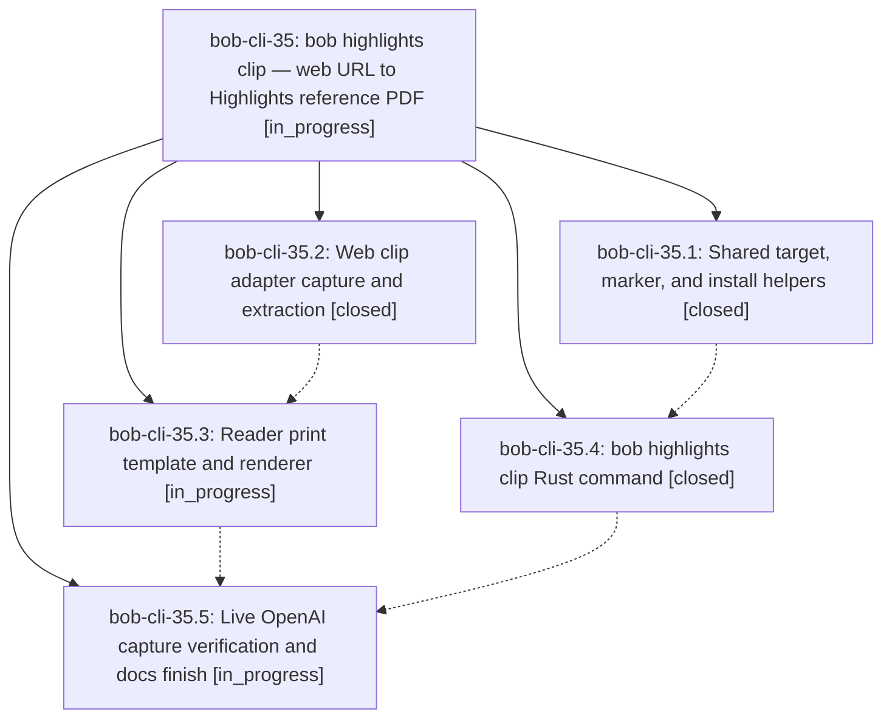

# Bead: bob-cli-35 — bob highlights clip — web URL to Highlights reference PDF

[Bead Pages](../README.md) / bob-cli-35

**Status:** ◐ in_progress · **Type:** ▸ plan · **Tier:** epic
**Owner:** `bryanbugyi34@gmail.com` · **Created by:** [bbugyi200.apollo.3s](https://github.com/bobs-org/bob-cli--agents/blob/main/sessions/bbugyi200.apollo.3s.md) · **Assignee:** `bob-cli-35.land`
**Created:** 2026-10-01 02:07:05 EDT
**Plan:** [202610/web\_url\_highlights\_clip.md](https://github.com/bobs-org/bob-cli--plans/blob/main/202610/web_url_highlights_clip.md)

## Description

`bob highlights clip <URL>` turns a web article into a beautiful, readable, provenance-stamped PDF in the Highlights intake (`~/bob/xlib/blogs/` by default), which the existing `bob highlights scan` turns into a `~/bob/ref/` note. The Cloudflare-protected OpenAI Symphony post is captured on a host that can run headed Chrome (athena), and every unsupported case fails loudly with a next step, never with a silently wrong PDF.

## Phases

| Bead | Title | Status | Size | Created | Agents | Commits |
|---|---|---|---|---|---:|---:|
| [bob-cli-35.1](bob-cli-35.1.md) | Shared target, marker, and install helpers | ✓ closed | small | 2026-10-01 | 1 | 1 |
| [bob-cli-35.2](bob-cli-35.2.md) | Web clip adapter capture and extraction | ✓ closed | medium | 2026-10-01 | 1 | 1 |
| [bob-cli-35.3](bob-cli-35.3.md) | Reader print template and renderer | ◐ in_progress | medium | 2026-10-01 | 1 | 0 |
| [bob-cli-35.4](bob-cli-35.4.md) | bob highlights clip Rust command | ✓ closed | medium | 2026-10-01 | 1 | 1 |
| [bob-cli-35.5](bob-cli-35.5.md) | Live OpenAI capture verification and docs finish | ◐ in_progress | medium | 2026-10-01 | 1 | 0 |

## Lineage

## Agents

| Agent | Bead | Commits |
|---|---|---:|
| [bbugyi200.apollo.bob-cli-35.1](https://github.com/bobs-org/bob-cli--agents/blob/main/agents/bbugyi200.apollo.bob-cli-35.1/README.md) | [bob-cli-35.1](bob-cli-35.1.md) | 1 |
| [bbugyi200.apollo.bob-cli-35.2](https://github.com/bobs-org/bob-cli--agents/blob/main/agents/bbugyi200.apollo.bob-cli-35.2/README.md) | [bob-cli-35.2](bob-cli-35.2.md) | 1 |
| [bbugyi200.apollo.bob-cli-35.3](https://github.com/bobs-org/bob-cli--agents/blob/main/agents/bbugyi200.apollo.bob-cli-35.3/README.md) | [bob-cli-35.3](bob-cli-35.3.md) | 0 |
| [bbugyi200.apollo.bob-cli-35.4](https://github.com/bobs-org/bob-cli--agents/blob/main/agents/bbugyi200.apollo.bob-cli-35.4/README.md) | [bob-cli-35.4](bob-cli-35.4.md) | 1 |
| [bbugyi200.apollo.bob-cli-35.5](https://github.com/bobs-org/bob-cli--agents/blob/main/agents/bbugyi200.apollo.bob-cli-35.5/README.md) | [bob-cli-35.5](bob-cli-35.5.md) | 0 |
| [bbugyi200.apollo.bob-cli-35.land](https://github.com/bobs-org/bob-cli--agents/blob/main/agents/bbugyi200.apollo.bob-cli-35.land/README.md) | [bob-cli-35](README.md) | 0 |

## Commits

| Repo | Commit | Subject | Bead | Committed |
|---|---|---|---|---|
| bob-cli | [`fd12809`](https://github.com/bobs-org/bob-cli/commit/fd128098dc311aeb02b03f0911829157e384459a) | feat(highlights-ref): add shared stamp-core module with marker extras and atomic install | [bob-cli-35.1](bob-cli-35.1.md) | 2026-10-01 02:23:38 EDT |
| bob-cli | [`e355016`](https://github.com/bobs-org/bob-cli/commit/e355016e67882ea464ef10b30275f98517d81cee) | feat(web-clip): implement adapter-capture phase (bob-cli-35.2) | [bob-cli-35.2](bob-cli-35.2.md) | 2026-10-01 02:49:03 EDT |
| bob-cli | [`44bfe58`](https://github.com/bobs-org/bob-cli/commit/44bfe5898fa399eb2669b15d2525db69a0236b23) | feat(highlights): add bob highlights clip subcommand | [bob-cli-35.4](bob-cli-35.4.md) | 2026-10-01 02:55:23 EDT |
