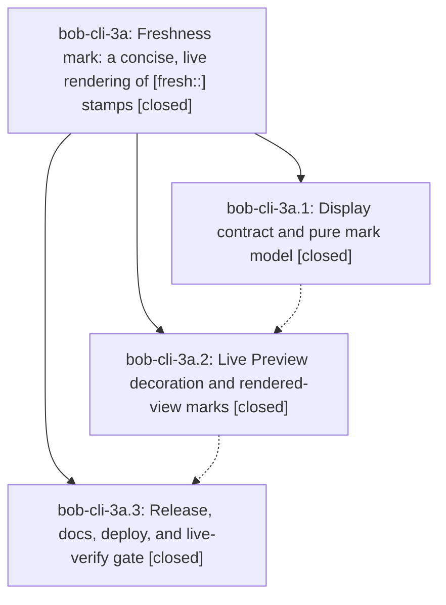

# Bead: bob-cli-3a — Freshness mark: a concise, live rendering of \[fresh::\] stamps

[Bead Pages](../README.md) / bob-cli-3a

**Status:** ✓ closed · **Resolution:** done · **Type:** ▸ plan · **Tier:** epic
**Owner:** `bryanbugyi34@gmail.com` · **Created by:** [bbugyi200.apollo.3y](https://github.com/bobs-org/bob-cli--agents/blob/main/sessions/bbugyi200.apollo.3y.md) · **Assignee:** `bob-cli-3a.land`
**Created:** 2026-10-01 11:19:39 EDT · **Closed:** 2026-10-01 12:30:36 EDT
**Plan:** [202610/fresh\_mark.md](https://github.com/bobs-org/bob-cli--plans/blob/main/202610/fresh_mark.md)

## Description

Every canonical `[fresh:: YYYY-MM-DD]` stamp renders in Obsidian as a small, theme-native freshness mark (`✓ today`, a draining lease ring with its age, `⟳ 9d` when due). The mark agrees exactly with the review queue wherever it shows a review state, and the stored syntax, both implementations, and every stamping path stay unchanged.

## Notes

[2026-10-01T16:06:48Z · bryanbugyi34@gmail.com] Why is there a little red box showing instead of a badge? See the 🔒 20261001\_120556.png screenshot for context. The epic lander agent should make sure this is fixed.

[2026-10-01T16:26:32Z · bob-cli-3a.land] FOLLOW-UP TRIAGE (lander, before the READY-badge closeout tale):

bob-cli-3a.3 PROPOSED FOLLOW-UP ("just lint fails identically on the clean base tree; clippy unnecessary_to_owned in the bob-cli test target"): declined as a new task. On master d2aae45 the named warning is still tests/cli/capture/pomodoro_shift.rs:580-581 (blame 7d1c8dd3) and is already tracked by ready task bob-cli-v; recorded a +1 naming phase bob-cli-3a.3. The failure that actually turns just lint red is the pre-existing '|| true' deny at tests/cli/capture/pomodoro_name.rs:807-812, owned by in-progress epic bob-cli-28; recorded a DISCOVERED ISSUE there. Not caused by this epic.

Epic-plan out-of-scope ideas (dashed-ring new mark, mark context menu, persisted toggle, Bob Mac Capture previews): declined. They are design non-goals in plan:202610/fresh_mark.md. No child recorded them as PROPOSED FOLLOW-UP notes, and they are not defects.

User note #1 (empty red box instead of the READY badge on dash.md, screenshot 20261001_120556.png): remaining work of this landing, not a separate task. The chip between NEXT and BLOCKED is renderReadyBadge. setReadyAnchorContent assigns anchor.text = "" on every paint and refresh. Obsidian's HTMLElement.text setter is textContent, so that assignment deletes the .bob-plan-ready-label and .bob-plan-ready-value spans and leaves the over-limit padding box (red, because the backlog is over cap). Node tests keep a plain .text data property, so they stay green. Introduced by bob-plugins 58b6200 (ready_badge_style tale), which landed before this epic; no commit after 2026-10-01 15:19:39Z outside this epic's own commits (bob-cli 61785b7, d2aae45; bob-plugins dbe3bdd, 2b128b7, 0d018c7) needs feature integration. The freshness mark post-processor does not touch this badge.

Phase verification: bob-cli-3a.1/.2/.3 notes match the tree. docs/freshness.md §11 and the landed Surfaces row, helpers exported from module.exports.helpers (freshnessMarkSource through buildFreshnessMarkElement), Live Preview plugin and sortOrder-50 post-processor, toggle-freshness-marks, styles, and manifest 1.10.0 are present. No --epic-symbol entries for bob-cli-3a. No parent_bead on the epic.

[2026-10-01T16:30:36Z · bob-cli-3a.land] Lander verification (cited, not re-audited): phases bob-cli-3a.1/.2/.3 closed with notes matching the tree (docs/freshness.md s11 Surfaces row, exported mark helpers, Live Preview plugin, sortOrder-50 post-processor, toggle-freshness-marks, mark styles, manifest 1.10.0). Commits after 2026-10-01 15:19:39Z are only this epic's own: bob-cli 61785b7 and d2aae45; bob-plugins dbe3bdd, 2b128b7, 0d018c7. No --epic-symbol entries for bob-cli-3a. Follow-up triage on bob-cli-3a: bob-cli-3a.3 lint follow-up declined as new task (unnecessary_to_owned at tests/cli/capture/pomodoro_shift.rs:580-581 already on bob-cli-v; || true deny at tests/cli/capture/pomodoro_name.rs:807-812 recorded on bob-cli-28); four plan non-goals declined as design non-goals. READY badge fix (tale plan:202610/ready_badge_text.md): setReadyAnchorContent no longer assigns .text on live elements (own-data-property check) and walks childNodes as NodeList; added 'READY never assigns the Obsidian text setter' regression covering in-limit 3/100 and over-limit 101/100 through paintReadyElement and refreshReadyBadges. Passed: node --test scripts/test-ledger-tools-ready-badge.cjs (25 pass), npm test (1067 pass), npm run validate (6/6 valid). Sync: bob plugins sync -n -p bob-ledger-tools OK (1 copied, 0 skipped, no --force).

## Attachments

- 🔒 20261001\_120556.png · image/png · 2872×1656 · 233.996 KiB (private attachment)

## Phases

| Bead | Title | Status | Size | Created | Agents | Commits |
|---|---|---|---|---|---:|---:|
| [bob-cli-3a.1](bob-cli-3a.1.md) | Display contract and pure mark model | ✓ closed | medium | 2026-10-01 | 1 | 2 |
| [bob-cli-3a.2](bob-cli-3a.2.md) | Live Preview decoration and rendered-view marks | ✓ closed | medium | 2026-10-01 | 1 | 1 |
| [bob-cli-3a.3](bob-cli-3a.3.md) | Release, docs, deploy, and live-verify gate | ✓ closed | small | 2026-10-01 | 1 | 2 |

## Lineage

## Agents

| Agent | Bead | Commits |
|---|---|---:|
| [bbugyi200.apollo.bob-cli-3a.1](https://github.com/bobs-org/bob-cli--agents/blob/main/agents/bbugyi200.apollo.bob-cli-3a.1/README.md) | [bob-cli-3a.1](bob-cli-3a.1.md) | 2 |
| [bbugyi200.apollo.bob-cli-3a.2](https://github.com/bobs-org/bob-cli--agents/blob/main/agents/bbugyi200.apollo.bob-cli-3a.2/README.md) | [bob-cli-3a.2](bob-cli-3a.2.md) | 1 |
| [bbugyi200.apollo.bob-cli-3a.3](https://github.com/bobs-org/bob-cli--agents/blob/main/agents/bbugyi200.apollo.bob-cli-3a.3/README.md) | [bob-cli-3a.3](bob-cli-3a.3.md) | 2 |
| [bbugyi200.apollo.bob-cli-3a.land](https://github.com/bobs-org/bob-cli--agents/blob/main/sessions/bbugyi200.apollo.bob-cli-3a.land.md) | [bob-cli-3a](README.md) | 1 |

## Commits

| Repo | Commit | Subject | Bead | Committed |
|---|---|---|---|---|
| bob-cli | [`61785b7`](https://github.com/bobs-org/bob-cli/commit/61785b77522f1e88344426acdf8c50e21dc281ac) | feat(freshness): add freshness mark display contract and conformance vectors | [bob-cli-3a.1](bob-cli-3a.1.md) | 2026-10-01 11:45:51 EDT |
| bob-plugins | [`bob-plugins@dbe3bdd`](https://github.com/bobs-org/bob-plugins/commit/dbe3bdd0e7364523f89b6491b090938240751e12) | feat(ledger-tools): add pure freshness mark model, styles, and vector tests | [bob-cli-3a.1](bob-cli-3a.1.md) | 2026-10-01 11:46:24 EDT |
| bob-plugins | [`bob-plugins@2b128b7`](https://github.com/bobs-org/bob-plugins/commit/2b128b71465f6d4ec0cc71826e6d52e3b95c9e91) | feat(ledger-tools): Live Preview decoration and rendered-view freshness marks | [bob-cli-3a.2](bob-cli-3a.2.md) | 2026-10-01 12:03:42 EDT |
| bob-cli | [`d2aae45`](https://github.com/bobs-org/bob-cli/commit/d2aae45e51949431d47b9a64dc29b94fc36ac3fa) | docs(freshness): land mark rollout surfaces and live-verification checklist | [bob-cli-3a.3](bob-cli-3a.3.md) | 2026-10-01 12:11:26 EDT |
| bob-plugins | [`bob-plugins@0d018c7`](https://github.com/bobs-org/bob-plugins/commit/0d018c70156e7d9ed124e2103b8ba2b699982a77) | feat(ledger-tools): mark rollout v1.10.0 with docs and manifest | [bob-cli-3a.3](bob-cli-3a.3.md) | 2026-10-01 12:12:00 EDT |
| bob-plugins | [`bob-plugins@854bdbe`](https://github.com/bobs-org/bob-plugins/commit/854bdbe0495325b88ebe66e2566c7183c8b7facb) | fix(ledger-tools): restore READY badge text wiped by Obsidian text setter | [bob-cli-3a](README.md) | 2026-10-01 12:32:02 EDT |
