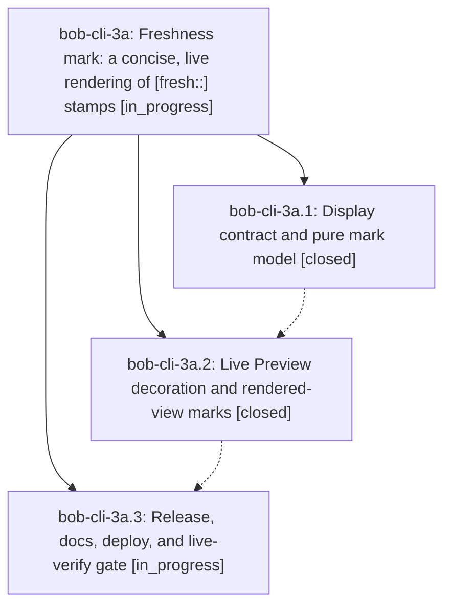

# Bead: bob-cli-3a — Freshness mark: a concise, live rendering of \[fresh::\] stamps

[Bead Pages](../README.md) / bob-cli-3a

**Status:** ◐ in_progress · **Type:** ▸ plan · **Tier:** epic
**Owner:** `bryanbugyi34@gmail.com` · **Created by:** [bbugyi200.apollo.3y](https://github.com/bobs-org/bob-cli--agents/blob/main/sessions/bbugyi200.apollo.3y.md) · **Assignee:** `bob-cli-3a.land`
**Created:** 2026-10-01 11:19:39 EDT
**Plan:** [202610/fresh\_mark.md](https://github.com/bobs-org/bob-cli--plans/blob/main/202610/fresh_mark.md)

## Description

Every canonical `[fresh:: YYYY-MM-DD]` stamp renders in Obsidian as a small, theme-native freshness mark (`✓ today`, a draining lease ring with its age, `⟳ 9d` when due). The mark agrees exactly with the review queue wherever it shows a review state, and the stored syntax, both implementations, and every stamping path stay unchanged.

## Phases

| Bead | Title | Status | Size | Created | Agents | Commits |
|---|---|---|---|---|---:|---:|
| [bob-cli-3a.1](bob-cli-3a.1.md) | Display contract and pure mark model | ✓ closed | medium | 2026-10-01 | 1 | 2 |
| [bob-cli-3a.2](bob-cli-3a.2.md) | Live Preview decoration and rendered-view marks | ✓ closed | medium | 2026-10-01 | 1 | 1 |
| [bob-cli-3a.3](bob-cli-3a.3.md) | Release, docs, deploy, and live-verify gate | ◐ in_progress | small | 2026-10-01 | 1 | 0 |

## Lineage

## Agents

| Agent | Bead | Commits |
|---|---|---:|
| [bbugyi200.apollo.bob-cli-3a.1](https://github.com/bobs-org/bob-cli--agents/blob/main/agents/bbugyi200.apollo.bob-cli-3a.1/README.md) | [bob-cli-3a.1](bob-cli-3a.1.md) | 2 |
| [bbugyi200.apollo.bob-cli-3a.2](https://github.com/bobs-org/bob-cli--agents/blob/main/agents/bbugyi200.apollo.bob-cli-3a.2/README.md) | [bob-cli-3a.2](bob-cli-3a.2.md) | 1 |
| [bbugyi200.apollo.bob-cli-3a.3](https://github.com/bobs-org/bob-cli--agents/blob/main/agents/bbugyi200.apollo.bob-cli-3a.3/README.md) | [bob-cli-3a.3](bob-cli-3a.3.md) | 0 |
| [bbugyi200.apollo.bob-cli-3a.land](https://github.com/bobs-org/bob-cli--agents/blob/main/agents/bbugyi200.apollo.bob-cli-3a.land/README.md) | [bob-cli-3a](README.md) | 0 |

## Commits

| Repo | Commit | Subject | Bead | Committed |
|---|---|---|---|---|
| bob-cli | [`61785b7`](https://github.com/bobs-org/bob-cli/commit/61785b77522f1e88344426acdf8c50e21dc281ac) | feat(freshness): add freshness mark display contract and conformance vectors | [bob-cli-3a.1](bob-cli-3a.1.md) | 2026-10-01 11:45:51 EDT |
| bob-plugins | [`bob-plugins@dbe3bdd`](https://github.com/bobs-org/bob-plugins/commit/dbe3bdd0e7364523f89b6491b090938240751e12) | feat(ledger-tools): add pure freshness mark model, styles, and vector tests | [bob-cli-3a.1](bob-cli-3a.1.md) | 2026-10-01 11:46:24 EDT |
| bob-plugins | [`bob-plugins@2b128b7`](https://github.com/bobs-org/bob-plugins/commit/2b128b71465f6d4ec0cc71826e6d52e3b95c9e91) | feat(ledger-tools): Live Preview decoration and rendered-view freshness marks | [bob-cli-3a.2](bob-cli-3a.2.md) | 2026-10-01 12:03:42 EDT |
