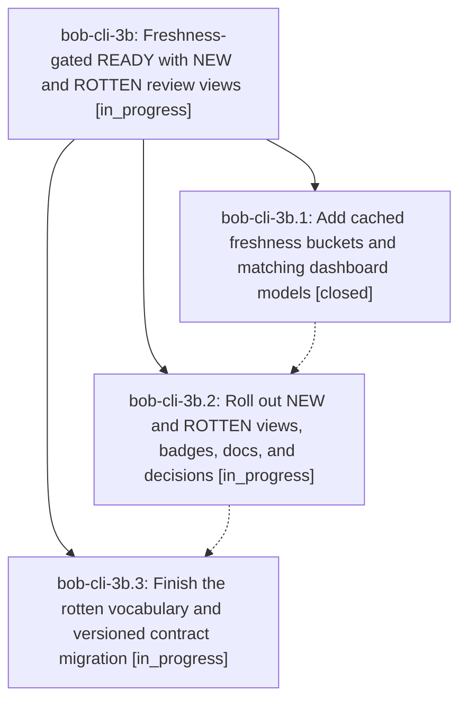

# Bead: bob-cli-3b — Freshness-gated READY with NEW and ROTTEN review views

[Bead Pages](../README.md) / bob-cli-3b

**Status:** ◐ in_progress · **Type:** ▸ plan · **Tier:** epic
**Owner:** `bryanbugyi34@gmail.com` · **Created by:** [bbugyi200.athena.0uy](https://github.com/bobs-org/bob-cli--agents/blob/main/sessions/bbugyi200.athena.0uy.md) · **Assignee:** `bob-cli-3b.land`
**Created:** 2026-10-01 13:09:36 EDT
**Plan:** [202610/freshness\_gated\_ready.md](https://github.com/bobs-org/bob-cli--plans/blob/main/202610/freshness_gated_ready.md)

## Description

The dashboard separates unconfirmed tasks into NEW, keeps confirmed and exempt tasks in READY, and links expired or returned confirmations to rotten.md, with matching live badges and one rotten vocabulary across human and machine views.

## Phases

| Bead | Title | Status | Size | Created | Agents | Commits |
|---|---|---|---|---|---:|---:|
| [bob-cli-3b.1](bob-cli-3b.1.md) | Add cached freshness buckets and matching dashboard models | ✓ closed | medium | 2026-10-01 | 1 | 2 |
| [bob-cli-3b.2](bob-cli-3b.2.md) | Roll out NEW and ROTTEN views, badges, docs, and decisions | ◐ in_progress | medium | 2026-10-01 | 1 | 0 |
| [bob-cli-3b.3](bob-cli-3b.3.md) | Finish the rotten vocabulary and versioned contract migration | ◐ in_progress | medium | 2026-10-01 | 1 | 0 |

## Lineage

## Agents

| Agent | Bead | Commits |
|---|---|---:|
| [bbugyi200.athena.bob-cli-3b.1](https://github.com/bobs-org/bob-cli--agents/blob/main/agents/bbugyi200.athena.bob-cli-3b.1/README.md) | [bob-cli-3b.1](bob-cli-3b.1.md) | 2 |
| [bbugyi200.athena.bob-cli-3b.2](https://github.com/bobs-org/bob-cli--agents/blob/main/agents/bbugyi200.athena.bob-cli-3b.2/README.md) | [bob-cli-3b.2](bob-cli-3b.2.md) | 0 |
| [bbugyi200.athena.bob-cli-3b.3](https://github.com/bobs-org/bob-cli--agents/blob/main/agents/bbugyi200.athena.bob-cli-3b.3/README.md) | [bob-cli-3b.3](bob-cli-3b.3.md) | 0 |
| [bbugyi200.athena.bob-cli-3b.land](https://github.com/bobs-org/bob-cli--agents/blob/main/agents/bbugyi200.athena.bob-cli-3b.land/README.md) | [bob-cli-3b](README.md) | 0 |

## Commits

| Repo | Commit | Subject | Bead | Committed |
|---|---|---|---|---|
| bob-cli | [`6d54e39`](https://github.com/bobs-org/bob-cli/commit/6d54e397bd3ac9acb354b5588748870c8b04d372) | feat(freshness): add read-time buckets, JSON bucket field, and rotten wording | [bob-cli-3b.1](bob-cli-3b.1.md) | 2026-10-01 13:45:47 EDT |
| bob-plugins | [`bob-plugins@570f40d`](https://github.com/bobs-org/bob-plugins/commit/570f40de1e795f329fefdce3fe890164f8db1c2c) | feat(ledger-tools): freshness namespace v2 with gated READY and NEW/ROTTEN models | [bob-cli-3b.1](bob-cli-3b.1.md) | 2026-10-01 13:46:23 EDT |
