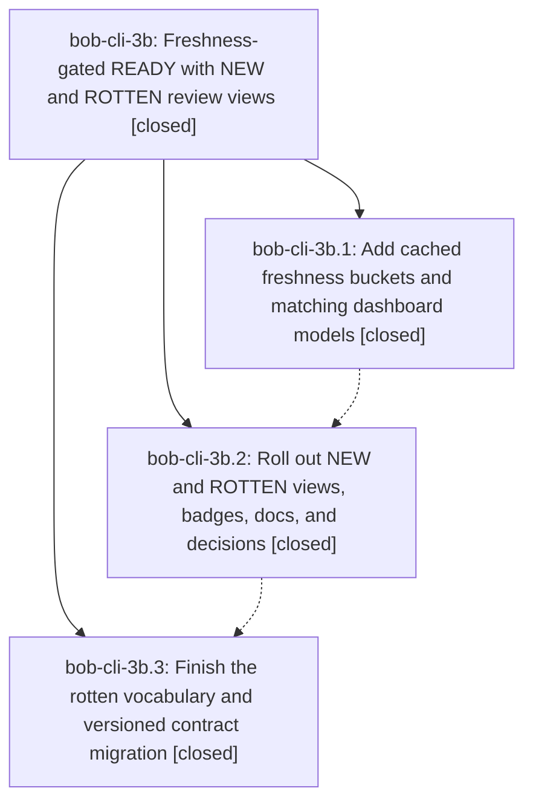

# Bead: bob-cli-3b — Freshness-gated READY with NEW and ROTTEN review views

[Bead Pages](../README.md) / bob-cli-3b

**Status:** ✓ closed · **Resolution:** done · **Type:** ▸ plan · **Tier:** epic
**Owner:** `bryanbugyi34@gmail.com` · **Created by:** [bbugyi200.athena.0uy](https://github.com/bobs-org/bob-cli--agents/blob/main/sessions/bbugyi200.athena.0uy.md) · **Assignee:** `bob-cli-3b.land`
**Created:** 2026-10-01 13:09:36 EDT · **Closed:** 2026-10-01 15:12:02 EDT
**Plan:** [202610/freshness\_gated\_ready.md](https://github.com/bobs-org/bob-cli--plans/blob/main/202610/freshness_gated_ready.md)

## Description

The dashboard separates unconfirmed tasks into NEW, keeps confirmed and exempt tasks in READY, and links expired or returned confirmations to rotten.md, with matching live badges and one rotten vocabulary across human and machine views.

## Notes

[2026-10-01T18:34:35Z · 3x.f0] DISCOVERED ISSUE: bob-cli docs/plan.md (Surfaces row for the daily bob-plan block, from 286ff35) and the bob-plugins README table row (from d5c1281) say the daily bob-plan block renders NEW and ROTTEN chips, but renderPlanBlock renders only TODAY, PENDING, NEXT, and READY.

[2026-10-01T18:35:08Z · 3x.f0] Skipped deployment: bob-ledger-tools 1.13.1 also carries the daily READY badge dialect fix (daily single-tone READY CSS plus the ready_cap_exceeded lint). The dash-gating rollout's live check should then confirm that the daily READY badge matches PENDING and NEXT, and that the ready_cap_exceeded line appears when READY is over the cap.

[2026-10-01T18:39:49Z · bob-cli-3b.land] FOLLOW-UP TRIAGE: bob-cli-3b.1 note #1, bob-cli-3b.2 note #1, and bob-cli-3b.3 note #1 are the same pre-existing process-global BOB_DAY_FILE race, independently confirmed by source audit on e77bbe3. Corroborated existing ready bug bob-cli-2e (+1; now +3); declined duplicate flake tasks because one shared env guard/removal addresses both capture_complete and capture_pomodoros symptoms. bob-cli-3b.2 note #2 and bob-cli-3b.3 note #2 are remaining epic rollout work, not separate follow-ups: remote vault at 4f72dbef still has freshness.md/REVIEW/ungated READY, no rotten.md, and f7d7a2c9 is absent. The 2026-10-05 through 2026-10-18 trial needs ready instructions, not execution or a two-week wait. Live-platform checks may be recorded as an exact gate per the approved plan, but the vault cutover itself must reach the live destination before close. No parent link is present; epic-symbols reports no entries. Preparing a medium tale that finishes rollout/integration and closes this epic itself.

[2026-10-01T18:41:48Z · bob-cli-3b.land] FOLLOW-UP TRIAGE (verification infrastructure): discovered just check cannot run because the check recipe does not exist on e77bbe3 or the pre-epic base; separate ready task bob-cli-3c records the deterministic failure and a small remedy using existing Rust gates. Same-type search, all-type weekly sweep, and active-epic causal audit found no duplicate or owning epic. No check-full was run. Focused cargo freshness validation passed 56 lib and 25 CLI tests; bob-plugins npm test passed 1078/1078 and manifest validate 6/6. This infrastructure issue is not remaining freshness work and must not be misreported as a feature-test failure.

[2026-10-01T18:44:08Z · bob-cli-3b.land] DISCOVERED ISSUE: remaining integration fixes reproduced against bob-plugins 3cb3016. A fixture with two notes/a.md TODO rows sharing ^duplicate, first NEW and second FRESH, yields independent row states [new,fresh] but apiFreshnessBucket returns [null,null], counts.new=1 and gatedReady=2 for only two visible tasks: freshnessBuildMemo evaluatedByKey last-writer overwrite breaks B=NEW+RETURNED+ROTTEN+READY. apiFreshnessIntervalFor calls freshnessEnsureMemo twice and reparses a warm row rather than serving cached interval data. The daily paintPlanBlock computes readyModel.tooltip with lane pressure then passes only count/cap/over to paintReadyElement, losing that tooltip. Correct the docs claim that daily bob-plan has NEW/ROTTEN chips to the actual four-chip contract (TODAY/PENDING/NEXT/READY), unless source evidence establishes those additional chips were explicitly required. New non-epic commits since first 3b commit are bob-cli cd7a8cf and bob-plugins beb634f (daily READY dialect + ready_cap_exceeded lint); preserve their styling/lint while fixing count/tooltip integration, and deploy at least ledger-tools 1.13.1. Remaining-work tale will own these defects and the incomplete vault deployment, rather than misfiling them as separate tasks.

[2026-10-01T18:48:13Z · bob-cli-3b.land] LANDING AUDIT: all three closed children, every phase note, parent plan, Rust and plugin code, and epic commits reviewed. No closure attempted because the vault rollout is absent from remote/current checkout and the reproduced snapshot/tooltip/interval defects remain. Source freshness tests pass (56 unit + 25 CLI), plugin tests pass (1078), manifests pass (6), fmt passes. Reviewed base-branch drift cd7a8cf (bob-cli) and beb634f (bob-plugins): the remaining medium tale must preserve and deploy daily READY styling/ready_cap_exceeded. Follow-up triage is complete in prior notes: existing bob-cli-2e corroborated, duplicate flakes declined, deployment kept in scope, missing check recipe recorded as bob-cli-3c. No epic-symbol exemptions; no parent link. Prepared and validated a medium tale, freshness_ready_remaining_landing, whose final step performs this epic closeout without depending on its own final commit, then symvision when available, original plan status done, and parent handling if linkage changed. Epic remains in_progress pending approved remaining work.

[2026-10-01T19:12:02Z · bob-cli-3b.land] LANDING (tale 202610/freshness_ready_remaining_landing): all remaining work implemented, deployed, and verified in this turn; no separate land agent.

REPAIRED DEFECTS (bob-ledger-tools 1.13.1 -> 1.13.2, source uncommitted for host finalizer): (1) identity collisions: freshnessBuildMemo now keeps evaluatedByIndex per row and only unambiguous keys in evaluatedByKey; freshnessEvaluatedFor serves a snapshot member's own row first, clones share unambiguous keys, ambiguous keys fall back to per-row evaluation (no borrowing, neutral policy kept); (2) warm interval: apiFreshnessIntervalFor serves the cached intervalDays/intervalSource from the same evaluated result after one ensure acquisition - no warm reparse/re-evaluation/config read; (3) daily READY tooltip: planBlockModel exposes lane and paintPlanBlock passes it to the shared paintReadyElement, so the rendered daily badge title/aria equal dashboard READY (legacy tooltip kept for unavailable/old/throwing paths); styling and plugin-only ready_cap_exceeded lint from beb634f preserved, no new renderer or polling loop; (4) docs: bob-cli docs/plan.md Surfaces row and plugins README now claim the true daily four-chip contract (TODAY/PENDING/NEXT/READY); dashboard seven-chip order and five sections intact. Namespace v3, top-level API v3, CLI schema 2 preserved.

DRIFT INTEGRATED: bob-cli cd7a8cf + bob-plugins beb634f (daily single-tone READY dialect + ready_cap_exceeded lint) preserved and deployed; no phase replay.

VAULT CUTOVER LIVE at ~/bob == origin/master 2971e4be (via supported workflow; vault daemon auto-committed b899a0f3/4791fc94/7e45aeae/2971e4be, sync clean local==remote): dash chips NEW/PENDING/NEXT/READY/BLOCKED/ROTTEN/TODAY + sections TODAY->NEW->PENDING->NEXT->READY, NEW=bucket-new unlimited, READY keeps old predicates minus review buckets, shared reviewModel feeds NEW/ROTTEN chips (red when new>0 / escalated), gated readyBudget+lane tooltip in the inline fallback (legacy count only for pre-capability plugins), REVIEW-only chip/CSS gone; freshness.md renamed to rotten.md (parent [[gtd]] + Review/Freshness-review/Rotten-Tasks aliases kept, decision table moved, source-note click-through + ]s/Alt+Shift+F review notes, RETURNED=resurfaced + ROTTEN=age-expired groups with rank sort, 14-day trial tally table); gtd_daily morning/weekly chores and blocked.md TOMORROW copy updated (returned deferrals needing RETURNED review vs unconfirmed NEW; no every-scheduled-is-rotten promise); all live freshness/REVIEW nav targets migrated; trial 2026-10-05..10-18 ready to run with keep rule. Plugins deployed from opened source: ledger-tools 1.13.2 copied (vault was 1.13.0), nav-hotkeys already 1.49.0; deployed copies untouched by hand.

VERIFICATION: plugin npm test 1089/1089, validate 6/6, Rust 56 freshness + 704 CLI + S11 resurfaced pass, cargo fmt clean, git diff --check clean both repos; /tmp/partition-probe executes the ACTUAL dash/rotten predicate strings with stubbed API on a pinned fixture (NEW/RETURNED/ROTTEN/READY + Today/Next/Pending/Blocked/hidden/template/conflict/done) - pairwise-disjoint B, chip equality, all exclusions, safe empty sections on missing/old/throwing APIs; live bob freshness list -f json is schema 2 with rotten vocabulary, plus exactly one diagnostic for a valid legacy stale_daily_budget key (config restored); hooks --dry-run identical before/after (final run shows only standard completion bookkeeping for the two closed vault tasks). bob_gtd ^hide-rotten-tasks + ^scheduled-are-stale completed per convention with IDs/children kept (S11 passed first); ^wip-next-refresh untouched. just check still absent (tracked by bob-cli-3c, not a feature failure); just symvision absent.

PRIOR TRIAGE (kept): bob-cli-2e corroborated (+3) for the BOB_DAY_FILE race; duplicate flake tasks declined; bob-cli-3c owns check-infra. GUI gate REMAINS UNVERIFIED (no GUI on athena CLI host): in Obsidian with Tasks + ledger-tools 1.13.2 + nav-hotkeys 1.49.0, open dash.md, a daily bob-plan block, rotten.md; expect NEW/PENDING/NEXT/READY/BLOCKED/ROTTEN/TODAY chips with counts, lane-pressure READY tooltip, click/hover/keyboard to dash#NEW/rotten/dash#READY, Reading/Live Preview [fresh::] marks, Alt+F stamp and NEW->0 then ROTTEN flow into READY, live updates on note edit/Tasks reload/Today change; measure rerender timing. Trial outcome is future human work.

## Phases

| Bead | Title | Status | Size | Created | Agents | Commits |
|---|---|---|---|---|---:|---:|
| [bob-cli-3b.1](bob-cli-3b.1.md) | Add cached freshness buckets and matching dashboard models | ✓ closed | medium | 2026-10-01 | 1 | 2 |
| [bob-cli-3b.2](bob-cli-3b.2.md) | Roll out NEW and ROTTEN views, badges, docs, and decisions | ✓ closed | medium | 2026-10-01 | 1 | 2 |
| [bob-cli-3b.3](bob-cli-3b.3.md) | Finish the rotten vocabulary and versioned contract migration | ✓ closed | medium | 2026-10-01 | 1 | 2 |

## Lineage

## Agents

| Agent | Bead | Commits |
|---|---|---:|
| [bbugyi200.athena.bob-cli-3b.1](https://github.com/bobs-org/bob-cli--agents/blob/main/agents/bbugyi200.athena.bob-cli-3b.1/README.md) | [bob-cli-3b.1](bob-cli-3b.1.md) | 2 |
| [bbugyi200.athena.bob-cli-3b.2](https://github.com/bobs-org/bob-cli--agents/blob/main/agents/bbugyi200.athena.bob-cli-3b.2/README.md) | [bob-cli-3b.2](bob-cli-3b.2.md) | 2 |
| [bbugyi200.athena.bob-cli-3b.3](https://github.com/bobs-org/bob-cli--agents/blob/main/agents/bbugyi200.athena.bob-cli-3b.3/README.md) | [bob-cli-3b.3](bob-cli-3b.3.md) | 2 |
| [bbugyi200.athena.bob-cli-3b.land](https://github.com/bobs-org/bob-cli--agents/blob/main/sessions/bbugyi200.athena.bob-cli-3b.land.md) | [bob-cli-3b](README.md) | 1 |

## Commits

| Repo | Commit | Subject | Bead | Committed |
|---|---|---|---|---|
| bob-cli | [`6d54e39`](https://github.com/bobs-org/bob-cli/commit/6d54e397bd3ac9acb354b5588748870c8b04d372) | feat(freshness): add read-time buckets, JSON bucket field, and rotten wording | [bob-cli-3b.1](bob-cli-3b.1.md) | 2026-10-01 13:45:47 EDT |
| bob-plugins | [`bob-plugins@570f40d`](https://github.com/bobs-org/bob-plugins/commit/570f40de1e795f329fefdce3fe890164f8db1c2c) | feat(ledger-tools): freshness namespace v2 with gated READY and NEW/ROTTEN models | [bob-cli-3b.1](bob-cli-3b.1.md) | 2026-10-01 13:46:23 EDT |
| bob-cli | [`286ff35`](https://github.com/bobs-org/bob-cli/commit/286ff357189e6fbd40016eda5cd643df779f0beb) | docs(freshness,plan): land dash-gating rollout docs, trial, and decisions | [bob-cli-3b.2](bob-cli-3b.2.md) | 2026-10-01 14:02:14 EDT |
| bob-plugins | [`bob-plugins@d5c1281`](https://github.com/bobs-org/bob-plugins/commit/d5c128188ee52ee240b4910b8d7d6429bac84f6b) | feat(ledger-tools): switch status-bar fallback to rotten for dash-gating | [bob-cli-3b.2](bob-cli-3b.2.md) | 2026-10-01 14:02:48 EDT |
| bob-cli | [`e77bbe3`](https://github.com/bobs-org/bob-cli/commit/e77bbe387ae4a88521a86b962bbb7fb8ae75e469) | feat(freshness): finish rotten vocabulary and versioned contract migration | [bob-cli-3b.3](bob-cli-3b.3.md) | 2026-10-01 14:29:46 EDT |
| bob-plugins | [`bob-plugins@3cb3016`](https://github.com/bobs-org/bob-plugins/commit/3cb301606491a1a111e5d99a8e85c8b217ba39be) | feat(ledger-tools): rename freshness state to rotten, namespace v3, one-release legacy budget key | [bob-cli-3b.3](bob-cli-3b.3.md) | 2026-10-01 14:30:15 EDT |
| bob-cli | [`8d9a229`](https://github.com/bobs-org/bob-cli/commit/8d9a2292f2f2c82e6b3a8a953780e8b31daf8d84) | docs(plan): correct daily bob-plan block to the four-chip contract | [bob-cli-3b](README.md) | 2026-10-01 15:14:23 EDT |
