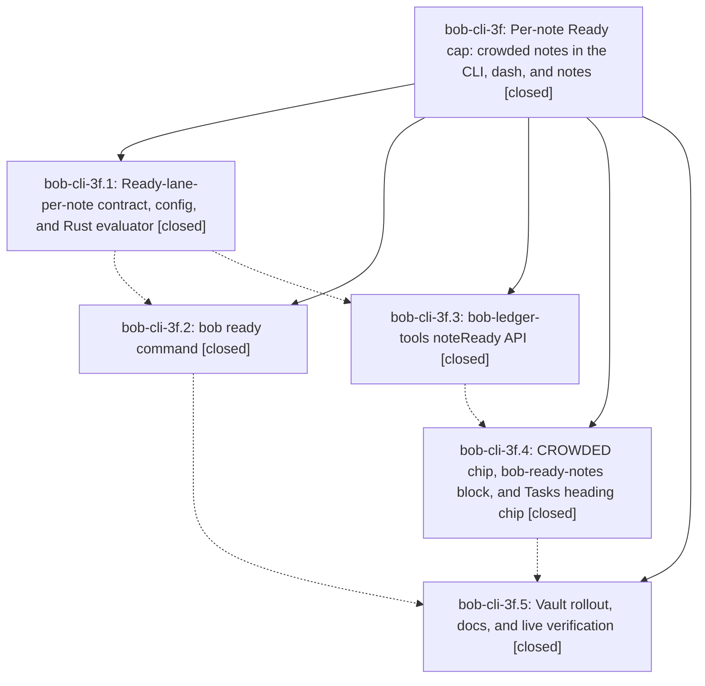

# Bead: bob-cli-3f — Per-note Ready cap: crowded notes in the CLI, dash, and notes

[Bead Pages](../README.md) / bob-cli-3f

**Status:** ✓ closed · **Resolution:** done · **Type:** ▸ plan · **Tier:** epic
**Owner:** `bryanbugyi34@gmail.com` · **Created by:** [bbugyi200.athena.0v5](https://github.com/bobs-org/bob-cli--agents/blob/main/sessions/bbugyi200.athena.0v5.md) · **Assignee:** `bob-cli-3f.land`
**Created:** 2026-10-01 17:55:47 EDT · **Closed:** 2026-10-01 20:01:37 EDT
**Plan:** [202610/per\_note\_ready\_cap.md](https://github.com/bobs-org/bob-cli--plans/blob/main/202610/per_note_ready_cap.md)

## Description

Every area/project note has a soft cap on its Ready lane (plan.max_ready_per_note, default 5, per-note ready_cap override). Crowded notes are named, counted, and easy to act on: in a new `bob ready` CLI view, a dash CROWDED chip that opens crowded.md, and a live chip on each note's `## Tasks` heading. All surfaces share one read-time contract, implemented in Rust and in bob-ledger-tools and pinned by shared vectors. The keymap-notice work is fully specified and filed to start after the freshness trial.

## Notes

[2026-10-02T00:01:37Z · bob-cli-3f.land] Land verification for bob-cli-3f (per-note Ready cap).

Phases verified in code:
- core (6e04265): plan.max_ready_per_note (1-999), list-form classifier with walk_typed_notes, the pure note_ready evaluator plus scan, the R1-R14 vectors, the docs/plan.md contract and lints, and decision note-ready-cap-counts-the-lane (with ready-is-freshness-gated marked superseded-in-part).
- cli (812c1b1): bob ready overview, worklist, JSON, --check, --cap, and --all.
- ledger-api (bob-plugins 03fbd18, 1.15.0): api.noteReady v1, stat-cached loadPlanCaps, the noteFrontmatter reader, and the JS vectors.
- ledger-views (bob-plugins 91b8e40, 1.16.0): renderCrowdedChip, the bob-ready-notes block, Tasks heading chips (CM6 and Reading view), and the scheduleLiveWidgetRefresh fan-out.
- rollout (vault 80db2219 plus bob-cli 447e97d): dash CROWDED chip with fallback, crowded.md, ready_cap: off on the three inboxes, the gtd_daily ritual and weekly prune text, the triage child under bob_gtd ^prj-task-count-warn, the rotten.md and freshness §13 trial lines, and the plan/freshness surfaces docs. ~/bob is at 80db2219 per bob vault-sync status. The deployed bob-ledger-tools is 1.17.0 (3g.2 on top; the noteReady API is present).

Integration with work that landed mid-epic (bob-cli-3g.1 a9c47d6 put PENDING/NEXT rows into the freshness Snapshot):
- note_ready/scan.rs now counts the worklist's also-here next/pending/blocked from Snapshot.next/.pending/.open instead of re-running NEXT_QUERY/PENDING_QUERY. That is two fewer vault passes per worklist. Live-vault also-here counts are identical to the old binary for sase, sase_remote, sase_pager, bob, and dev.
- Removed the epic-introduced unused TypedNote re-export (projects/mod.rs clippy warning) and the `let _ = ProjectStatus::Wip;` placeholder. Clippy warnings dropped 38→37; the rest are pre-existing baseline warnings outside the epic's files.
- 3g.2's ledger-tools changes add no new refresh fan-out sites. noteReady make-up reads ready-lane buckets from the shared freshness memo.
- Added a coordination note on bob-cli-3g: its rollout must keep the CROWDED ritual step, the [[crowded|CROWDED]] link, and the weekly `bob ready -a` check.

Gates:
- cargo fmt --check clean.
- cargo test --no-fail-fast: CLI 722/722 and parity suites green; lib 1474/1475, note_ready 22, `cli ready` 19. The one lib failure is the pre-existing BOB_DAY_FILE race in capture_pomodoros, which also fails at pre-epic 5d24c98.
- bob-plugins npm test 1185/1185.
- epic-symbols: none.

Follow-ups:
- PROPOSED FOLLOW-UP from bob-cli-3f.5 (capture_pomodoros flake): a duplicate of bob-cli-2e and not caused by the epic. Corroborated with +1 (now +4): it fails 5/5 full lib runs here and 1/3 at 5d24c98.
- Plan "Epic landing" step 4: filed bob-cli-3h (feature, large), "Per-note ready cap: gesture feedback (picker pills and capacity notices)". It is marked ready and snoozed until 2026-10-19T08:00-04:00. (The related artifact link failed: the artifact-link store reports a reused operation_id. The description cites the epic and plan instead.)
- bob-cli-3d and bob-cli-3e are closed with the ledger-views and ledger-api evidence.

Still gated (no Obsidian runtime on athena during landing):
- the dash CROWDED chip's look, tooltip, keyboard, click, and hover;
- crowded.md bars, groups, %%NNN%% hiding, and click-through;
- heading chips in Live Preview and Reading view, including `ready 65 · no cap` on gkeep_inbox;
- live update after completing a task in a crowded note or editing ready_cap;
- day rollover;
- the CLI vs plugin cross-check.
Repro: open ~/bob in Obsidian on athena, run `app.plugins.plugins["bob-ledger-tools"].api.noteReady.snapshot()` in the dev console, and compare per-note count/cap/state and totals with `bob ready -f json` on the same date. Then check dash.md, crowded.md, and a crowded note such as sase.md in both views.

## Phases

| Bead | Title | Status | Size | Created | Agents | Commits |
|---|---|---|---|---|---:|---:|
| [bob-cli-3f.1](bob-cli-3f.1.md) | Ready-lane-per-note contract, config, and Rust evaluator | ✓ closed | medium | 2026-10-01 | 1 | 1 |
| [bob-cli-3f.2](bob-cli-3f.2.md) | bob ready command | ✓ closed | medium | 2026-10-01 | 1 | 1 |
| [bob-cli-3f.3](bob-cli-3f.3.md) | bob-ledger-tools noteReady API | ✓ closed | medium | 2026-10-01 | 1 | 1 |
| [bob-cli-3f.4](bob-cli-3f.4.md) | CROWDED chip, bob-ready-notes block, and Tasks heading chip | ✓ closed | medium | 2026-10-01 | 1 | 1 |
| [bob-cli-3f.5](bob-cli-3f.5.md) | Vault rollout, docs, and live verification | ✓ closed | medium | 2026-10-01 | 1 | 1 |

## Lineage

## Agents

| Agent | Bead | Commits |
|---|---|---:|
| [bbugyi200.athena.bob-cli-3f.1](https://github.com/bobs-org/bob-cli--agents/blob/main/agents/bbugyi200.athena.bob-cli-3f.1/README.md) | [bob-cli-3f.1](bob-cli-3f.1.md) | 1 |
| [bbugyi200.athena.bob-cli-3f.2](https://github.com/bobs-org/bob-cli--agents/blob/main/agents/bbugyi200.athena.bob-cli-3f.2/README.md) | [bob-cli-3f.2](bob-cli-3f.2.md) | 1 |
| [bbugyi200.athena.bob-cli-3f.3](https://github.com/bobs-org/bob-cli--agents/blob/main/agents/bbugyi200.athena.bob-cli-3f.3/README.md) | [bob-cli-3f.3](bob-cli-3f.3.md) | 1 |
| [bbugyi200.athena.bob-cli-3f.4](https://github.com/bobs-org/bob-cli--agents/blob/main/agents/bbugyi200.athena.bob-cli-3f.4/README.md) | [bob-cli-3f.4](bob-cli-3f.4.md) | 1 |
| [bbugyi200.athena.bob-cli-3f.5](https://github.com/bobs-org/bob-cli--agents/blob/main/agents/bbugyi200.athena.bob-cli-3f.5/README.md) | [bob-cli-3f.5](bob-cli-3f.5.md) | 1 |
| [bbugyi200.athena.bob-cli-3f.land](https://github.com/bobs-org/bob-cli--agents/blob/main/agents/bbugyi200.athena.bob-cli-3f.land/README.md) | [bob-cli-3f](README.md) | 1 |

## Commits

| Repo | Commit | Subject | Bead | Committed |
|---|---|---|---|---|
| bob-cli | [`6e04265`](https://github.com/bobs-org/bob-cli/commit/6e0426524aeed583632995fdc01ceae33f840c17) | feat(note-ready): per-note Ready cap contract, config, and Rust evaluator | [bob-cli-3f.1](bob-cli-3f.1.md) | 2026-10-01 18:17:15 EDT |
| bob-plugins | [`bob-plugins@03fbd18`](https://github.com/bobs-org/bob-plugins/commit/03fbd18367f00fa6b2bdf997131588e0bd866d04) | feat(ledger-tools): per-note Ready cap api.noteReady v1 (1.15.0) | [bob-cli-3f.3](bob-cli-3f.3.md) | 2026-10-01 18:47:49 EDT |
| bob-cli | [`812c1b1`](https://github.com/bobs-org/bob-cli/commit/812c1b19ac8402dd92c6fd451405e6a853341c97) | feat(ready): add bob ready per-note Ready-cap view | [bob-cli-3f.2](bob-cli-3f.2.md) | 2026-10-01 18:48:02 EDT |
| bob-plugins | [`bob-plugins@91b8e40`](https://github.com/bobs-org/bob-plugins/commit/91b8e405adb9bb1a2b76475d90e80748c17963c2) | feat(ledger-tools): CROWDED chip, bob-ready-notes block, and Tasks heading chip (1.16.0) | [bob-cli-3f.4](bob-cli-3f.4.md) | 2026-10-01 19:19:48 EDT |
| bob-cli | [`447e97d`](https://github.com/bobs-org/bob-cli/commit/447e97da716eb06ed29147bb2a606ddcdd445e44) | docs: per-note Ready cap rollout surfaces, ritual, and trial log | [bob-cli-3f.5](bob-cli-3f.5.md) | 2026-10-01 19:37:33 EDT |
| bob-cli | [`f83b250`](https://github.com/bobs-org/bob-cli/commit/f83b25084cc618bc5ec1517689b8b382f4d86d65) | chore(note-ready): land epic bob-cli-3f — reuse snapshot lane rows, drop unused re-export | [bob-cli-3f](README.md) | 2026-10-01 20:03:00 EDT |
