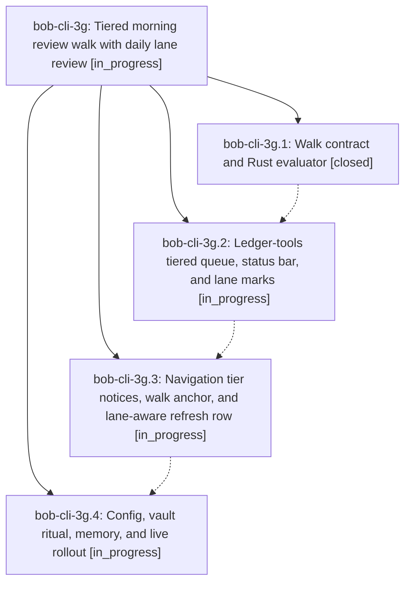

# Bead: bob-cli-3g — Tiered morning review walk with daily lane review

[Bead Pages](../README.md) / bob-cli-3g

**Status:** ◐ in_progress · **Type:** ▸ plan · **Tier:** epic
**Owner:** `bryanbugyi34@gmail.com` · **Created by:** [bbugyi200.athena.0v7](https://github.com/bobs-org/bob-cli--agents/blob/main/sessions/bbugyi200.athena.0v7.md) · **Assignee:** `bob-cli-3g.land`
**Created:** 2026-10-01 18:28:57 EDT
**Plan:** [202610/tiered\_morning\_review\_walk.md](https://github.com/bobs-org/bob-cli--plans/blob/main/202610/tiered_morning_review_walk.md)

## Description

`]s` / `[s` and Ctrl+Alt+J/K walk one shared review queue in explicit tiers, NEW → PENDING → NEXT → RETURNED → ROTTEN. Pending and Next tasks come due for a daily review set by new `pending_interval` / `next_interval` keys (default 1 day). ROTTEN sorts by interval, then lateness, then newest `created`. The walk tells Bryan by tier where he is, when the commitments are done, and that ROTTEN is stoppable upkeep. No stamps are stripped, and the seed is never run again.

## Phases

| Bead | Title | Status | Size | Created | Agents | Commits |
|---|---|---|---|---|---:|---:|
| [bob-cli-3g.1](bob-cli-3g.1.md) | Walk contract and Rust evaluator | ✓ closed | medium | 2026-10-01 | 1 | 1 |
| [bob-cli-3g.2](bob-cli-3g.2.md) | Ledger-tools tiered queue, status bar, and lane marks | ◐ in_progress | medium | 2026-10-01 | 1 | 0 |
| [bob-cli-3g.3](bob-cli-3g.3.md) | Navigation tier notices, walk anchor, and lane-aware refresh row | ◐ in_progress | medium | 2026-10-01 | 1 | 0 |
| [bob-cli-3g.4](bob-cli-3g.4.md) | Config, vault ritual, memory, and live rollout | ◐ in_progress | medium | 2026-10-01 | 1 | 0 |

## Lineage

## Agents

| Agent | Bead | Commits |
|---|---|---:|
| [bbugyi200.athena.bob-cli-3g.1](https://github.com/bobs-org/bob-cli--agents/blob/main/agents/bbugyi200.athena.bob-cli-3g.1/README.md) | [bob-cli-3g.1](bob-cli-3g.1.md) | 1 |
| [bbugyi200.athena.bob-cli-3g.2](https://github.com/bobs-org/bob-cli--agents/blob/main/agents/bbugyi200.athena.bob-cli-3g.2/README.md) | [bob-cli-3g.2](bob-cli-3g.2.md) | 0 |
| [bbugyi200.athena.bob-cli-3g.3](https://github.com/bobs-org/bob-cli--agents/blob/main/agents/bbugyi200.athena.bob-cli-3g.3/README.md) | [bob-cli-3g.3](bob-cli-3g.3.md) | 0 |
| [bbugyi200.athena.bob-cli-3g.4](https://github.com/bobs-org/bob-cli--agents/blob/main/agents/bbugyi200.athena.bob-cli-3g.4/README.md) | [bob-cli-3g.4](bob-cli-3g.4.md) | 0 |
| [bbugyi200.athena.bob-cli-3g.land](https://github.com/bobs-org/bob-cli--agents/blob/main/agents/bbugyi200.athena.bob-cli-3g.land/README.md) | [bob-cli-3g](README.md) | 0 |

## Commits

| Repo | Commit | Subject | Bead | Committed |
|---|---|---|---|---|
| bob-cli | [`a9c47d6`](https://github.com/bobs-org/bob-cli/commit/a9c47d66823ffcebd56d3bf96adbd91588fa6ec3) | feat(freshness): implement rust walk evaluator with schema-3 output | [bob-cli-3g.1](bob-cli-3g.1.md) | 2026-10-01 19:10:44 EDT |
