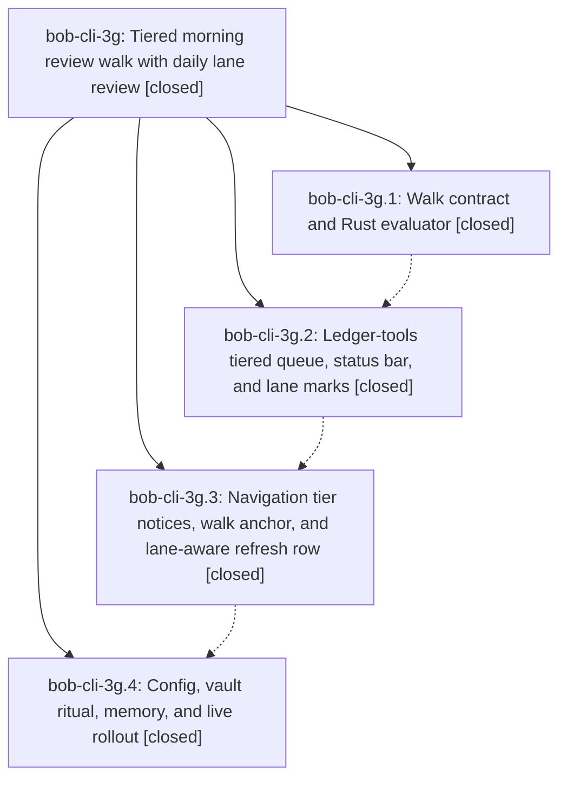

# Bead: bob-cli-3g — Tiered morning review walk with daily lane review

[Bead Pages](../README.md) / bob-cli-3g

**Status:** ✓ closed · **Resolution:** done · **Type:** ▸ plan · **Tier:** epic
**Owner:** `bryanbugyi34@gmail.com` · **Created by:** [bbugyi200.athena.0v7](https://github.com/bobs-org/bob-cli--agents/blob/main/sessions/bbugyi200.athena.0v7.md) · **Assignee:** `bob-cli-3g.land`
**Created:** 2026-10-01 18:28:57 EDT · **Closed:** 2026-10-01 20:31:06 EDT
**Plan:** [202610/tiered\_morning\_review\_walk.md](https://github.com/bobs-org/bob-cli--plans/blob/main/202610/tiered_morning_review_walk.md)

## Description

`]s` / `[s` and Ctrl+Alt+J/K walk one shared review queue in explicit tiers, NEW → PENDING → NEXT → RETURNED → ROTTEN. Pending and Next tasks come due for a daily review set by new `pending_interval` / `next_interval` keys (default 1 day). ROTTEN sorts by interval, then lateness, then newest `created`. The walk tells Bryan by tier where he is, when the commitments are done, and that ROTTEN is stoppable upkeep. No stamps are stripped, and the seed is never run again.

## Notes

[2026-10-02T00:01:07Z · bob-cli-3f.land] INTEGRATION NOTE (from bob-cli-3f land agent): epic bob-cli-3f landed per-note CROWDED review. docs/freshness.md §6 now has ritual step 4 'Clear CROWDED to 0 (split, sequence, defer, drop via bob ready)'. Vault commit 80db2219 added two pieces of ritual text: the gtd_daily.md 'Morning review' chore now says 'then clear [[crowded|CROWDED]] to 0 (split, sequence, defer, drop)', and the 'Weekly prune' chore ends with 'check `bob ready -a`'. When 3g's rollout phase rewrites those chores to the §6 ritual, keep the CROWDED step with its [[crowded|CROWDED]] link and the weekly 'bob ready -a' check. They are not in 3g's plan link-target list. Also, the bob ready worklist now reads NEXT/PENDING counts from the freshness Snapshot.next/.pending that 3g.1 added (src/native/note_ready/scan.rs), so keep those Snapshot fields.

[2026-10-02T00:22:00Z · bob-cli-3g.land] FOLLOW-UP TRIAGE (land agent, before the remaining-work tale):

No child note contains a PROPOSED FOLLOW-UP entry (bob-cli-3g.1 #1, bob-cli-3g.2 #1, bob-cli-3g.3 #1, bob-cli-3g.4 #1 and #2).

DECLINED as a new task — bob-cli-3g.4 note #1 VERIFICATION GATE (Obsidian GUI checks on athena/apollo and the Mac). The rollout phase contract says when the GUI is unavailable, record those checks as a gate rather than claim a pass. That note is the gate. It is epic verification residue, not a distinct defect, and a headless coder cannot perform it. Not filed with sase_new_task.

DECLINED as remaining work — copying the "walk went live" bullet from docs/freshness.md §13 onto rotten.md. The trial window 2026-10-05 through 2026-10-18 is already on the rotten heading and in §13. The dates are mirrored. A second copy of the landing sentence is not a conflict.

ALREADY INTEGRATED, no further edit — the bob-cli-3f land note on this epic: docs/freshness.md §6 step 4 still clears CROWDED via bob ready and does not depend on ROTTEN progress; gtd_daily.md Morning review keeps the [[crowded|CROWDED]] step; Weekly prune keeps `bob ready -a` and the next_interval keep-rate check; Snapshot.next and Snapshot.pending still exist on the freshness scan and src/native/note_ready/scan.rs counts them (commit f83b250).

REMAINING EPIC WORK (this tale, not a new task) — two surfaces committed while this epic was open still describe the pre-walk world:
1. Vault crowded.md (80db2219) intro still says "After NEW and ROTTEN". §6 and gtd_daily clear CROWDED after Commitments done, and that step does not depend on ROTTEN.
2. docs/plan.md surface rows for the daily bob-plan block and dash.md, written by 447e97d (bob-cli-3f.5), still say "freshness namespace v3". Ledger-tools api.freshness is namespace v4 (cdadcde). The top-level api stays v3.

No parent_bead (parent_id null). No --epic-symbol entries at triage time.

[2026-10-02T00:31:06Z · bob-cli-3g.land] Verified bob-cli-3g.1 through .4 against the plan, the Rust and plugin evaluators, and commits a9c47d6, cdadcde, ede89d3, 9e548bb, vault 36bda225/24fbd255, and chezmoi 9a3e13f7. Schema 3, namespace v4, nav 1.50.0, lane intervals, ritual, decision record, and closed ^wip-next-refresh are in tree. 3f's CROWDED ritual step, gtd_daily wikilink, weekly bob ready -a check, and Snapshot.next/.pending reuse were already integrated. This turn aligned crowded.md with section 6 (CROWDED after Commitments done, independent of ROTTEN) and updated the two docs/plan.md surface rows from freshness namespace v3 to v4. No just check recipe exists in this workspace (justfile gates fmt/lint/test under all); ran it: fmt and lint passed, cargo test passed on rerun (all suites ok) after one flaky capture_pomodoros failure that passes in isolation and on rerun. No just symvision recipe exists; skipped. No PROPOSED FOLLOW-UP entries. The 3g.4 GUI verification gate stays the recorded headless residue and was not filed as a new task. No epic-symbol entries. ~/bob remains at 24fbd255 until the next vault-sync after this vault commit is pushed. No parent bead.

## Phases

| Bead | Title | Status | Size | Created | Agents | Commits |
|---|---|---|---|---|---:|---:|
| [bob-cli-3g.1](bob-cli-3g.1.md) | Walk contract and Rust evaluator | ✓ closed | medium | 2026-10-01 | 1 | 1 |
| [bob-cli-3g.2](bob-cli-3g.2.md) | Ledger-tools tiered queue, status bar, and lane marks | ✓ closed | medium | 2026-10-01 | 1 | 1 |
| [bob-cli-3g.3](bob-cli-3g.3.md) | Navigation tier notices, walk anchor, and lane-aware refresh row | ✓ closed | medium | 2026-10-01 | 1 | 0 |
| [bob-cli-3g.4](bob-cli-3g.4.md) | Config, vault ritual, memory, and live rollout | ✓ closed | medium | 2026-10-01 | 1 | 1 |

## Lineage

## Agents

| Agent | Bead | Commits |
|---|---|---:|
| [bbugyi200.athena.bob-cli-3g.1](https://github.com/bobs-org/bob-cli--agents/blob/main/agents/bbugyi200.athena.bob-cli-3g.1/README.md) | [bob-cli-3g.1](bob-cli-3g.1.md) | 1 |
| [bbugyi200.athena.bob-cli-3g.2](https://github.com/bobs-org/bob-cli--agents/blob/main/agents/bbugyi200.athena.bob-cli-3g.2/README.md) | [bob-cli-3g.2](bob-cli-3g.2.md) | 1 |
| [bbugyi200.athena.bob-cli-3g.3](https://github.com/bobs-org/bob-cli--agents/blob/main/agents/bbugyi200.athena.bob-cli-3g.3/README.md) | [bob-cli-3g.3](bob-cli-3g.3.md) | 0 |
| [bbugyi200.athena.bob-cli-3g.4](https://github.com/bobs-org/bob-cli--agents/blob/main/agents/bbugyi200.athena.bob-cli-3g.4/README.md) | [bob-cli-3g.4](bob-cli-3g.4.md) | 1 |
| [bbugyi200.athena.bob-cli-3g.land](https://github.com/bobs-org/bob-cli--agents/blob/main/sessions/bbugyi200.athena.bob-cli-3g.land.md) | [bob-cli-3g](README.md) | 2 |

## Commits

| Repo | Commit | Subject | Bead | Committed |
|---|---|---|---|---|
| bob-cli | [`a9c47d6`](https://github.com/bobs-org/bob-cli/commit/a9c47d66823ffcebd56d3bf96adbd91588fa6ec3) | feat(freshness): implement rust walk evaluator with schema-3 output | [bob-cli-3g.1](bob-cli-3g.1.md) | 2026-10-01 19:10:44 EDT |
| bob-plugins | [`bob-plugins@cdadcde`](https://github.com/bobs-org/bob-plugins/commit/cdadcded6e5eccfac7cba8ac3db40001578a9167) | feat(ledger-tools): tiered morning review walk with daily lane review (1.17.0) | [bob-cli-3g.2](bob-cli-3g.2.md) | 2026-10-01 19:31:11 EDT |
| bob-cli | [`9e548bb`](https://github.com/bobs-org/bob-cli/commit/9e548bba484fb76f951c067c21c593c689811cd8) | feat(freshness): land tiered review walk NEW PENDING NEXT RETURNED ROTTEN | [bob-cli-3g.4](bob-cli-3g.4.md) | 2026-10-01 20:07:42 EDT |
| bob-cli | [`f11a9f8`](https://github.com/bobs-org/bob-cli/commit/f11a9f81256a10ee812e47c3a203797262e9c381) | docs(plan): update plan surfaces to freshness namespace v4 for tiered walk | [bob-cli-3g](README.md) | 2026-10-01 20:33:20 EDT |
| bob-cli--plans | [`bob-cli--plans@3ce66be`](https://github.com/bobs-org/bob-cli--plans/commit/3ce66be6427efdb5d3988d56cbbdaa73709a620a) | chore(plans): mark tiered\_morning\_review\_walk done after bob-cli-3g landing | [bob-cli-3g](README.md) | 2026-10-01 20:34:18 EDT |
