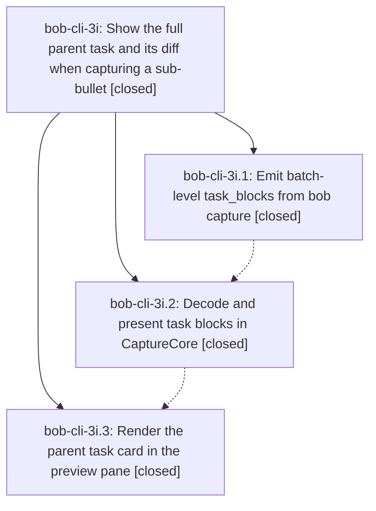

# Bead: bob-cli-3i — Show the full parent task and its diff when capturing a sub-bullet

[Bead Pages](../README.md) / bob-cli-3i

**Status:** ✓ closed · **Resolution:** done · **Type:** ▸ plan · **Tier:** epic
**Owner:** `bryanbugyi34@gmail.com` · **Created by:** [bbugyi200.athena.0vb](https://github.com/bobs-org/bob-cli--agents/blob/main/sessions/bbugyi200.athena.0vb.md) · **Assignee:** `bob-cli-3i.land`
**Created:** 2026-10-02 09:49:31 EDT · **Closed:** 2026-10-02 11:44:55 EDT
**Plan:** [202610/sub\_bullet\_task\_block\_preview.md](https://github.com/bobs-org/bob-cli--plans/blob/main/202610/sub_bullet_task_block_preview.md)

## Description

When a draft adds a sub-bullet under an existing task (`@route+block-id`, with or without `#section`, picker task refs, and global `@@route+block-id` batches), the Bob Mac Capture preview shows the whole parent task as a card: the task line and every line of its block, exactly as Bob will write them, with the new lines marked as added. Bob computes the block and the diff. The app decodes and renders it with the same diff card the Pomodoro blocks use.

## Notes

[2026-10-02T15:32:36Z · bob-cli-3i.land] LAND AUDIT / FOLLOW-UP TRIAGE: Read epic and every phase scope/note, approved plan:202610/sub_bullet_task_block_preview.md, bob-cli commit 00d4941 (phase .1), and bob-mac-capture commits 46c5614 (.2)/b8b054f (.3). Reviewed shared diff/planning/output/tracker, JSON decode, task-row tokens, folding/covers/accessibility, shared SwiftUI card, compact headers, footer fix, tests and docs. Direct gh verification confirms macOS runs 37023148696 and 37025611761 succeeded for the exact phase SHAs. Later drift is bob-cli 74f47d4 and Mac 1478969 (inline single-entry close); a sandbox batch note @sase+capture followed by =x1 Shipped the fix emits cumulative task rows with the new note, WORK LOG header and dated summary, plus two Pomodoro blocks, so the new close semantics integrate. Remaining epic defects: task_blocks::finish groups by BTreeMap path, violating cross-note first-touch order (rebuilt current CLI: zulu, alpha, zulu items -> alpha, zulu blocks); Mac splitTaskSuffixes rebuilds text/tag tokens with default struck=false (Swift source repro: - ~~old #task~~ ^parent loses strike on old and #task while Pomodoro tokenization preserves it). Both are caused by this epic and belong in a small tale whose final step closes this epic. FOLLOW-UP OUTCOMES: bob-cli-3i.1 note #1 BOB_DAY_FILE race is duplicate bob-cli-2e; added +1 with proposing-phase attribution and independent source audit, no fresh failure execution claimed. Independently missing just check is duplicate bob-cli-3c; added +1 for current missing-recipe reproduction. The weekly task sweep and active-epic scopes show no other causal owner. No proposal declined and no new task needed. Current sase bead epic-symbols bob-cli-3i is empty; check and symvision recipes are absent. Current epic has no parent_bead. Original children stay closed pending the narrowly scoped correctness tale.

[2026-10-02T15:44:55Z · bob-cli-3i.land] Verified all original phase scopes/notes and commits, successful phase macOS CI, post-epic inline-close integration, corrected cross-note first-touch order and task-row strike preservation, regression/native checks, and clean epic symbols. Follow-up from bob-cli-3i.1 note #1 corroborated on bob-cli-2e; missing just check corroborated on bob-cli-3c; no duplicate tasks or declined proposals. Closeout verification: cargo test --lib serial 1497 passed, cargo test --test cli 727 passed, CaptureCoreTests 585 passed (incl. 3 new strike tests), new cross-note order regression passes, fresh-binary sandbox dry-run returns zulu,alpha order with cumulative additions. Newer non-epic drift reviewed: bob-cli 71d57da (completion command tree, capture suites still green) and Mac HEAD b8b054f already covered by CI; just check recipe still absent (known bob-cli-3c limitation), used cargo fmt/clippy/test + swift test instead.

## Phases

| Bead | Title | Status | Size | Created | Agents | Commits |
|---|---|---|---|---|---:|---:|
| [bob-cli-3i.1](bob-cli-3i.1.md) | Emit batch-level task\_blocks from bob capture | ✓ closed | medium | 2026-10-02 | 1 | 1 |
| [bob-cli-3i.2](bob-cli-3i.2.md) | Decode and present task blocks in CaptureCore | ✓ closed | medium | 2026-10-02 | 1 | 1 |
| [bob-cli-3i.3](bob-cli-3i.3.md) | Render the parent task card in the preview pane | ✓ closed | medium | 2026-10-02 | 1 | 1 |

## Lineage

## Agents

| Agent | Bead | Commits |
|---|---|---:|
| [bbugyi200.athena.bob-cli-3i.1](https://github.com/bobs-org/bob-cli--agents/blob/main/agents/bbugyi200.athena.bob-cli-3i.1/README.md) | [bob-cli-3i.1](bob-cli-3i.1.md) | 1 |
| [bbugyi200.athena.bob-cli-3i.2](https://github.com/bobs-org/bob-cli--agents/blob/main/sessions/bbugyi200.athena.bob-cli-3i.2.md) | [bob-cli-3i.2](bob-cli-3i.2.md) | 1 |
| [bbugyi200.athena.bob-cli-3i.3](https://github.com/bobs-org/bob-cli--agents/blob/main/sessions/bbugyi200.athena.bob-cli-3i.3.md) | [bob-cli-3i.3](bob-cli-3i.3.md) | 1 |
| [bbugyi200.athena.bob-cli-3i.land](https://github.com/bobs-org/bob-cli--agents/blob/main/sessions/bbugyi200.athena.bob-cli-3i.land.md) | [bob-cli-3i](README.md) | 2 |

## Commits

| Repo | Commit | Subject | Bead | Committed |
|---|---|---|---|---|
| bob-cli | [`00d4941`](https://github.com/bobs-org/bob-cli/commit/00d49417e080a8a2aef3379f7962ca096ce98161) | feat(capture): emit batch-level task\_blocks from bob capture json | [bob-cli-3i.1](bob-cli-3i.1.md) | 2026-10-02 10:37:36 EDT |
| bob-mac-capture | [`bob-mac-capture@46c5614`](https://github.com/bobs-org/bob-mac-capture/commit/46c561497798c44e54406c7ee21b106d32aa895b) | feat(capture): decode and present sub-bullet task blocks | [bob-cli-3i.2](bob-cli-3i.2.md) | 2026-10-02 10:54:11 EDT |
| bob-mac-capture | [`bob-mac-capture@b8b054f`](https://github.com/bobs-org/bob-mac-capture/commit/b8b054fe17acc94e5bb53f39d5a703d3b0ce2a65) | feat(capture): show the full parent task when capturing a sub-bullet | [bob-cli-3i.3](bob-cli-3i.3.md) | 2026-10-02 11:14:49 EDT |
| bob-cli | [`0791fb6`](https://github.com/bobs-org/bob-cli/commit/0791fb6ae5d1767110854a9481c6501af8613246) | fix(capture): preserve first-touch order in task block output | [bob-cli-3i](README.md) | 2026-10-02 11:46:35 EDT |
| bob-mac-capture | [`bob-mac-capture@15f930e`](https://github.com/bobs-org/bob-mac-capture/commit/15f930e3125a2fa855a1989ab87af9ea0f677fdf) | fix(capture): preserve strikethrough in task-row token splitting | [bob-cli-3i](README.md) | 2026-10-02 11:47:10 EDT |
