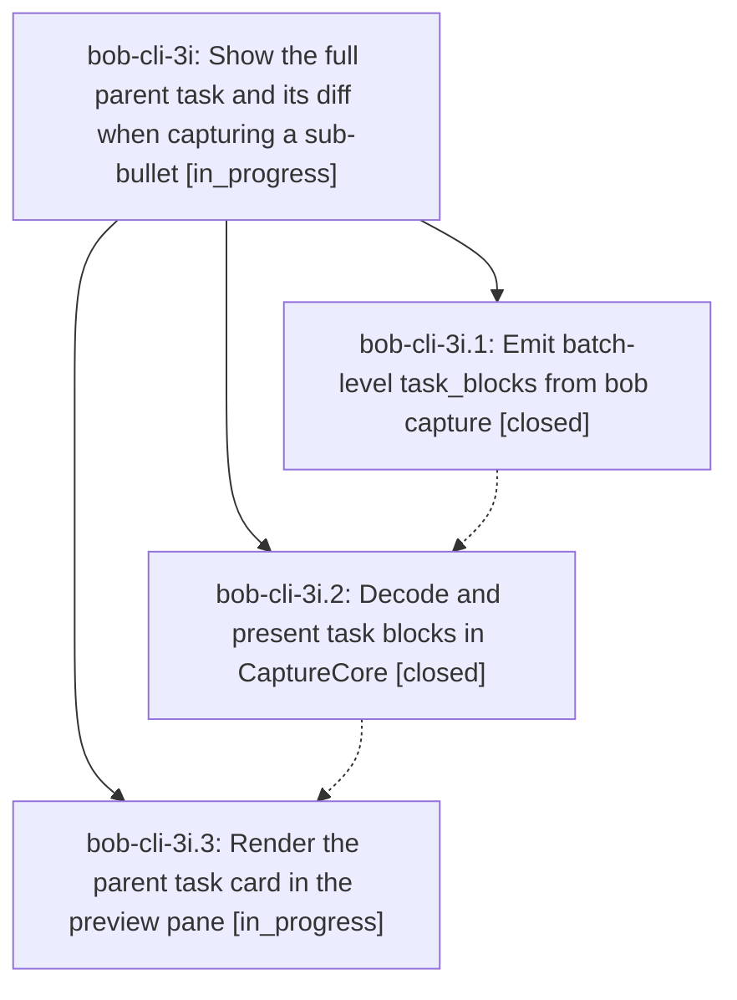

# Bead: bob-cli-3i — Show the full parent task and its diff when capturing a sub-bullet

[Bead Pages](../README.md) / bob-cli-3i

**Status:** ◐ in_progress · **Type:** ▸ plan · **Tier:** epic
**Owner:** `bryanbugyi34@gmail.com` · **Created by:** [bbugyi200.athena.0vb](https://github.com/bobs-org/bob-cli--agents/blob/main/sessions/bbugyi200.athena.0vb.md) · **Assignee:** `bob-cli-3i.land`
**Created:** 2026-10-02 09:49:31 EDT
**Plan:** [202610/sub\_bullet\_task\_block\_preview.md](https://github.com/bobs-org/bob-cli--plans/blob/main/202610/sub_bullet_task_block_preview.md)

## Description

When a draft adds a sub-bullet under an existing task (`@route+block-id`, with or without `#section`, picker task refs, and global `@@route+block-id` batches), the Bob Mac Capture preview shows the whole parent task as a card: the task line and every line of its block, exactly as Bob will write them, with the new lines marked as added. Bob computes the block and the diff. The app decodes and renders it with the same diff card the Pomodoro blocks use.

## Phases

| Bead | Title | Status | Size | Created | Agents | Commits |
|---|---|---|---|---|---:|---:|
| [bob-cli-3i.1](bob-cli-3i.1.md) | Emit batch-level task\_blocks from bob capture | ✓ closed | medium | 2026-10-02 | 1 | 1 |
| [bob-cli-3i.2](bob-cli-3i.2.md) | Decode and present task blocks in CaptureCore | ✓ closed | medium | 2026-10-02 | 1 | 1 |
| [bob-cli-3i.3](bob-cli-3i.3.md) | Render the parent task card in the preview pane | ◐ in_progress | medium | 2026-10-02 | 1 | 1 |

## Lineage

## Agents

| Agent | Bead | Commits |
|---|---|---:|
| [bbugyi200.athena.bob-cli-3i.1](https://github.com/bobs-org/bob-cli--agents/blob/main/agents/bbugyi200.athena.bob-cli-3i.1/README.md) | [bob-cli-3i.1](bob-cli-3i.1.md) | 1 |
| [bbugyi200.athena.bob-cli-3i.2](https://github.com/bobs-org/bob-cli--agents/blob/main/sessions/bbugyi200.athena.bob-cli-3i.2.md) | [bob-cli-3i.2](bob-cli-3i.2.md) | 1 |
| [bbugyi200.athena.bob-cli-3i.3](https://github.com/bobs-org/bob-cli--agents/blob/main/agents/bbugyi200.athena.bob-cli-3i.3/README.md) | [bob-cli-3i.3](bob-cli-3i.3.md) | 1 |
| [bbugyi200.athena.bob-cli-3i.land](https://github.com/bobs-org/bob-cli--agents/blob/main/agents/bbugyi200.athena.bob-cli-3i.land/README.md) | [bob-cli-3i](README.md) | 0 |

## Commits

| Repo | Commit | Subject | Bead | Committed |
|---|---|---|---|---|
| bob-cli | [`00d4941`](https://github.com/bobs-org/bob-cli/commit/00d49417e080a8a2aef3379f7962ca096ce98161) | feat(capture): emit batch-level task\_blocks from bob capture json | [bob-cli-3i.1](bob-cli-3i.1.md) | 2026-10-02 10:37:36 EDT |
| bob-mac-capture | [`bob-mac-capture@46c5614`](https://github.com/bobs-org/bob-mac-capture/commit/46c561497798c44e54406c7ee21b106d32aa895b) | feat(capture): decode and present sub-bullet task blocks | [bob-cli-3i.2](bob-cli-3i.2.md) | 2026-10-02 10:54:11 EDT |
| bob-mac-capture | [`bob-mac-capture@b8b054f`](https://github.com/bobs-org/bob-mac-capture/commit/b8b054fe17acc94e5bb53f39d5a703d3b0ce2a65) | feat(capture): show the full parent task when capturing a sub-bullet | [bob-cli-3i.3](bob-cli-3i.3.md) | 2026-10-02 11:14:49 EDT |
