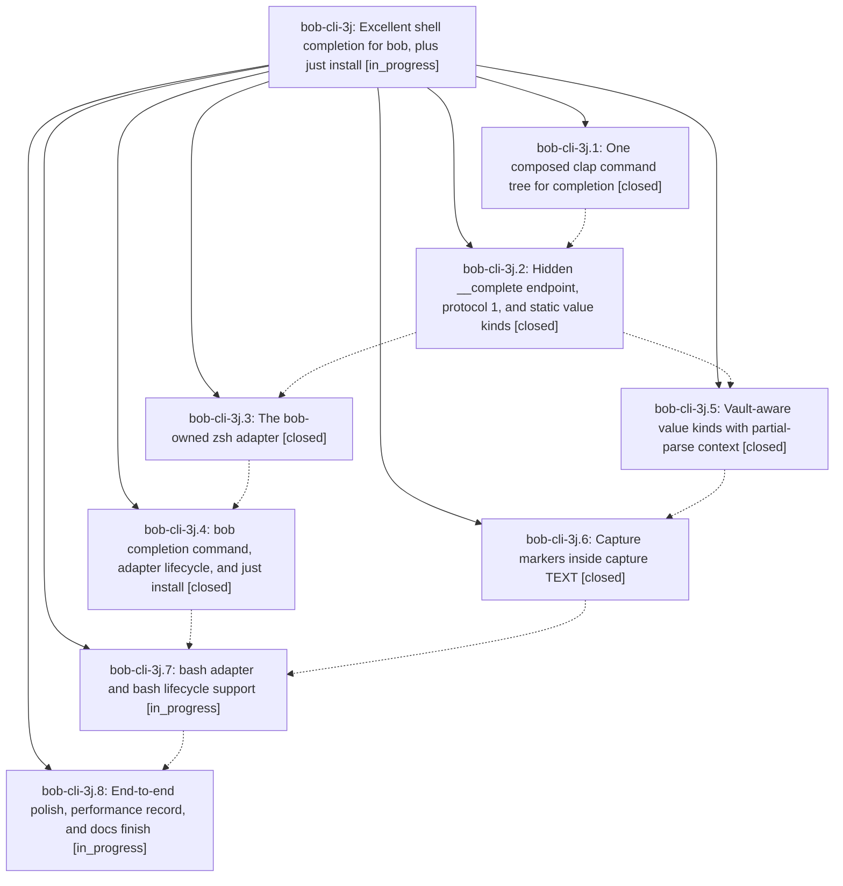

# Bead: bob-cli-3j — Excellent shell completion for bob, plus just install

[Bead Pages](../README.md) / bob-cli-3j

**Status:** ◐ in_progress · **Type:** ▸ plan · **Tier:** epic
**Owner:** `bryanbugyi34@gmail.com` · **Created by:** [bbugyi200.apollo.46](https://github.com/bobs-org/bob-cli--agents/blob/main/sessions/bbugyi200.apollo.46.md) · **Assignee:** `bob-cli-3j.land`
**Created:** 2026-10-02 11:06:15 EDT
**Plan:** [202610/bob\_shell\_completion.md](https://github.com/bobs-org/bob-cli--plans/blob/main/202610/bob_shell_completion.md)

## Description

Pressing TAB after `bob` in zsh (and bash) offers grouped, described, vault-aware completions computed live by the installed bob binary, so completion can never drift from the CLI; `bob completion` installs, inspects, and removes the shell adapter safely and honestly; and `just install` installs bob from source and keeps its shell completion current in one step.

## Phases

| Bead | Title | Status | Size | Created | Agents | Commits |
|---|---|---|---|---|---:|---:|
| [bob-cli-3j.1](bob-cli-3j.1.md) | One composed clap command tree for completion | ✓ closed | medium | 2026-10-02 | 1 | 1 |
| [bob-cli-3j.2](bob-cli-3j.2.md) | Hidden \_\_complete endpoint, protocol 1, and static value kinds | ✓ closed | medium | 2026-10-02 | 1 | 1 |
| [bob-cli-3j.3](bob-cli-3j.3.md) | The bob-owned zsh adapter | ✓ closed | medium | 2026-10-02 | 1 | 1 |
| [bob-cli-3j.4](bob-cli-3j.4.md) | bob completion command, adapter lifecycle, and just install | ✓ closed | medium | 2026-10-02 | 1 | 1 |
| [bob-cli-3j.5](bob-cli-3j.5.md) | Vault-aware value kinds with partial-parse context | ✓ closed | medium | 2026-10-02 | 1 | 1 |
| [bob-cli-3j.6](bob-cli-3j.6.md) | Capture markers inside capture TEXT | ✓ closed | medium | 2026-10-02 | 1 | 1 |
| [bob-cli-3j.7](bob-cli-3j.7.md) | bash adapter and bash lifecycle support | ◐ in_progress | medium | 2026-10-02 | 1 | 0 |
| [bob-cli-3j.8](bob-cli-3j.8.md) | End-to-end polish, performance record, and docs finish | ◐ in_progress | small | 2026-10-02 | 1 | 0 |

## Lineage

## Agents

| Agent | Bead | Commits |
|---|---|---:|
| [bbugyi200.apollo.bob-cli-3j.1](https://github.com/bobs-org/bob-cli--agents/blob/main/agents/bbugyi200.apollo.bob-cli-3j.1/README.md) | [bob-cli-3j.1](bob-cli-3j.1.md) | 1 |
| [bbugyi200.apollo.bob-cli-3j.2](https://github.com/bobs-org/bob-cli--agents/blob/main/agents/bbugyi200.apollo.bob-cli-3j.2/README.md) | [bob-cli-3j.2](bob-cli-3j.2.md) | 1 |
| [bbugyi200.apollo.bob-cli-3j.3](https://github.com/bobs-org/bob-cli--agents/blob/main/agents/bbugyi200.apollo.bob-cli-3j.3/README.md) | [bob-cli-3j.3](bob-cli-3j.3.md) | 1 |
| [bbugyi200.apollo.bob-cli-3j.4](https://github.com/bobs-org/bob-cli--agents/blob/main/agents/bbugyi200.apollo.bob-cli-3j.4/README.md) | [bob-cli-3j.4](bob-cli-3j.4.md) | 1 |
| [bbugyi200.apollo.bob-cli-3j.5](https://github.com/bobs-org/bob-cli--agents/blob/main/agents/bbugyi200.apollo.bob-cli-3j.5/README.md) | [bob-cli-3j.5](bob-cli-3j.5.md) | 1 |
| [bbugyi200.apollo.bob-cli-3j.6](https://github.com/bobs-org/bob-cli--agents/blob/main/agents/bbugyi200.apollo.bob-cli-3j.6/README.md) | [bob-cli-3j.6](bob-cli-3j.6.md) | 1 |
| [bbugyi200.apollo.bob-cli-3j.7](https://github.com/bobs-org/bob-cli--agents/blob/main/agents/bbugyi200.apollo.bob-cli-3j.7/README.md) | [bob-cli-3j.7](bob-cli-3j.7.md) | 0 |
| [bbugyi200.apollo.bob-cli-3j.8](https://github.com/bobs-org/bob-cli--agents/blob/main/agents/bbugyi200.apollo.bob-cli-3j.8/README.md) | [bob-cli-3j.8](bob-cli-3j.8.md) | 0 |
| [bbugyi200.apollo.bob-cli-3j.land](https://github.com/bobs-org/bob-cli--agents/blob/main/agents/bbugyi200.apollo.bob-cli-3j.land/README.md) | [bob-cli-3j](README.md) | 0 |

## Commits

| Repo | Commit | Subject | Bead | Committed |
|---|---|---|---|---|
| bob-cli | [`71d57da`](https://github.com/bobs-org/bob-cli/commit/71d57da42a940afaa6c3fe26fb4c59cbe5b82c5c) | feat(completion): land one-tree composed clap command tree for completion | [bob-cli-3j.1](bob-cli-3j.1.md) | 2026-10-02 11:26:18 EDT |
| bob-cli | [`b9a067d`](https://github.com/bobs-org/bob-cli/commit/b9a067da5c8a55ca5e153c6469df06fdc3c0efa2) | feat(completion): add native shell completion engine with protocol and presenter | [bob-cli-3j.2](bob-cli-3j.2.md) | 2026-10-02 11:59:11 EDT |
| bob-cli | [`eafe65c`](https://github.com/bobs-org/bob-cli/commit/eafe65c5ccbbb4e631704068ce20b0b69f276c10) | feat(completion): add vault value completion with context and providers | [bob-cli-3j.5](bob-cli-3j.5.md) | 2026-10-02 12:32:46 EDT |
| bob-cli | [`ba48629`](https://github.com/bobs-org/bob-cli/commit/ba48629f5d2d43d1e3f45c1d4d1ee104c2b0d4ad) | feat(completion): land bob-owned zsh adapter with stubbed-compsys and real-zpty tests | [bob-cli-3j.3](bob-cli-3j.3.md) | 2026-10-02 12:44:08 EDT |
| bob-cli | [`6b272e4`](https://github.com/bobs-org/bob-cli/commit/6b272e4af604242aa2dad2148ff20cf18a455b5b) | feat(completion): complete capture markers inside capture TEXT | [bob-cli-3j.6](bob-cli-3j.6.md) | 2026-10-02 13:09:58 EDT |
| bob-cli | [`a9fc134`](https://github.com/bobs-org/bob-cli/commit/a9fc13454ce9a6bbe0644d3be79385e0a87a9939) | feat(completion): land bob completion command, adapter lifecycle, and just install | [bob-cli-3j.4](bob-cli-3j.4.md) | 2026-10-02 13:23:37 EDT |
