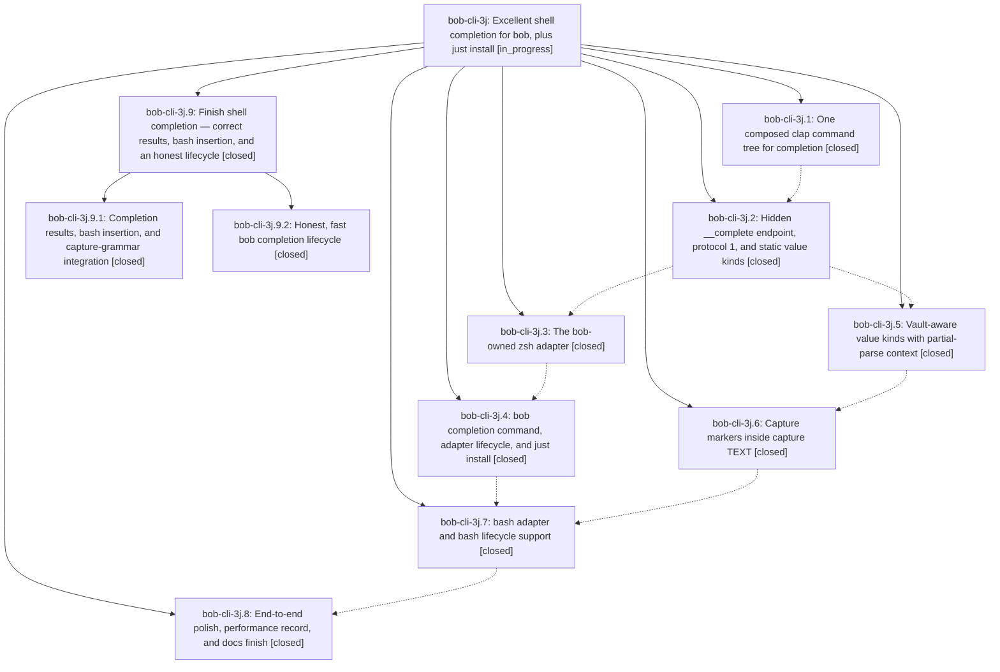

# Bead: bob-cli-3j — Excellent shell completion for bob, plus just install

[Bead Pages](../README.md) / bob-cli-3j

**Status:** ◐ in_progress · **Type:** ▸ plan · **Tier:** epic
**Owner:** `bryanbugyi34@gmail.com` · **Created by:** [bbugyi200.apollo.46](https://github.com/bobs-org/bob-cli--agents/blob/main/sessions/bbugyi200.apollo.46.md) · **Assignee:** `bob-cli-3j.land`
**Created:** 2026-10-02 11:06:15 EDT
**Plan:** [202610/bob\_shell\_completion.md](https://github.com/bobs-org/bob-cli--plans/blob/main/202610/bob_shell_completion.md)

## Description

Pressing TAB after `bob` in zsh (and bash) offers grouped, described, vault-aware completions computed live by the installed bob binary, so completion can never drift from the CLI; `bob completion` installs, inspects, and removes the shell adapter safely and honestly; and `just install` installs bob from source and keeps its shell completion current in one step.

## Notes

[2026-10-02T18:25:47Z · bob-cli-3j.land] LAND AUDIT (bob-cli-3j.land, master 81b45eb): Read all 8 closed phases and their notes, the plan, and the epic commits 71d57da b9a067d eafe65c ba48629 6b272e4 a9fc134 5a60bd8 81b45eb. cargo fmt --check is clean. cargo test is green (1522 lib + 810 cli + the integration binaries). clippy: the only error is the pre-existing pomodoro_name.rs:808 deny; the epic adds 1 warning (needless_option_as_deref, completion/verify.rs:257). No epic-symbol entries. INTEGRATION: the non-epic commits since the epic started are 74f47d4 (inline =x entry), 0791fb6 (task-block order) and f589d07 (=*/=! shorthands). Shell completion inherits 74f47d4 and f589d07 through the shared capture_language completion_field_at: '=x done @', '=*' and '=!' offer nothing, and '=x wired it =#' offers start names. 0791fb6 does not touch completion. The goldens and docs for these cases are planned. REMAINING EPIC WORK, all confirmed against the built binary, a real pty-driven interactive bash, and a sandboxed HOME: (1) body-bearing '<text> @route:' offers existing task IDs that then fail as duplicates, while capture-complete says intent new; (2) bash adapter: '=#' becomes '==#…', an open-quote word loses its text, values with spaces split, attached --opt= !files-in completes nothing; (3) ValueHints are ignored (completion install -t gets free text, completion zsh -o gets *.pdf), positional md-file slots are unreachable, stale capture-complete TEXT hint; (4) lifecycle: probes stall 8 s each under a controlling tty (status -v took 24 s, all timed out) because of process_group without setsid; status -v fails not-installed shells; $SHELL is ignored once any adapter is owned; a not-registered install shows ✓ and exits 0 against the plan; dry run prints 'Completion is live'; probe compinit -D hides stale dumps; unrecorded stamped files get adopted; plus missing plan-required tests. Planned as child epic plan shell_completion_landing_fixes (phases results, lifecycle). DECLINED as non-defects: the context.rs hand walker instead of ignore_errors (behaviour verified by the goldens); the docs transcripts being raw __complete output rather than zpty menus; the 89-line bash adapter versus the 40-70 guideline; engine Candidate having no tag field; vault.rs chmod scope; the ':' task-link group name.

[2026-10-02T18:25:54Z · bob-cli-3j.land] FOLLOW-UP TRIAGE: The only PROPOSED FOLLOW-UP, filed by bob-cli-3j.1/.2/.3/.5/.6/.7/.8, is the clippy deny overly_complex_bool_expr at tests/cli/capture/pomodoro_name.rs:808 ('|| true'). It predates this epic (7d1c8dd, 2026-09-28). /sase_new_task found that in-progress epic bob-cli-28 caused it and owns its closeout; bob-cli-v covers warnings only. Recorded as a DISCOVERED ISSUE corroboration note on bob-cli-28. No new task was created.

[2026-10-02T19:39:31Z · bob-cli-3j.9.land] LANDING BLOCKER after bob-cli-3j.9 (do not close yet): completion::zsh_adapter::default_styles_use_green_headers fails when the runner exports NO_COLOR=1. Reproduced 2026-10-02 on master 712d277: cargo test --test cli completion::zsh_adapter::default_styles_use_green_headers exits failed and the stub prints `format '── %d ──'` with no %B%F{green}. env -u NO_COLOR makes that same test pass. no_color_uses_plain_header passed in the NO_COLOR=1 run. Cause: _bob.zsh sets the plain header when NO_COLOR is set, and run_stubbed inherits the process environment. Neither _bob.zsh nor default_styles_use_green_headers was changed by 8f01f33 or 712d277. Fix: in that test's pre script, unset NO_COLOR before _bob, then re-run the completion cli tests. The rest of the 3j.9 recheck is in the child close note. Eight phases are closed, there are no --epic-symbol entries, and there are no non-epic commits after 81b45eb besides the child epic's own two commits.

## Phases

| Bead | Title | Status | Size | Created | Agents | Commits |
|---|---|---|---|---|---:|---:|
| [bob-cli-3j.1](bob-cli-3j.1.md) | One composed clap command tree for completion | ✓ closed | medium | 2026-10-02 | 1 | 1 |
| [bob-cli-3j.2](bob-cli-3j.2.md) | Hidden \_\_complete endpoint, protocol 1, and static value kinds | ✓ closed | medium | 2026-10-02 | 1 | 1 |
| [bob-cli-3j.3](bob-cli-3j.3.md) | The bob-owned zsh adapter | ✓ closed | medium | 2026-10-02 | 1 | 1 |
| [bob-cli-3j.4](bob-cli-3j.4.md) | bob completion command, adapter lifecycle, and just install | ✓ closed | medium | 2026-10-02 | 1 | 1 |
| [bob-cli-3j.5](bob-cli-3j.5.md) | Vault-aware value kinds with partial-parse context | ✓ closed | medium | 2026-10-02 | 1 | 1 |
| [bob-cli-3j.6](bob-cli-3j.6.md) | Capture markers inside capture TEXT | ✓ closed | medium | 2026-10-02 | 1 | 1 |
| [bob-cli-3j.7](bob-cli-3j.7.md) | bash adapter and bash lifecycle support | ✓ closed | medium | 2026-10-02 | 1 | 1 |
| [bob-cli-3j.8](bob-cli-3j.8.md) | End-to-end polish, performance record, and docs finish | ✓ closed | small | 2026-10-02 | 1 | 1 |

## Lineage

## Agents

| Agent | Bead | Commits |
|---|---|---:|
| [bbugyi200.apollo.bob-cli-3j.1](https://github.com/bobs-org/bob-cli--agents/blob/main/agents/bbugyi200.apollo.bob-cli-3j.1/README.md) | [bob-cli-3j.1](bob-cli-3j.1.md) | 1 |
| [bbugyi200.apollo.bob-cli-3j.2](https://github.com/bobs-org/bob-cli--agents/blob/main/agents/bbugyi200.apollo.bob-cli-3j.2/README.md) | [bob-cli-3j.2](bob-cli-3j.2.md) | 1 |
| [bbugyi200.apollo.bob-cli-3j.3](https://github.com/bobs-org/bob-cli--agents/blob/main/agents/bbugyi200.apollo.bob-cli-3j.3/README.md) | [bob-cli-3j.3](bob-cli-3j.3.md) | 1 |
| [bbugyi200.apollo.bob-cli-3j.4](https://github.com/bobs-org/bob-cli--agents/blob/main/agents/bbugyi200.apollo.bob-cli-3j.4/README.md) | [bob-cli-3j.4](bob-cli-3j.4.md) | 1 |
| [bbugyi200.apollo.bob-cli-3j.5](https://github.com/bobs-org/bob-cli--agents/blob/main/agents/bbugyi200.apollo.bob-cli-3j.5/README.md) | [bob-cli-3j.5](bob-cli-3j.5.md) | 1 |
| [bbugyi200.apollo.bob-cli-3j.6](https://github.com/bobs-org/bob-cli--agents/blob/main/agents/bbugyi200.apollo.bob-cli-3j.6/README.md) | [bob-cli-3j.6](bob-cli-3j.6.md) | 1 |
| [bbugyi200.apollo.bob-cli-3j.7](https://github.com/bobs-org/bob-cli--agents/blob/main/agents/bbugyi200.apollo.bob-cli-3j.7/README.md) | [bob-cli-3j.7](bob-cli-3j.7.md) | 1 |
| [bbugyi200.apollo.bob-cli-3j.8](https://github.com/bobs-org/bob-cli--agents/blob/main/agents/bbugyi200.apollo.bob-cli-3j.8/README.md) | [bob-cli-3j.8](bob-cli-3j.8.md) | 1 |
| [bbugyi200.apollo.bob-cli-3j.9.1](https://github.com/bobs-org/bob-cli--agents/blob/main/agents/bbugyi200.apollo.bob-cli-3j.9.1/README.md) | [bob-cli-3j.9.1](bob-cli-3j.9.1.md) | 1 |
| [bbugyi200.apollo.bob-cli-3j.9.2](https://github.com/bobs-org/bob-cli--agents/blob/main/agents/bbugyi200.apollo.bob-cli-3j.9.2/README.md) | [bob-cli-3j.9.2](bob-cli-3j.9.2.md) | 1 |
| [bbugyi200.apollo.bob-cli-3j.9.land](https://github.com/bobs-org/bob-cli--agents/blob/main/agents/bbugyi200.apollo.bob-cli-3j.9.land/README.md) | [bob-cli-3j.9](bob-cli-3j.9.md) | 1 |
| [bbugyi200.apollo.bob-cli-3j.land](https://github.com/bobs-org/bob-cli--agents/blob/main/sessions/bbugyi200.apollo.bob-cli-3j.land.md) | [bob-cli-3j](README.md) | 0 |

## Commits

| Repo | Commit | Subject | Bead | Committed |
|---|---|---|---|---|
| bob-cli | [`71d57da`](https://github.com/bobs-org/bob-cli/commit/71d57da42a940afaa6c3fe26fb4c59cbe5b82c5c) | feat(completion): land one-tree composed clap command tree for completion | [bob-cli-3j.1](bob-cli-3j.1.md) | 2026-10-02 11:26:18 EDT |
| bob-cli | [`b9a067d`](https://github.com/bobs-org/bob-cli/commit/b9a067da5c8a55ca5e153c6469df06fdc3c0efa2) | feat(completion): add native shell completion engine with protocol and presenter | [bob-cli-3j.2](bob-cli-3j.2.md) | 2026-10-02 11:59:11 EDT |
| bob-cli | [`eafe65c`](https://github.com/bobs-org/bob-cli/commit/eafe65c5ccbbb4e631704068ce20b0b69f276c10) | feat(completion): add vault value completion with context and providers | [bob-cli-3j.5](bob-cli-3j.5.md) | 2026-10-02 12:32:46 EDT |
| bob-cli | [`ba48629`](https://github.com/bobs-org/bob-cli/commit/ba48629f5d2d43d1e3f45c1d4d1ee104c2b0d4ad) | feat(completion): land bob-owned zsh adapter with stubbed-compsys and real-zpty tests | [bob-cli-3j.3](bob-cli-3j.3.md) | 2026-10-02 12:44:08 EDT |
| bob-cli | [`6b272e4`](https://github.com/bobs-org/bob-cli/commit/6b272e4af604242aa2dad2148ff20cf18a455b5b) | feat(completion): complete capture markers inside capture TEXT | [bob-cli-3j.6](bob-cli-3j.6.md) | 2026-10-02 13:09:58 EDT |
| bob-cli | [`a9fc134`](https://github.com/bobs-org/bob-cli/commit/a9fc13454ce9a6bbe0644d3be79385e0a87a9939) | feat(completion): land bob completion command, adapter lifecycle, and just install | [bob-cli-3j.4](bob-cli-3j.4.md) | 2026-10-02 13:23:37 EDT |
| bob-cli | [`5a60bd8`](https://github.com/bobs-org/bob-cli/commit/5a60bd8f7e91c94838166f8823155b22e8deab27) | feat(completion): add bash adapter and bash lifecycle support | [bob-cli-3j.7](bob-cli-3j.7.md) | 2026-10-02 13:51:29 EDT |
| bob-cli | [`81b45eb`](https://github.com/bobs-org/bob-cli/commit/81b45eb9a1a653b9a217625603fb60919abfca7a) | docs(completion): finish live transcripts, performance section; fix subcommand order | [bob-cli-3j.8](bob-cli-3j.8.md) | 2026-10-02 14:02:48 EDT |
| bob-cli | [`8f01f33`](https://github.com/bobs-org/bob-cli/commit/8f01f331c4f81d3f2c0a1866b82f9ed161a377ef) | feat(completion): bounded probes, probe-free status, and lifecycle polish | [bob-cli-3j.9.2](bob-cli-3j.9.2.md) | 2026-10-02 15:16:32 EDT |
| bob-cli | [`712d277`](https://github.com/bobs-org/bob-cli/commit/712d27773fcb4b207887a3b7f332766d2e5f60e8) | feat(completion): body-bearing @route, TEXT hints, ValueHints, positional slots, bash adapter | [bob-cli-3j.9.1](bob-cli-3j.9.1.md) | 2026-10-02 15:25:26 EDT |
| bob-cli--plans | [`bob-cli--plans@2517d71`](https://github.com/bobs-org/bob-cli--plans/commit/2517d712c79cacc372160cb3b8537d0606910c27) | docs(plan): mark shell completion landing fixes done | [bob-cli-3j.9](bob-cli-3j.9.md) | 2026-10-02 15:40:59 EDT |
