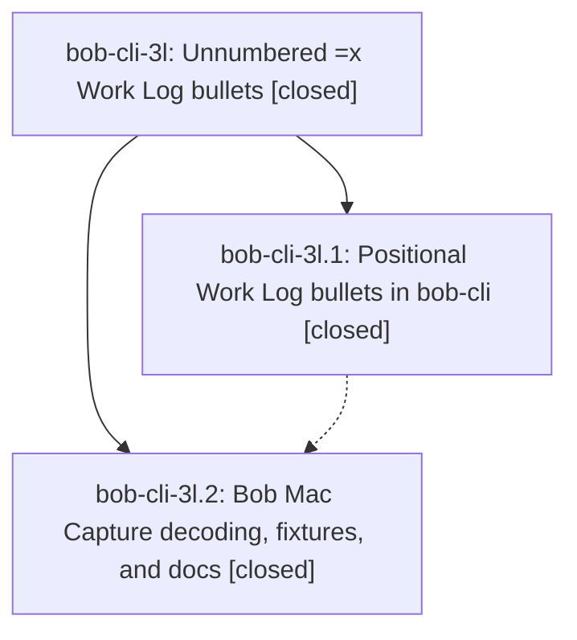

# Bead: bob-cli-3l — Unnumbered =x Work Log bullets

[Bead Pages](../README.md) / bob-cli-3l

**Status:** ✓ closed · **Resolution:** done · **Type:** ▸ plan · **Tier:** epic
**Owner:** `bryanbugyi34@gmail.com` · **Created by:** [bbugyi200.apollo.47](https://github.com/bobs-org/bob-cli--agents/blob/main/sessions/bbugyi200.apollo.47.md) · **Assignee:** `bob-cli-3l.land`
**Created:** 2026-10-02 15:17:48 EDT · **Closed:** 2026-10-02 16:17:36 EDT
**Plan:** [202610/unnumbered\_close\_log\_bullets.md](https://github.com/bobs-org/bob-cli--plans/blob/main/202610/unnumbered_close_log_bullets.md)

## Description

Work Log bullets under a whole-item `=x` close need a leading task number only when bullet order cannot say which task each bullet logs to. `=x3,4` plus `- foo bar` and `- baz bam` writes exactly what `- 3 foo bar` and `- 4 baz bam` write, and `bob capture`, `bob capture-parse`, dry-run previews, and Bob Mac Capture all agree on that.

## Notes

[2026-10-02T20:08:30Z · bob-cli-3l.land] FOLLOW-UP TRIAGE: Read every child note. The sole PROPOSED FOLLOW-UP (bob-cli-3l.1 note #1, just lint failing with overly_complex_bool_expr at pomodoro_name.rs:808) is pre-existing and caused by active epic bob-cli-28; independently reproduced with all-target Clippy on 923adb8 and recorded a DISCOVERED ISSUE note on bob-cli-28. Declined a new task or +1 to bob-cli-v because v tracks warnings, not this deny. Separately reproduced missing just check (and absent symvision recipe); /sase_new_task found semantic duplicate bob-cli-3c, added independent +1, no new task. Mac CI for bob-cli-3l.2 commit 68ed00d passed formatting and production build but test compilation failed on unchanged testCloseAliasPreviewSubmitsUntouchedDraft using nonexistent CapturePreviewState.pending (line 2024, blame aa1e73a8 before epic creation). No semantic duplicate or causally related active epic: filed small CI task bob-cli-3m with evidence file:explicit:52cc64d1d2d6cc9d625ac888 and marked ready. This is distinct from closed Linux termination task bob-cli-1u. The positional-origin defect caused by bob-cli-3l is remaining epic work, not a follow-up task.

[2026-10-02T20:08:34Z · bob-cli-3l.land] LAND AUDIT: Read epic scope (no previous epic notes), all notes on closed phases bob-cli-3l.1/.2, and approved plan plan:202610/unnumbered_close_log_bullets.md. Inspected bob-cli commit 923adb8 and Mac commit 68ed00d, shared lexer/model/editor/execution paths, resolved summary/write_logs, acceptance tests, CLI help/docs, Mac decoder/presentation/panel tests/fake-bob/README. cargo fmt --check passed; all 1535 lib tests and 416 capture CLI tests passed. Three real parse fixtures exactly match the built bob and fake-bob dispatch; positional preview fixture has resolved log indices 1/2 and correct typed_work_log per row. INTEGRATION: after epic creation 2026-10-02T19:17:48Z, non-epic bob-cli commit 712d277 (shell completion fixes) precedes 923adb8 and is included; none follows the first epic commit. Master and fetched origin/master agree. Mac has no non-epic commit since epic creation or after 68ed00d, and fetched origin/master agrees. Bash/zsh __complete probes for unnumbered bullet text ending in @, =#, or ^ return no candidates, confirming shared-parser suppression integrates with 712d277. No duplicate or conflicting integration code needs changing. REMAINING EPIC WORK: close_log.rs log_entries_from_lex classifies origin using entry.index; selection-mode unnumbered bullets already have Some(index), so they incorrectly become Bullet. A real dry-run on CAPTURE with top-level task 1 and nested task 2, draft =x1,2 followed by - a / - b, returns generic nested-task wording instead of required Work Log bullet 2 logs to task 2 by its position. Existing nested-wording test hand-constructs the correct origin and misses this path. Repair using index_range/authored numbering and add real parser-to-runtime coverage. No epic-symbol entries. Parent-link reread confirms no parent_bead. A small tale will fix only this gap and perform the epic closeout in its own turn.

[2026-10-02T20:11:25Z · bob-cli-3l.land] Remaining-work tale scope also includes the approved positional-error batch-rollback coverage: the new positional runtime test submits only one close despite its comment, while the existing genuine multi-item rollback test exercises a numbered lexical error. The tale will cover an earlier valid resize followed by a positional runtime failure and verify unchanged day/task files. Validation and integration audit otherwise remain as recorded. Follow-up triage is complete before proposal.

[2026-10-02T20:17:36Z · bob-cli-3l.land] Closeout: phases bob-cli-3l.1 and bob-cli-3l.2 verified still closed; linked plan plan:202610/unnumbered_close_log_bullets.md unchanged. Commits: bob-cli 923adb8 plus this turn's positional-origin fix; Mac 68ed00d unchanged. Integration rechecked: master == origin/master == 923adb8, no non-epic commits since the audit. Fix: log_entries_from_lex now keys origin on index_range (authored numbering), so selection-mode unnumbered bullets (index Some, no range) get PositionalBullet with the 1-based typed ordinal; numbered Bullet behavior, index resolution, serialized JSON, and inline origins intact. Regression: extended positional_entries_carry_their_typed_position (lexically resolved selection-mode + unresolved plain =x + numbered controls) and added CLI capture_pomodoro_close_log_positional_nested_wording (parses =x1,2 unnumbered draft with resolved indices, executes against a nested-link vault asserting 'Work Log bullet 2 logs to task 2 by its position...', plus a genuine +1 resize batch rollback asserting day and task files byte-identical); both fail under the old index-based conversion and pass with the fix. Validation: cargo fmt clean, 1535 lib tests and 417 capture CLI tests pass (incl. numbered-vs-unnumbered acceptance); clippy deny-level error is only the pre-existing pomodoro_name.rs:808 overly_complex_bool_expr from bob-cli-28, no new diagnostics in changed files. Follow-ups already triaged, repeated: (1) bob-cli-3l.1 note 1 Clippy error is bob-cli-28's, DISCOVERED ISSUE corroboration added there, no new task; (2) missing just check / absent symvision duplicates bob-cli-3c, +1 added, no new task; (3) Mac shorthand test failure is pre-existing aa1e73a8, filed ready CI task bob-cli-3m, distinct from bob-cli-1u; (4) inline default when task 1 deferred/nested is an explicit non-goal, no follow-up.

## Phases

| Bead | Title | Status | Size | Created | Agents | Commits |
|---|---|---|---|---|---:|---:|
| [bob-cli-3l.1](bob-cli-3l.1.md) | Positional Work Log bullets in bob-cli | ✓ closed | medium | 2026-10-02 | 1 | 1 |
| [bob-cli-3l.2](bob-cli-3l.2.md) | Bob Mac Capture decoding, fixtures, and docs | ✓ closed | small | 2026-10-02 | 1 | 0 |

## Lineage

## Agents

| Agent | Bead | Commits |
|---|---|---:|
| [bbugyi200.apollo.bob-cli-3l.1](https://github.com/bobs-org/bob-cli--agents/blob/main/agents/bbugyi200.apollo.bob-cli-3l.1/README.md) | [bob-cli-3l.1](bob-cli-3l.1.md) | 1 |
| [bbugyi200.apollo.bob-cli-3l.2](https://github.com/bobs-org/bob-cli--agents/blob/main/agents/bbugyi200.apollo.bob-cli-3l.2/README.md) | [bob-cli-3l.2](bob-cli-3l.2.md) | 0 |
| [bbugyi200.apollo.bob-cli-3l.land](https://github.com/bobs-org/bob-cli--agents/blob/main/sessions/bbugyi200.apollo.bob-cli-3l.land.md) | [bob-cli-3l](README.md) | 2 |

## Commits

| Repo | Commit | Subject | Bead | Committed |
|---|---|---|---|---|
| bob-cli | [`923adb8`](https://github.com/bobs-org/bob-cli/commit/923adb8a7e70a233d2910ef9658405fe5db064d9) | feat(capture): accept unnumbered =x Work Log bullets resolved positionally | [bob-cli-3l.1](bob-cli-3l.1.md) | 2026-10-02 15:46:58 EDT |
| bob-cli | [`a5224a3`](https://github.com/bobs-org/bob-cli/commit/a5224a3a54ad7f491c7b49530d91355ca2117bbd) | fix(capture): preserve positional Work Log origins for selection-mode unnumbered bullets | [bob-cli-3l](README.md) | 2026-10-02 16:19:01 EDT |
| bob-cli--plans | [`bob-cli--plans@da1e123`](https://github.com/bobs-org/bob-cli--plans/commit/da1e1231df2df6f311eb304a1e8a9367bafc9187) | docs(plans): mark unnumbered close log bullets plan done | [bob-cli-3l](README.md) | 2026-10-02 16:19:27 EDT |
