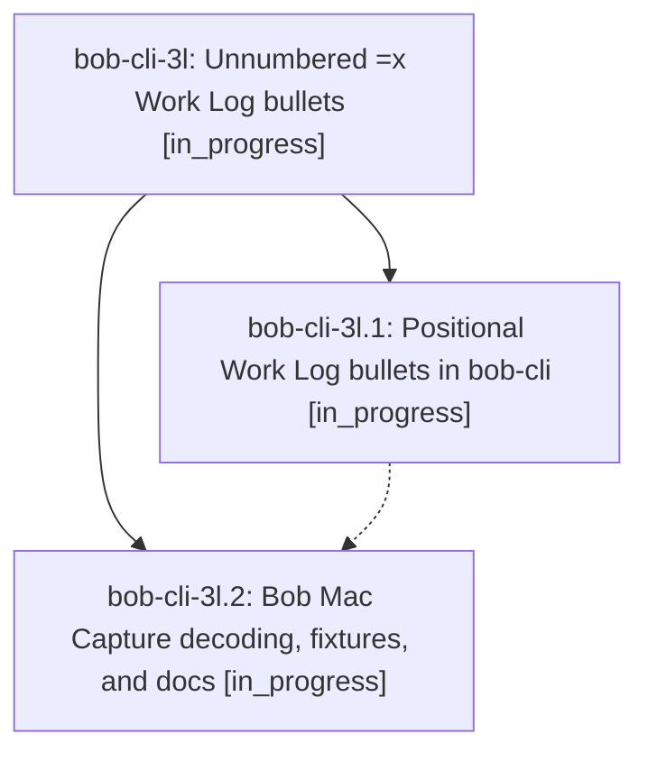

# Bead: bob-cli-3l — Unnumbered =x Work Log bullets

[Bead Pages](../README.md) / bob-cli-3l

**Status:** ◐ in_progress · **Type:** ▸ plan · **Tier:** epic
**Owner:** `bryanbugyi34@gmail.com` · **Created by:** [bbugyi200.apollo.47](https://github.com/bobs-org/bob-cli--agents/blob/main/sessions/bbugyi200.apollo.47.md) · **Assignee:** `bob-cli-3l.land`
**Created:** 2026-10-02 15:17:48 EDT
**Plan:** [202610/unnumbered\_close\_log\_bullets.md](https://github.com/bobs-org/bob-cli--plans/blob/main/202610/unnumbered_close_log_bullets.md)

## Description

Work Log bullets under a whole-item `=x` close need a leading task number only when bullet order cannot say which task each bullet logs to. `=x3,4` plus `- foo bar` and `- baz bam` writes exactly what `- 3 foo bar` and `- 4 baz bam` write, and `bob capture`, `bob capture-parse`, dry-run previews, and Bob Mac Capture all agree on that.

## Phases

| Bead | Title | Status | Size | Created | Agents | Commits |
|---|---|---|---|---|---:|---:|
| [bob-cli-3l.1](bob-cli-3l.1.md) | Positional Work Log bullets in bob-cli | ◐ in_progress | medium | 2026-10-02 | 1 | 1 |
| [bob-cli-3l.2](bob-cli-3l.2.md) | Bob Mac Capture decoding, fixtures, and docs | ◐ in_progress | small | 2026-10-02 | 1 | 0 |

## Lineage

## Agents

| Agent | Bead | Commits |
|---|---|---:|
| [bbugyi200.apollo.bob-cli-3l.1](https://github.com/bobs-org/bob-cli--agents/blob/main/agents/bbugyi200.apollo.bob-cli-3l.1/README.md) | [bob-cli-3l.1](bob-cli-3l.1.md) | 1 |
| [bbugyi200.apollo.bob-cli-3l.2](https://github.com/bobs-org/bob-cli--agents/blob/main/agents/bbugyi200.apollo.bob-cli-3l.2/README.md) | [bob-cli-3l.2](bob-cli-3l.2.md) | 0 |
| [bbugyi200.apollo.bob-cli-3l.land](https://github.com/bobs-org/bob-cli--agents/blob/main/agents/bbugyi200.apollo.bob-cli-3l.land/README.md) | [bob-cli-3l](README.md) | 0 |

## Commits

| Repo | Commit | Subject | Bead | Committed |
|---|---|---|---|---|
| bob-cli | [`923adb8`](https://github.com/bobs-org/bob-cli/commit/923adb8a7e70a233d2910ef9658405fe5db064d9) | feat(capture): accept unnumbered =x Work Log bullets resolved positionally | [bob-cli-3l.1](bob-cli-3l.1.md) | 2026-10-02 15:46:58 EDT |
