# Bead: bob-cli-3n — Task dependency links: one Depends-On line, a vault-wide Ctrl+Shift+P picker, and live chips

[Bead Pages](../README.md) / bob-cli-3n

**Status:** ◐ in_progress · **Type:** ▸ plan · **Tier:** epic
**Owner:** `bryanbugyi34@gmail.com` · **Created by:** [bbugyi200.athena.0vl](https://github.com/bobs-org/bob-cli--agents/blob/main/sessions/bbugyi200.athena.0vl.md) · **Assignee:** `bob-cli-3n.land`
**Created:** 2026-10-02 16:54:34 EDT
**Plan:** [202610/task\_dep\_links.md](https://github.com/bobs-org/bob-cli--plans/blob/main/202610/task_dep_links.md)

## Description

A task's prerequisites live as plain task dependency links on one managed `⛓️ **DEPENDS ON:**` first-child line. That line is the source of truth, and the `[dependsOn::]` / `[id::]` fields are derived from it. Ctrl+Shift+P adds and removes prerequisites by fuzzy-searching every open task in the vault. bob-ledger-tools draws each link as a live status chip. The vault no longer uses transcluded dependency bullets. The glossary, docs, and decision records describe the new contract.

## Notes

[2026-10-03T03:18:34Z · bob-cli-3n.land] LAND TRIAGE (bob-cli-3n.land, 2026-10-02): PROPOSED FOLLOW-UP outcomes. (1) 3n.1 research cross-check: RESOLVED by lander - opened research sidecar, sase artifact read of the report now succeeds; ADJ-1..ADJ-10 are all reflected in docs/task-dependencies.md (fields derived, wrap, chips-first rollout, #^ref not edges, ! pure toggle, pool exclusions incl _conflicts/#hide muted, entry points, immediate removal recovery, unencodable disabled with reason, glossary/decision); remaining gaps are implementation, not contract. (2) 3n.3 capture_pomodoros parallel flake: pre-existing, not epic -> duplicate of bob-cli-2e, +1 recorded (also noted note_ready::scan_excludes_r3_and_r7_paths). (3) 3n.7 same-note marked-batch +id target-not-found: CAUSED BY EPIC (regression from 5194bc8), confirmed still present -> remaining epic work. (4) 3n.8 land-before-fleet-rollout: RESOLVED - 3n.9 recorded nav 1.55.0 synced on athena and apollo; declined. (5) 3n.11 #1 retire R8 legacy readers after a week of zero legacy -> new task bob-cli-3o (feature, medium, snoozed to 2026-10-12, time-gated). (6) 3n.11 #2 reverse Blocks stage -> new task bob-cli-3p (feature, large). (7) 3n.11 #3 task-line mini-badge -> new task bob-cli-3q (feature, medium). (8) 3n.11 #4 v2 path codec (ADJ-9) -> new task bob-cli-3r (feature, large). (9) 3n.11 #5 migrate-task-dependency-identities.mjs + test + README section still shipped: CAUSED BY EPIC (nav-gestures step 4/6 unfinished) -> remaining epic work. (10) 3n.9/3n.10 MacBook unreachable: operational, left for Bryan, but see WARNING note. Artifact related-links to bob-cli-3n could not be added (artifact-link event store invalid: operation_id reused - pre-existing store problem); task descriptions cite bob-cli-3n instead.

[2026-10-03T03:18:51Z · bob-cli-3n.land] LAND VERIFICATION (bob-cli-3n.land): epic NOT complete. just all green (1556 lib + 851 cli) and bob-plugins npm test 1291/1291 + validate 6/6, but the tests miss real epic-caused defects. Reproduced by lander in a scratch vault with the f21e856 build: (a) reconcile.rs ReconcileWorker::apply sorts edits (line, kind) then reverses, so an Insert and a Replace at the same index apply Insert-then-Replace: field-only A followed by task B needing an [id::] stamp -> A's adopted Depends-On line is lost and task ^b is DUPLICATED in one run; (b) set_task_fields stops at trailing tags: '[dependsOn:: other__x] #hide ^d' gains a second [dependsOn::] after #hide and D is never Blocked. Source-confirmed: nav applyDependencyEditTransaction is synchronous but prepareDependencyTargetNote is async, so every cross-note add needing target preparation fails 'target-preparation-failed' while the prep still writes in the background; chips send api ref.line 1-based (lineNumber+1) while nav reads 0-based, so chip x/+ act on the task below. Verifier agents also found: reconcile drops current-daily edits, can write the previous daily, target-stamp/own-field overwrite; nav planner fails on links to unloaded notes, basename uniqueness checked only against loaded notes, same-note +id batch, partial ADJ-8 recovery, counted vault top-down line shift; hand-edit mirror wired to editor-change (no change ranges -> edited line always 0, can clear the wrong task), no IME/modal guard, no status effects, stamps freshness; field-only Ctrl+D no recovery; Reading-view chips decorate the parent task li; leftover legacy writers/identity migration script; stage layout/ranker deviations; decision record missing a rejected alternative and wrong decided date; docs/projects.md, docs/freshness.md, docs/capture.md stale. Drift since epic start (bob-cli 664e01c, 21ebf8e; bob-plugins 67cc029, 6f67cd2): no conflict with the dependency model (scheduled-first row runs before the dep pill; scheduling Work Log prompt never fires from dependency writes and appends after the Depends-On line); only stale docs/projects.md dependency examples need updating. Remaining work planned as a child epic.

[2026-10-03T03:18:54Z · bob-cli-3n.land] WARNING FOR BRYAN: do NOT yet run the 3n.9/3n.10 'LEFT FOR BRYAN' MacBook update (cargo install from master). The Mac cron is the only live hooks runner; installing bob at 043d9c5/f21e856 there would start the R1-R10 reconcile with the reproduced note-corrupting edit-ordering bug (duplicated task lines) every 15 minutes. Wait for the remaining-work child epic's hooks fix and rollout phase. Deployed plugins (nav 1.55.0, ledger-tools 1.18.0) carry the chip x/+ off-by-one and the broken hand-edit mirror until the child epic's plugin phases deploy fixes.

## Phases

| Bead | Title | Status | Size | Created | Agents | Commits |
|---|---|---|---|---|---:|---:|
| [bob-cli-3n.1](bob-cli-3n.1.md) | Dependency-line contract doc and conformance vectors | ✓ closed | medium | 2026-10-02 | 1 | 1 |
| [bob-cli-3n.10](bob-cli-3n.10.md) | Migrate the vault to Depends-On lines | ✓ closed | medium | 2026-10-02 | 1 | 0 |
| [bob-cli-3n.11](bob-cli-3n.11.md) | Publish glossary, decision record, and final docs | ✓ closed | small | 2026-10-02 | 1 | 1 |
| [bob-cli-3n.2](bob-cli-3n.2.md) | Rust dependency-line parser, promotion edges, and parser guards | ✓ closed | medium | 2026-10-02 | 1 | 1 |
| [bob-cli-3n.3](bob-cli-3n.3.md) | R1-R10 reconciliation in bob task-status-hooks | ✓ closed | medium | 2026-10-02 | 1 | 1 |
| [bob-cli-3n.4](bob-cli-3n.4.md) | bob-ledger-tools live dependency chips | ✓ closed | medium | 2026-10-02 | 1 | 0 |
| [bob-cli-3n.5](bob-cli-3n.5.md) | task-status-cycler and block-id-prompt compatibility | ✓ closed | medium | 2026-10-02 | 1 | 0 |
| [bob-cli-3n.6](bob-cli-3n.6.md) | Navigation-hotkeys dependency model, single-transaction writer, and api v1 | ✓ closed | medium | 2026-10-02 | 1 | 0 |
| [bob-cli-3n.7](bob-cli-3n.7.md) | Vault-wide Ctrl+Shift+P Depends on stage | ✓ closed | medium | 2026-10-02 | 1 | 0 |
| [bob-cli-3n.8](bob-cli-3n.8.md) | Gesture cleanup, hand-edit mirror, and legacy writer removal | ✓ closed | medium | 2026-10-02 | 1 | 0 |
| [bob-cli-3n.9](bob-cli-3n.9.md) | Install bob and sync plugins on every machine | ✓ closed | small | 2026-10-02 | 1 | 0 |

## Lineage

```mermaid
flowchart TD
    n0["bob-cli-3n: Task dependency links: one Depends-On line, a vault-wide Ctrl+Shift+P picker, and live chips [in_progress]"]
    n1["bob-cli-3n.1: Dependency-line contract doc and conformance vectors [closed]"]
    n2["bob-cli-3n.10: Migrate the vault to Depends-On lines [closed]"]
    n3["bob-cli-3n.11: Publish glossary, decision record, and final docs [closed]"]
    n4["bob-cli-3n.12: Finish task dependency links: fix the hooks reconcile, chips, nav writer, mirror, and stage defects found at landing [in_progress]"]
    n5["bob-cli-3n.12.1: Fix R1-R10 reconcile correctness bugs in bob task-status-hooks [closed]"]
    n6["bob-cli-3n.12.2: Hooks dependency docs, Summary line, helper dedupe, and reconcile split [closed]"]
    n7["bob-cli-3n.12.3: Fix dependency chips and align the Depends-On recognisers [closed]"]
    n8["bob-cli-3n.12.4: Fix the navigation-hotkeys dependency writer across notes [closed]"]
    n9["bob-cli-3n.12.5: Rebuild the hand-edit mirror and finish gesture cleanup and legacy removal [closed]"]
    n10["bob-cli-3n.12.6: Bring the Depends on stage to its design [closed]"]
    n11["bob-cli-3n.12.7: Correct the decision record and sweep stale dependency docs [closed]"]
    n12["bob-cli-3n.12.8: Reinstall bob and resync plugins across the fleet with the fixes [closed]"]
    n13["bob-cli-3n.12.9: Land task dependency link fixes: nav writer and mirror bugs, Reading-view chips, DP29, hooks test gaps, rollout [in_progress]"]
    n14["bob-cli-3n.12.9.1: Reading-view chips, recogniser alignment, and the DP29/DP30 contract [closed]"]
    n15["bob-cli-3n.12.9.2: Fix the nav dependency writer bugs the landing audit confirmed [closed]"]
    n16["bob-cli-3n.12.9.3: Finish the hand-edit mirror baseline and the Depends on stage [closed]"]
    n17["bob-cli-3n.12.9.4: Close the hooks DW, DP, Summary, docs, and per-run copy gaps [closed]"]
    n18["bob-cli-3n.12.9.5: Reinstall bob and resync plugins across the fleet with the landing fixes [closed]"]
    n19["bob-cli-3n.12.9.6: Finish the task dependency landing fixes: nav regressions, mirror owner, stage badge, DP30 chips, Reading-view line, R9 hooks, rollout [in_progress]"]
    n20["bob-cli-3n.12.9.6.1: Fix the nav writer regressions and finish its missing tests [in_progress]"]
    n21["bob-cli-3n.12.9.6.2: Fix the mirror owner lookup, the waits-on badge, and the remaining stale refusals [in_progress]"]
    n22["bob-cli-3n.12.9.6.3: Render chips on DP30, pick the right Reading-view row, and finish the DP tables [in_progress]"]
    n23["bob-cli-3n.12.9.6.4: Apply R9 to label-only lines in the hooks and bring the touched files under size [closed]"]
    n24["bob-cli-3n.12.9.6.5: Reinstall bob and resync the plugins with the remaining fixes [in_progress]"]
    n25["bob-cli-3n.2: Rust dependency-line parser, promotion edges, and parser guards [closed]"]
    n26["bob-cli-3n.3: R1-R10 reconciliation in bob task-status-hooks [closed]"]
    n27["bob-cli-3n.4: bob-ledger-tools live dependency chips [closed]"]
    n28["bob-cli-3n.5: task-status-cycler and block-id-prompt compatibility [closed]"]
    n29["bob-cli-3n.6: Navigation-hotkeys dependency model, single-transaction writer, and api v1 [closed]"]
    n30["bob-cli-3n.7: Vault-wide Ctrl+Shift+P Depends on stage [closed]"]
    n31["bob-cli-3n.8: Gesture cleanup, hand-edit mirror, and legacy writer removal [closed]"]
    n32["bob-cli-3n.9: Install bob and sync plugins on every machine [closed]"]
    n0 --> n1
    n0 --> n2
    n0 --> n3
    n0 --> n4
    n4 --> n5
    n4 --> n6
    n4 --> n7
    n4 --> n8
    n4 --> n9
    n4 --> n10
    n4 --> n11
    n4 --> n12
    n4 --> n13
    n13 --> n14
    n13 --> n15
    n13 --> n16
    n13 --> n17
    n13 --> n18
    n13 --> n19
    n19 --> n20
    n19 --> n21
    n19 --> n22
    n19 --> n23
    n19 --> n24
    n0 --> n25
    n0 --> n26
    n0 --> n27
    n0 --> n28
    n0 --> n29
    n0 --> n30
    n0 --> n31
    n0 --> n32
    n1 -.-> n25
    n1 -.-> n27
    n1 -.-> n28
    n1 -.-> n29
    n2 -.-> n3
    n5 -.-> n6
    n6 -.-> n11
    n6 -.-> n12
    n7 -.-> n11
    n7 -.-> n12
    n8 -.-> n9
    n9 -.-> n10
    n10 -.-> n11
    n10 -.-> n12
    n14 -.-> n18
    n15 -.-> n16
    n15 -.-> n18
    n16 -.-> n18
    n17 -.-> n18
    n20 -.-> n21
    n20 -.-> n24
    n21 -.-> n24
    n22 -.-> n24
    n23 -.-> n24
    n25 -.-> n26
    n26 -.-> n32
    n27 -.-> n29
    n27 -.-> n32
    n28 -.-> n29
    n28 -.-> n32
    n29 -.-> n30
    n30 -.-> n31
    n30 -.-> n32
    n31 -.-> n32
    n32 -.-> n2
```

## Agents

| Agent | Bead | Commits |
|---|---|---:|
| [bbugyi200.athena.bob-cli-3n.1](https://github.com/bobs-org/bob-cli--agents/blob/main/agents/bbugyi200.athena.bob-cli-3n.1/README.md) | [bob-cli-3n.1](bob-cli-3n.1.md) | 1 |
| [bbugyi200.athena.bob-cli-3n.10](https://github.com/bobs-org/bob-cli--agents/blob/main/agents/bbugyi200.athena.bob-cli-3n.10/README.md) | [bob-cli-3n.10](bob-cli-3n.10.md) | 0 |
| [bbugyi200.athena.bob-cli-3n.11](https://github.com/bobs-org/bob-cli--agents/blob/main/agents/bbugyi200.athena.bob-cli-3n.11/README.md) | [bob-cli-3n.11](bob-cli-3n.11.md) | 1 |
| [bbugyi200.athena.bob-cli-3n.12.1](https://github.com/bobs-org/bob-cli--agents/blob/main/agents/bbugyi200.athena.bob-cli-3n.12.1/README.md) | [bob-cli-3n.12.1](bob-cli-3n.12.1.md) | 1 |
| [bbugyi200.athena.bob-cli-3n.12.2](https://github.com/bobs-org/bob-cli--agents/blob/main/agents/bbugyi200.athena.bob-cli-3n.12.2/README.md) | [bob-cli-3n.12.2](bob-cli-3n.12.2.md) | 1 |
| [bbugyi200.athena.bob-cli-3n.12.3](https://github.com/bobs-org/bob-cli--agents/blob/main/agents/bbugyi200.athena.bob-cli-3n.12.3/README.md) | [bob-cli-3n.12.3](bob-cli-3n.12.3.md) | 1 |
| [bbugyi200.athena.bob-cli-3n.12.4](https://github.com/bobs-org/bob-cli--agents/blob/main/agents/bbugyi200.athena.bob-cli-3n.12.4/README.md) | [bob-cli-3n.12.4](bob-cli-3n.12.4.md) | 1 |
| [bbugyi200.athena.bob-cli-3n.12.5](https://github.com/bobs-org/bob-cli--agents/blob/main/agents/bbugyi200.athena.bob-cli-3n.12.5/README.md) | [bob-cli-3n.12.5](bob-cli-3n.12.5.md) | 0 |
| [bbugyi200.athena.bob-cli-3n.12.6](https://github.com/bobs-org/bob-cli--agents/blob/main/agents/bbugyi200.athena.bob-cli-3n.12.6/README.md) | [bob-cli-3n.12.6](bob-cli-3n.12.6.md) | 0 |
| [bbugyi200.athena.bob-cli-3n.12.7](https://github.com/bobs-org/bob-cli--agents/blob/main/agents/bbugyi200.athena.bob-cli-3n.12.7/README.md) | [bob-cli-3n.12.7](bob-cli-3n.12.7.md) | 1 |
| [bbugyi200.athena.bob-cli-3n.12.8](https://github.com/bobs-org/bob-cli--agents/blob/main/agents/bbugyi200.athena.bob-cli-3n.12.8/README.md) | [bob-cli-3n.12.8](bob-cli-3n.12.8.md) | 0 |
| [bbugyi200.athena.bob-cli-3n.12.9.1](https://github.com/bobs-org/bob-cli--agents/blob/main/agents/bbugyi200.athena.bob-cli-3n.12.9.1/README.md) | [bob-cli-3n.12.9.1](bob-cli-3n.12.9.1.md) | 1 |
| [bbugyi200.athena.bob-cli-3n.12.9.2](https://github.com/bobs-org/bob-cli--agents/blob/main/sessions/bbugyi200.athena.bob-cli-3n.12.9.2.md) | [bob-cli-3n.12.9.2](bob-cli-3n.12.9.2.md) | 0 |
| [bbugyi200.athena.bob-cli-3n.12.9.3](https://github.com/bobs-org/bob-cli--agents/blob/main/agents/bbugyi200.athena.bob-cli-3n.12.9.3/README.md) | [bob-cli-3n.12.9.3](bob-cli-3n.12.9.3.md) | 0 |
| [bbugyi200.athena.bob-cli-3n.12.9.4](https://github.com/bobs-org/bob-cli--agents/blob/main/agents/bbugyi200.athena.bob-cli-3n.12.9.4/README.md) | [bob-cli-3n.12.9.4](bob-cli-3n.12.9.4.md) | 1 |
| [bbugyi200.athena.bob-cli-3n.12.9.5](https://github.com/bobs-org/bob-cli--agents/blob/main/sessions/bbugyi200.athena.bob-cli-3n.12.9.5.md) | [bob-cli-3n.12.9.5](bob-cli-3n.12.9.5.md) | 0 |
| [bbugyi200.athena.bob-cli-3n.12.9.6.1](https://github.com/bobs-org/bob-cli--agents/blob/main/agents/bbugyi200.athena.bob-cli-3n.12.9.6.1/README.md) | [bob-cli-3n.12.9.6.1](bob-cli-3n.12.9.6.1.md) | 0 |
| [bbugyi200.athena.bob-cli-3n.12.9.6.2](https://github.com/bobs-org/bob-cli--agents/blob/main/agents/bbugyi200.athena.bob-cli-3n.12.9.6.2/README.md) | [bob-cli-3n.12.9.6.2](bob-cli-3n.12.9.6.2.md) | 0 |
| [bbugyi200.athena.bob-cli-3n.12.9.6.3](https://github.com/bobs-org/bob-cli--agents/blob/main/agents/bbugyi200.athena.bob-cli-3n.12.9.6.3/README.md) | [bob-cli-3n.12.9.6.3](bob-cli-3n.12.9.6.3.md) | 0 |
| [bbugyi200.athena.bob-cli-3n.12.9.6.4](https://github.com/bobs-org/bob-cli--agents/blob/main/agents/bbugyi200.athena.bob-cli-3n.12.9.6.4/README.md) | [bob-cli-3n.12.9.6.4](bob-cli-3n.12.9.6.4.md) | 1 |
| [bbugyi200.athena.bob-cli-3n.12.9.6.5](https://github.com/bobs-org/bob-cli--agents/blob/main/agents/bbugyi200.athena.bob-cli-3n.12.9.6.5/README.md) | [bob-cli-3n.12.9.6.5](bob-cli-3n.12.9.6.5.md) | 0 |
| [bbugyi200.athena.bob-cli-3n.12.9.6.land](https://github.com/bobs-org/bob-cli--agents/blob/main/agents/bbugyi200.athena.bob-cli-3n.12.9.6.land/README.md) | [bob-cli-3n.12.9.6](bob-cli-3n.12.9.6.md) | 0 |
| [bbugyi200.athena.bob-cli-3n.12.9.land](https://github.com/bobs-org/bob-cli--agents/blob/main/sessions/bbugyi200.athena.bob-cli-3n.12.9.land.md) | [bob-cli-3n.12.9](bob-cli-3n.12.9.md) | 0 |
| [bbugyi200.athena.bob-cli-3n.12.land](https://github.com/bobs-org/bob-cli--agents/blob/main/sessions/bbugyi200.athena.bob-cli-3n.12.land.md) | [bob-cli-3n.12](bob-cli-3n.12.md) | 0 |
| [bbugyi200.athena.bob-cli-3n.2](https://github.com/bobs-org/bob-cli--agents/blob/main/agents/bbugyi200.athena.bob-cli-3n.2/README.md) | [bob-cli-3n.2](bob-cli-3n.2.md) | 1 |
| [bbugyi200.athena.bob-cli-3n.3](https://github.com/bobs-org/bob-cli--agents/blob/main/agents/bbugyi200.athena.bob-cli-3n.3/README.md) | [bob-cli-3n.3](bob-cli-3n.3.md) | 1 |
| [bbugyi200.athena.bob-cli-3n.4](https://github.com/bobs-org/bob-cli--agents/blob/main/agents/bbugyi200.athena.bob-cli-3n.4/README.md) | [bob-cli-3n.4](bob-cli-3n.4.md) | 0 |
| [bbugyi200.athena.bob-cli-3n.5](https://github.com/bobs-org/bob-cli--agents/blob/main/agents/bbugyi200.athena.bob-cli-3n.5/README.md) | [bob-cli-3n.5](bob-cli-3n.5.md) | 0 |
| [bbugyi200.athena.bob-cli-3n.6](https://github.com/bobs-org/bob-cli--agents/blob/main/agents/bbugyi200.athena.bob-cli-3n.6/README.md) | [bob-cli-3n.6](bob-cli-3n.6.md) | 0 |
| [bbugyi200.athena.bob-cli-3n.7](https://github.com/bobs-org/bob-cli--agents/blob/main/agents/bbugyi200.athena.bob-cli-3n.7/README.md) | [bob-cli-3n.7](bob-cli-3n.7.md) | 0 |
| [bbugyi200.athena.bob-cli-3n.8](https://github.com/bobs-org/bob-cli--agents/blob/main/agents/bbugyi200.athena.bob-cli-3n.8/README.md) | [bob-cli-3n.8](bob-cli-3n.8.md) | 0 |
| [bbugyi200.athena.bob-cli-3n.9](https://github.com/bobs-org/bob-cli--agents/blob/main/agents/bbugyi200.athena.bob-cli-3n.9/README.md) | [bob-cli-3n.9](bob-cli-3n.9.md) | 0 |
| [bbugyi200.athena.bob-cli-3n.land](https://github.com/bobs-org/bob-cli--agents/blob/main/sessions/bbugyi200.athena.bob-cli-3n.land.md) | [bob-cli-3n](README.md) | 0 |

## Commits

| Repo | Commit | Subject | Bead | Committed |
|---|---|---|---|---|
| bob-cli | [`f4b0d12`](https://github.com/bobs-org/bob-cli/commit/f4b0d12b447f43bdceb6844ed1229fda6e4fd20a) | docs(tasks): document task dependency contract with DK vector coverage | [bob-cli-3n.1](bob-cli-3n.1.md) | 2026-10-02 17:35:53 EDT |
| bob-cli | [`2d4d508`](https://github.com/bobs-org/bob-cli/commit/2d4d50835ef449d971920c911903436fe78b0907) | feat(hooks): Rust dependency-line parser, promotion edges, and parser guards | [bob-cli-3n.2](bob-cli-3n.2.md) | 2026-10-02 19:27:39 EDT |
| bob-cli | [`043d9c5`](https://github.com/bobs-org/bob-cli/commit/043d9c54022b4146d66b29f36b73ee0adf41e635) | feat(hooks): R1-R10 Depends-On reconciliation in bob task-status-hooks | [bob-cli-3n.3](bob-cli-3n.3.md) | 2026-10-02 20:19:21 EDT |
| bob-cli | [`f21e856`](https://github.com/bobs-org/bob-cli/commit/f21e856cae4893f482a9a8baeb0417b5ea1501d0) | docs(memory): publish task-deps-are-depends-on-links decision and glossary | [bob-cli-3n.11](bob-cli-3n.11.md) | 2026-10-02 22:35:21 EDT |
| bob-cli | [`8d54b0e`](https://github.com/bobs-org/bob-cli/commit/8d54b0e6ad9dc9ae7d0412b9e2e29c4fb7a99d25) | fix(task-status-hooks): reconcile correctness for dependency lines | [bob-cli-3n.12.1](bob-cli-3n.12.1.md) | 2026-10-02 23:46:42 EDT |
| bob-cli | [`b61727a`](https://github.com/bobs-org/bob-cli/commit/b61727abf00e5d64f9a4008cc779aa55b429dc5a) | docs(deps): pin removeDependency not-on-line refusal in contract S9 | [bob-cli-3n.12.4](bob-cli-3n.12.4.md) | 2026-10-02 23:46:50 EDT |
| bob-cli | [`a069239`](https://github.com/bobs-org/bob-cli/commit/a069239a5ec36929933b9bdbfa096e27a7d9ed58) | docs(deps): pin api v1 ref.line as 0-based and add DP24-DP29 recogniser vectors | [bob-cli-3n.12.3](bob-cli-3n.12.3.md) | 2026-10-03 00:00:51 EDT |
| bob-cli | [`79e39af`](https://github.com/bobs-org/bob-cli/commit/79e39afe50a0bd2f65055e60d33fea31f51c25be) | docs(hooks): dependency docs, Summary counts, helper dedupe, reconcile split | [bob-cli-3n.12.2](bob-cli-3n.12.2.md) | 2026-10-03 00:07:15 EDT |
| bob-cli | [`3b04a06`](https://github.com/bobs-org/bob-cli/commit/3b04a06559b7cd7c2402b3e793765bf73c4273a6) | docs(deps): correct decision record and sweep stale dependency docs | [bob-cli-3n.12.7](bob-cli-3n.12.7.md) | 2026-10-03 01:02:05 EDT |
| bob-cli | [`eb9d846`](https://github.com/bobs-org/bob-cli/commit/eb9d846b765f0c1172038ba147771a0d0e580836) | feat(task-deps): pin DP29 not-a-line, DP30 accept(1), cover DP24-DP30 vectors | [bob-cli-3n.12.9.1](bob-cli-3n.12.9.1.md) | 2026-10-03 01:54:55 EDT |
| bob-cli | [`72964be`](https://github.com/bobs-org/bob-cli/commit/72964be19e6ab52d3b5a5e567ceeb96acb7a8e93) | fix(hooks): close DW/DP Summary docs and per-run copy gaps (bob-cli-3n.12.9.4) | [bob-cli-3n.12.9.4](bob-cli-3n.12.9.4.md) | 2026-10-03 01:55:57 EDT |
| bob-cli | [`94131c7`](https://github.com/bobs-org/bob-cli/commit/94131c7b044a635e53d992ce0fb4f71eb659da6c) | fix(task-status-hooks): R9 label-only Depends-On line deletes line and field | [bob-cli-3n.12.9.6.4](bob-cli-3n.12.9.6.4.md) | 2026-10-03 03:07:44 EDT |
