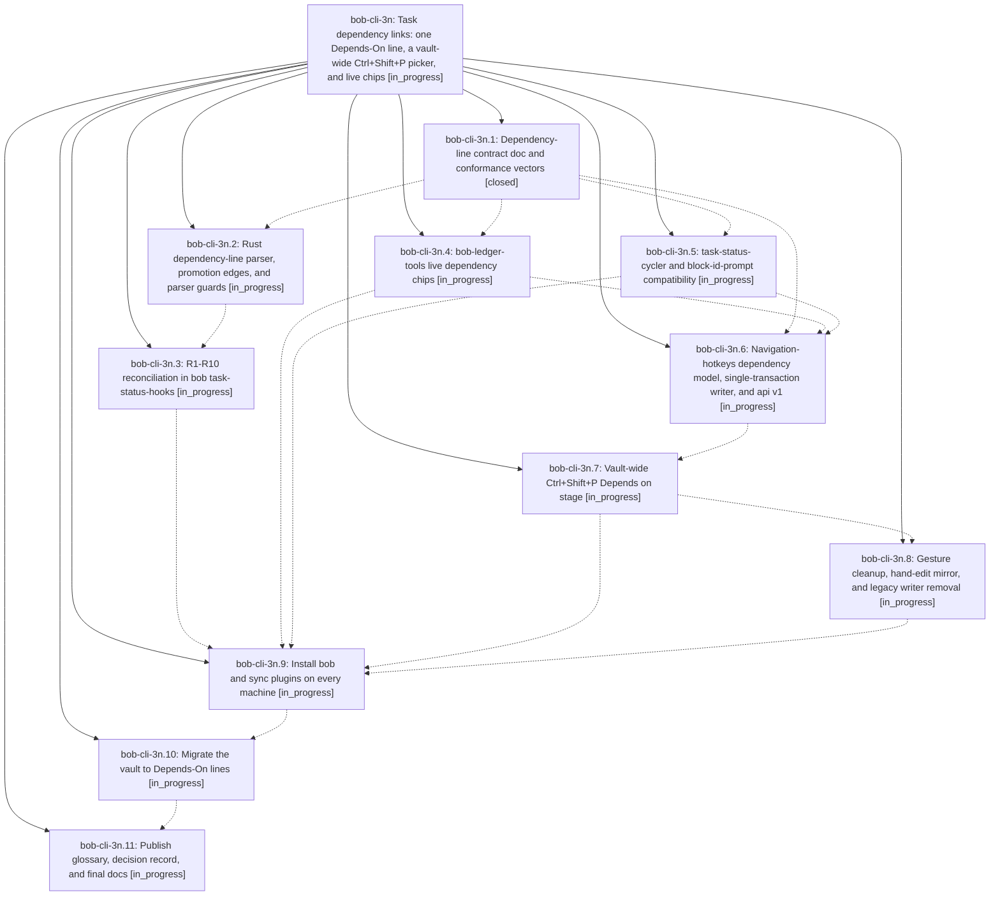

# Bead: bob-cli-3n — Task dependency links: one Depends-On line, a vault-wide Ctrl+Shift+P picker, and live chips

[Bead Pages](../README.md) / bob-cli-3n

**Status:** ◐ in_progress · **Type:** ▸ plan · **Tier:** epic
**Owner:** `bryanbugyi34@gmail.com` · **Created by:** [bbugyi200.athena.0vl](https://github.com/bobs-org/bob-cli--agents/blob/main/sessions/bbugyi200.athena.0vl.md) · **Assignee:** `bob-cli-3n.land`
**Created:** 2026-10-02 16:54:34 EDT
**Plan:** [202610/task\_dep\_links.md](https://github.com/bobs-org/bob-cli--plans/blob/main/202610/task_dep_links.md)

## Description

A task's prerequisites live as plain task dependency links on one managed `⛓️ **DEPENDS ON:**` first-child line. That line is the source of truth, and the `[dependsOn::]` / `[id::]` fields are derived from it. Ctrl+Shift+P adds and removes prerequisites by fuzzy-searching every open task in the vault. bob-ledger-tools draws each link as a live status chip. The vault no longer uses transcluded dependency bullets. The glossary, docs, and decision records describe the new contract.

## Phases

| Bead | Title | Status | Size | Created | Agents | Commits |
|---|---|---|---|---|---:|---:|
| [bob-cli-3n.1](bob-cli-3n.1.md) | Dependency-line contract doc and conformance vectors | ✓ closed | medium | 2026-10-02 | 1 | 1 |
| [bob-cli-3n.10](bob-cli-3n.10.md) | Migrate the vault to Depends-On lines | ◐ in_progress | medium | 2026-10-02 | 1 | 0 |
| [bob-cli-3n.11](bob-cli-3n.11.md) | Publish glossary, decision record, and final docs | ◐ in_progress | small | 2026-10-02 | 1 | 0 |
| [bob-cli-3n.2](bob-cli-3n.2.md) | Rust dependency-line parser, promotion edges, and parser guards | ◐ in_progress | medium | 2026-10-02 | 1 | 0 |
| [bob-cli-3n.3](bob-cli-3n.3.md) | R1-R10 reconciliation in bob task-status-hooks | ◐ in_progress | medium | 2026-10-02 | 1 | 0 |
| [bob-cli-3n.4](bob-cli-3n.4.md) | bob-ledger-tools live dependency chips | ◐ in_progress | medium | 2026-10-02 | 1 | 0 |
| [bob-cli-3n.5](bob-cli-3n.5.md) | task-status-cycler and block-id-prompt compatibility | ◐ in_progress | medium | 2026-10-02 | 1 | 0 |
| [bob-cli-3n.6](bob-cli-3n.6.md) | Navigation-hotkeys dependency model, single-transaction writer, and api v1 | ◐ in_progress | medium | 2026-10-02 | 1 | 0 |
| [bob-cli-3n.7](bob-cli-3n.7.md) | Vault-wide Ctrl+Shift+P Depends on stage | ◐ in_progress | medium | 2026-10-02 | 1 | 0 |
| [bob-cli-3n.8](bob-cli-3n.8.md) | Gesture cleanup, hand-edit mirror, and legacy writer removal | ◐ in_progress | medium | 2026-10-02 | 1 | 0 |
| [bob-cli-3n.9](bob-cli-3n.9.md) | Install bob and sync plugins on every machine | ◐ in_progress | small | 2026-10-02 | 1 | 0 |

## Lineage

## Agents

| Agent | Bead | Commits |
|---|---|---:|
| [bbugyi200.athena.bob-cli-3n.1](https://github.com/bobs-org/bob-cli--agents/blob/main/agents/bbugyi200.athena.bob-cli-3n.1/README.md) | [bob-cli-3n.1](bob-cli-3n.1.md) | 1 |
| [bbugyi200.athena.bob-cli-3n.10](https://github.com/bobs-org/bob-cli--agents/blob/main/agents/bbugyi200.athena.bob-cli-3n.10/README.md) | [bob-cli-3n.10](bob-cli-3n.10.md) | 0 |
| [bbugyi200.athena.bob-cli-3n.11](https://github.com/bobs-org/bob-cli--agents/blob/main/agents/bbugyi200.athena.bob-cli-3n.11/README.md) | [bob-cli-3n.11](bob-cli-3n.11.md) | 0 |
| [bbugyi200.athena.bob-cli-3n.2](https://github.com/bobs-org/bob-cli--agents/blob/main/agents/bbugyi200.athena.bob-cli-3n.2/README.md) | [bob-cli-3n.2](bob-cli-3n.2.md) | 0 |
| [bbugyi200.athena.bob-cli-3n.3](https://github.com/bobs-org/bob-cli--agents/blob/main/agents/bbugyi200.athena.bob-cli-3n.3/README.md) | [bob-cli-3n.3](bob-cli-3n.3.md) | 0 |
| [bbugyi200.athena.bob-cli-3n.4](https://github.com/bobs-org/bob-cli--agents/blob/main/agents/bbugyi200.athena.bob-cli-3n.4/README.md) | [bob-cli-3n.4](bob-cli-3n.4.md) | 0 |
| [bbugyi200.athena.bob-cli-3n.5](https://github.com/bobs-org/bob-cli--agents/blob/main/agents/bbugyi200.athena.bob-cli-3n.5/README.md) | [bob-cli-3n.5](bob-cli-3n.5.md) | 0 |
| [bbugyi200.athena.bob-cli-3n.6](https://github.com/bobs-org/bob-cli--agents/blob/main/agents/bbugyi200.athena.bob-cli-3n.6/README.md) | [bob-cli-3n.6](bob-cli-3n.6.md) | 0 |
| [bbugyi200.athena.bob-cli-3n.7](https://github.com/bobs-org/bob-cli--agents/blob/main/agents/bbugyi200.athena.bob-cli-3n.7/README.md) | [bob-cli-3n.7](bob-cli-3n.7.md) | 0 |
| [bbugyi200.athena.bob-cli-3n.8](https://github.com/bobs-org/bob-cli--agents/blob/main/agents/bbugyi200.athena.bob-cli-3n.8/README.md) | [bob-cli-3n.8](bob-cli-3n.8.md) | 0 |
| [bbugyi200.athena.bob-cli-3n.9](https://github.com/bobs-org/bob-cli--agents/blob/main/agents/bbugyi200.athena.bob-cli-3n.9/README.md) | [bob-cli-3n.9](bob-cli-3n.9.md) | 0 |
| [bbugyi200.athena.bob-cli-3n.land](https://github.com/bobs-org/bob-cli--agents/blob/main/agents/bbugyi200.athena.bob-cli-3n.land/README.md) | [bob-cli-3n](README.md) | 0 |

## Commits

| Repo | Commit | Subject | Bead | Committed |
|---|---|---|---|---|
| bob-cli | [`f4b0d12`](https://github.com/bobs-org/bob-cli/commit/f4b0d12b447f43bdceb6844ed1229fda6e4fd20a) | docs(tasks): document task dependency contract with DK vector coverage | [bob-cli-3n.1](bob-cli-3n.1.md) | 2026-10-02 17:35:53 EDT |
