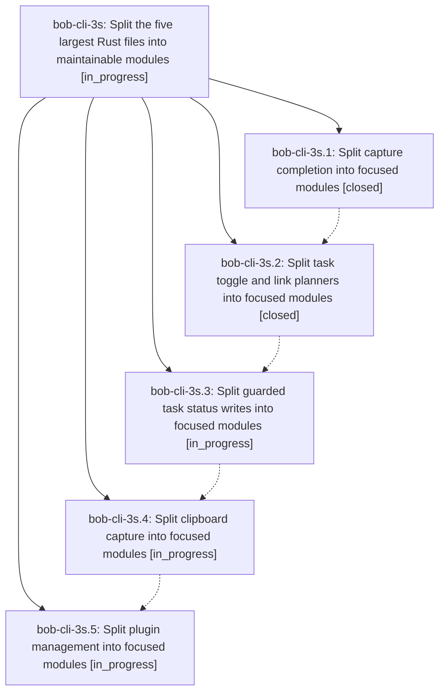

# Bead: bob-cli-3s — Split the five largest Rust files into maintainable modules

[Bead Pages](../README.md) / bob-cli-3s

**Status:** ◐ in_progress · **Type:** ▸ plan · **Tier:** epic
**Owner:** `bryanbugyi34@gmail.com` · **Created by:** [bbugyi200.athena.0vn](https://github.com/bobs-org/bob-cli--agents/blob/main/sessions/bbugyi200.athena.0vn.md) · **Assignee:** `bob-cli-3s.land`
**Created:** 2026-10-03 05:16:50 EDT
**Plan:** [202610/split\_largest\_rust\_files.md](https://github.com/bobs-org/bob-cli--plans/blob/main/202610/split_largest_rust_files.md)

## Description

Refactor the five Rust files identified in this plan, in sequence, into cohesive modules whose production and test files each contain at most 1500 physical lines, preserving existing behavior, interfaces, and test coverage. Each large phase owns planning its final split against the code present when it starts.

## Phases

| Bead | Title | Status | Size | Created | Agents | Commits |
|---|---|---|---|---|---:|---:|
| [bob-cli-3s.1](bob-cli-3s.1.md) | Split capture completion into focused modules | ✓ closed | large | 2026-10-03 | 1 | 1 |
| [bob-cli-3s.2](bob-cli-3s.2.md) | Split task toggle and link planners into focused modules | ✓ closed | large | 2026-10-03 | 1 | 1 |
| [bob-cli-3s.3](bob-cli-3s.3.md) | Split guarded task status writes into focused modules | ◐ in_progress | large | 2026-10-03 | 1 | 0 |
| [bob-cli-3s.4](bob-cli-3s.4.md) | Split clipboard capture into focused modules | ◐ in_progress | large | 2026-10-03 | 1 | 0 |
| [bob-cli-3s.5](bob-cli-3s.5.md) | Split plugin management into focused modules | ◐ in_progress | large | 2026-10-03 | 1 | 0 |

## Lineage

## Agents

| Agent | Bead | Commits |
|---|---|---:|
| [bbugyi200.athena.bob-cli-3s.1](https://github.com/bobs-org/bob-cli--agents/blob/main/sessions/bbugyi200.athena.bob-cli-3s.1.md) | [bob-cli-3s.1](bob-cli-3s.1.md) | 1 |
| [bbugyi200.athena.bob-cli-3s.2](https://github.com/bobs-org/bob-cli--agents/blob/main/sessions/bbugyi200.athena.bob-cli-3s.2.md) | [bob-cli-3s.2](bob-cli-3s.2.md) | 1 |
| [bbugyi200.athena.bob-cli-3s.3](https://github.com/bobs-org/bob-cli--agents/blob/main/agents/bbugyi200.athena.bob-cli-3s.3/README.md) | [bob-cli-3s.3](bob-cli-3s.3.md) | 0 |
| [bbugyi200.athena.bob-cli-3s.4](https://github.com/bobs-org/bob-cli--agents/blob/main/agents/bbugyi200.athena.bob-cli-3s.4/README.md) | [bob-cli-3s.4](bob-cli-3s.4.md) | 0 |
| [bbugyi200.athena.bob-cli-3s.5](https://github.com/bobs-org/bob-cli--agents/blob/main/agents/bbugyi200.athena.bob-cli-3s.5/README.md) | [bob-cli-3s.5](bob-cli-3s.5.md) | 0 |
| [bbugyi200.athena.bob-cli-3s.land](https://github.com/bobs-org/bob-cli--agents/blob/main/agents/bbugyi200.athena.bob-cli-3s.land/README.md) | [bob-cli-3s](README.md) | 0 |

## Commits

| Repo | Commit | Subject | Bead | Committed |
|---|---|---|---|---|
| bob-cli | [`fa71773`](https://github.com/bobs-org/bob-cli/commit/fa717730d2211f07c1d60253e897c87e3d3d03d2) | refactor(capture-complete): split 4656-line module into focused submodules | [bob-cli-3s.1](bob-cli-3s.1.md) | 2026-10-03 05:44:13 EDT |
| bob-cli | [`c9a6f1b`](https://github.com/bobs-org/bob-cli/commit/c9a6f1b453b12730f1a64b4d2b16a2314e383c1d) | refactor(capture): split capture\_task\_toggle into focused modules | [bob-cli-3s.2](bob-cli-3s.2.md) | 2026-10-03 06:17:25 EDT |
