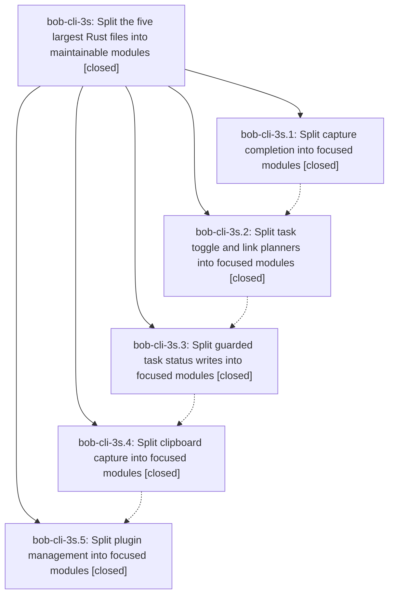

# Bead: bob-cli-3s — Split the five largest Rust files into maintainable modules

[Bead Pages](../README.md) / bob-cli-3s

**Status:** ✓ closed · **Resolution:** done · **Type:** ▸ plan · **Tier:** epic
**Owner:** `bryanbugyi34@gmail.com` · **Created by:** [bbugyi200.athena.0vn](https://github.com/bobs-org/bob-cli--agents/blob/main/sessions/bbugyi200.athena.0vn.md) · **Assignee:** `bob-cli-3s.land`
**Created:** 2026-10-03 05:16:50 EDT · **Closed:** 2026-10-03 07:44:01 EDT
**Plan:** [202610/split\_largest\_rust\_files.md](https://github.com/bobs-org/bob-cli--plans/blob/main/202610/split_largest_rust_files.md)

## Description

Refactor the five Rust files identified in this plan, in sequence, into cohesive modules whose production and test files each contain at most 1500 physical lines, preserving existing behavior, interfaces, and test coverage. Each large phase owns planning its final split against the code present when it starts.

## Notes

[2026-10-03T11:37:32Z · bob-cli-3s.land] LANDING FOLLOW-UP TRIAGE: (1) The capture_pomodoros missing_note_and_missing_section_are_warning_successes BOB_DAY_FILE parallel race, proposed by bob-cli-3s.2, .3 (notes 1 and 3), and .5, is a semantic duplicate of bob-cli-2e. I recorded one +1 on bob-cli-2e from the bob-cli-3s land run, noting that DAY_FILE_LOCK moved to src/native/capture_complete/tests/mod.rs, and created no new task. It predates the epic; capture_pomodoros.rs is untouched. (2) The ob lock_wait_behavior intermittent Contended failure, proposed by bob-cli-3s.4, had no duplicate and no causally related active epic, so I created flake task bob-cli-3t (size large, ready). src/native/ob.rs is untouched by the epic. No proposals were declined.

[2026-10-03T11:44:01Z · bob-cli-3s.land] Verified all 5 phases (3s.1-.5) complete: unit test names (61/49/21/19/17) and fn names (142/91/94/76/101) identical to base 6192017; every split file <=865 lines, no mod.rs roots or include!; no non-epic commits landed during the epic, so no integration needed. Landing cleanup removed epic-introduced unused facade re-exports in capture_task_toggle.rs and task_status_hooks_write.rs (7 lib + 4 lib-test unused_imports warnings -> 0) and the #[allow(unused_imports)] ShellCompletion/ShellRow re-export in capture_complete.rs. just all: 1560 passed, 1 failed (known flake missing_note_and_missing_section_are_warning_successes, passes in isolation); focused suites 49/21/61, cli complete 87, randomize 15. Follow-ups: BOB_DAY_FILE race (3s.2/.3/.5) +1'd on bob-cli-2e; ob lock_wait_behavior flake (3s.4) filed as bob-cli-3t; none declined. No epic-symbols entries.

## Phases

| Bead | Title | Status | Size | Created | Agents | Commits |
|---|---|---|---|---|---:|---:|
| [bob-cli-3s.1](bob-cli-3s.1.md) | Split capture completion into focused modules | ✓ closed | large | 2026-10-03 | 1 | 1 |
| [bob-cli-3s.2](bob-cli-3s.2.md) | Split task toggle and link planners into focused modules | ✓ closed | large | 2026-10-03 | 1 | 1 |
| [bob-cli-3s.3](bob-cli-3s.3.md) | Split guarded task status writes into focused modules | ✓ closed | large | 2026-10-03 | 1 | 1 |
| [bob-cli-3s.4](bob-cli-3s.4.md) | Split clipboard capture into focused modules | ✓ closed | large | 2026-10-03 | 1 | 1 |
| [bob-cli-3s.5](bob-cli-3s.5.md) | Split plugin management into focused modules | ✓ closed | large | 2026-10-03 | 1 | 1 |

## Lineage

## Agents

| Agent | Bead | Commits |
|---|---|---:|
| [bbugyi200.athena.bob-cli-3s.1](https://github.com/bobs-org/bob-cli--agents/blob/main/sessions/bbugyi200.athena.bob-cli-3s.1.md) | [bob-cli-3s.1](bob-cli-3s.1.md) | 1 |
| [bbugyi200.athena.bob-cli-3s.2](https://github.com/bobs-org/bob-cli--agents/blob/main/sessions/bbugyi200.athena.bob-cli-3s.2.md) | [bob-cli-3s.2](bob-cli-3s.2.md) | 1 |
| [bbugyi200.athena.bob-cli-3s.3](https://github.com/bobs-org/bob-cli--agents/blob/main/sessions/bbugyi200.athena.bob-cli-3s.3.md) | [bob-cli-3s.3](bob-cli-3s.3.md) | 1 |
| [bbugyi200.athena.bob-cli-3s.4](https://github.com/bobs-org/bob-cli--agents/blob/main/sessions/bbugyi200.athena.bob-cli-3s.4.md) | [bob-cli-3s.4](bob-cli-3s.4.md) | 1 |
| [bbugyi200.athena.bob-cli-3s.5](https://github.com/bobs-org/bob-cli--agents/blob/main/sessions/bbugyi200.athena.bob-cli-3s.5.md) | [bob-cli-3s.5](bob-cli-3s.5.md) | 1 |
| [bbugyi200.athena.bob-cli-3s.land](https://github.com/bobs-org/bob-cli--agents/blob/main/sessions/bbugyi200.athena.bob-cli-3s.land.md) | [bob-cli-3s](README.md) | 1 |

## Commits

| Repo | Commit | Subject | Bead | Committed |
|---|---|---|---|---|
| bob-cli | [`fa71773`](https://github.com/bobs-org/bob-cli/commit/fa717730d2211f07c1d60253e897c87e3d3d03d2) | refactor(capture-complete): split 4656-line module into focused submodules | [bob-cli-3s.1](bob-cli-3s.1.md) | 2026-10-03 05:44:13 EDT |
| bob-cli | [`c9a6f1b`](https://github.com/bobs-org/bob-cli/commit/c9a6f1b453b12730f1a64b4d2b16a2314e383c1d) | refactor(capture): split capture\_task\_toggle into focused modules | [bob-cli-3s.2](bob-cli-3s.2.md) | 2026-10-03 06:17:25 EDT |
| bob-cli | [`b4a5022`](https://github.com/bobs-org/bob-cli/commit/b4a5022515e08c764299614c1c473a5199867608) | refactor(native): split task\_status\_hooks\_write into focused modules | [bob-cli-3s.3](bob-cli-3s.3.md) | 2026-10-03 06:40:14 EDT |
| bob-cli | [`c2c54a4`](https://github.com/bobs-org/bob-cli/commit/c2c54a4b5da85a67555f5f7d085ad84d37630400) | refactor(capture-clip): split capture\_clip into focused modules | [bob-cli-3s.4](bob-cli-3s.4.md) | 2026-10-03 07:04:42 EDT |
| bob-cli | [`bfa3ac9`](https://github.com/bobs-org/bob-cli/commit/bfa3ac904d194fc26e92c9c70706f510a552eccd) | refactor(plugins): split plugin management into focused modules | [bob-cli-3s.5](bob-cli-3s.5.md) | 2026-10-03 07:26:42 EDT |
| bob-cli | [`1305af5`](https://github.com/bobs-org/bob-cli/commit/1305af5b48be78dbe0c7f5b5bc05657dac5483b4) | refactor(native): drop unused facade re-exports to land bob-cli-3s | [bob-cli-3s](README.md) | 2026-10-03 07:46:30 EDT |
