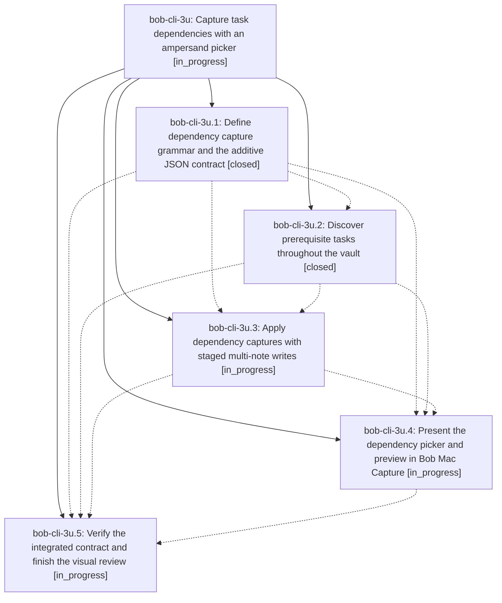

# Bead: bob-cli-3u — Capture task dependencies with an ampersand picker

[Bead Pages](../README.md) / bob-cli-3u

**Status:** ◐ in_progress · **Type:** ▸ plan · **Tier:** epic
**Owner:** `bryanbugyi34@gmail.com` · **Created by:** [bbugyi200.apollo.4m](https://github.com/bobs-org/bob-cli--agents/blob/main/sessions/bbugyi200.apollo.4m.md) · **Assignee:** `bob-cli-3u.land`
**Created:** 2026-10-03 09:11:57 EDT
**Plan:** [202610/capture\_task\_dependencies.md](https://github.com/bobs-org/bob-cli--plans/blob/main/202610/capture_task_dependencies.md)

## Description

Bryan can add prerequisite links to new or explicitly selected existing tasks with &note:block-id in bob capture and use a beautiful, responsive vault-wide dependency picker and accurate preview in Bob Mac Capture.

## Phases

| Bead | Title | Status | Size | Created | Agents | Commits |
|---|---|---|---|---|---:|---:|
| [bob-cli-3u.1](bob-cli-3u.1.md) | Define dependency capture grammar and the additive JSON contract | ✓ closed | medium | 2026-10-03 | 1 | 1 |
| [bob-cli-3u.2](bob-cli-3u.2.md) | Discover prerequisite tasks throughout the vault | ✓ closed | medium | 2026-10-03 | 1 | 1 |
| [bob-cli-3u.3](bob-cli-3u.3.md) | Apply dependency captures with staged multi-note writes | ◐ in_progress | medium | 2026-10-03 | 1 | 0 |
| [bob-cli-3u.4](bob-cli-3u.4.md) | Present the dependency picker and preview in Bob Mac Capture | ◐ in_progress | medium | 2026-10-03 | 1 | 0 |
| [bob-cli-3u.5](bob-cli-3u.5.md) | Verify the integrated contract and finish the visual review | ◐ in_progress | small | 2026-10-03 | 1 | 0 |

## Lineage

## Agents

| Agent | Bead | Commits |
|---|---|---:|
| [bbugyi200.apollo.bob-cli-3u.1](https://github.com/bobs-org/bob-cli--agents/blob/main/agents/bbugyi200.apollo.bob-cli-3u.1/README.md) | [bob-cli-3u.1](bob-cli-3u.1.md) | 1 |
| [bbugyi200.apollo.bob-cli-3u.2](https://github.com/bobs-org/bob-cli--agents/blob/main/agents/bbugyi200.apollo.bob-cli-3u.2/README.md) | [bob-cli-3u.2](bob-cli-3u.2.md) | 1 |
| [bbugyi200.apollo.bob-cli-3u.3](https://github.com/bobs-org/bob-cli--agents/blob/main/agents/bbugyi200.apollo.bob-cli-3u.3/README.md) | [bob-cli-3u.3](bob-cli-3u.3.md) | 0 |
| [bbugyi200.apollo.bob-cli-3u.4](https://github.com/bobs-org/bob-cli--agents/blob/main/agents/bbugyi200.apollo.bob-cli-3u.4/README.md) | [bob-cli-3u.4](bob-cli-3u.4.md) | 0 |
| [bbugyi200.apollo.bob-cli-3u.5](https://github.com/bobs-org/bob-cli--agents/blob/main/agents/bbugyi200.apollo.bob-cli-3u.5/README.md) | [bob-cli-3u.5](bob-cli-3u.5.md) | 0 |
| [bbugyi200.apollo.bob-cli-3u.land](https://github.com/bobs-org/bob-cli--agents/blob/main/agents/bbugyi200.apollo.bob-cli-3u.land/README.md) | [bob-cli-3u](README.md) | 0 |

## Commits

| Repo | Commit | Subject | Bead | Committed |
|---|---|---|---|---|
| bob-cli | [`4b20af6`](https://github.com/bobs-org/bob-cli/commit/4b20af6cd7c878395d06589ebd4e0154175eef24) | feat(capture): define dependency capture grammar and additive JSON contract | [bob-cli-3u.1](bob-cli-3u.1.md) | 2026-10-03 09:59:30 EDT |
| bob-cli | [`cfe88fc`](https://github.com/bobs-org/bob-cli/commit/cfe88fcb26c11f332db06337cfa68e80df8ac747) | feat(capture): add vault-wide task dependency discovery for bob-cli-3u.2 | [bob-cli-3u.2](bob-cli-3u.2.md) | 2026-10-03 10:30:54 EDT |
