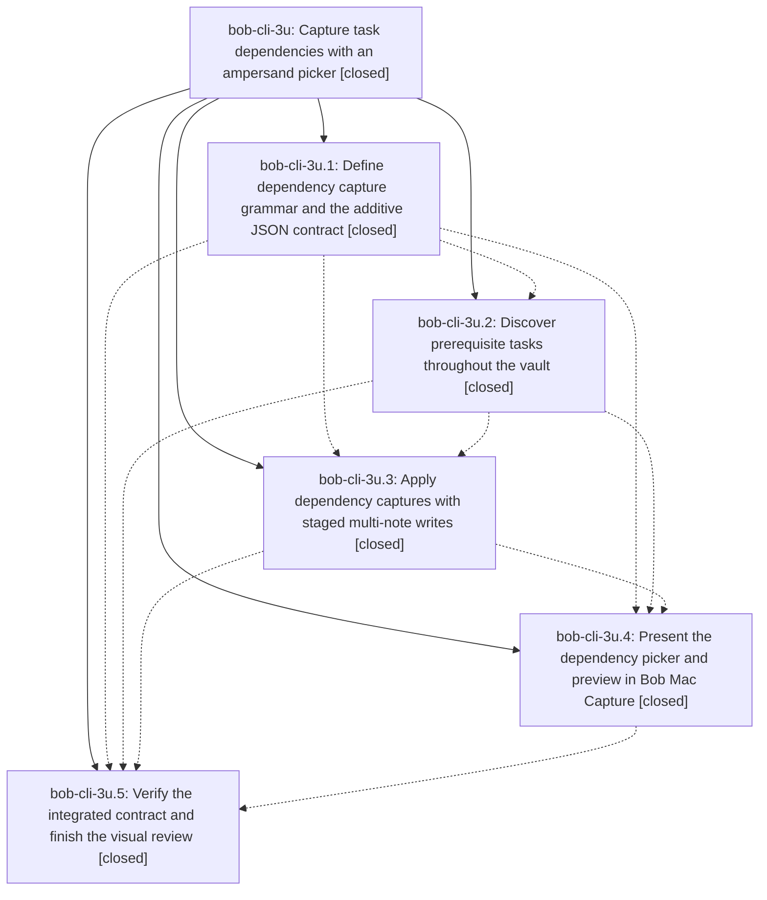

# Bead: bob-cli-3u — Capture task dependencies with an ampersand picker

[Bead Pages](../README.md) / bob-cli-3u

**Status:** ✓ closed · **Resolution:** done · **Type:** ▸ plan · **Tier:** epic
**Owner:** `bryanbugyi34@gmail.com` · **Created by:** [bbugyi200.apollo.4m](https://github.com/bobs-org/bob-cli--agents/blob/main/sessions/bbugyi200.apollo.4m.md) · **Assignee:** `bob-cli-3u.land`
**Created:** 2026-10-03 09:11:57 EDT · **Closed:** 2026-10-03 13:03:57 EDT
**Plan:** [202610/capture\_task\_dependencies.md](https://github.com/bobs-org/bob-cli--plans/blob/main/202610/capture_task_dependencies.md)

## Description

Bryan can add prerequisite links to new or explicitly selected existing tasks with &note:block-id in bob capture and use a beautiful, responsive vault-wide dependency picker and accurate preview in Bob Mac Capture.

## Notes

[2026-10-03T16:09:15Z · bryanbugyi34@gmail.com] 'just install' is failing for bob-mac-capture: 🔒 bob\_mac\_capture\_error.txt

[2026-10-03T17:03:57Z · bob-cli-3u.land] LAND VERIFIED.

(1) Audit. I read every phase bead and its notes, the plan, and commits 4b20af6, cfe88fc, 6718111 (bob-cli) and 680e17f (bob-mac-capture).

(2) Epic note #1, `just install` failing: confirmed it was caused by bob-cli-3u.4. CapturePanelModel.swift:3259 passed `notePath:` before `taskRef:`. It was the same error as CI run 37134501063. Fixed the argument order.

(3) Mac verification on the tailnet Mac (macOS 26, Swift 6.3.2, Command Line Tools only). This was the macOS gap that 3u.4 and 3u.5 left.
- Debug build and release bundle pass. plutil and codesign verify.
- install.sh, the script behind `just install`, succeeds into a temporary HOME.
- swift-format lint exits 0.
- The full suite ran under a throwaway XCTest stand-in that was never committed. It caught 8 more argument-order compile errors in the epic's CaptureDependencyPanelTests and CapturePickerDesignTests; fixed.
- It also caught a real bug: accepting an "Already added" row spliced a duplicate `&` token, because Bob still sends that row's replacement. DependencyPickerPresentation now drops the insertion for alreadyDependency rows, as the plan requires.
- After the fixes, all 39 new epic tests pass, with 622 CaptureCore and 16 install-helper tests. The only 3 failures are identical at pre-epic 68ed00d.
- Rendered the dependency picker PNGs at 760/620 pt in light and dark. Header, owner prompt, count, detail strip, match highlight and semantic `&locator:id` colouring are coherent with the existing pickers. ImageRenderer cannot draw the AppKit search field or list rows for any picker, so row visuals and interactive VoiceOver/keyboard checks remain unverified.

(4) bob-cli on master 89acf06.
- cargo fmt --check is clean. Full cargo test passes: 1599 lib, 909 CLI, all suites.
- clippy's only error is the pre-existing pomodoro_name.rs:808 one.
- Real-binary fixture run:
  - `Buy Groceries! @home &foo:bar` creates a Blocked task with the canonical DEPENDS ON child and dependsOn field.
  - `&foo:bar @body+excercise` adds the dependency, stamps fresh and clears keeps.
  - The repeat (colon alias) is idempotent.
  - Ownerless `&foo:bar` is refused.
  - task-status-hooks dry-run reports already in sync.
- 20k-task synthetic vault: `&` completion returns all 20000 candidates in 1.61 s on the debug build.

(5) Integration with the concurrent keep-streak and PROJECTS-tier work (bob-cli-3v; c46f25d..89acf06).
- The dependency writer already stamps through the shared stamp_fresh, so it inherits keep-clearing.
- Updated docs/freshness.md: §5 Who-stamps and §8 Surfaces now list the `&` dependency stamp.
- Updated docs/task-dependencies.md §8 with the capture writer.
- No code conflicts. "capture never stamps trackers" concerns incidental stamps only.

Follow-ups:
- 3u.2, 3u.3 and 3u.5 proposed the clippy `|| true` at tests/cli/capture/pomodoro_name.rs:808. It predates the epic (7d1c8dd) and is owned by active epic bob-cli-28, so I noted the corroboration on bob-cli-28. No new task.
- 3u.4's macOS-verification proposal was epic work and is done in this landing. Declined as a task.
- Discovered: +1 on bob-cli-3m, the pre-existing Mac test compile error that keeps CI's Test step red, including after this landing's push.
- Discovered: created bob-cli-3x, depending on bob-cli-3m, for two pre-existing Mac test failures masked by it.

## Attachments

- 🔒 bob\_mac\_capture\_error.txt · text/plain · 17.1201 KiB (private attachment)

## Phases

| Bead | Title | Status | Size | Created | Agents | Commits |
|---|---|---|---|---|---:|---:|
| [bob-cli-3u.1](bob-cli-3u.1.md) | Define dependency capture grammar and the additive JSON contract | ✓ closed | medium | 2026-10-03 | 1 | 1 |
| [bob-cli-3u.2](bob-cli-3u.2.md) | Discover prerequisite tasks throughout the vault | ✓ closed | medium | 2026-10-03 | 1 | 1 |
| [bob-cli-3u.3](bob-cli-3u.3.md) | Apply dependency captures with staged multi-note writes | ✓ closed | medium | 2026-10-03 | 1 | 1 |
| [bob-cli-3u.4](bob-cli-3u.4.md) | Present the dependency picker and preview in Bob Mac Capture | ✓ closed | medium | 2026-10-03 | 1 | 0 |
| [bob-cli-3u.5](bob-cli-3u.5.md) | Verify the integrated contract and finish the visual review | ✓ closed | small | 2026-10-03 | 1 | 0 |

## Lineage

## Agents

| Agent | Bead | Commits |
|---|---|---:|
| [bbugyi200.apollo.bob-cli-3u.1](https://github.com/bobs-org/bob-cli--agents/blob/main/agents/bbugyi200.apollo.bob-cli-3u.1/README.md) | [bob-cli-3u.1](bob-cli-3u.1.md) | 1 |
| [bbugyi200.apollo.bob-cli-3u.2](https://github.com/bobs-org/bob-cli--agents/blob/main/agents/bbugyi200.apollo.bob-cli-3u.2/README.md) | [bob-cli-3u.2](bob-cli-3u.2.md) | 1 |
| [bbugyi200.apollo.bob-cli-3u.3](https://github.com/bobs-org/bob-cli--agents/blob/main/agents/bbugyi200.apollo.bob-cli-3u.3/README.md) | [bob-cli-3u.3](bob-cli-3u.3.md) | 1 |
| [bbugyi200.apollo.bob-cli-3u.4](https://github.com/bobs-org/bob-cli--agents/blob/main/agents/bbugyi200.apollo.bob-cli-3u.4/README.md) | [bob-cli-3u.4](bob-cli-3u.4.md) | 0 |
| [bbugyi200.apollo.bob-cli-3u.5](https://github.com/bobs-org/bob-cli--agents/blob/main/agents/bbugyi200.apollo.bob-cli-3u.5/README.md) | [bob-cli-3u.5](bob-cli-3u.5.md) | 0 |
| [bbugyi200.apollo.bob-cli-3u.land](https://github.com/bobs-org/bob-cli--agents/blob/main/agents/bbugyi200.apollo.bob-cli-3u.land/README.md) | [bob-cli-3u](README.md) | 1 |

## Commits

| Repo | Commit | Subject | Bead | Committed |
|---|---|---|---|---|
| bob-cli | [`4b20af6`](https://github.com/bobs-org/bob-cli/commit/4b20af6cd7c878395d06589ebd4e0154175eef24) | feat(capture): define dependency capture grammar and additive JSON contract | [bob-cli-3u.1](bob-cli-3u.1.md) | 2026-10-03 09:59:30 EDT |
| bob-cli | [`cfe88fc`](https://github.com/bobs-org/bob-cli/commit/cfe88fcb26c11f332db06337cfa68e80df8ac747) | feat(capture): add vault-wide task dependency discovery for bob-cli-3u.2 | [bob-cli-3u.2](bob-cli-3u.2.md) | 2026-10-03 10:30:54 EDT |
| bob-cli | [`6718111`](https://github.com/bobs-org/bob-cli/commit/67181114af85467c1e4d3ecaa3ee98484d5d39c4) | feat(capture): implement staged capture writer with dependency parsing | [bob-cli-3u.3](bob-cli-3u.3.md) | 2026-10-03 11:22:40 EDT |
| bob-cli | [`e5a049c`](https://github.com/bobs-org/bob-cli/commit/e5a049c43b02e37d5ebd93c91b1c297d88711fed) | docs(capture): record the & dependency capture in freshness and dependency contracts | [bob-cli-3u](README.md) | 2026-10-03 13:05:00 EDT |
