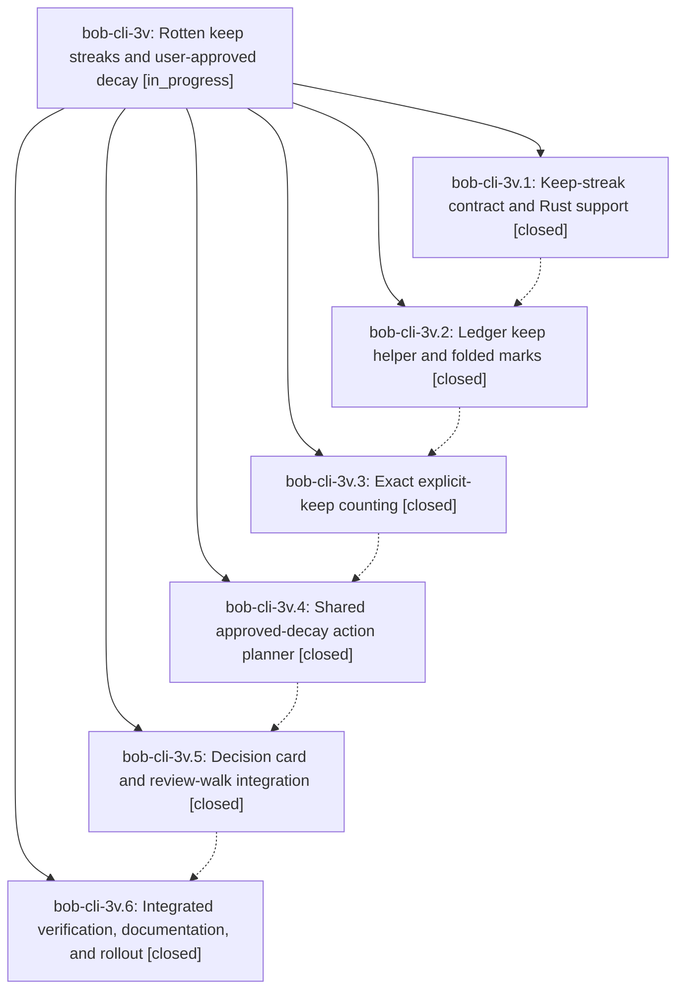

# Bead: bob-cli-3v — Rotten keep streaks and user-approved decay

[Bead Pages](../README.md) / bob-cli-3v

**Status:** ◐ in_progress · **Type:** ▸ plan · **Tier:** epic
**Owner:** `bryanbugyi34@gmail.com` · **Created by:** [bbugyi200.apollo.4o](https://github.com/bobs-org/bob-cli--agents/blob/main/sessions/bbugyi200.apollo.4o.md) · **Assignee:** `bob-cli-3v.land`
**Created:** 2026-10-03 10:36:59 EDT
**Plan:** [202610/rotten\_keep\_streak.md](https://github.com/bobs-org/bob-cli--plans/blob/main/202610/rotten_keep_streak.md)

## Description

Explicit due-Ready keeps have a trustworthy streak and a quiet freshness-mark display; repeated keeps offer an approved decision that enters the existing priority ladder, with no silent decay or change to the freshness trial.

## Phases

| Bead | Title | Status | Size | Created | Agents | Commits |
|---|---|---|---|---|---:|---:|
| [bob-cli-3v.1](bob-cli-3v.1.md) | Keep-streak contract and Rust support | ✓ closed | medium | 2026-10-03 | 1 | 1 |
| [bob-cli-3v.2](bob-cli-3v.2.md) | Ledger keep helper and folded marks | ✓ closed | medium | 2026-10-03 | 1 | 2 |
| [bob-cli-3v.3](bob-cli-3v.3.md) | Exact explicit-keep counting | ✓ closed | medium | 2026-10-03 | 1 | 2 |
| [bob-cli-3v.4](bob-cli-3v.4.md) | Shared approved-decay action planner | ✓ closed | medium | 2026-10-03 | 1 | 2 |
| [bob-cli-3v.5](bob-cli-3v.5.md) | Decision card and review-walk integration | ✓ closed | medium | 2026-10-03 | 1 | 2 |
| [bob-cli-3v.6](bob-cli-3v.6.md) | Integrated verification, documentation, and rollout | ✓ closed | medium | 2026-10-03 | 1 | 1 |

## Lineage

## Agents

| Agent | Bead | Commits |
|---|---|---:|
| [bbugyi200.apollo.bob-cli-3v.1](https://github.com/bobs-org/bob-cli--agents/blob/main/agents/bbugyi200.apollo.bob-cli-3v.1/README.md) | [bob-cli-3v.1](bob-cli-3v.1.md) | 1 |
| [bbugyi200.apollo.bob-cli-3v.2](https://github.com/bobs-org/bob-cli--agents/blob/main/agents/bbugyi200.apollo.bob-cli-3v.2/README.md) | [bob-cli-3v.2](bob-cli-3v.2.md) | 2 |
| [bbugyi200.apollo.bob-cli-3v.3](https://github.com/bobs-org/bob-cli--agents/blob/main/agents/bbugyi200.apollo.bob-cli-3v.3/README.md) | [bob-cli-3v.3](bob-cli-3v.3.md) | 2 |
| [bbugyi200.apollo.bob-cli-3v.4](https://github.com/bobs-org/bob-cli--agents/blob/main/agents/bbugyi200.apollo.bob-cli-3v.4/README.md) | [bob-cli-3v.4](bob-cli-3v.4.md) | 2 |
| [bbugyi200.apollo.bob-cli-3v.5](https://github.com/bobs-org/bob-cli--agents/blob/main/agents/bbugyi200.apollo.bob-cli-3v.5/README.md) | [bob-cli-3v.5](bob-cli-3v.5.md) | 2 |
| [bbugyi200.apollo.bob-cli-3v.6](https://github.com/bobs-org/bob-cli--agents/blob/main/agents/bbugyi200.apollo.bob-cli-3v.6/README.md) | [bob-cli-3v.6](bob-cli-3v.6.md) | 1 |
| [bbugyi200.apollo.bob-cli-3v.land](https://github.com/bobs-org/bob-cli--agents/blob/main/agents/bbugyi200.apollo.bob-cli-3v.land/README.md) | [bob-cli-3v](README.md) | 0 |

## Commits

| Repo | Commit | Subject | Bead | Committed |
|---|---|---|---|---|
| bob-cli | [`c46f25d`](https://github.com/bobs-org/bob-cli/commit/c46f25d759f5d9f7e46311fd0cf7ebc795af7efe) | feat(freshness): keep-streak contract and Rust support for bob-cli-3v.1 | [bob-cli-3v.1](bob-cli-3v.1.md) | 2026-10-03 10:55:18 EDT |
| bob-cli | [`ca611d2`](https://github.com/bobs-org/bob-cli/commit/ca611d2884f00ff310e072c77ba3f25b4ea5cc0d) | feat(freshness): ledger keep helper and folded marks for bob-cli-3v.2 | [bob-cli-3v.2](bob-cli-3v.2.md) | 2026-10-03 11:10:34 EDT |
| bob-plugins | [`bob-plugins@67e9409`](https://github.com/bobs-org/bob-plugins/commit/67e9409b7a3d4b0e6e1f0520b8a769eaa6999019) | feat(freshness): keep-streak namespace v5, keepLine, and folded pips for bob-cli-3v.2 | [bob-cli-3v.2](bob-cli-3v.2.md) | 2026-10-03 11:12:12 EDT |
| bob-cli | [`d6b63e8`](https://github.com/bobs-org/bob-cli/commit/d6b63e864c3b29b15f89a98cd9859184bb53ced5) | docs(freshness): record keep-counting as trial-neutral first milestone | [bob-cli-3v.3](bob-cli-3v.3.md) | 2026-10-03 11:25:19 EDT |
| bob-plugins | [`bob-plugins@9a86df4`](https://github.com/bobs-org/bob-plugins/commit/9a86df48e4537b4b3ac80682d8377f49f38573c1) | feat(nav-hotkeys): count eligible fresh stamps through keepLine with exact pre-write match | [bob-cli-3v.3](bob-cli-3v.3.md) | 2026-10-03 11:25:51 EDT |
| bob-cli | [`cb7650e`](https://github.com/bobs-org/bob-cli/commit/cb7650e9723004a5593181cc401b1ba2a8ccdddf) | docs(decay-planner): document approved-decay action planner and kept-count tails | [bob-cli-3v.4](bob-cli-3v.4.md) | 2026-10-03 11:38:20 EDT |
| bob-plugins | [`bob-plugins@995f734`](https://github.com/bobs-org/bob-plugins/commit/995f73423445109dbc116bd34677e66a025cdf9a) | feat(nav-hotkeys): add pure approved-decay action planner with D-vector tests | [bob-cli-3v.4](bob-cli-3v.4.md) | 2026-10-03 11:39:00 EDT |
| bob-cli | [`d7744f3`](https://github.com/bobs-org/bob-cli/commit/d7744f3ee2480d1dcbc88e369de245bb3c851ee1) | docs(freshness): document decay decision card and review-walk integration | [bob-cli-3v.5](bob-cli-3v.5.md) | 2026-10-03 12:03:30 EDT |
| bob-plugins | [`bob-plugins@3e99159`](https://github.com/bobs-org/bob-plugins/commit/3e991591487967d2d4e6a8e246c6de1734435fd3) | feat(decay-card): add FreshnessDecayCardModal consent interaction and leaf decide signal | [bob-cli-3v.5](bob-cli-3v.5.md) | 2026-10-03 12:04:08 EDT |
| bob-cli | [`89acf06`](https://github.com/bobs-org/bob-cli/commit/89acf0685b1c038174c6e76b34aa9858bfcea3aa) | docs(freshness): keep-streak rollout notes, calibration, and memory publication | [bob-cli-3v.6](bob-cli-3v.6.md) | 2026-10-03 12:21:24 EDT |
