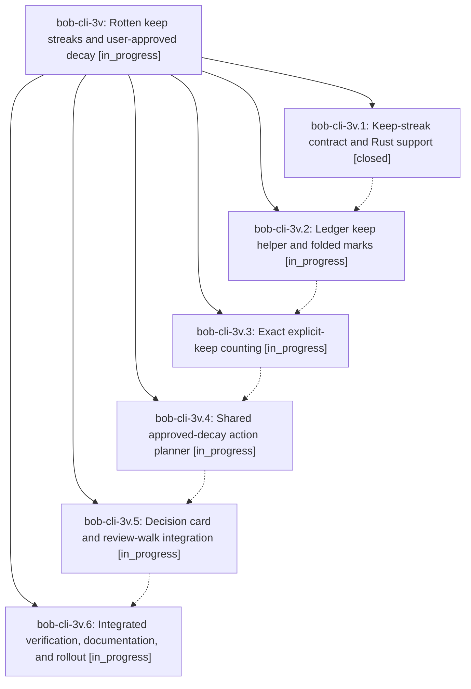

# Bead: bob-cli-3v — Rotten keep streaks and user-approved decay

[Bead Pages](../README.md) / bob-cli-3v

**Status:** ◐ in_progress · **Type:** ▸ plan · **Tier:** epic
**Owner:** `bryanbugyi34@gmail.com` · **Created by:** [bbugyi200.apollo.4o](https://github.com/bobs-org/bob-cli--agents/blob/main/sessions/bbugyi200.apollo.4o.md) · **Assignee:** `bob-cli-3v.land`
**Created:** 2026-10-03 10:36:59 EDT
**Plan:** [202610/rotten\_keep\_streak.md](https://github.com/bobs-org/bob-cli--plans/blob/main/202610/rotten_keep_streak.md)

## Description

Explicit due-Ready keeps have a trustworthy streak and a quiet freshness-mark display; repeated keeps offer an approved decision that enters the existing priority ladder, with no silent decay or change to the freshness trial.

## Phases

| Bead | Title | Status | Size | Created | Agents | Commits |
|---|---|---|---|---|---:|---:|
| [bob-cli-3v.1](bob-cli-3v.1.md) | Keep-streak contract and Rust support | ✓ closed | medium | 2026-10-03 | 1 | 1 |
| [bob-cli-3v.2](bob-cli-3v.2.md) | Ledger keep helper and folded marks | ◐ in_progress | medium | 2026-10-03 | 1 | 0 |
| [bob-cli-3v.3](bob-cli-3v.3.md) | Exact explicit-keep counting | ◐ in_progress | medium | 2026-10-03 | 1 | 0 |
| [bob-cli-3v.4](bob-cli-3v.4.md) | Shared approved-decay action planner | ◐ in_progress | medium | 2026-10-03 | 1 | 0 |
| [bob-cli-3v.5](bob-cli-3v.5.md) | Decision card and review-walk integration | ◐ in_progress | medium | 2026-10-03 | 1 | 0 |
| [bob-cli-3v.6](bob-cli-3v.6.md) | Integrated verification, documentation, and rollout | ◐ in_progress | medium | 2026-10-03 | 1 | 0 |

## Lineage

## Agents

| Agent | Bead | Commits |
|---|---|---:|
| [bbugyi200.apollo.bob-cli-3v.1](https://github.com/bobs-org/bob-cli--agents/blob/main/agents/bbugyi200.apollo.bob-cli-3v.1/README.md) | [bob-cli-3v.1](bob-cli-3v.1.md) | 1 |
| [bbugyi200.apollo.bob-cli-3v.2](https://github.com/bobs-org/bob-cli--agents/blob/main/agents/bbugyi200.apollo.bob-cli-3v.2/README.md) | [bob-cli-3v.2](bob-cli-3v.2.md) | 0 |
| [bbugyi200.apollo.bob-cli-3v.3](https://github.com/bobs-org/bob-cli--agents/blob/main/agents/bbugyi200.apollo.bob-cli-3v.3/README.md) | [bob-cli-3v.3](bob-cli-3v.3.md) | 0 |
| [bbugyi200.apollo.bob-cli-3v.4](https://github.com/bobs-org/bob-cli--agents/blob/main/agents/bbugyi200.apollo.bob-cli-3v.4/README.md) | [bob-cli-3v.4](bob-cli-3v.4.md) | 0 |
| [bbugyi200.apollo.bob-cli-3v.5](https://github.com/bobs-org/bob-cli--agents/blob/main/agents/bbugyi200.apollo.bob-cli-3v.5/README.md) | [bob-cli-3v.5](bob-cli-3v.5.md) | 0 |
| [bbugyi200.apollo.bob-cli-3v.6](https://github.com/bobs-org/bob-cli--agents/blob/main/agents/bbugyi200.apollo.bob-cli-3v.6/README.md) | [bob-cli-3v.6](bob-cli-3v.6.md) | 0 |
| [bbugyi200.apollo.bob-cli-3v.land](https://github.com/bobs-org/bob-cli--agents/blob/main/agents/bbugyi200.apollo.bob-cli-3v.land/README.md) | [bob-cli-3v](README.md) | 0 |

## Commits

| Repo | Commit | Subject | Bead | Committed |
|---|---|---|---|---|
| bob-cli | [`c46f25d`](https://github.com/bobs-org/bob-cli/commit/c46f25d759f5d9f7e46311fd0cf7ebc795af7efe) | feat(freshness): keep-streak contract and Rust support for bob-cli-3v.1 | [bob-cli-3v.1](bob-cli-3v.1.md) | 2026-10-03 10:55:18 EDT |
