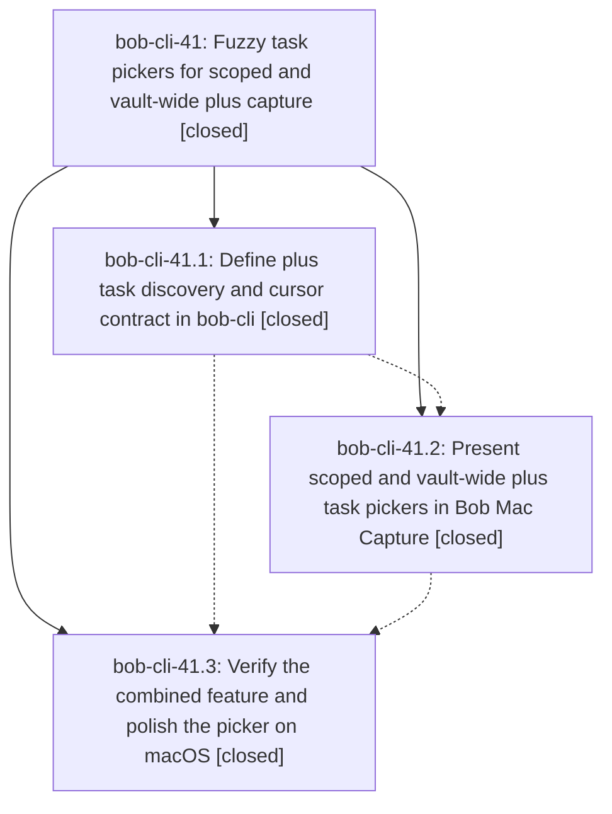

# Bead: bob-cli-41 — Fuzzy task pickers for scoped and vault-wide plus capture

[Bead Pages](../README.md) / bob-cli-41

**Status:** ✓ closed · **Resolution:** done · **Type:** ▸ plan · **Tier:** epic
**Owner:** `bryanbugyi34@gmail.com` · **Created by:** [bbugyi200.athena.0vw](https://github.com/bobs-org/bob-cli--agents/blob/main/sessions/bbugyi200.athena.0vw.md) · **Assignee:** `bob-cli-41.land`
**Created:** 2026-10-03 16:24:17 EDT · **Closed:** 2026-10-03 18:46:38 EDT
**Plan:** [202610/plus\_task\_picker.md](https://github.com/bobs-org/bob-cli--plans/blob/main/202610/plus_task_picker.md)

## Description

Scoped @file+ and leading or prose-terminal + gestures open the shared native fuzzy task picker, insert the correct @file+id marker, and preserve existing capture semantics, Pomodoro operators, and stale-safe task identity.

## Notes

[2026-10-03T22:46:38Z · bob-cli-41.land] Verified all three closed phases against their notes, plan:202610/plus_task_picker.md, and the commits. bob-cli 0aa9b8a (bob-cli-41.1) adds the shared bare-plus classifier, task_parent context, parent-task picker descriptor, vault candidates without pulls_forward, parent_replacement on capture-task-id, and shell rows that skip ID-less tasks. bob-mac-capture e9b5f81 (bob-cli-41.2) routes task_parent and descriptor-bearing scoped task responses onto the shared card, keeps older task responses on the inline list, and covers operator continuation, ID assignment, and design states. bob-cli a960232 and bob-mac-capture 098e67e (bob-cli-41.3) add the fixture-vault catalog, accept/capture, and operator walks. cargo test parent_task and bare_plus_shell_completion passed here (10 lib, 3 cli, 1 shell). macOS 26 CI runs 37157187639 and 37158683771 passed format lint and Build for those Mac commits.

Integration: since 0aa9b8a the only non-epic bob-cli commits are 223974d and 0b7693b, docs-only changes to docs/freshness.md and docs/projects.md, with no file overlap and no capture-plus behavior to adopt. bob-mac-capture has no non-epic commits since e9b5f81. No integration edits.

Follow-ups: bob-cli-41.1's green-header failure is the NO_COLOR=1 inheritance already owned by in-progress epic bob-cli-3j (notes #3 and #5); corroborated there, no new task. bob-cli-41.2's Linux Swift 6.0.3 hintTokens timeout was reproduced with swiftc -typecheck on current master and is unchanged by the picker commits; filed bob-cli-43 (bug, small, ready). Related artifact links to bob-cli-41.2, bob-cli-3m, and bob-cli-3x failed because the artifact-link event store rejected a reused operation_id; those beads are named in the task description instead. bob-cli-41.3's Mac inspection gap is the pre-existing CapturePreviewState.pending compile error; +1 on bob-cli-3m with the two CI run URLs. bob-cli-3x still tracks the two close tests that surface after that compile. No separate visual-QA task: Build succeeded, no visual defect was observed, and design-state tests are in the tree. No --epic-symbol entries. No parent bead.

## Phases

| Bead | Title | Status | Size | Created | Agents | Commits |
|---|---|---|---|---|---:|---:|
| [bob-cli-41.1](bob-cli-41.1.md) | Define plus task discovery and cursor contract in bob-cli | ✓ closed | medium | 2026-10-03 | 1 | 1 |
| [bob-cli-41.2](bob-cli-41.2.md) | Present scoped and vault-wide plus task pickers in Bob Mac Capture | ✓ closed | medium | 2026-10-03 | 1 | 1 |
| [bob-cli-41.3](bob-cli-41.3.md) | Verify the combined feature and polish the picker on macOS | ✓ closed | small | 2026-10-03 | 1 | 2 |

## Lineage

## Agents

| Agent | Bead | Commits |
|---|---|---:|
| [bbugyi200.athena.bob-cli-41.1](https://github.com/bobs-org/bob-cli--agents/blob/main/agents/bbugyi200.athena.bob-cli-41.1/README.md) | [bob-cli-41.1](bob-cli-41.1.md) | 1 |
| [bbugyi200.athena.bob-cli-41.2](https://github.com/bobs-org/bob-cli--agents/blob/main/agents/bbugyi200.athena.bob-cli-41.2/README.md) | [bob-cli-41.2](bob-cli-41.2.md) | 1 |
| [bbugyi200.athena.bob-cli-41.3](https://github.com/bobs-org/bob-cli--agents/blob/main/agents/bbugyi200.athena.bob-cli-41.3/README.md) | [bob-cli-41.3](bob-cli-41.3.md) | 2 |
| [bbugyi200.athena.bob-cli-41.land](https://github.com/bobs-org/bob-cli--agents/blob/main/agents/bbugyi200.athena.bob-cli-41.land/README.md) | [bob-cli-41](README.md) | 1 |

## Commits

| Repo | Commit | Subject | Bead | Committed |
|---|---|---|---|---|
| bob-cli | [`0aa9b8a`](https://github.com/bobs-org/bob-cli/commit/0aa9b8a72163187de0c1c6c4796049ccd1ea9281) | feat(capture): add parent task picker | [bob-cli-41.1](bob-cli-41.1.md) | 2026-10-03 17:08:56 EDT |
| bob-mac-capture | [`bob-mac-capture@e9b5f81`](https://github.com/bobs-org/bob-mac-capture/commit/e9b5f811e0bf09b3e5a3464c905f7816ee57b648) | feat(capture): present scoped and vault-wide plus task pickers | [bob-cli-41.2](bob-cli-41.2.md) | 2026-10-03 18:04:28 EDT |
| bob-cli | [`a960232`](https://github.com/bobs-org/bob-cli/commit/a960232b2a757046319949f0ad17947af5ac0eec) | test(capture): cover plus-picker catalog and operator walks | [bob-cli-41.3](bob-cli-41.3.md) | 2026-10-03 18:29:50 EDT |
| bob-mac-capture | [`bob-mac-capture@098e67e`](https://github.com/bobs-org/bob-mac-capture/commit/098e67e9861cd52a981d1f89a73a623b74d3bdd5) | test(capture): align plus-picker fixtures with backend refetch | [bob-cli-41.3](bob-cli-41.3.md) | 2026-10-03 18:30:29 EDT |
| bob-cli--plans | [`bob-cli--plans@7c4dd95`](https://github.com/bobs-org/bob-cli--plans/commit/7c4dd95785152078935c375e74ccfff442c67b35) | docs(plan): mark the plus task picker epic done | [bob-cli-41](README.md) | 2026-10-03 18:48:26 EDT |
