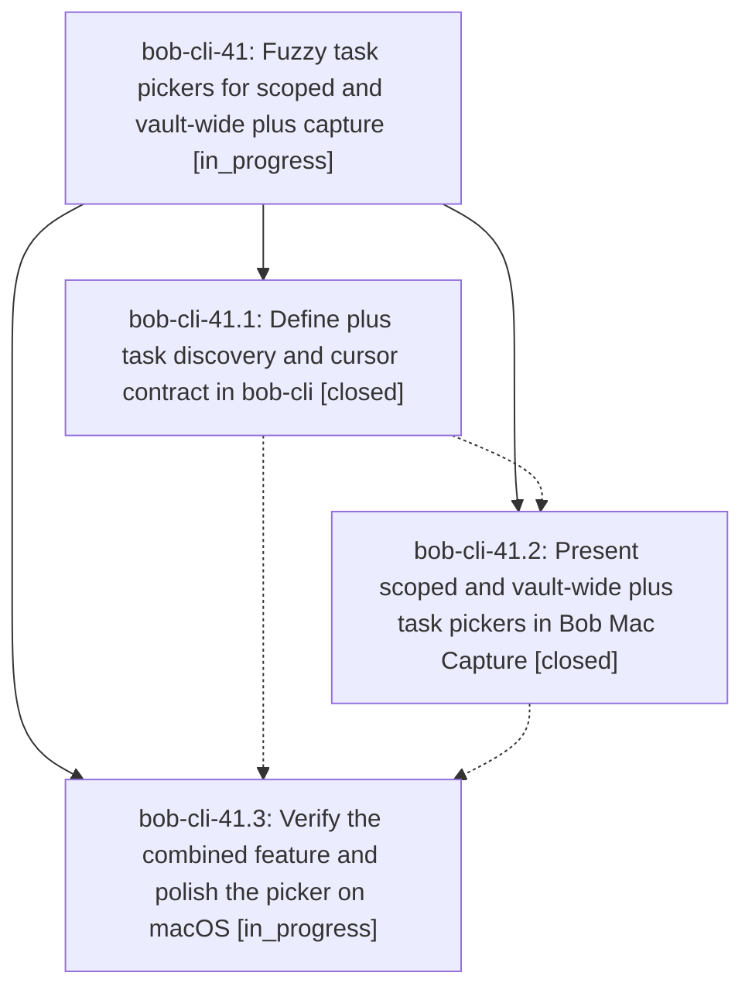

# Bead: bob-cli-41 — Fuzzy task pickers for scoped and vault-wide plus capture

[Bead Pages](../README.md) / bob-cli-41

**Status:** ◐ in_progress · **Type:** ▸ plan · **Tier:** epic
**Owner:** `bryanbugyi34@gmail.com` · **Created by:** [bbugyi200.athena.0vw](https://github.com/bobs-org/bob-cli--agents/blob/main/sessions/bbugyi200.athena.0vw.md) · **Assignee:** `bob-cli-41.land`
**Created:** 2026-10-03 16:24:17 EDT
**Plan:** [202610/plus\_task\_picker.md](https://github.com/bobs-org/bob-cli--plans/blob/main/202610/plus_task_picker.md)

## Description

Scoped @file+ and leading or prose-terminal + gestures open the shared native fuzzy task picker, insert the correct @file+id marker, and preserve existing capture semantics, Pomodoro operators, and stale-safe task identity.

## Phases

| Bead | Title | Status | Size | Created | Agents | Commits |
|---|---|---|---|---|---:|---:|
| [bob-cli-41.1](bob-cli-41.1.md) | Define plus task discovery and cursor contract in bob-cli | ✓ closed | medium | 2026-10-03 | 1 | 1 |
| [bob-cli-41.2](bob-cli-41.2.md) | Present scoped and vault-wide plus task pickers in Bob Mac Capture | ✓ closed | medium | 2026-10-03 | 1 | 1 |
| [bob-cli-41.3](bob-cli-41.3.md) | Verify the combined feature and polish the picker on macOS | ◐ in_progress | small | 2026-10-03 | 1 | 0 |

## Lineage

## Agents

| Agent | Bead | Commits |
|---|---|---:|
| [bbugyi200.athena.bob-cli-41.1](https://github.com/bobs-org/bob-cli--agents/blob/main/agents/bbugyi200.athena.bob-cli-41.1/README.md) | [bob-cli-41.1](bob-cli-41.1.md) | 1 |
| [bbugyi200.athena.bob-cli-41.2](https://github.com/bobs-org/bob-cli--agents/blob/main/agents/bbugyi200.athena.bob-cli-41.2/README.md) | [bob-cli-41.2](bob-cli-41.2.md) | 1 |
| [bbugyi200.athena.bob-cli-41.3](https://github.com/bobs-org/bob-cli--agents/blob/main/agents/bbugyi200.athena.bob-cli-41.3/README.md) | [bob-cli-41.3](bob-cli-41.3.md) | 0 |
| [bbugyi200.athena.bob-cli-41.land](https://github.com/bobs-org/bob-cli--agents/blob/main/agents/bbugyi200.athena.bob-cli-41.land/README.md) | [bob-cli-41](README.md) | 0 |

## Commits

| Repo | Commit | Subject | Bead | Committed |
|---|---|---|---|---|
| bob-cli | [`0aa9b8a`](https://github.com/bobs-org/bob-cli/commit/0aa9b8a72163187de0c1c6c4796049ccd1ea9281) | feat(capture): add parent task picker | [bob-cli-41.1](bob-cli-41.1.md) | 2026-10-03 17:08:56 EDT |
| bob-mac-capture | [`bob-mac-capture@e9b5f81`](https://github.com/bobs-org/bob-mac-capture/commit/e9b5f811e0bf09b3e5a3464c905f7816ee57b648) | feat(capture): present scoped and vault-wide plus task pickers | [bob-cli-41.2](bob-cli-41.2.md) | 2026-10-03 18:04:28 EDT |
