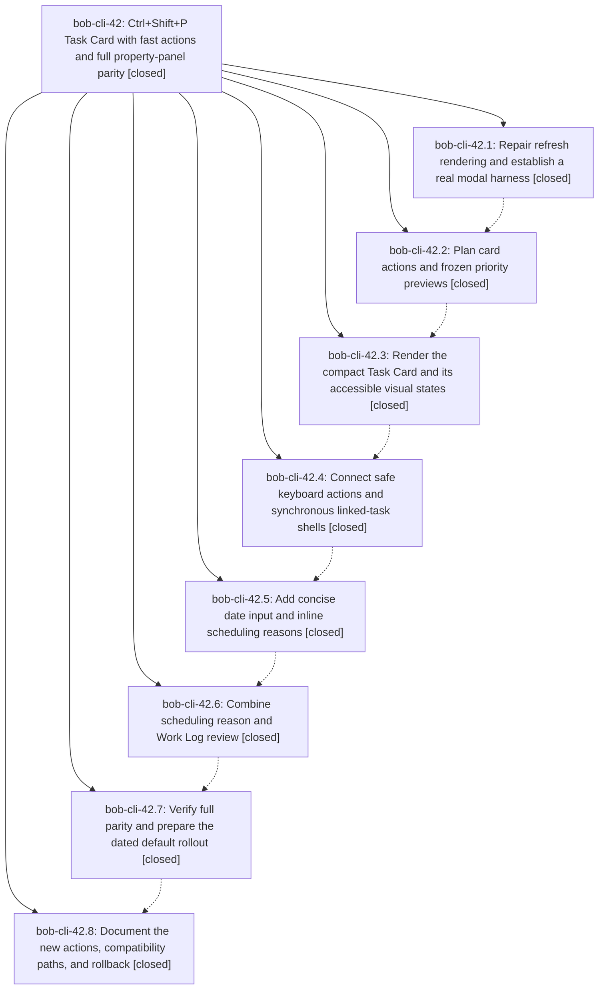

# Bead: bob-cli-42 — Ctrl+Shift+P Task Card with fast actions and full property-panel parity

[Bead Pages](../README.md) / bob-cli-42

**Status:** ✓ closed · **Resolution:** done · **Type:** ▸ plan · **Tier:** epic
**Owner:** `bryanbugyi34@gmail.com` · **Created by:** [bbugyi200.apollo.research.05.linker.w0](https://github.com/bobs-org/bob-cli--agents/blob/main/sessions/bbugyi200.apollo.research.05.linker.w0.md) · **Assignee:** `bob-cli-42.land`
**Created:** 2026-10-03 16:27:19 EDT · **Closed:** 2026-10-03 20:41:25 EDT
**Plan:** [202610/ctrl\_shift\_p\_task\_card.md](https://github.com/bobs-org/bob-cli--plans/blob/main/202610/ctrl_shift_p_task_card.md)

## Description

Replace the property picker's first screen with a beautiful, reliable Task Card that reduces common priority actions to one key after opening, preserves every existing editing capability and stored side effect, and protects the October freshness trial with a staged rollout.

## Notes

[2026-10-04T00:34:30Z · bob-cli-42.land] LAND TRIAGE (bob-cli-42.land, 2026-10-04): PROPOSED FOLLOW-UP outcomes. (1) bob-cli-42.3 #1, the withheld live-vault sync of 1.71.1 over vault 1.72.0: DECLINED as already resolved. Later phases rebased onto upstream and synced 1.75.0 and then 2.0.0, and 'bob plugins sync --repo <opened bob-plugins> --no-pull --dry-run' now reports all six plugins up to date. (2) bob-cli-42.5 #1 (GUI smoke of Task Card date input), bob-cli-42.8 #1 (light/dark/narrow screenshots plus an Obsidian reload for the palette rename), and the bob-cli-42.7 manual acceptance checklist: these are the epic's own GUI acceptance, which the plan explicitly lets the epic record as a limitation. No task bead was filed, because a task worker has no GUI either. They stay as Bryan's manual pre-2026-10-19 checklist, carried into the close note; setting Classic list holds the default until it is done. (3) Not proposed by a phase: the pre-existing clippy deny (overly_complex_bool_expr at tests/cli/capture/pomodoro_name.rs:808) fails 'just lint'. Via /sase_new_task it was corroborated on active epic bob-cli-28, which owns it; no new task. (4) The Pending refresh Work Log prompt (e4aa7d0) is unreachable from the card's f / picker refresh: DECLINED as by design, since docs/projects.md:706 scopes it to Alt+F / Alt+Shift+F and says picker refresh has no prompt; the classic path behaves the same. (5) Enter on a Tab-focused decay-card Drop button drops: DECLINED as pre-existing (3e99159) explicit button activation; the epic's 'Enter never cancels' contract covers default Enter, which still maps to Not now. Integration: bob-cli-3z (the refresh footer crash, plan-coordinated) is now closed as fixed by bob-cli-42.1 aa38c1d.

[2026-10-04T00:41:25Z · bob-cli-42.land] Land verification. All 8 phases are closed; their notes and PROPOSED FOLLOW-UPs were triaged (see the land-triage note on bob-cli-42). Epic commits verified: bob-plugins aa38c1d, 8813271, c0ff974, b3269d9, 48f0466, a0b788c, e872aee, dae2dd2, plus the landing tale's commit; bob-cli 2b754c8, plus the tale's docs. Tests: bob-plugins npm test 1721/1721 pass (baseline 1715 + 6 new tests; one wall-clock stage-ranker timing test flaked in two full runs under load, passes alone and on two reruns) and npm run validate 6/6; bob-cli cargo test and cargo fmt --check green (no Rust touched by the tale). just lint is red only from the pre-existing clippy overly_complex_bool_expr deny at tests/cli/capture/pomodoro_name.rs:808, owned by bob-cli-28. Integration was checked against concurrent bob-plugins e4aa7d0, 84cdbc7, 10cfee3 and bob-cli 223974d, 0b7693b, 787365f with no conflicts; bob-cli-3z was closed as fixed by aa38c1d. The tale's fixes (sections 1-5) are done: failed Task Card deletions stay on the card, card accelerators work from the banner and priority radios (held/IME Enter never writes), combined review counts unique tasks, dead Task Card code removed, scheduling-input grammar documented, navigation-hotkeys bumped to 2.0.1. bob plugins sync deployed it; the vault is file-identical to the 2.0.1 source (final dry run: 0 to copy, 16 unchanged). Obsidian GUI access was not available, so no Obsidian reload was done. OUTSTANDING MANUAL GUI ACCEPTANCE for Bryan before 2026-10-19: light/dark/narrow screenshots of the card and the combined review; reload Obsidian for the palette rename; smoke-test the date input; exact digit previews; the reason vs Work summary distinction; the Oct 18/19 activation boundary; warm paint <=100 ms and search <=50 ms; a 20-30-use tally. Setting Classic list holds the default if acceptance fails.

## Phases

| Bead | Title | Status | Size | Created | Agents | Commits |
|---|---|---|---|---|---:|---:|
| [bob-cli-42.1](bob-cli-42.1.md) | Repair refresh rendering and establish a real modal harness | ✓ closed | small | 2026-10-03 | 1 | 1 |
| [bob-cli-42.2](bob-cli-42.2.md) | Plan card actions and frozen priority previews | ✓ closed | medium | 2026-10-03 | 1 | 1 |
| [bob-cli-42.3](bob-cli-42.3.md) | Render the compact Task Card and its accessible visual states | ✓ closed | medium | 2026-10-03 | 1 | 1 |
| [bob-cli-42.4](bob-cli-42.4.md) | Connect safe keyboard actions and synchronous linked-task shells | ✓ closed | medium | 2026-10-03 | 1 | 1 |
| [bob-cli-42.5](bob-cli-42.5.md) | Add concise date input and inline scheduling reasons | ✓ closed | medium | 2026-10-03 | 1 | 1 |
| [bob-cli-42.6](bob-cli-42.6.md) | Combine scheduling reason and Work Log review | ✓ closed | medium | 2026-10-03 | 1 | 1 |
| [bob-cli-42.7](bob-cli-42.7.md) | Verify full parity and prepare the dated default rollout | ✓ closed | medium | 2026-10-03 | 1 | 1 |
| [bob-cli-42.8](bob-cli-42.8.md) | Document the new actions, compatibility paths, and rollback | ✓ closed | small | 2026-10-03 | 1 | 2 |

## Lineage

## Agents

| Agent | Bead | Commits |
|---|---|---:|
| [bbugyi200.apollo.bob-cli-42.1](https://github.com/bobs-org/bob-cli--agents/blob/main/agents/bbugyi200.apollo.bob-cli-42.1/README.md) | [bob-cli-42.1](bob-cli-42.1.md) | 1 |
| [bbugyi200.apollo.bob-cli-42.2](https://github.com/bobs-org/bob-cli--agents/blob/main/agents/bbugyi200.apollo.bob-cli-42.2/README.md) | [bob-cli-42.2](bob-cli-42.2.md) | 1 |
| [bbugyi200.apollo.bob-cli-42.3](https://github.com/bobs-org/bob-cli--agents/blob/main/agents/bbugyi200.apollo.bob-cli-42.3/README.md) | [bob-cli-42.3](bob-cli-42.3.md) | 1 |
| [bbugyi200.apollo.bob-cli-42.4](https://github.com/bobs-org/bob-cli--agents/blob/main/agents/bbugyi200.apollo.bob-cli-42.4/README.md) | [bob-cli-42.4](bob-cli-42.4.md) | 1 |
| [bbugyi200.apollo.bob-cli-42.5](https://github.com/bobs-org/bob-cli--agents/blob/main/agents/bbugyi200.apollo.bob-cli-42.5/README.md) | [bob-cli-42.5](bob-cli-42.5.md) | 1 |
| [bbugyi200.apollo.bob-cli-42.6](https://github.com/bobs-org/bob-cli--agents/blob/main/agents/bbugyi200.apollo.bob-cli-42.6/README.md) | [bob-cli-42.6](bob-cli-42.6.md) | 1 |
| [bbugyi200.apollo.bob-cli-42.7](https://github.com/bobs-org/bob-cli--agents/blob/main/agents/bbugyi200.apollo.bob-cli-42.7/README.md) | [bob-cli-42.7](bob-cli-42.7.md) | 1 |
| [bbugyi200.apollo.bob-cli-42.8](https://github.com/bobs-org/bob-cli--agents/blob/main/agents/bbugyi200.apollo.bob-cli-42.8/README.md) | [bob-cli-42.8](bob-cli-42.8.md) | 2 |
| [bbugyi200.apollo.bob-cli-42.land](https://github.com/bobs-org/bob-cli--agents/blob/main/sessions/bbugyi200.apollo.bob-cli-42.land.md) | [bob-cli-42](README.md) | 2 |

## Commits

| Repo | Commit | Subject | Bead | Committed |
|---|---|---|---|---|
| bob-plugins | [`bob-plugins@aa38c1d`](https://github.com/bobs-org/bob-plugins/commit/aa38c1de122c323ed483bdf5cbb41738acbeb4db) | fix(navigation): repair refresh modal rendering | [bob-cli-42.1](bob-cli-42.1.md) | 2026-10-03 16:35:18 EDT |
| bob-plugins | [`bob-plugins@8813271`](https://github.com/bobs-org/bob-plugins/commit/8813271e51424db76222f2e5db787b50446e9fd9) | feat(navigation-hotkeys): add Task Card planning model | [bob-cli-42.2](bob-cli-42.2.md) | 2026-10-03 17:01:51 EDT |
| bob-plugins | [`bob-plugins@c0ff974`](https://github.com/bobs-org/bob-plugins/commit/c0ff9742efb7c49e948d61f50a06383948acb952) | feat(navigation-hotkeys): render compact Task Card view | [bob-cli-42.3](bob-cli-42.3.md) | 2026-10-03 17:31:33 EDT |
| bob-plugins | [`bob-plugins@b3269d9`](https://github.com/bobs-org/bob-plugins/commit/b3269d9b95bd752ce0478dc5c385ebc19dfbcb44) | feat(navigation): connect task card actions and safe link resolution | [bob-cli-42.4](bob-cli-42.4.md) | 2026-10-03 18:32:24 EDT |
| bob-plugins | [`bob-plugins@48f0466`](https://github.com/bobs-org/bob-plugins/commit/48f046624b448dbb90e9170244f3a0a201f66f38) | feat(navigation): add concise Task Card date input and inline reasons | [bob-cli-42.5](bob-cli-42.5.md) | 2026-10-03 18:59:07 EDT |
| bob-plugins | [`bob-plugins@a0b788c`](https://github.com/bobs-org/bob-plugins/commit/a0b788c5b62aa1d02d239ae70ce505c74249ceea) | feat(navigation-hotkeys): combine schedule reason and Work Log review | [bob-cli-42.6](bob-cli-42.6.md) | 2026-10-03 19:22:35 EDT |
| bob-plugins | [`bob-plugins@e872aee`](https://github.com/bobs-org/bob-plugins/commit/e872aeec61aec8748c98e66331d42262b666b98a) | feat(navigation-hotkeys): ship Task Card 2.0 rollout | [bob-cli-42.7](bob-cli-42.7.md) | 2026-10-03 20:05:02 EDT |
| bob-cli | [`2b754c8`](https://github.com/bobs-org/bob-cli/commit/2b754c8181e3839fa7eedce959b5b3b2ba559c22) | docs(ready): advertise Task Card keys after October 19 | [bob-cli-42.8](bob-cli-42.8.md) | 2026-10-03 20:19:06 EDT |
| bob-plugins | [`bob-plugins@dae2dd2`](https://github.com/bobs-org/bob-plugins/commit/dae2dd26b4dae9858dacd56a42c49aa76c4afe85) | docs(nav): document the Task Card and rename the palette command | [bob-cli-42.8](bob-cli-42.8.md) | 2026-10-03 20:19:39 EDT |
| bob-cli | [`b39ef14`](https://github.com/bobs-org/bob-cli/commit/b39ef14f90d485b8245f7f1c70ce7208dca529c0) | docs(task-card): document the scheduling input grammar | [bob-cli-42](README.md) | 2026-10-03 20:42:03 EDT |
| bob-plugins | [`bob-plugins@c2898cc`](https://github.com/bobs-org/bob-plugins/commit/c2898cca19f427185e2ab8b007c210a3ded87f21) | fix(navigation-hotkeys): land Task Card closeout fixes in 2.0.1 | [bob-cli-42](README.md) | 2026-10-03 20:42:34 EDT |
