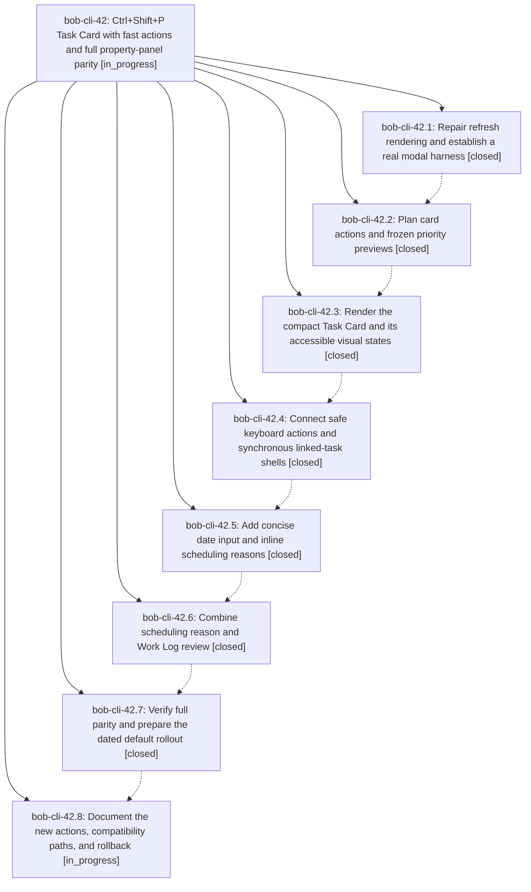

# Bead: bob-cli-42 — Ctrl+Shift+P Task Card with fast actions and full property-panel parity

[Bead Pages](../README.md) / bob-cli-42

**Status:** ◐ in_progress · **Type:** ▸ plan · **Tier:** epic
**Owner:** `bryanbugyi34@gmail.com` · **Created by:** [bbugyi200.apollo.research.05.linker.w0](https://github.com/bobs-org/bob-cli--agents/blob/main/sessions/bbugyi200.apollo.research.05.linker.w0.md) · **Assignee:** `bob-cli-42.land`
**Created:** 2026-10-03 16:27:19 EDT
**Plan:** [202610/ctrl\_shift\_p\_task\_card.md](https://github.com/bobs-org/bob-cli--plans/blob/main/202610/ctrl_shift_p_task_card.md)

## Description

Replace the property picker's first screen with a beautiful, reliable Task Card that reduces common priority actions to one key after opening, preserves every existing editing capability and stored side effect, and protects the October freshness trial with a staged rollout.

## Phases

| Bead | Title | Status | Size | Created | Agents | Commits |
|---|---|---|---|---|---:|---:|
| [bob-cli-42.1](bob-cli-42.1.md) | Repair refresh rendering and establish a real modal harness | ✓ closed | small | 2026-10-03 | 1 | 1 |
| [bob-cli-42.2](bob-cli-42.2.md) | Plan card actions and frozen priority previews | ✓ closed | medium | 2026-10-03 | 1 | 1 |
| [bob-cli-42.3](bob-cli-42.3.md) | Render the compact Task Card and its accessible visual states | ✓ closed | medium | 2026-10-03 | 1 | 1 |
| [bob-cli-42.4](bob-cli-42.4.md) | Connect safe keyboard actions and synchronous linked-task shells | ✓ closed | medium | 2026-10-03 | 1 | 1 |
| [bob-cli-42.5](bob-cli-42.5.md) | Add concise date input and inline scheduling reasons | ✓ closed | medium | 2026-10-03 | 1 | 1 |
| [bob-cli-42.6](bob-cli-42.6.md) | Combine scheduling reason and Work Log review | ✓ closed | medium | 2026-10-03 | 1 | 1 |
| [bob-cli-42.7](bob-cli-42.7.md) | Verify full parity and prepare the dated default rollout | ✓ closed | medium | 2026-10-03 | 1 | 1 |
| [bob-cli-42.8](bob-cli-42.8.md) | Document the new actions, compatibility paths, and rollback | ◐ in_progress | small | 2026-10-03 | 1 | 0 |

## Lineage

## Agents

| Agent | Bead | Commits |
|---|---|---:|
| [bbugyi200.apollo.bob-cli-42.1](https://github.com/bobs-org/bob-cli--agents/blob/main/agents/bbugyi200.apollo.bob-cli-42.1/README.md) | [bob-cli-42.1](bob-cli-42.1.md) | 1 |
| [bbugyi200.apollo.bob-cli-42.2](https://github.com/bobs-org/bob-cli--agents/blob/main/agents/bbugyi200.apollo.bob-cli-42.2/README.md) | [bob-cli-42.2](bob-cli-42.2.md) | 1 |
| [bbugyi200.apollo.bob-cli-42.3](https://github.com/bobs-org/bob-cli--agents/blob/main/agents/bbugyi200.apollo.bob-cli-42.3/README.md) | [bob-cli-42.3](bob-cli-42.3.md) | 1 |
| [bbugyi200.apollo.bob-cli-42.4](https://github.com/bobs-org/bob-cli--agents/blob/main/agents/bbugyi200.apollo.bob-cli-42.4/README.md) | [bob-cli-42.4](bob-cli-42.4.md) | 1 |
| [bbugyi200.apollo.bob-cli-42.5](https://github.com/bobs-org/bob-cli--agents/blob/main/agents/bbugyi200.apollo.bob-cli-42.5/README.md) | [bob-cli-42.5](bob-cli-42.5.md) | 1 |
| [bbugyi200.apollo.bob-cli-42.6](https://github.com/bobs-org/bob-cli--agents/blob/main/agents/bbugyi200.apollo.bob-cli-42.6/README.md) | [bob-cli-42.6](bob-cli-42.6.md) | 1 |
| [bbugyi200.apollo.bob-cli-42.7](https://github.com/bobs-org/bob-cli--agents/blob/main/agents/bbugyi200.apollo.bob-cli-42.7/README.md) | [bob-cli-42.7](bob-cli-42.7.md) | 1 |
| [bbugyi200.apollo.bob-cli-42.8](https://github.com/bobs-org/bob-cli--agents/blob/main/agents/bbugyi200.apollo.bob-cli-42.8/README.md) | [bob-cli-42.8](bob-cli-42.8.md) | 0 |
| [bbugyi200.apollo.bob-cli-42.land](https://github.com/bobs-org/bob-cli--agents/blob/main/agents/bbugyi200.apollo.bob-cli-42.land/README.md) | [bob-cli-42](README.md) | 0 |

## Commits

| Repo | Commit | Subject | Bead | Committed |
|---|---|---|---|---|
| bob-plugins | [`bob-plugins@aa38c1d`](https://github.com/bobs-org/bob-plugins/commit/aa38c1de122c323ed483bdf5cbb41738acbeb4db) | fix(navigation): repair refresh modal rendering | [bob-cli-42.1](bob-cli-42.1.md) | 2026-10-03 16:35:18 EDT |
| bob-plugins | [`bob-plugins@8813271`](https://github.com/bobs-org/bob-plugins/commit/8813271e51424db76222f2e5db787b50446e9fd9) | feat(navigation-hotkeys): add Task Card planning model | [bob-cli-42.2](bob-cli-42.2.md) | 2026-10-03 17:01:51 EDT |
| bob-plugins | [`bob-plugins@c0ff974`](https://github.com/bobs-org/bob-plugins/commit/c0ff9742efb7c49e948d61f50a06383948acb952) | feat(navigation-hotkeys): render compact Task Card view | [bob-cli-42.3](bob-cli-42.3.md) | 2026-10-03 17:31:33 EDT |
| bob-plugins | [`bob-plugins@b3269d9`](https://github.com/bobs-org/bob-plugins/commit/b3269d9b95bd752ce0478dc5c385ebc19dfbcb44) | feat(navigation): connect task card actions and safe link resolution | [bob-cli-42.4](bob-cli-42.4.md) | 2026-10-03 18:32:24 EDT |
| bob-plugins | [`bob-plugins@48f0466`](https://github.com/bobs-org/bob-plugins/commit/48f046624b448dbb90e9170244f3a0a201f66f38) | feat(navigation): add concise Task Card date input and inline reasons | [bob-cli-42.5](bob-cli-42.5.md) | 2026-10-03 18:59:07 EDT |
| bob-plugins | [`bob-plugins@a0b788c`](https://github.com/bobs-org/bob-plugins/commit/a0b788c5b62aa1d02d239ae70ce505c74249ceea) | feat(navigation-hotkeys): combine schedule reason and Work Log review | [bob-cli-42.6](bob-cli-42.6.md) | 2026-10-03 19:22:35 EDT |
| bob-plugins | [`bob-plugins@e872aee`](https://github.com/bobs-org/bob-plugins/commit/e872aeec61aec8748c98e66331d42262b666b98a) | feat(navigation-hotkeys): ship Task Card 2.0 rollout | [bob-cli-42.7](bob-cli-42.7.md) | 2026-10-03 20:05:02 EDT |
