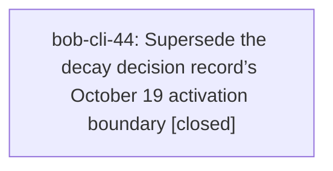

# Bead: bob-cli-44 — Supersede the decay decision record’s October 19 activation boundary

[Bead Pages](../README.md) / bob-cli-44

**Status:** ✓ closed · **Resolution:** done · **Type:** ◆ task · **Task type:** ▤ memory
**Owner:** `bryanbugyi34@gmail.com` · **Created by:** [bbugyi200.athena.0w4.f0](https://github.com/bobs-org/bob-cli--agents/blob/main/sessions/bbugyi200.athena.0w4.f0.md) · **Assignee:** `bob-cli-44` · **Size:** small
**Created:** 2026-10-04 06:20:17 EDT · **Closed:** 2026-10-04 07:06:03 EDT

## Description

Evidence: audited decisions:rotten-keeps-use-priority-decay read retains the 2026-10-19 activation condition in its rejected timer-fired-cards alternative and its date-bound reopening criterion; docs/freshness.md section 2a and section 14 encode the same gate. This turn authors an ungated-decay tale, without canonical memory edits. After the change is approved, create a short successor decision citing the approved no-trial-date plan and implementation evidence; mark the existing strand superseded-in-part only for the activation boundary and corresponding trial-extension reopening condition, retaining its accepted counting, explicit-consent, priority/log, and exclusion rules. Link both records under the memory-web supersession convention and run sase memory init. Do not claim implementation has landed before checking it. Obtain the explicit memory authorization required by sase_memory_write and task(memory) before editing or closing.

---

\## Memory update

- **Path:** `decisions/rotten-keeps-use-priority-decay.md`

Narrowly supersede the date-gated rollout policy with immediate gesture-triggered decay decisions once compatible updated plugins are installed; preserve the old accepted body apart from its supersession metadata and backlink, and preserve every non-date rule.

## Notes

[2026-10-04T10:34:26Z · bob-cli-44] Reviewed approved plan:202610/freshness_decay_without_trial_date_1.md. Cannot author the requested successor decision yet: current bob-cli still contains the 2026-10-19 boundary in docs/freshness.md and Rust config/state/CLI, and freshly opened bob-plugins source still contains FRESHNESS_DECAY_ACTIVE_FROM and its date-gated helpers. Need implementation evidence after the plan lands before changing canonical decision memory or closing this memory bead.

[2026-10-04T11:06:03Z · bob-cli-44] Verified implementation landed (bob-cli fc438bc schema 8, no decay_active_from / asks-from; bob-plugins f4b3562 ledger 1.28.0 / nav 2.2.0, freshness namespace v6, freshnessDecayCard v2, no FRESHNESS_DECAY_ACTIVE_FROM). Authored decisions/decay-decisions-are-available-immediately citing plan:202610/freshness_decay_without_trial_date_1.md. Marked rotten-keeps-use-priority-decay superseded-in-part for the 2026-10-19 activation boundary and trial-extension reopening only; counting, consent, priority/log, and exclusion rules retained. Ran sase memory init; roster shows the successor and the partly-superseded mark.

## References

- file:explicit:5174b046ebf0437b6c6f1c48

## Lineage

## Agents

| Agent | Bead | Commits |
|---|---|---:|
| [bbugyi200.athena.bob-cli-44](https://github.com/bobs-org/bob-cli--agents/blob/main/agents/bbugyi200.athena.bob-cli-44/README.md) | [bob-cli-44](README.md) | 1 |

## Commits

| Repo | Commit | Subject | Bead | Committed |
|---|---|---|---|---|
| bob-cli | [`b188144`](https://github.com/bobs-org/bob-cli/commit/b188144e62c06fcbbf71dc372870d2564c64b3f8) | docs(memory): supersede the decay trial-date activation boundary | [bob-cli-44](README.md) | 2026-10-04 07:07:05 EDT |
