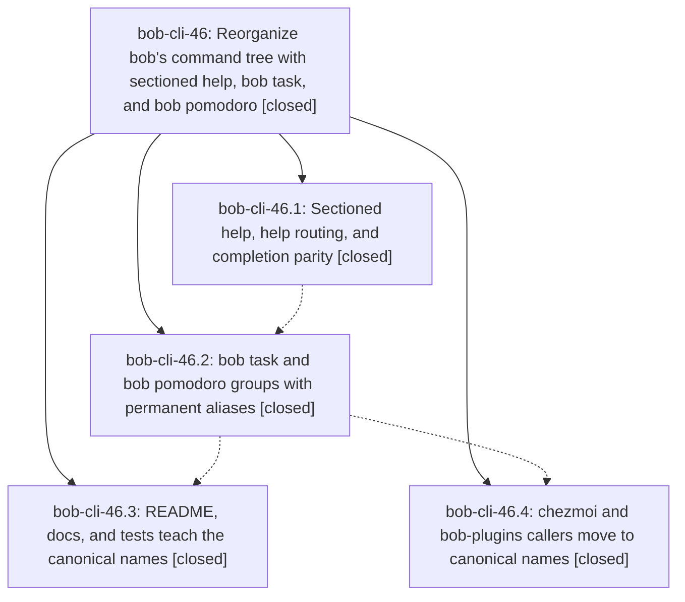

# Bead: bob-cli-46 — Reorganize bob's command tree with sectioned help, bob task, and bob pomodoro

[Bead Pages](../README.md) / bob-cli-46

**Status:** ✓ closed · **Resolution:** done · **Type:** ▸ plan · **Tier:** epic
**Owner:** `bryanbugyi34@gmail.com` · **Created by:** [bbugyi200.apollo.4y](https://github.com/bobs-org/bob-cli--agents/blob/main/sessions/bbugyi200.apollo.4y.md) · **Assignee:** `bob-cli-46.land`
**Created:** 2026-10-04 07:02:05 EDT · **Closed:** 2026-10-04 09:58:05 EDT
**Plan:** [202610/bob\_command\_tree.md](https://github.com/bobs-org/bob-cli--plans/blob/main/202610/bob_command_tree.md)

## Description

`bob -h` and `bob <TAB>` present 14 workflow-ordered commands in five sections plus a collapsed Capture protocol section; `bob task {archive,reconcile,reroll}` and `bob pomodoro {notify,status,tmux}` replace five opaque top-level names; every old spelling keeps working forever as a silent alias with byte-identical behavior; and the README, docs, tests, chezmoi, and bob-plugins all teach the canonical names.

## Notes

[2026-10-04T13:50:02Z · bob-cli-46.land] FOLLOW-UP TRIAGE (bob-cli-46 land, 2026-10-04): Reviewed every child note and deduplicated 10 PROPOSED FOLLOW-UP entries into eight distinct issues. /sase_new_task searches covered all task statuses, same-type searches, the last-week task sweep, and every active epic. Outcomes: (1) bob-cli-46.1 #1, bob-cli-46.2 #2, and bob-cli-46.3 #6/#8 clippy deny: independently reproduced at pomodoro_name.rs:808 on 192e8b5; appended DISCOVERED ISSUE to causal active epic bob-cli-28, whose .1 introduced the || true assertion; no duplicate task. (2) bob-cli-46.2 #3 BOB_DAY_FILE flake: corroborated root bug bob-cli-2e and flake bob-cli-40 with phase attribution and independent source audit; no new task. (3) bob-cli-46.4 #1 stage-ranker timing flake: corroborated bob-cli-3w with the phase's two suite failures (19.75/29.20 ms) and isolated pass; no new task. (4) bob-cli-46.3 #1 run_notify missing sleeps/ignored usage exit: new ready bug bob-cli-49 (large); independently reproduced no-arg exit 2 and verified unchanged pre-epic fc438bc code; worker must design an appropriate one-shot notifier, since blindly supplying sleeps would hang sync in an endless Pomodoro loop. (5) .3 #2 JSON options: new ready feature bob-cli-4a (large). (6) .3 #3 noun policy: new ready feature bob-cli-4b (large). (7) .3 #4 hand-parsed help restyle: new ready feature bob-cli-4c (medium). (8) .3 #5 decision record: new ready memory task bob-cli-4d (small), explicit memory authorization still required before writing. No proposal was declined. Additional discovered infrastructure gap: just check recipe missing, corroborated existing bob-cli-3c; symvision recipe also absent. Implementation evidence from .4 exact stale-skill removal list recorded on existing bob-cli-45; no claim of verifying all hosts and no duplicate filed. The above outcomes must be carried into the final epic close note.

[2026-10-04T13:50:08Z · bob-cli-46.land] LAND AUDIT before remaining tale: Read bob-cli-46 and all four children with every note plus approved plan:202610/bob_command_tree.md. Verified actual runner Section/SECTIONS, Leaf/Group routing and defaults, shared OsString alias rewrite preserving -- and non-UTF-8 tails, help path validation guarding capture free text, completion tree/presenter/context, hidden freshness seed and marked defaults, canonical leaf diagnostics/log/replay/commit strings with persisted ids untouched, alias/live-write/fallback fixtures, README/docs and chezmoi/plugin callers. Reviewed own main commits 660c171/b13f96c/192e8b5, chezmoi 53960fc0 and plugin 0e6620a. Main post-start non-epic commits e09c11b (Task Card docs), b188144 (immutable decay decision metadata), 354b5ae (remove freshness trial docs) are compatible and preserved. Fetched origin; no additional base-branch commits beyond HEAD 192e8b5. Linked post-phase drift: chezmoi 06eb7965 only regenerates memory index; bob-plugins c8ec83f already synchronizes migrated navigation comments/notice into fragments and generated main, 5b476ad noteReady perf work does not change command callers. Current navigation manifest is 2.2.1 (earlier claim of 2.1.1 is superseded by intervening version drift). Installed grouped-command rollout guard and shim --help checks pass. Current verify: just fmt pass; cargo test --lib runner:: 5/5; cargo test --test cli aliases -- --test-threads=4 13/13; just check unavailable (bob-cli-3c); cargo clippy sole error is pre-existing bob-cli-28 || true deny. No check-full run. sase bead epic-symbols bob-cli-46 reports none; just symvision unavailable. Epic has no parent_bead. REMAINING EPIC WORK: docs/obsidian-sync-exclusions.md:55 current nightly procedure still names move-done-tasks rather than task archive. This fails the plan's residual-sweep rule and is epic work, not a task follow-up. A single small tale must correct that wording, recheck any later drift and readiness, then close bob-cli-46 itself and mark its linked plan done in the same coder turn, without waiting for that turn's own commit.

[2026-10-04T13:52:41Z · bob-cli-46.land] Additional integration verification: npm run validate in the opened bob-plugins checkout passed generated-source build checks and all six manifests. This confirms the post-epic source-fragment synchronization is current.

[2026-10-04T13:58:05Z · bob-cli-46.land] Landed the approved command-tree epic after its final docs residual. Re-read the approved artifact plan:202610/bob_command_tree.md and all four closed phase beads/notes (bob-cli-46.1 through .4); verified all descendants complete. Re-read bob-cli-46 before close: no parent bead. Source and history audit: the implementation commits 660c171, b13f96c, and 192e8b5 satisfy the plan; preserved compatible non-epic commits e09c11b, b188144, and 354b5ae. Reviewed current HEAD f873b7b (freshness PRE/POST checklist tiers/schema 9); it does not affect command callers. Previously audited linked drift remains compatible: chezmoi 06eb7965 is generated memory index only; bob-plugins c8ec83f mirrors canonical navigation comments/notice and 5b476ad changes noteReady performance only. No new command-tree drift found.

Corrected docs/obsidian-sync-exclusions.md Procedure step 2 to say nightly runs vault-sync, task archive, vault-sync. Re-ran the planned residual search across README.md, docs, src, tests, and justfile: no other disallowed current-use old command spellings; remaining hits are alias/parity coverage, persisted identifiers, internal modules/files/state paths, the explicitly preserved vault_sync::run_notify call, historical/migration narrative, or one formerly/compatibility note.

Validation: cargo fmt --check passed; cargo test --test cli help:: -- --test-threads=4 passed (29/29). just check is unavailable because no recipe exists, corroborating existing bob-cli-3c; used the planned narrow checks. The known clippy deny at tests/cli/capture/pomodoro_name.rs:808 is pre-existing and belongs to bob-cli-28; it was independently reproduced on the base and is not claimed green here. Did not run just check-full. Prior epic evidence remains: just fmt, runner tests (5/5), alias tests (13/13), installed grouped-command/shim help checks, and bob-plugins npm run validate passed; check-full was not run. just symvision is unavailable; epic-symbols was checked immediately before close and has no remaining entries.

Follow-up triage carried forward with no duplicate tasks and no declined proposals: (1) clippy deny from .1 #1, .2 #2, .3 #6/#8 was reproduced and recorded on causal active epic bob-cli-28; no duplicate task. (2) BOB_DAY_FILE parallel flake from .2 #3 corroborated existing bob-cli-2e and bob-cli-40 with phase/source evidence. (3) stage-ranker timing flake from .4 #1 corroborated existing bob-cli-3w with its two loaded-suite failures (19.75/29.20 ms) and isolated pass. (4) vault_sync::run_notify no-argument notifier/ignored exit issue became ready bug bob-cli-49 (large), with one-shot behavior required; sleeps alone could loop indefinitely. (5) JSON option policy became ready feature bob-cli-4a (large). (6) singular/plural noun policy became ready feature bob-cli-4b (large). (7) hand-parsed help styling became ready feature bob-cli-4c (medium). (8) command-tree decision record became ready memory task bob-cli-4d (small); memory write still requires explicit authorization. Infrastructure gap just check was corroborated on bob-cli-3c; just symvision is also absent. The exact stale-skill removal list is recorded as implementation evidence on bob-cli-45; all hosts were not independently reverified, so that bead remains open.

## Phases

| Bead | Title | Status | Size | Created | Agents | Commits |
|---|---|---|---|---|---:|---:|
| [bob-cli-46.1](bob-cli-46.1.md) | Sectioned help, help routing, and completion parity | ✓ closed | medium | 2026-10-04 | 1 | 1 |
| [bob-cli-46.2](bob-cli-46.2.md) | bob task and bob pomodoro groups with permanent aliases | ✓ closed | medium | 2026-10-04 | 1 | 1 |
| [bob-cli-46.3](bob-cli-46.3.md) | README, docs, and tests teach the canonical names | ✓ closed | medium | 2026-10-04 | 1 | 1 |
| [bob-cli-46.4](bob-cli-46.4.md) | chezmoi and bob-plugins callers move to canonical names | ✓ closed | small | 2026-10-04 | 1 | 2 |

## Lineage

## Agents

| Agent | Bead | Commits |
|---|---|---:|
| [bbugyi200.apollo.bob-cli-46.1](https://github.com/bobs-org/bob-cli--agents/blob/main/agents/bbugyi200.apollo.bob-cli-46.1/README.md) | [bob-cli-46.1](bob-cli-46.1.md) | 1 |
| [bbugyi200.apollo.bob-cli-46.2](https://github.com/bobs-org/bob-cli--agents/blob/main/sessions/bbugyi200.apollo.bob-cli-46.2.md) | [bob-cli-46.2](bob-cli-46.2.md) | 1 |
| [bbugyi200.apollo.bob-cli-46.3](https://github.com/bobs-org/bob-cli--agents/blob/main/sessions/bbugyi200.apollo.bob-cli-46.3.md) | [bob-cli-46.3](bob-cli-46.3.md) | 1 |
| [bbugyi200.apollo.bob-cli-46.4](https://github.com/bobs-org/bob-cli--agents/blob/main/agents/bbugyi200.apollo.bob-cli-46.4/README.md) | [bob-cli-46.4](bob-cli-46.4.md) | 2 |
| [bbugyi200.apollo.bob-cli-46.land](https://github.com/bobs-org/bob-cli--agents/blob/main/sessions/bbugyi200.apollo.bob-cli-46.land.md) | [bob-cli-46](README.md) | 2 |

## Commits

| Repo | Commit | Subject | Bead | Committed |
|---|---|---|---|---|
| bob-cli | [`660c171`](https://github.com/bobs-org/bob-cli/commit/660c171c6b281053d86907b3e908fce032f8f141) | feat(cli): add sectioned help and routing | [bob-cli-46.1](bob-cli-46.1.md) | 2026-10-04 07:44:26 EDT |
| bob-cli | [`b13f96c`](https://github.com/bobs-org/bob-cli/commit/b13f96ccfbfdaac8c06e20c0b343f0f5cce7de60) | feat(cli): nest task and pomodoro command groups | [bob-cli-46.2](bob-cli-46.2.md) | 2026-10-04 08:56:02 EDT |
| bob-plugins | [`bob-plugins@0e6620a`](https://github.com/bobs-org/bob-plugins/commit/0e6620a2a58c5fbc82db786fe42f7155223a3673) | fix(plugins): use canonical task reconcile notice | [bob-cli-46.4](bob-cli-46.4.md) | 2026-10-04 09:09:08 EDT |
| chezmoi | [`chezmoi@53960fc`](https://github.com/bbugyi200/dotfiles/commit/53960fc09b3aadf9da3c3932f269f140ceda9da8) | fix(chezmoi): use canonical bob command paths | [bob-cli-46.4](bob-cli-46.4.md) | 2026-10-04 09:09:54 EDT |
| bob-cli | [`192e8b5`](https://github.com/bobs-org/bob-cli/commit/192e8b51157a7616ddeecf4161667b0c538699e6) | docs(cli): teach canonical task and pomodoro names | [bob-cli-46.3](bob-cli-46.3.md) | 2026-10-04 09:35:22 EDT |
| bob-cli | [`76df6b6`](https://github.com/bobs-org/bob-cli/commit/76df6b656a963e1defaaf1fa9c83caeb20ffb8aa) | docs(cli): correct nightly archive command and land bob-cli-46 | [bob-cli-46](README.md) | 2026-10-04 09:59:45 EDT |
| bob-cli--plans | [`bob-cli--plans@4c10fc5`](https://github.com/bobs-org/bob-cli--plans/commit/4c10fc54e470ed795ffd7b99afa229ad1dcf1ce1) | docs(plan): mark command tree epic done | [bob-cli-46](README.md) | 2026-10-04 10:00:36 EDT |
