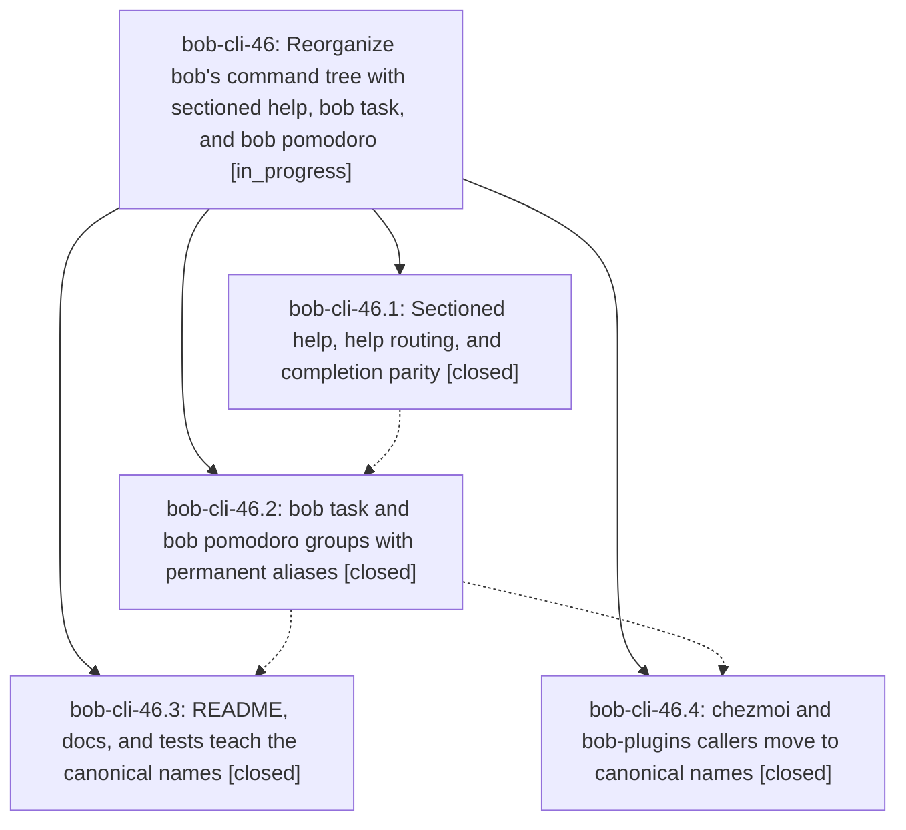

# Bead: bob-cli-46 — Reorganize bob's command tree with sectioned help, bob task, and bob pomodoro

[Bead Pages](../README.md) / bob-cli-46

**Status:** ◐ in_progress · **Type:** ▸ plan · **Tier:** epic
**Owner:** `bryanbugyi34@gmail.com` · **Created by:** [bbugyi200.apollo.4y](https://github.com/bobs-org/bob-cli--agents/blob/main/sessions/bbugyi200.apollo.4y.md) · **Assignee:** `bob-cli-46.land`
**Created:** 2026-10-04 07:02:05 EDT
**Plan:** [202610/bob\_command\_tree.md](https://github.com/bobs-org/bob-cli--plans/blob/main/202610/bob_command_tree.md)

## Description

`bob -h` and `bob <TAB>` present 14 workflow-ordered commands in five sections plus a collapsed Capture protocol section; `bob task {archive,reconcile,reroll}` and `bob pomodoro {notify,status,tmux}` replace five opaque top-level names; every old spelling keeps working forever as a silent alias with byte-identical behavior; and the README, docs, tests, chezmoi, and bob-plugins all teach the canonical names.

## Phases

| Bead | Title | Status | Size | Created | Agents | Commits |
|---|---|---|---|---|---:|---:|
| [bob-cli-46.1](bob-cli-46.1.md) | Sectioned help, help routing, and completion parity | ✓ closed | medium | 2026-10-04 | 1 | 1 |
| [bob-cli-46.2](bob-cli-46.2.md) | bob task and bob pomodoro groups with permanent aliases | ✓ closed | medium | 2026-10-04 | 1 | 1 |
| [bob-cli-46.3](bob-cli-46.3.md) | README, docs, and tests teach the canonical names | ✓ closed | medium | 2026-10-04 | 1 | 1 |
| [bob-cli-46.4](bob-cli-46.4.md) | chezmoi and bob-plugins callers move to canonical names | ✓ closed | small | 2026-10-04 | 1 | 0 |

## Lineage

## Agents

| Agent | Bead | Commits |
|---|---|---:|
| [bbugyi200.apollo.bob-cli-46.1](https://github.com/bobs-org/bob-cli--agents/blob/main/agents/bbugyi200.apollo.bob-cli-46.1/README.md) | [bob-cli-46.1](bob-cli-46.1.md) | 1 |
| [bbugyi200.apollo.bob-cli-46.2](https://github.com/bobs-org/bob-cli--agents/blob/main/sessions/bbugyi200.apollo.bob-cli-46.2.md) | [bob-cli-46.2](bob-cli-46.2.md) | 1 |
| [bbugyi200.apollo.bob-cli-46.3](https://github.com/bobs-org/bob-cli--agents/blob/main/sessions/bbugyi200.apollo.bob-cli-46.3.md) | [bob-cli-46.3](bob-cli-46.3.md) | 1 |
| [bbugyi200.apollo.bob-cli-46.4](https://github.com/bobs-org/bob-cli--agents/blob/main/agents/bbugyi200.apollo.bob-cli-46.4/README.md) | [bob-cli-46.4](bob-cli-46.4.md) | 0 |
| [bbugyi200.apollo.bob-cli-46.land](https://github.com/bobs-org/bob-cli--agents/blob/main/agents/bbugyi200.apollo.bob-cli-46.land/README.md) | [bob-cli-46](README.md) | 0 |

## Commits

| Repo | Commit | Subject | Bead | Committed |
|---|---|---|---|---|
| bob-cli | [`660c171`](https://github.com/bobs-org/bob-cli/commit/660c171c6b281053d86907b3e908fce032f8f141) | feat(cli): add sectioned help and routing | [bob-cli-46.1](bob-cli-46.1.md) | 2026-10-04 07:44:26 EDT |
| bob-cli | [`b13f96c`](https://github.com/bobs-org/bob-cli/commit/b13f96ccfbfdaac8c06e20c0b343f0f5cce7de60) | feat(cli): nest task and pomodoro command groups | [bob-cli-46.2](bob-cli-46.2.md) | 2026-10-04 08:56:02 EDT |
| bob-cli | [`192e8b5`](https://github.com/bobs-org/bob-cli/commit/192e8b51157a7616ddeecf4161667b0c538699e6) | docs(cli): teach canonical task and pomodoro names | [bob-cli-46.3](bob-cli-46.3.md) | 2026-10-04 09:35:22 EDT |
