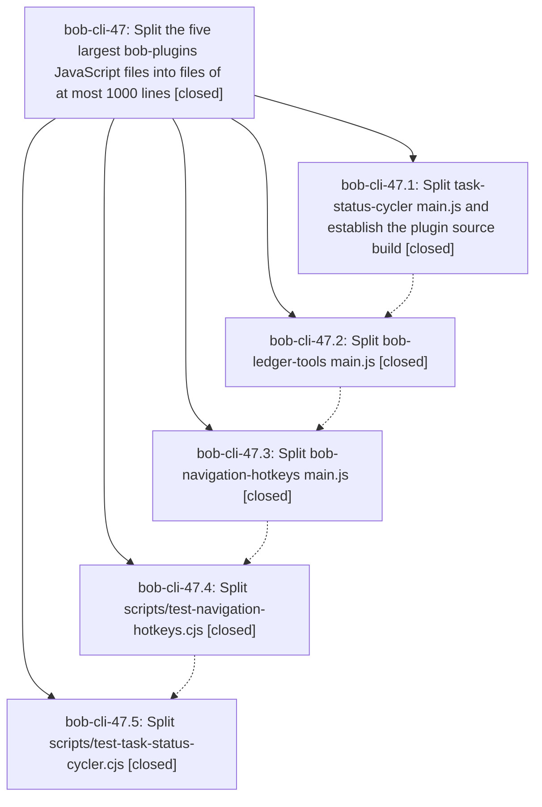

# Bead: bob-cli-47 — Split the five largest bob-plugins JavaScript files into files of at most 1000 lines

[Bead Pages](../README.md) / bob-cli-47

**Status:** ✓ closed · **Resolution:** done · **Type:** ▸ plan · **Tier:** epic
**Owner:** `bryanbugyi34@gmail.com` · **Created by:** [bbugyi200.apollo.4z](https://github.com/bobs-org/bob-cli--agents/blob/main/sessions/bbugyi200.apollo.4z.md) · **Assignee:** `bob-cli-47.land`
**Created:** 2026-10-04 07:13:45 EDT · **Closed:** 2026-10-04 10:18:51 EDT
**Plan:** [202610/split\_largest\_bob\_plugins\_js\_files.md](https://github.com/bobs-org/bob-cli--plans/blob/main/202610/split_largest_bob_plugins_js_files.md)

## Description

The five largest JavaScript files in the bob-plugins linked repo are each split into multiple hand-edited files of at most 1000 lines. Plugin runtime behavior, the `helpers` test surface, `bob plugins sync`, and the full `npm test` / `npm run validate` suite stay unchanged.

## Notes

[2026-10-04T14:18:51Z · bob-cli-47.land] LAND VERIFICATION. Read all five closed phases (bob-cli-47.1-.5) and every note, the plan, and epic commits 6f8aca0, 5680659, c1762af, 5d074dc, b854201 in bob-plugins. All five targets are split. task-status-cycler, bob-ledger-tools and bob-navigation-hotkeys build from src/fragments.json (21/35/70 fragments); their main.js files are generated. The nav and cycler test monoliths are now per-area files plus navigation-hotkeys-harness.cjs and task-status-cycler-harness.cjs. Every hand-edited file the epic created or touched is <=1000 lines. The one >1000 file in the range, test-ledger-tools-note-ready.cjs (1253), was already 1114 before the epic and grew in unrelated 5b476ad. On master b854201: npm run build:check ok, npm run validate 6/6, npm test 1764/1764, and bob plugins list shows all 6 plugins synced. Official parity passes at each split commit against its parent: cycler 183 helpers/187 methods, ledger 212/191, nav 574/308 with --split-helper BulletPropertyPickerModal once the checker fix below is applied. The live onClose body is preserved at the first-definition key slot. INTEGRATION: Non-epic bob-plugins commits since the epic started (5b476ad ledger perf, 0e6620a canonical notice, c8ec83f cycler API v2) all edited src/ fragments, and build:check confirms the generated bundles are current. c8ec83f retargeted the nav fragment comments after 0e6620a had edited the generated nav main.js directly. 47.5 carried c8ec83f's 6 new cycler tests into the split (185 names). bob-cli commits since epic start do not touch plugins. docs/plugins.md does not claim main.js is hand-edited, so it needs no change. EPIC-CAUSED FIXES IN THIS LANDING (bob-plugins): (1) scripts/check-split-parity.mjs --split-helper compared String(prototype.constructor), the whole class source, so it always failed for a mixin-split class (47.3 notes #2/#5). It now skips that string, as the default export already did, but still requires the same class name and superclass name. A new test-plugin-build.cjs case covers accept, changed-method, and reparented cases. (2) README now says main.js is generated from src/ for opted-in plugins and documents what --split-helper compares. FOLLOW-UP TRIAGE: test-navigation-dependencies-stage 16 ms timing flake (47.1 #1, 47.2 #3, 47.3 #3/#6) is not epic-caused because the clean base also failed; +1 on existing bob-cli-3w. Dead duplicate BulletPropertyPickerModal onClose (47.3 #1) is a latent bug from c0ff974 that the split preserved; filed new task bob-cli-4e (bug, small, ready). Nav Pomodoro recognizer comment retarget (47.2 #1): already done by 47.3 (src/010-requires-and-config.js:41 points at bob-ledger-tools/src/010-load-and-constants.js), so declined. README styles.css list omitting bob-ledger-tools (47.2 #2): pre-existing one-word doc gap, fixed inline next to the epic README edit instead of filing a task, so declined. check-split-parity --split-helper (47.3 #2/#5) is epic-caused and fixed above, so declined as a task. No --epic-symbol entries.

## Phases

| Bead | Title | Status | Size | Created | Agents | Commits |
|---|---|---|---|---|---:|---:|
| [bob-cli-47.1](bob-cli-47.1.md) | Split task-status-cycler main.js and establish the plugin source build | ✓ closed | large | 2026-10-04 | 1 | 1 |
| [bob-cli-47.2](bob-cli-47.2.md) | Split bob-ledger-tools main.js | ✓ closed | large | 2026-10-04 | 1 | 1 |
| [bob-cli-47.3](bob-cli-47.3.md) | Split bob-navigation-hotkeys main.js | ✓ closed | large | 2026-10-04 | 1 | 1 |
| [bob-cli-47.4](bob-cli-47.4.md) | Split scripts/test-navigation-hotkeys.cjs | ✓ closed | large | 2026-10-04 | 1 | 1 |
| [bob-cli-47.5](bob-cli-47.5.md) | Split scripts/test-task-status-cycler.cjs | ✓ closed | large | 2026-10-04 | 1 | 1 |

## Lineage

## Agents

| Agent | Bead | Commits |
|---|---|---:|
| [bbugyi200.apollo.bob-cli-47.1](https://github.com/bobs-org/bob-cli--agents/blob/main/sessions/bbugyi200.apollo.bob-cli-47.1.md) | [bob-cli-47.1](bob-cli-47.1.md) | 1 |
| [bbugyi200.apollo.bob-cli-47.2](https://github.com/bobs-org/bob-cli--agents/blob/main/sessions/bbugyi200.apollo.bob-cli-47.2.md) | [bob-cli-47.2](bob-cli-47.2.md) | 1 |
| [bbugyi200.apollo.bob-cli-47.3](https://github.com/bobs-org/bob-cli--agents/blob/main/sessions/bbugyi200.apollo.bob-cli-47.3.md) | [bob-cli-47.3](bob-cli-47.3.md) | 1 |
| [bbugyi200.apollo.bob-cli-47.4](https://github.com/bobs-org/bob-cli--agents/blob/main/sessions/bbugyi200.apollo.bob-cli-47.4.md) | [bob-cli-47.4](bob-cli-47.4.md) | 1 |
| [bbugyi200.apollo.bob-cli-47.5](https://github.com/bobs-org/bob-cli--agents/blob/main/sessions/bbugyi200.apollo.bob-cli-47.5.md) | [bob-cli-47.5](bob-cli-47.5.md) | 1 |
| [bbugyi200.apollo.bob-cli-47.land](https://github.com/bobs-org/bob-cli--agents/blob/main/agents/bbugyi200.apollo.bob-cli-47.land/README.md) | [bob-cli-47](README.md) | 2 |

## Commits

| Repo | Commit | Subject | Bead | Committed |
|---|---|---|---|---|
| bob-plugins | [`bob-plugins@6f8aca0`](https://github.com/bobs-org/bob-plugins/commit/6f8aca0beae21e66922ae61a6d865d642d056803) | feat(plugins): add deterministic fragment build and split task status cycler | [bob-cli-47.1](bob-cli-47.1.md) | 2026-10-04 07:43:42 EDT |
| bob-plugins | [`bob-plugins@5680659`](https://github.com/bobs-org/bob-plugins/commit/56806594c212627956e06a5a7981c66ada7de4be) | feat(bob-ledger-tools): split main.js onto the fragment source build | [bob-cli-47.2](bob-cli-47.2.md) | 2026-10-04 08:13:32 EDT |
| bob-plugins | [`bob-plugins@c1762af`](https://github.com/bobs-org/bob-plugins/commit/c1762af3b757579d700dceb010e63a36bf8537b0) | refactor(bob-navigation-hotkeys): split navigation source into fragments | [bob-cli-47.3](bob-cli-47.3.md) | 2026-10-04 09:08:16 EDT |
| bob-plugins | [`bob-plugins@5d074dc`](https://github.com/bobs-org/bob-plugins/commit/5d074dc340173f94cb9353f11a0241d9a8717af5) | refactor(test): split navigation hotkeys suite | [bob-cli-47.4](bob-cli-47.4.md) | 2026-10-04 09:47:50 EDT |
| bob-plugins | [`bob-plugins@b854201`](https://github.com/bobs-org/bob-plugins/commit/b8542019284ca72e2dfe36b60c523edbe47b36ed) | refactor(test): split task-status-cycler suite | [bob-cli-47.5](bob-cli-47.5.md) | 2026-10-04 10:09:02 EDT |
| bob-plugins | [`bob-plugins@cd89f31`](https://github.com/bobs-org/bob-plugins/commit/cd89f31ddad384b3cefce1e9cbe7884ad6c07e3e) | fix(parity): accept mixin-split helper classes in check-split-parity | [bob-cli-47](README.md) | 2026-10-04 10:19:49 EDT |
| bob-cli--plans | [`bob-cli--plans@7c50cc1`](https://github.com/bobs-org/bob-cli--plans/commit/7c50cc1e1f52a3262cc8fdcfee5c7ed003716de2) | chore(plans): mark split\_largest\_bob\_plugins\_js\_files done | [bob-cli-47](README.md) | 2026-10-04 10:20:29 EDT |
