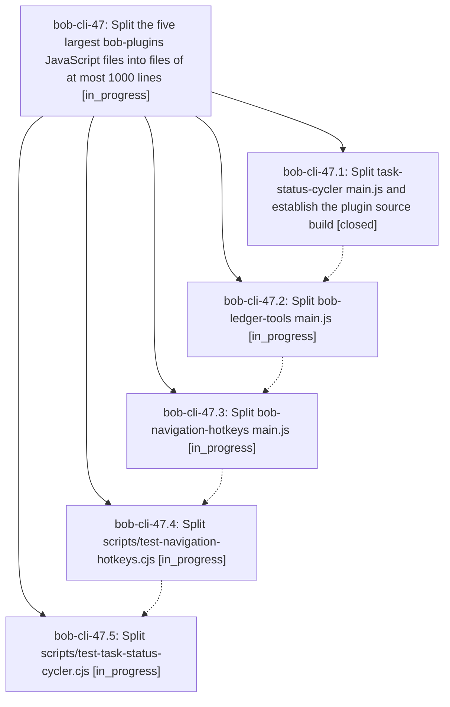

# Bead: bob-cli-47 — Split the five largest bob-plugins JavaScript files into files of at most 1000 lines

[Bead Pages](../README.md) / bob-cli-47

**Status:** ◐ in_progress · **Type:** ▸ plan · **Tier:** epic
**Owner:** `bryanbugyi34@gmail.com` · **Created by:** [bbugyi200.apollo.4z](https://github.com/bobs-org/bob-cli--agents/blob/main/sessions/bbugyi200.apollo.4z.md) · **Assignee:** `bob-cli-47.land`
**Created:** 2026-10-04 07:13:45 EDT
**Plan:** [202610/split\_largest\_bob\_plugins\_js\_files.md](https://github.com/bobs-org/bob-cli--plans/blob/main/202610/split_largest_bob_plugins_js_files.md)

## Description

The five largest JavaScript files in the bob-plugins linked repo are each split into multiple hand-edited files of at most 1000 lines. Plugin runtime behavior, the `helpers` test surface, `bob plugins sync`, and the full `npm test` / `npm run validate` suite stay unchanged.

## Phases

| Bead | Title | Status | Size | Created | Agents | Commits |
|---|---|---|---|---|---:|---:|
| [bob-cli-47.1](bob-cli-47.1.md) | Split task-status-cycler main.js and establish the plugin source build | ✓ closed | large | 2026-10-04 | 1 | 1 |
| [bob-cli-47.2](bob-cli-47.2.md) | Split bob-ledger-tools main.js | ◐ in_progress | large | 2026-10-04 | 1 | 0 |
| [bob-cli-47.3](bob-cli-47.3.md) | Split bob-navigation-hotkeys main.js | ◐ in_progress | large | 2026-10-04 | 1 | 0 |
| [bob-cli-47.4](bob-cli-47.4.md) | Split scripts/test-navigation-hotkeys.cjs | ◐ in_progress | large | 2026-10-04 | 1 | 0 |
| [bob-cli-47.5](bob-cli-47.5.md) | Split scripts/test-task-status-cycler.cjs | ◐ in_progress | large | 2026-10-04 | 1 | 0 |

## Lineage

## Agents

| Agent | Bead | Commits |
|---|---|---:|
| [bbugyi200.apollo.bob-cli-47.1](https://github.com/bobs-org/bob-cli--agents/blob/main/sessions/bbugyi200.apollo.bob-cli-47.1.md) | [bob-cli-47.1](bob-cli-47.1.md) | 1 |
| [bbugyi200.apollo.bob-cli-47.2](https://github.com/bobs-org/bob-cli--agents/blob/main/agents/bbugyi200.apollo.bob-cli-47.2/README.md) | [bob-cli-47.2](bob-cli-47.2.md) | 0 |
| [bbugyi200.apollo.bob-cli-47.3](https://github.com/bobs-org/bob-cli--agents/blob/main/agents/bbugyi200.apollo.bob-cli-47.3/README.md) | [bob-cli-47.3](bob-cli-47.3.md) | 0 |
| [bbugyi200.apollo.bob-cli-47.4](https://github.com/bobs-org/bob-cli--agents/blob/main/agents/bbugyi200.apollo.bob-cli-47.4/README.md) | [bob-cli-47.4](bob-cli-47.4.md) | 0 |
| [bbugyi200.apollo.bob-cli-47.5](https://github.com/bobs-org/bob-cli--agents/blob/main/agents/bbugyi200.apollo.bob-cli-47.5/README.md) | [bob-cli-47.5](bob-cli-47.5.md) | 0 |
| [bbugyi200.apollo.bob-cli-47.land](https://github.com/bobs-org/bob-cli--agents/blob/main/agents/bbugyi200.apollo.bob-cli-47.land/README.md) | [bob-cli-47](README.md) | 0 |

## Commits

| Repo | Commit | Subject | Bead | Committed |
|---|---|---|---|---|
| bob-plugins | [`bob-plugins@6f8aca0`](https://github.com/bobs-org/bob-plugins/commit/6f8aca0beae21e66922ae61a6d865d642d056803) | feat(plugins): add deterministic fragment build and split task status cycler | [bob-cli-47.1](bob-cli-47.1.md) | 2026-10-04 07:43:42 EDT |
