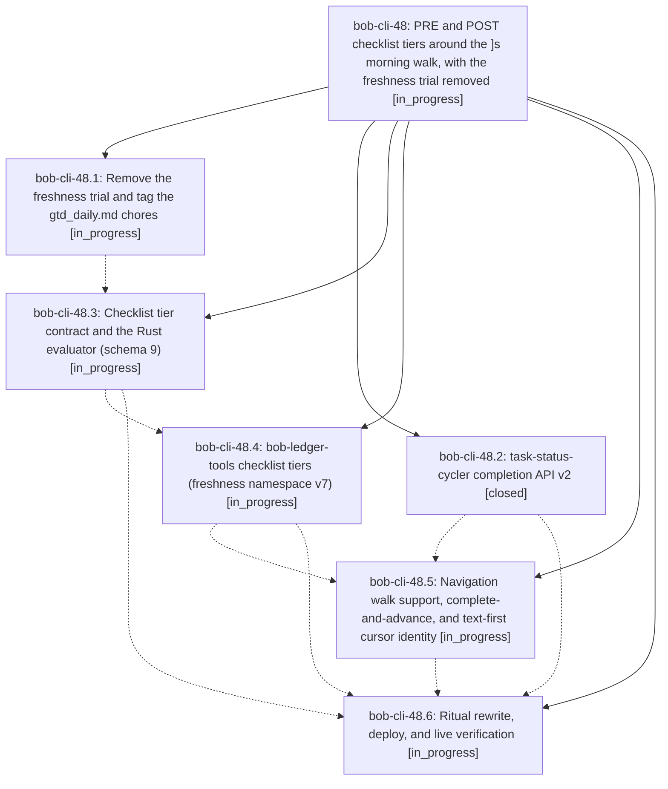

# Bead: bob-cli-48 — PRE and POST checklist tiers around the \]s morning walk, with the freshness trial removed

[Bead Pages](../README.md) / bob-cli-48

**Status:** ◐ in_progress · **Type:** ▸ plan · **Tier:** epic
**Owner:** `bryanbugyi34@gmail.com` · **Created by:** [bbugyi200.apollo.research.07.linker.w1](https://github.com/bobs-org/bob-cli--agents/blob/main/sessions/bbugyi200.apollo.research.07.linker.w1.md) · **Assignee:** `bob-cli-48.land`
**Created:** 2026-10-04 09:05:22 EDT
**Plan:** [202610/gtd\_pre\_post\_review\_tiers.md](https://github.com/bobs-org/bob-cli--plans/blob/main/202610/gtd_pre_post_review_tiers.md)

## Description

The ]s walk opens with every open, actionable-today #gtd #pre task (the gtd_daily.md chores) and closes with the #gtd #post Morning review. Bryan resolves each of those rows by completing it in the walk, and checking Morning review last certifies the review. No doc, vault note, decision record, or bead waits on a freshness trial any more.

## Phases

| Bead | Title | Status | Size | Created | Agents | Commits |
|---|---|---|---|---|---:|---:|
| [bob-cli-48.1](bob-cli-48.1.md) | Remove the freshness trial and tag the gtd\_daily.md chores | ◐ in_progress | small | 2026-10-04 | 1 | 0 |
| [bob-cli-48.2](bob-cli-48.2.md) | task-status-cycler completion API v2 | ✓ closed | small | 2026-10-04 | 1 | 1 |
| [bob-cli-48.3](bob-cli-48.3.md) | Checklist tier contract and the Rust evaluator (schema 9) | ◐ in_progress | medium | 2026-10-04 | 1 | 0 |
| [bob-cli-48.4](bob-cli-48.4.md) | bob-ledger-tools checklist tiers (freshness namespace v7) | ◐ in_progress | medium | 2026-10-04 | 1 | 0 |
| [bob-cli-48.5](bob-cli-48.5.md) | Navigation walk support, complete-and-advance, and text-first cursor identity | ◐ in_progress | medium | 2026-10-04 | 1 | 0 |
| [bob-cli-48.6](bob-cli-48.6.md) | Ritual rewrite, deploy, and live verification | ◐ in_progress | small | 2026-10-04 | 1 | 0 |

## Lineage

## Agents

| Agent | Bead | Commits |
|---|---|---:|
| [bbugyi200.apollo.bob-cli-48.1](https://github.com/bobs-org/bob-cli--agents/blob/main/agents/bbugyi200.apollo.bob-cli-48.1/README.md) | [bob-cli-48.1](bob-cli-48.1.md) | 0 |
| [bbugyi200.apollo.bob-cli-48.2](https://github.com/bobs-org/bob-cli--agents/blob/main/agents/bbugyi200.apollo.bob-cli-48.2/README.md) | [bob-cli-48.2](bob-cli-48.2.md) | 1 |
| [bbugyi200.apollo.bob-cli-48.3](https://github.com/bobs-org/bob-cli--agents/blob/main/agents/bbugyi200.apollo.bob-cli-48.3/README.md) | [bob-cli-48.3](bob-cli-48.3.md) | 0 |
| [bbugyi200.apollo.bob-cli-48.4](https://github.com/bobs-org/bob-cli--agents/blob/main/agents/bbugyi200.apollo.bob-cli-48.4/README.md) | [bob-cli-48.4](bob-cli-48.4.md) | 0 |
| [bbugyi200.apollo.bob-cli-48.5](https://github.com/bobs-org/bob-cli--agents/blob/main/agents/bbugyi200.apollo.bob-cli-48.5/README.md) | [bob-cli-48.5](bob-cli-48.5.md) | 0 |
| [bbugyi200.apollo.bob-cli-48.6](https://github.com/bobs-org/bob-cli--agents/blob/main/agents/bbugyi200.apollo.bob-cli-48.6/README.md) | [bob-cli-48.6](bob-cli-48.6.md) | 0 |
| [bbugyi200.apollo.bob-cli-48.land](https://github.com/bobs-org/bob-cli--agents/blob/main/agents/bbugyi200.apollo.bob-cli-48.land/README.md) | [bob-cli-48](README.md) | 0 |

## Commits

| Repo | Commit | Subject | Bead | Committed |
|---|---|---|---|---|
| bob-plugins | [`bob-plugins@c8ec83f`](https://github.com/bobs-org/bob-plugins/commit/c8ec83fae6a094a5c3762418200e2e5b91f4e0f3) | feat(task-status-cycler): add completeTaskAtCursor API v2 | [bob-cli-48.2](bob-cli-48.2.md) | 2026-10-04 09:21:55 EDT |
