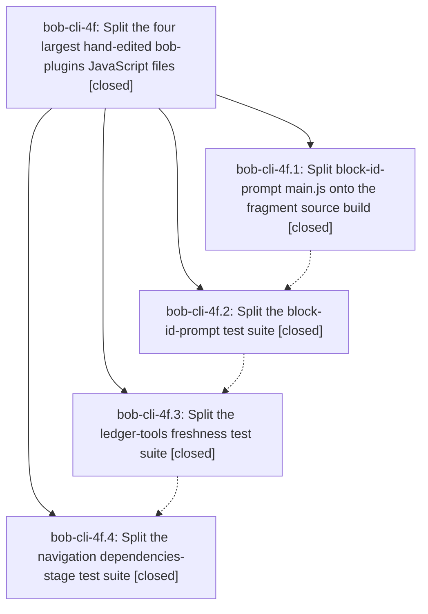

# Bead: bob-cli-4f — Split the four largest hand-edited bob-plugins JavaScript files

[Bead Pages](../README.md) / bob-cli-4f

**Status:** ✓ closed · **Resolution:** done · **Type:** ▸ plan · **Tier:** epic
**Owner:** `bryanbugyi34@gmail.com` · **Created by:** [bbugyi200.apollo.54](https://github.com/bobs-org/bob-cli--agents/blob/main/sessions/bbugyi200.apollo.54.md) · **Assignee:** `bob-cli-4f.land`
**Created:** 2026-10-04 21:42:18 EDT · **Closed:** 2026-10-04 23:10:36 EDT
**Plan:** [202610/split\_largest\_bob\_plugins\_js\_files\_1.md](https://github.com/bobs-org/bob-cli--plans/blob/main/202610/split_largest_bob_plugins_js_files_1.md)

## Description

The four largest hand-edited JavaScript files in bob-plugins are each split into behavior-identical files of at most 1000 lines, with every test still running.

## Notes

[2026-10-05T03:10:36Z · bob-cli-4f.land] LAND VERIFIED: Reviewed the epic's own record (no pre-landing notes), accepted plan plan:202610/split_largest_bob_plugins_js_files_1.md, all four closed phase beads, every one of their six notes, and bob-plugins commits 03f0c17/2486da9/474d6fe/b662018. Read generated-source diff, ordered fragment build/manifest, duplicate-safe mixin installer/exports, all three harnesses, representative tests, package test registration and README changes. Independently verified source parity against 2c3eb4c: 64 exported helpers, 73 prototype methods/descriptors and dependency calls unchanged. Test registration capture confirms all 179 block-id-prompt, 57 ledger freshness and 61 navigation-stage names, callback source bytes and options are identical to their pre-split commits; old monoliths are removed and all 22 new files explicitly registered. Each new file passed standalone (297/297 total, no failures/skips/cancellations). npm test passed 1809/1809; its build:check gate passed for four generated plugins; npm run validate passed 6/6. Every epic-created/modified hand-edited file is <=1000 lines: largest new test file 821, largest source fragment 688. New out-of-scope ranking begins test-navigation-roll-decay.cjs 2685 and test-navigation-freshness.cjs 2259. bob plugins list --no-pull against the opened linked checkout confirms 6/6 vault plugins synced, 0 drift, block-id-prompt 1.21.2.

INTEGRATION: Refreshed both origin branches and compared their tips. bob-plugins b662018 contains only this epic's four commits after first epic commit 03f0c17; bob-cli master/origin/master 2152202 has no commits since epic creation (2026-10-05T01:42:18Z). Reviewed existing CLI scan/sync and install-all consumers: deployment still reads committed main.js/manifest/styles and is compatible with the generated entrypoint. No post-start unrelated changes, duplicated consumers, conflicts, or missing feature integration remained.

FOLLOW-UP TRIAGE: Using /sase_new_task, searched semantic duplicates across statuses, swept last-week tasks, and inspected all three in-progress epics. bob-cli-4f.2 note #1 (16.62ms stage-ranker flake) corroborated existing ready flake task bob-cli-3w with phase attribution, fail/pass evidence and its new entry-and-view test path; no duplicate task, and no new timing failure claimed by this lander. bob-cli-4f.3 note #1 (adopt shared ledger harness in siblings) became small feature task bob-cli-4g, limited to compatible freshness-footer and freshness-mark tests; boilerplate predates this epic and the accepted plan explicitly excludes sibling migration. Neither proposal was declined. just check exits 1 because the recipe is absent; independently corroborated existing infrastructure task bob-cli-3c. Used the accepted plugin checks above; no just check-full run. All managed bead triage commits are published.

CLOSEOUT: All four phases closed normally with resolution done; no parent bead on the epic. sase bead epic-symbols bob-cli-4f reports no entries, and neither repository has a symvision recipe. No epic-caused issue remains. Close normally without force; mark the linked epic plan status done after close.

## Phases

| Bead | Title | Status | Size | Created | Agents | Commits |
|---|---|---|---|---|---:|---:|
| [bob-cli-4f.1](bob-cli-4f.1.md) | Split block-id-prompt main.js onto the fragment source build | ✓ closed | large | 2026-10-04 | 1 | 1 |
| [bob-cli-4f.2](bob-cli-4f.2.md) | Split the block-id-prompt test suite | ✓ closed | large | 2026-10-04 | 1 | 1 |
| [bob-cli-4f.3](bob-cli-4f.3.md) | Split the ledger-tools freshness test suite | ✓ closed | large | 2026-10-04 | 1 | 1 |
| [bob-cli-4f.4](bob-cli-4f.4.md) | Split the navigation dependencies-stage test suite | ✓ closed | large | 2026-10-04 | 1 | 1 |

## Lineage

## Agents

| Agent | Bead | Commits |
|---|---|---:|
| [bbugyi200.apollo.bob-cli-4f.1](https://github.com/bobs-org/bob-cli--agents/blob/main/sessions/bbugyi200.apollo.bob-cli-4f.1.md) | [bob-cli-4f.1](bob-cli-4f.1.md) | 1 |
| [bbugyi200.apollo.bob-cli-4f.2](https://github.com/bobs-org/bob-cli--agents/blob/main/sessions/bbugyi200.apollo.bob-cli-4f.2.md) | [bob-cli-4f.2](bob-cli-4f.2.md) | 1 |
| [bbugyi200.apollo.bob-cli-4f.3](https://github.com/bobs-org/bob-cli--agents/blob/main/sessions/bbugyi200.apollo.bob-cli-4f.3.md) | [bob-cli-4f.3](bob-cli-4f.3.md) | 1 |
| [bbugyi200.apollo.bob-cli-4f.4](https://github.com/bobs-org/bob-cli--agents/blob/main/sessions/bbugyi200.apollo.bob-cli-4f.4.md) | [bob-cli-4f.4](bob-cli-4f.4.md) | 1 |
| [bbugyi200.apollo.bob-cli-4f.land](https://github.com/bobs-org/bob-cli--agents/blob/main/agents/bbugyi200.apollo.bob-cli-4f.land/README.md) | [bob-cli-4f](README.md) | 1 |

## Commits

| Repo | Commit | Subject | Bead | Committed |
|---|---|---|---|---|
| bob-plugins | [`bob-plugins@03f0c17`](https://github.com/bobs-org/bob-plugins/commit/03f0c177989871805561e84cd16f7310cdbed32f) | refactor(block-id-prompt): split main.js onto the fragment source build | [bob-cli-4f.1](bob-cli-4f.1.md) | 2026-10-04 22:03:15 EDT |
| bob-plugins | [`bob-plugins@2486da9`](https://github.com/bobs-org/bob-plugins/commit/2486da9c17b3fdade1a954ecf31e2e88acef5751) | refactor(test): split block-id-prompt suite | [bob-cli-4f.2](bob-cli-4f.2.md) | 2026-10-04 22:26:13 EDT |
| bob-plugins | [`bob-plugins@474d6fe`](https://github.com/bobs-org/bob-plugins/commit/474d6fe063f0096296728b52702e4331d0371be6) | refactor(test): split ledger-tools freshness suite | [bob-cli-4f.3](bob-cli-4f.3.md) | 2026-10-04 22:38:30 EDT |
| bob-plugins | [`bob-plugins@b662018`](https://github.com/bobs-org/bob-plugins/commit/b66201867008d00d48c5535ca9ab2ea2ef197e12) | refactor(test): split navigation dependencies-stage suite | [bob-cli-4f.4](bob-cli-4f.4.md) | 2026-10-04 23:01:57 EDT |
| bob-cli--plans | [`bob-cli--plans@e78d93b`](https://github.com/bobs-org/bob-cli--plans/commit/e78d93b242441106b30d42e9c5e19cb01d6f1216) | docs(plans): mark bob-cli-4f complete | [bob-cli-4f](README.md) | 2026-10-04 23:12:25 EDT |
