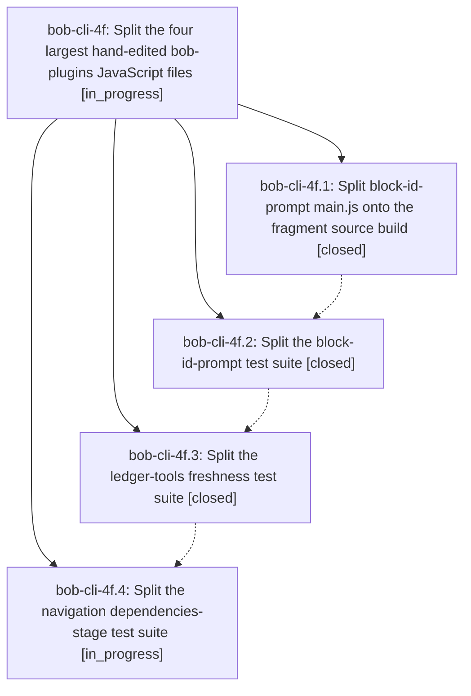

# Bead: bob-cli-4f — Split the four largest hand-edited bob-plugins JavaScript files

[Bead Pages](../README.md) / bob-cli-4f

**Status:** ◐ in_progress · **Type:** ▸ plan · **Tier:** epic
**Owner:** `bryanbugyi34@gmail.com` · **Created by:** [bbugyi200.apollo.54](https://github.com/bobs-org/bob-cli--agents/blob/main/sessions/bbugyi200.apollo.54.md) · **Assignee:** `bob-cli-4f.land`
**Created:** 2026-10-04 21:42:18 EDT
**Plan:** [202610/split\_largest\_bob\_plugins\_js\_files\_1.md](https://github.com/bobs-org/bob-cli--plans/blob/main/202610/split_largest_bob_plugins_js_files_1.md)

## Description

The four largest hand-edited JavaScript files in bob-plugins are each split into behavior-identical files of at most 1000 lines, with every test still running.

## Phases

| Bead | Title | Status | Size | Created | Agents | Commits |
|---|---|---|---|---|---:|---:|
| [bob-cli-4f.1](bob-cli-4f.1.md) | Split block-id-prompt main.js onto the fragment source build | ✓ closed | large | 2026-10-04 | 1 | 1 |
| [bob-cli-4f.2](bob-cli-4f.2.md) | Split the block-id-prompt test suite | ✓ closed | large | 2026-10-04 | 1 | 1 |
| [bob-cli-4f.3](bob-cli-4f.3.md) | Split the ledger-tools freshness test suite | ✓ closed | large | 2026-10-04 | 1 | 1 |
| [bob-cli-4f.4](bob-cli-4f.4.md) | Split the navigation dependencies-stage test suite | ◐ in_progress | large | 2026-10-04 | 1 | 0 |

## Lineage

## Agents

| Agent | Bead | Commits |
|---|---|---:|
| [bbugyi200.apollo.bob-cli-4f.1](https://github.com/bobs-org/bob-cli--agents/blob/main/sessions/bbugyi200.apollo.bob-cli-4f.1.md) | [bob-cli-4f.1](bob-cli-4f.1.md) | 1 |
| [bbugyi200.apollo.bob-cli-4f.2](https://github.com/bobs-org/bob-cli--agents/blob/main/sessions/bbugyi200.apollo.bob-cli-4f.2.md) | [bob-cli-4f.2](bob-cli-4f.2.md) | 1 |
| [bbugyi200.apollo.bob-cli-4f.3](https://github.com/bobs-org/bob-cli--agents/blob/main/sessions/bbugyi200.apollo.bob-cli-4f.3.md) | [bob-cli-4f.3](bob-cli-4f.3.md) | 1 |
| [bbugyi200.apollo.bob-cli-4f.4](https://github.com/bobs-org/bob-cli--agents/blob/main/agents/bbugyi200.apollo.bob-cli-4f.4/README.md) | [bob-cli-4f.4](bob-cli-4f.4.md) | 0 |
| [bbugyi200.apollo.bob-cli-4f.land](https://github.com/bobs-org/bob-cli--agents/blob/main/agents/bbugyi200.apollo.bob-cli-4f.land/README.md) | [bob-cli-4f](README.md) | 0 |

## Commits

| Repo | Commit | Subject | Bead | Committed |
|---|---|---|---|---|
| bob-plugins | [`bob-plugins@03f0c17`](https://github.com/bobs-org/bob-plugins/commit/03f0c177989871805561e84cd16f7310cdbed32f) | refactor(block-id-prompt): split main.js onto the fragment source build | [bob-cli-4f.1](bob-cli-4f.1.md) | 2026-10-04 22:03:15 EDT |
| bob-plugins | [`bob-plugins@2486da9`](https://github.com/bobs-org/bob-plugins/commit/2486da9c17b3fdade1a954ecf31e2e88acef5751) | refactor(test): split block-id-prompt suite | [bob-cli-4f.2](bob-cli-4f.2.md) | 2026-10-04 22:26:13 EDT |
| bob-plugins | [`bob-plugins@474d6fe`](https://github.com/bobs-org/bob-plugins/commit/474d6fe063f0096296728b52702e4331d0371be6) | refactor(test): split ledger-tools freshness suite | [bob-cli-4f.3](bob-cli-4f.3.md) | 2026-10-04 22:38:30 EDT |
